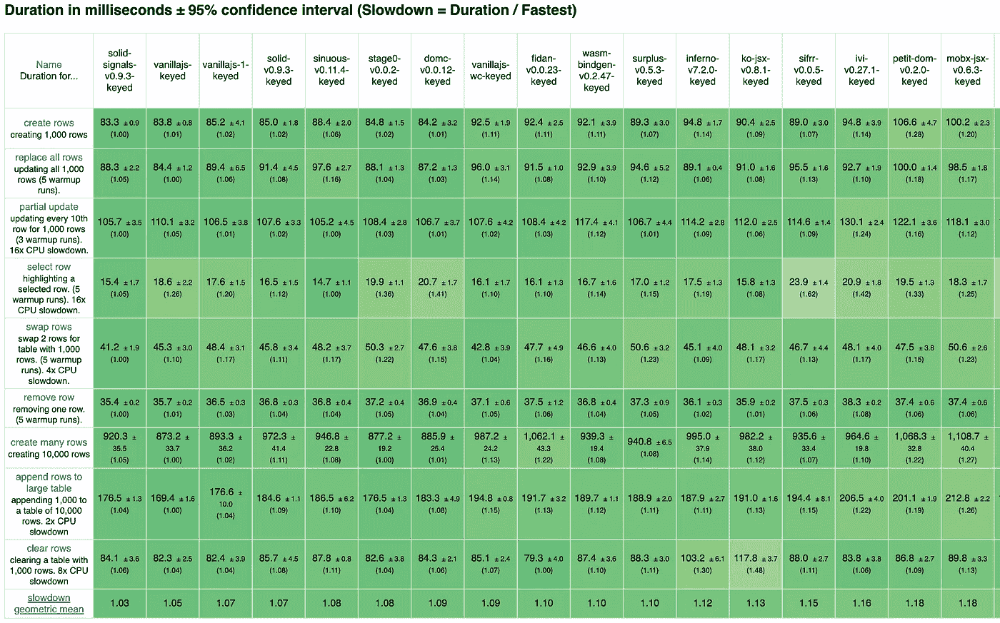

# 我们如何编写最快的 JavaScript UI 框架

> 原文：<https://javascript.plainenglish.io/how-we-wrote-the-fastest-javascript-ui-frameworks-a96f2636431e?source=collection_archive---------0----------------------->

Man riding bicycle on city street by Snapwire on pexels.com

我相信你曾经有过这样的经历。你有个好主意。一些新奇的东西。新的东西。一些有影响力的东西。你知道这有点野心勃勃，所以你想出了一个攻击计划。你和几个同行一起审查这个想法。然后剩下的就是工作了。

起初，事情进展顺利。直到你意识到事情会比最初想象的要复杂一些。你努力去做，一切都很好，但不是你所期望的那样。

但是事情发生了。当一切都对齐的时候。一个突破！事情越来越多，当你朝着目标前进时，没有什么能阻止你。你熬了最后一个通宵，调整了最后一个小细节。现在剩下就是按下提交按钮并等待。

…呼吸…

然后这种情况发生了:

Current Official JS Framework Benchmark Results

> 比普通的 JavaScript 更快！！什么？！这里有什么问题吗？

这不是玩具演示。这是 JS 框架基准测试，可以说是这种性质的 UI 框架中最著名的基准测试。你的框架的优化版本不仅比 VanillaJS 更快，而且标准的 React-Friendly API 版本也比其他框架更快。

# 这是怎么回事？

我是 [Solid.js](https://github.com/ryansolid/solid) 的作者，这是一个专注于细粒度控制和残酷性能的 JavaScript UI 库。想象一下，如果有人穿越反应与苗条，并与地狱无情地训练孩子。我已经在 Medium 上详细写过如何让[高效地渲染 DOM](https://medium.com/better-programming/the-fastest-way-to-render-the-dom-e3b226b15ca3)。但有时我也会让自己吃惊。大约一个月前，在收集了问题的反馈后，我决定做一个相当大的改变，以适应不断增长的社区的用例。我在 Github 上发布了一个 RFC，得到了一些好评，于是我决定在接下来的几个星期里，利用晚上的时间来做这个大规模的重构。

重构是一项巨大的工作，因为我开发的底层渲染器[Solid](https://github.com/ryansolid/solid)([DOM Expressions](https://github.com/ryansolid/dom-expressions))支持任何细粒度的反应库。加班的事情变得如此严格，以至于允许某些性能优化，这不仅限制了 [Solid](https://github.com/ryansolid/solid) 的用户，也限制了 MobX 和 Knockout 变种的用户。所以我想出了一个损失最小的计划。它极大地简化了事情，但是需要在两个阶段完成工作；一次在反应系统中，一次在 DOM 调解器中。

事实证明，更少地访问 DOM，即使访问被保留给[安全属性](https://github.com/patrick-steele-idem/morphdom#isnt-the-dom-slow)也能显著提高性能。我一直在努力寻找最佳系统，但它的复杂性抑制了它的性能。

Solid 比 vanilla(普通)JavaScript 快吗？不，这是一个使用高度优化的框架的良好运行，并且总是存在差异。尽管如此，这些都是非常优化的香草实现，所以它仍然令人印象深刻。去找到你最喜欢的框架，看看它们放在哪里。

> 对于那些寻找技术解决方案的人来说，答案很简单。有时候，将 DOM 节点列表保存为一个数组比线性遍历 DOM 更有效，这需要开销来保持同步。要了解更多关于 Solid 如何工作以及性能如何的信息，请查看文章底部的链接。

# 吸取的教训

六个月前我生日的时候写了:[我如何写出最快的 JavaScript UI 框架](https://medium.com/@ryansolid/how-i-wrote-the-fastest-javascript-ui-framework-37525b42d6c9)。在那一天，根据 JS 框架基准测试，Solid 第一次成为世界上最快的。我传授了我的智慧，关于前端的发展方向，以及你应该在一个框架中寻找什么。这一次， [Solid](https://github.com/ryansolid/solid) 甚至超过了这个基准，但我们看到的是一个非常不同的场景。

在基准测试中占据首位的细粒度反应库数量激增。网络组装还没有起飞。尽管执行速度很快，但与 DOM 交互的开销意味着，至少在不久的将来，优化的 JavaScript 库将胜过 WASM。虚拟 DOM 没怎么动(虽然 Inferno 看起来又夺回了皇冠)。

我创建了 [DOM 表达式](https://github.com/ryansolid/dom-expressions),希望让人们能够使用一个公共运行时，并带来他们的反应库和意见，以创建他们完美的 UI 开发人员体验。那是一个天真的梦。人们不再使用我的库，他们只是抓取代码包装到他们的库中，并开始按他们的方式做事。六个月前，我从来没有想到有人会拿走我的代码，以减少几千字节的名义，创建一个只提供相同功能子集的库，并在 Github 上拥有近 300 颗星。太神奇了。这就是开源的意义所在。

> Solid 的血统归功于[盈余](https://github.com/adamhaile/surplus)，这证明了 JSX 是反应式库的可行解决方案(抱歉，Rich Harris，但在这一点上，你大错特错了)。当然，在这一点上，localvoid(Boris Kaul)列出了几乎每个顶级图书馆都使用的协调例程。

我也没有想到一个小的用户群体会通过特性请求，推动一个将 web 性能提升到新高度的重构。每当我有一个新的想法，就会有人迫不及待地讨论，或者每当我感到筋疲力尽，就会有人说好话。有人会花时间来编辑我的文章或纠正我天真的打字稿定义。我应该感谢许多人，因为没有他们，这一切都不可能实现。

六个月前，我觉得自己基本上是一个人。现在，这已经超出了我的范围。

# 加入革命

它可能没有以我想象的方式发生，但是我们确实在见证一个转变。在上图中，6 个实现基于我的 [DOM 表达式](https://github.com/ryansolid/dom-expressions)代码的重要部分。这占了前 10 名(非普通)实现的 50%。这是一个由少数个人和小团体推动的缓慢过程。你不会发现脸书或谷歌潜伏在背后。资源是有限的，我们只是触及了这里可能发生的事情的表面。我们一直在推动性能的极限，并发现新的更好的方法来声明性地定义用户界面。未来几个月有很多话题:

*   服务器端渲染
*   改进的悬念(更好的安排/延续)
*   “真实世界”演示应用程序
*   官方网站
*   动画/过渡

过来，成为网络未来的一部分。

 [## 瑞安固体/固体

### 一个用于构建用户界面的声明式、高效且灵活的 JavaScript 库。—瑞安固体/固体

github.com](https://github.com/ryansolid/solid)  [## solid——你从未听说过的最好的 JavaScript UI 库

### 任何人都不希望看到另一个 JavaScript UI 库/框架。但我们还是来了。

levelup.gitconnected.com](https://levelup.gitconnected.com/solid-the-best-javascript-ui-library-youve-never-heard-of-297b22848ac1)  [## 呈现 DOM 的最快方法

### 虚拟 DOM、带标签的模板文字还是细粒度的可观察对象速度最快？

medium.com](https://medium.com/better-programming/the-fastest-way-to-render-the-dom-e3b226b15ca3)  [## JS 框架基准当前结果

### JS 框架基准的当前交互结果

krausest.github.io](https://krausest.github.io/js-framework-benchmark/current.html)