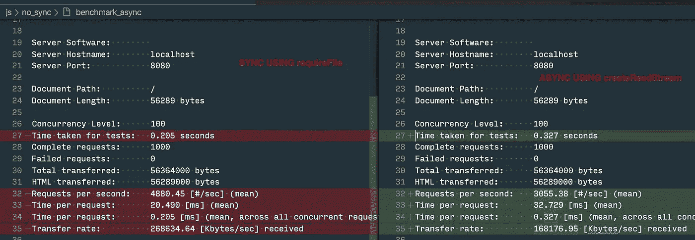
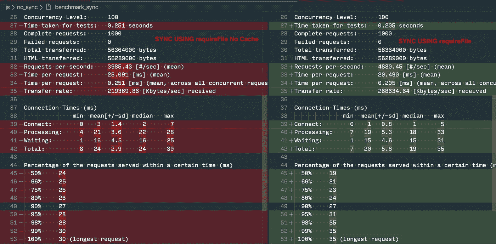

# 你不应该写代码| JavaScript 第二部分

> 原文：<https://javascript.plainenglish.io/how-you-should-not-write-code-javascript-part-2-e76d17ad7ded?source=collection_archive---------3----------------------->

Photo by [Kristina Flour](https://unsplash.com/@tinaflour?utm_source=medium&utm_medium=referral) on [Unsplash](https://unsplash.com?utm_source=medium&utm_medium=referral)

编写 JavaScript 代码需要更少的努力。然而，由于其动态特性。很难维护和扩展。为了编写更好的代码，您需要了解它的缺陷。在本文中，我将介绍 JavaScript 中常见的误导性 API 和模式。

“我学得越多，就越意识到我有多少知识是不知道的。”——***阿尔伯特·爱因斯坦***

*本文是我上一篇文章* [*如何不应该写代码*](https://medium.com/swlh/how-not-to-write-code-javascript-62a7fa1f819c) *的延续。如果你还没有读过，我建议你读一读。*

## **1。要求(乞求)不好**

我在代码里看过一个 **JSON 文件，**开发者使用 [**要求**](https://nodejs.org/api/modules.html#modules_require_id) 。然而，**要求**并不像你想象的那么好。我们用一个例子来探讨一下。

在文件夹**【require _ files】中创建一个 **user.json** 。我正在展示一个大 JSON 文件的一小段代码。但是，您可以从 Github 下载更长的版本。**

让我们创建主函数:

如果你注意到**要求**和 **readFileSync** 的时序，它是完全不同的。原因是，**需要**这个方法在幕后做很多事情(比如**缓存)**。

让我们看看它在循环中的另一个版本。

在 **for 循环**中，我一次又一次地要求相同的文件。由于 **require** 是缓存的， **require** 相比我们的[**fs . read file sync**](https://nodejs.org/api/fs.html#fs_fs_readfilesync_path_options)版本非常快。让我们创建一个缓存的 **requireJSON** 实用程序库。

在这里可以清楚的看到性能差异: **requireJSON** 比 **require** 快 40 倍。

**注意:**并不意味着我们不应该停止使用**要求**。**要求**主要是加载 **JS** 文件。它有很多功能。但是，每当你在处理 **JSON(static)** 文件的时候。我建议创建一个小的实用函数或使用任何库。

**代码**:[https://github . com/deepakshrma/how-not-write-Code/tree/master/js/require _ files](https://github.com/deepakshrma/how-not-to-write-code/tree/master/js/require_files)

Photo by [Jose Aragones](https://unsplash.com/@jodaarba?utm_source=medium&utm_medium=referral) on [Unsplash](https://unsplash.com?utm_source=medium&utm_medium=referral)

## **2。不要使用同步 API**

在上面的例子中，我讲了很多关于**要求**的内容。但是，您不应该在 Node.js 中使用任何同步 I/O。它会大大降低您的应用程序性能。

**AB 测试基准:**

Benchmark: Sync vs Stream

**注意:**使用缓存`requireFile`功能的同步版本

同步文件版本的性能似乎比 createReadStream 更好。然而，同步版本使用缓存 API 和*我们不能缓存 2GB 的文件像这些*。让我们移除缓存。

Benchmark: Sync No Cache vs Sync

正如您可以看到的那样，通过删除缓存，性能降低了 20%，并且文件非常小。想想如果文件太大。它真的会影响你的服务器`**concurrency**`。

**代码:**[https://github . com/deepakshrma/how-not-write-Code/tree/master/js/no _ sync](https://github.com/deepakshrma/how-not-to-write-code/tree/master/js/no_sync)

## 3.嘿，下划线，你做错了。

我很喜欢布莱恩·朗斯多夫(DrBoolean)的[视频](https://www.youtube.com/watch?v=m3svKOdZijA)。在这段视频中，他解释了下划线是如何出错的。如果你真的对函数式编程感兴趣，我推荐你观看这个演讲。

让我们从他的演讲中看一个小例子。

在上面的例子中，`firstLetters`试图获取一个`Array`中单词的第一个字符。如果用一个`[**partial function**](https://scotch.io/tutorials/javascript-functional-programming-explained-partial-application-and-currying)`(库里)的概念。我们可以减少代码，使其更具可读性。

来看看我自己版本的`[**partial function**](https://scotch.io/tutorials/javascript-functional-programming-explained-partial-application-and-currying)`。

在上面的例子中，没有什么是花哨的。`first`返回单词的第一个字符，map 只是迭代。

如果你注意到了，我刚刚添加了一个小的实用函数`curry`,它帮助我们将任何函数作为部分函数。现在使用它，我们可以使我们的`firstLetters`函数更加可读/可重用。

**代码**:[https://github . com/deepakshrma/how-not-to-write-Code/blob/master/js/partial _ fun . js](https://github.com/deepakshrma/how-not-to-write-code/blob/master/js/partial_fun.js)

## 4.**对象 API 不起作用**

对象类 API 本质上不是功能性的。当我这样说的时候，我们必须意识到事实。我们举一个很基本的例子。假设我们有一个`country code`和`name`的对象，其中键是代码，值是`name`。并且我们想把它转换成一个`country objects`的数组。

这个例子在这里工作得非常好。需要注意的是， `Object.entries`本身是一个`for-loop`，在此之后，我们调用`map`函数。也就是说，我们为同一件事循环了两次。

代码同上，但只有一个时间循环。性能大幅提升。在这个解决方案中，转换逻辑在函数中紧密耦合。我们来解耦一下。

这与上述函数的工作原理相同。然而，我们已经将转换逻辑解耦为一个`**mapper**`函数。不知何故，它比旧版本性能更好。

*我尝试在 StackOverflow 中回答一个问题。但是似乎开发者更喜欢头脑简单的代码。*😂

 [## 如何用 JSON 创建数组？

### 我需要将这个 JSON 文件转换成一个单个国家条目的数组。{ "AT ":"奥地利"，" BE ":"比利时"，" BG"…

stackoverflow.com](https://stackoverflow.com/questions/59190494/how-to-create-an-array-out-of-json/59190684#59190684) 

**代码:**[https://github . com/deepakshrma/how-not-to-write-Code/blob/master/js/object _ APIs . js](https://github.com/deepakshrma/how-not-to-write-code/blob/master/js/object_apis.js)

## **5。让我们保证你不会拒绝我**

我个人非常喜欢`[Promise](https://developer.mozilla.org/en-US/docs/Web/JavaScript/Reference/Global_Objects/Promise)` API。然而，我看到人们在承诺上挣扎了很久。最大的挑战是同时履行多个承诺。

这里有一个我们可以解决的常见问题。假设我们必须使用两个不同的异步 API，我们想从这两个 API 中收集数据。

让我们看看解决方案。

**注:** `deley`是模拟`async I/O`的小效用函数。

一切看起来不错。然而，有一个问题。如果其中一个`call`失败了怎么办？？

它完全失败了。我们不会得到第二个 API 调用的输出。

**根据**的类型定义，如果**拒绝任何承诺，`Promise.all`将拒绝。**

为了解决这个问题，我们可以创建一个非常基本的效用函数`collectAll`。

**代码:**[https://github . com/deepakshrma/how-not-to-write-Code/blob/master/js/promis _ merge . js](https://github.com/deepakshrma/how-not-to-write-code/blob/master/js/promis_merge.js)

> 感谢阅读。如果你喜欢这篇文章，请在评论中告诉我。并请订阅我的饲料更多这样的编码博客。所有代码都可以在我的 GitHub 上找到:

 [## deepakshrma/如何不写代码

### 此时您不能执行该操作。您已使用另一个标签页或窗口登录。您已在另一个选项卡中注销，或者…

github.com](https://github.com/deepakshrma/how-not-to-write-code)