# HTML 画布火了

> 原文：<https://javascript.plainenglish.io/html-canvas-is-fire-1320b2b40c37?source=collection_archive---------5----------------------->

## 井字游戏系列—第二部分

## 精确理解画布

嗨！我正在用我能想到的最简单的领域探索技术，井字游戏，查看其他文章:

1.  [井字游戏:React，TypeScript，XState，fp-ts & CSS 网格](https://medium.com/javascript-in-plain-english/tic-tac-toe-react-typescript-xstate-fp-ts-css-grid-cbbb6455cbf7?source=friends_link&sk=5a651587dc6376cfbd55596e30b6692e) — [西班牙语](https://medium.com/codingedgar/tes-en-l%C3%ADnea-react-typescript-xstate-fp-ts-css-grid-esp-1373236189d1?source=friends_link&sk=acd495a60f69e43c68e3f6970fa9da60)
2.  HTML Canvas 是火的(本文)—西班牙语(proximamente)

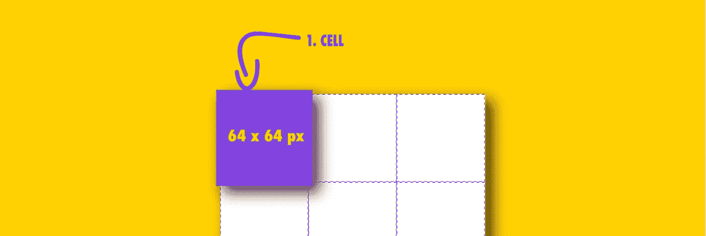

# 等等，什么是 HTML 画布？

根据 Mozilla 的说法:

> **Canvas API** 提供了通过 [JavaScript](https://developer.mozilla.org/en-US/docs/Web/JavaScript) 和 [HTML](https://developer.mozilla.org/en-US/docs/Web/HTML) `[<canvas>](https://developer.mozilla.org/en-US/docs/Web/HTML/Element/canvas)`元素绘制图形的方法。除此之外，它还可以用于动画、游戏图形、数据可视化、照片处理和实时视频处理。
> 
> Canvas API 主要关注 2D 图形。同样使用`<canvas>`元素的 [WebGL API](https://developer.mozilla.org/en-US/docs/Web/WebGL) 绘制硬件加速的 2D 和 3D 图形。

# 我们将如何探索 HTML 画布？

我们将使用 HTML Canvas 实现井字游戏资产(X 玩家、O 玩家、棋盘和赢线)，但首先，我们如何画线？

# 如何划清界限？

我将向你展示一个最简单的教程，用来自 w3schools 的 HTML 画布画线:

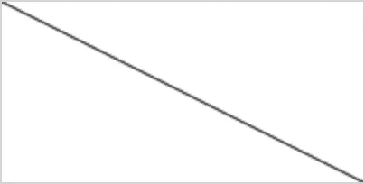

检查一下，在第 5 行我们添加了一个画布标签，带有一个稍后要引用的`id`、`width`和`height`。

使用 Canvas API，您会注意到的第一件事是绘图命令完全是通过 JavaScript 来指示的。它们不能在`<canvas/>`标签内被内联指令。

绘制有 6 个基本步骤:

1.  包括一个可识别的画布标签(第 5 行)。
2.  将画布作为 HTML 元素访问(第 9 行)。
3.  获取画布的 2d 上下文(第 10 行)。
4.  作为由给定坐标(第 11 行)指定的点处的新子路径。
5.  通过将子路径的最后一点连接到指定的坐标，为当前子路径添加一条直线(第 12 行)。
6.  画出给定路径的轮廓(第 13 行)。

## 画布渲染上下文 2D

画布的背景不太明显，它是什么，为什么在那里？

[我会用 Mozilla 教程描述](https://developer.mozilla.org/en-US/docs/Web/API/Canvas_API/Tutorial/Basic_usage):

> 画布最初是空白的。为了显示某些东西，脚本首先需要访问渲染上下文并在其上进行绘制。`[<canvas>](https://developer.mozilla.org/en-US/docs/Web/HTML/Element/canvas)`元素有一个名为`[getContext()](https://developer.mozilla.org/en-US/docs/Web/API/HTMLCanvasElement/getContext)`的方法，用于获取渲染上下文及其绘制函数。`getContext()`采用一个参数，即上下文的类型。对于 2D 图形，比如本教程所涉及的图形，您可以指定`"2d"`来获得一个`[CanvasRenderingContext2D](https://developer.mozilla.org/en-US/docs/Web/API/CanvasRenderingContext2D)`。

但是，什么是`**CanvasRenderingContext2D**`？[让我们再检查一下 Mozilla](https://developer.mozilla.org/en-US/docs/Web/API/CanvasRenderingContext2D):

> `**CanvasRenderingContext2D**`接口是 [Canvas API](https://developer.mozilla.org/en-US/docs/Web/API/Canvas_API) 的一部分，为`[<canvas>](https://developer.mozilla.org/en-US/docs/Web/HTML/Element/canvas)`元素的绘制表面提供 2D 渲染上下文。它用于绘制形状、文本、图像和其他对象。

上下文的另一个有趣属性如下，来自 [Mozilla](https://developer.mozilla.org/en-US/docs/Web/API/HTMLCanvasElement/getContext) `[getContext](https://developer.mozilla.org/en-US/docs/Web/API/HTMLCanvasElement/getContext)`:

> 以后在同一个 canvas 元素上调用这个方法，使用相同的`contextType`参数，将总是返回与第一次调用该方法时返回的相同的绘图上下文实例。不可能在给定的画布元素上获得不同的绘图上下文对象。

上下文似乎是拥有所有画布绘制方法的实例，是区别于其他 HTML 元素的属性。

## 恭喜

我认为，现在，你和我已经掌握了 Canvas 的基本原理，其他的一切都是从这 6 个基本步骤开始的，现在让我们用我们的领域将它付诸实践。

# 纸板帆布

[在上一篇文章](https://medium.com/javascript-in-plain-english/tic-tac-toe-react-typescript-xstate-fp-ts-css-grid-cbbb6455cbf7)中，我们将板实现为图像，在结构上实现为 CSS 网格，对于本文，我们将板构建为画布中的 4 行。

## 画布

从前面的画线示例中，您可能注意到画布的中枢(0，0 坐标)在左上角，坐标(宽度，高度)在右下角，如下所示:

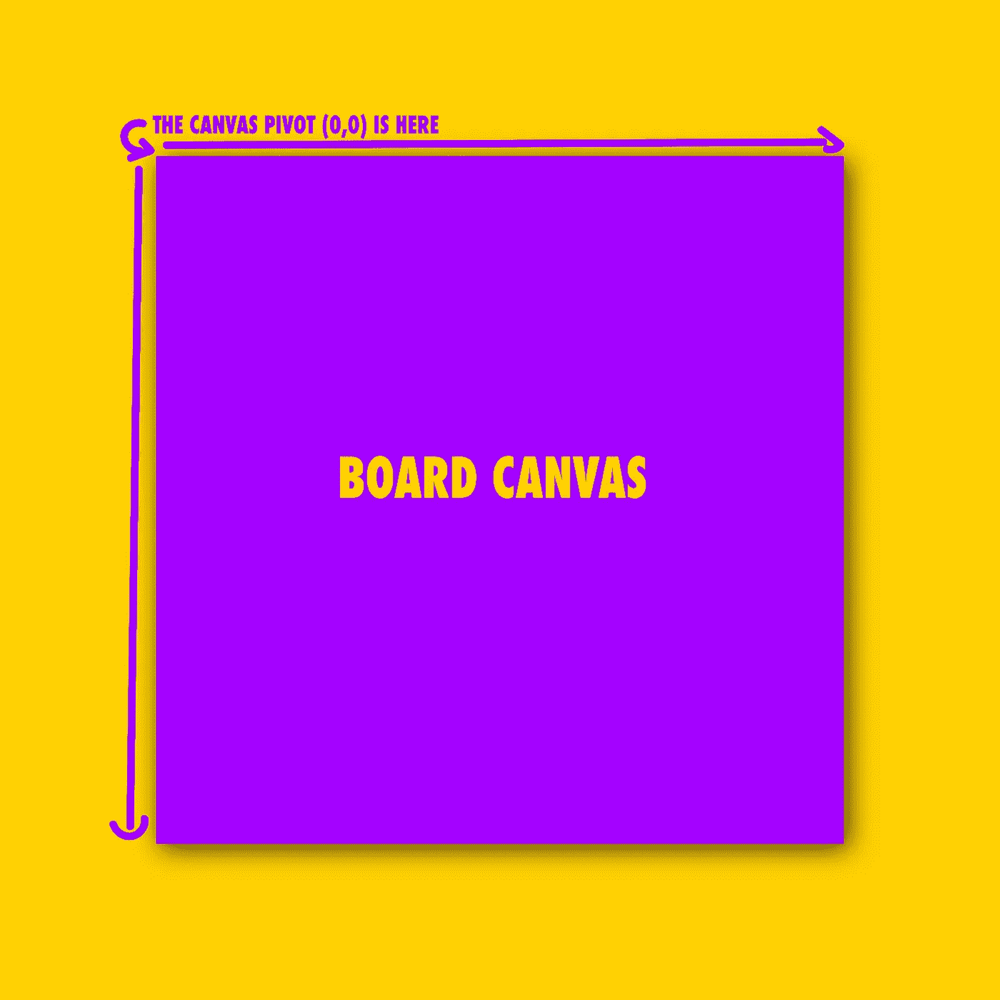

## 细胞与空间

这是我们以前的董事会:


如果从器件角度分析电路板，我们希望:


网格中有九个细胞，对吗？好吧，如果我们这样做，那么我们在哪里画棋盘线？

在我的上一次迭代中，这些线被画在细胞之间的分离中心，它们的宽度在一个细胞中是 50%，在另一个细胞中是 50%，这感觉不公平，不深思熟虑。

我决定改变它，并为纸板线条添加合适的空间:

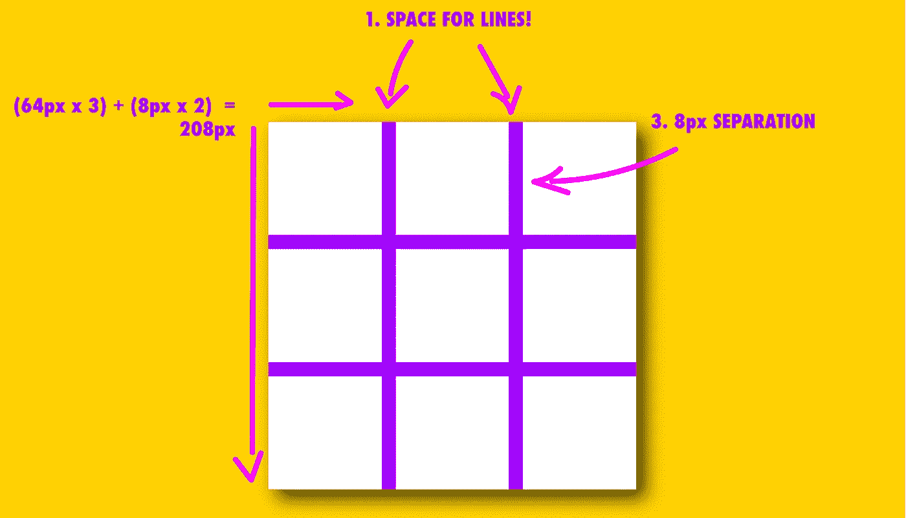

现在我们的主板应该是 208 x 208 px，3 个 64px 的单元和 2 行 8 px 的水平和垂直。

## 纸板线

既然我们已经考虑了电路板的尺寸，让我们画出电路板线。

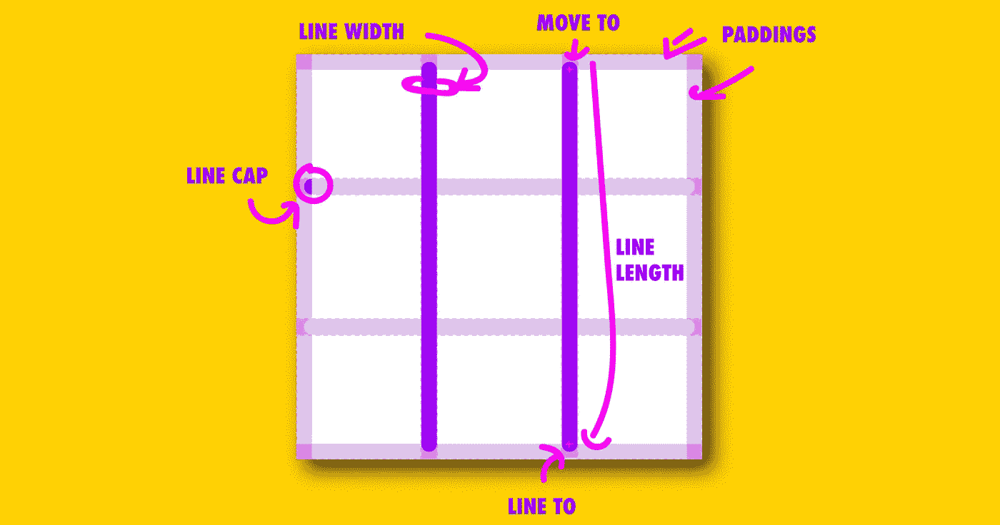

这个布局有一些我们需要用来计算线条的重要元素:

1.  电路板尺寸，将为 208 像素。
2.  纸板填充，线条和画布之间的空间，让它呼吸，这是纯粹的美学，4px。
3.  线宽，8px。
4.  线帽大小，或圆形末端，4px 或线宽的一半。
5.  线长度，将为 200 px 或板尺寸减去两次划水。
6.  最后，细胞大小，64 像素。

我们将使用的方法是使电路板成为[功能反应组件](https://reactjs.org/docs/components-and-props.html#function-and-class-components):

## 画一次

现在，我们需要绘制，但只绘制一次，这就是为什么我们将使用`useEffect`来仅在找到画布时进行更改，这种情况只发生一次。

## 获取上下文

我们可以安全地使用[非空和非未定义类型的防护(！)](https://www.typescriptlang.org/docs/handbook/release-notes/typescript-2-0.html#non-null-and-non-undefined-type-guards)因为我们应该有一个`canvas`在手边，并且这样应该有一个上下文，如果这些事情都不是真的，那么一定会发生错误，并且将被缓存在开发中。

## 笔画风格

我们将只添加 2 种笔画样式:

1.  线宽。
2.  [线帽](https://developer.mozilla.org/en-US/docs/Web/API/CanvasRenderingContext2D/lineCap) : `round`，是确定用于绘制线条端点的形状的属性。

## 进一步了解圆形线帽

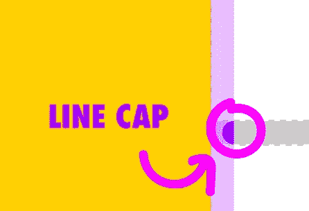

线帽`round`比较棘手。

如果我们设置线帽为`round`，那么当我们的线画半个圆时，它的长度会增加一半的宽度。

这个额外的空间需要考虑。

要注意的另一个重要优点是，画布线条易于消除锯齿，这是一种渲染平滑图像的技术，圆形形状总是消除锯齿的，因此会有一些具有不同色调的像素来显示平滑的圆形，如下所示:


Close up of the Board rendered in the Browser

请注意，线条，尤其是圆端是反锯齿的。

这也使得计算`moveTo`和`lineTo`变得令人困惑，我认为一个图像可以帮助你更好地理解这条线的实际起点:

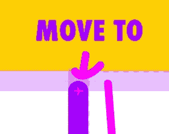

因此，在这两种情况下，行首和行尾的圆形大写字母都是额外添加的空格。

这些盖子让我们的数学变得有点复杂，当然可以简化为电路板填充空间的一部分。如果我们将填充的大小增加一倍，我们就不需要将线帽大小常量添加到所有的计算中，但是我想让你明白这个值，以便做出精确的图形。

# 玩家 X

这是我们要做的:

1.  我们将移动到单元格的左上角，考虑板填充、板线帽大小、单元格填充和 X 线帽大小，总结起来，4 个 4 px 的空间。
2.  然后，我们将再次对单元格大小划分 4 个空格。


我特别小心地画出了线条的起点和终点，以及我们要考虑的 4 个空间；现在我们的玩家 X 将非常适合我们的细胞。

# 如何画一个圆

我们的参与人 O 将会是一个圆，这和我们目前所画的不同，线。

我将用 w3schools 中的一个[简单的例子向你展示如何用画布画一个圆:](https://www.w3schools.com/html/html5_canvas.asp)

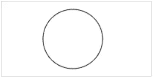

正如你所看到的，我们实际上画的是一个“弧”，而不是一个圆，弧更通用，可以画圆，所以这是画布 API 的一个好想法。

`arc`方法有 6 个参数:

```
void ctx.arc(x, y, radius, startAngle, endAngle [, anticlockwise]);
```

1.  x，中心的水平坐标。
2.  y，中心的垂直坐标。
3.  半径，从中心到圆弧起点的距离。
4.  startAngle，圆弧开始的角度，以弧度表示，从 x 轴正方向开始测量。
5.  endAngle，以弧度表示的圆弧结束的角度，从 x 轴正方向开始测量。
6.  逆时针(可选)，如果`true`，在开始和结束角度之间逆时针画弧。默认为`false`(顺时针)。

我将从 Mozilla 中选取一些例子来进一步演示如何使用弧线绘制不同的形状，并帮助您更好地理解角度的起点、终点以及形状的填充方式:

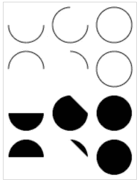

# 玩家 O

现在我们知道了如何画圆，让我们画我们的玩家 Y，但首先，我们的措施:

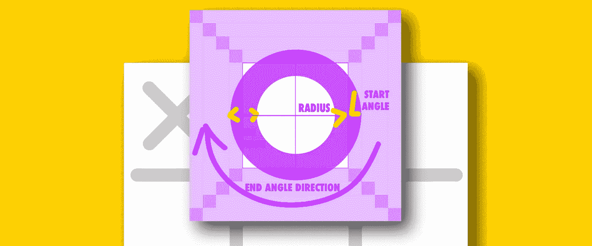

我们将重复 4 个空格的模式，但是我们的第四个空格，尽管大小相同，却有另一个原因:

1.  纸板衬垫。
2.  板线帽。
3.  单元格填充。
4.  半线宽。

正如你所注意到的，弧线方法中的线条宽度是画在弧线的中间，向内和向外各扩展 50%,所以，我们需要一半宽度的空间来画和 x 一样大的玩家 O。

# 获奖台词

获胜线的尺寸将是我们正常线的两倍，为我们的玩家增加了一个很好的区分。这意味着我们也需要两倍的线帽，别忘了！

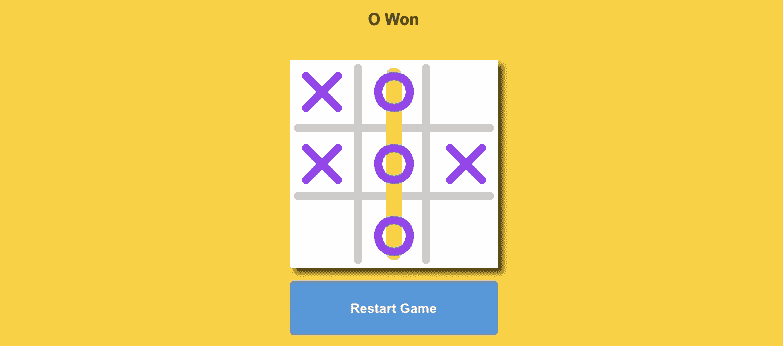

# 就是这样！


整个项目在 https://github.com/codingedgar/TicTacToe[进行](https://github.com/codingedgar/TicTacToe)去那里检查 example2，并给它一个派生，欢迎任何问题和改进。

如果你喜欢这篇文章，也许你会喜欢[订阅我的简讯](http://eepurl.com/hg7AeP)！下一集再见👋。