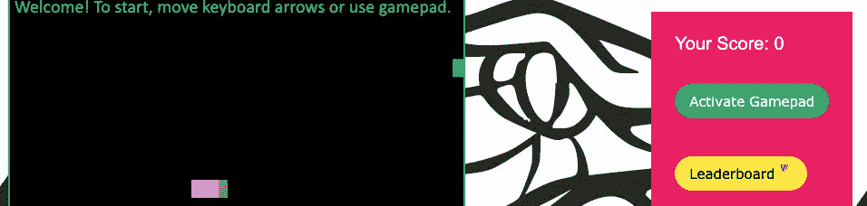
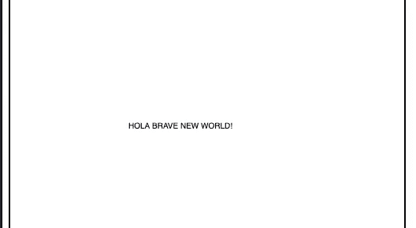
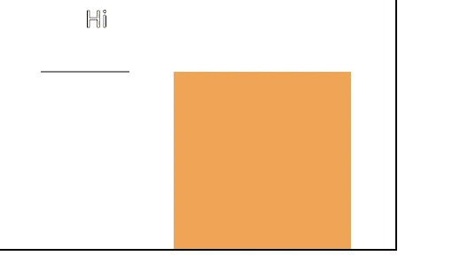

# HTML5 + JS 游戏——画布元素简介👾

> 原文：<https://javascript.plainenglish.io/html5-js-games-an-intro-to-the-canvas-element-fe049c222595?source=collection_archive---------13----------------------->

## HTML 游戏是练习 HTML `*canvas*` *标签技巧和 JavaScript 概念的有趣方式。*

几周前，我做了一个街机经典蛇的克隆，[复古蛇](http://fbohz.com/html5_games/retro_snake.html)。今天我们将讨论构建 HTML5 和 JS 游戏的一些基本概念。



My take on the popular Snake Game

# **HTML 画布**

HTML 游戏是练习 HTML 标签技能和 JavaScript 概念的有趣方式。

`<canvas>`是一个有高度/宽度的元素，你可以在里面画任何东西。

*   画布就像一个有边框的盒子。在盒子里面，你可以制作另一个盒子、圆圈、线条和文本。你不能在画布之外做任何事情。
*   画布是在主体内部定义的。

```
<body>
    <canvas height="500" width="500" 
    style="border: 2px solid #000;" 
    id="ctx"></canvas>
</body>
```

# 将带有 JS 的文本添加到画布

`getContext()`在 JS 和‘2d’中用于指定二维。

使用`fillText()`,你可以在特定的 x 和 y 坐标中添加文本，得到如下结果:

```
**var** ctx **=** document.getElementById("ctx")
    .getContext('2d');

ctx.fillText("HOLA BRAVE NEW WORLD!", 150, 250);
```



你可以像`ctx.font = "30px Calibri"`一样放大字体。

# **在画布上画一条线**

`strokeText()`:赋予字体浮雕效果。

`moveTo()`:带两个参数。第一个光标将移动到特定位置。你用它和`lineTo()`画线。然后你可以用`stroke()`创建线条。

```
ctx.moveTo(100,300)
ctx.lineTo(200,300)
ctx.stroke();
```

前两种方法定义直线，第三种方法画直线。

`fillStyle()`。您可以使用`fillRect()`将`ctx.fillStyle = '#efa556'`等颜色添加到矩形中。

`fillRect()`带四个参数。前两个位置然后接下来的两个宽度和高度的矩形为`ctx.fillRect(250, 300, 200, 300);`。



# **画布状态**

我们标识为`ctx`的 canvas 对象有许多我们已经描述过的属性。有时，如果我们`fillStyle()` ctx，那么之后的一切也可能是红色的！

为了管理这个，我们有*画布状态*。

*   `save()`:我们想要保存的状态是什么，就像一个*检查点*
*   然后我们可以调用`restore()`来恢复到之前的状态。

因此，当我们在画布上进行修改，然后保存检查点并在需要时恢复时。

# **在画布中绘制 JS 对象**

让我们试着画一个物体:

```
**const** square **=** {
    width: 300,
    height: 200,
    x: 100,
    y: 200,
    color: 'red'
}
```

通过访问正方形属性，我们可以轻松地绘制正方形:

```
ctx.fillStyle **=** square.color
ctx.fillRect(
    square.x, square.y, 
    square.width, square.height
    )
```

# **使用 JavaScript 函数**

视频之类的游戏只是一个*系列的帧*。主要的区别是你可以和游戏互动，而不是视频。

我们使用`setInterval()`来完成这个任务。这将在每个指定的时间调用该函数。如果我们有`setInterval(myFunction(),1000)`，那么它会像 *1fps* ，因为每 1 秒就会有新的帧。这将是一个非常慢的游戏，所以我们可以减少当`setInterval()`可以被调用有更多的帧。

# **用户输入&事件处理**

您可以使用键盘和鼠标控制事件，如`onmousedown`、`onmouseup`、`onkeydown`，

例如:

```
document.getElementById("ctx").onmousedown **=** **function**() {
    ctx.fillStyle **=** 'blue';
    ctx.fillRect(100,100,50,50);

}

document.getElementById("ctx").onmouseup **=** **function**() {
    ctx.fillStyle **=** 'red';
    ctx.fillRect(100,100,50,50);

}

document.onkeydown **=** **function**(e) {
    *//a = 65 code*
    **if** (e.keyCode **==** 65) {
        ctx.fillText('A has been pressed', 100,100);
    }

}
```

# **向前移动**

构建 HTML5 + JS 游戏时，请确保:

1.  声明`canvas`元素。
2.  构建游戏的对象。例如:蛇和食物(用于蛇的游戏)。
3.  在画布中绘制对象。
4.  根据需要移动对象。
5.  用功能满足游戏需求。确保你清楚游戏的要求。
6.  添加常见的功能，如分数，游戏结束，初始屏幕等。
7.  添加其他功能。例如难度。

*原载于 2020 年 7 月 27 日 http://fbohz.com**[*。*](http://fbohz.com/html_js_games_canvas)*