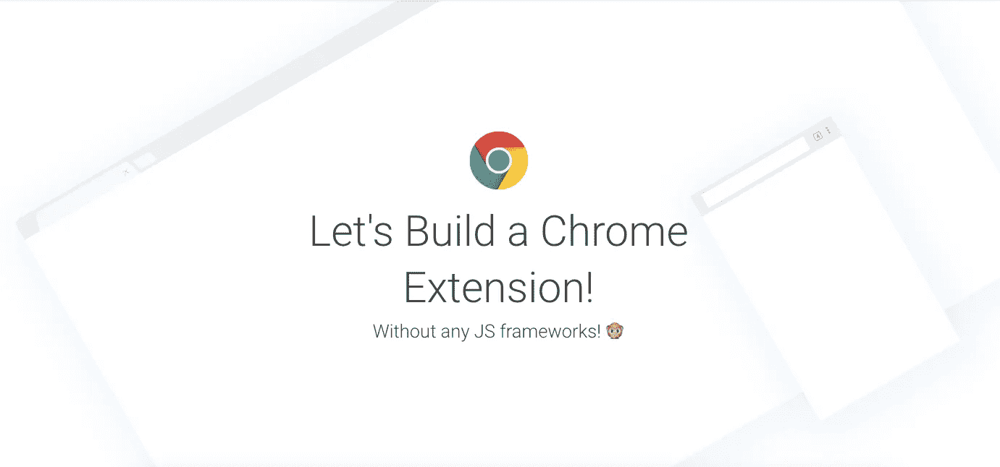
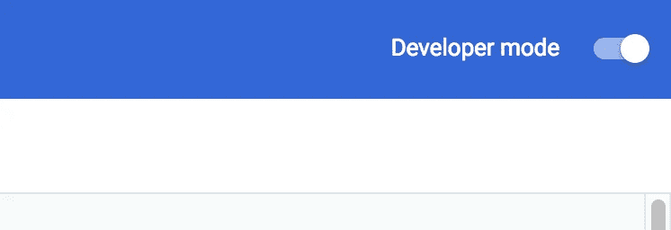
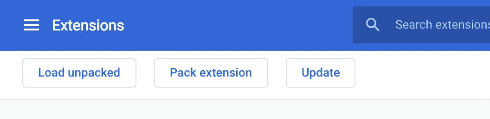
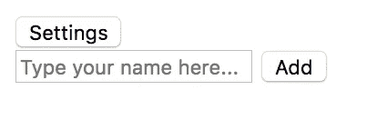
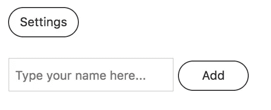
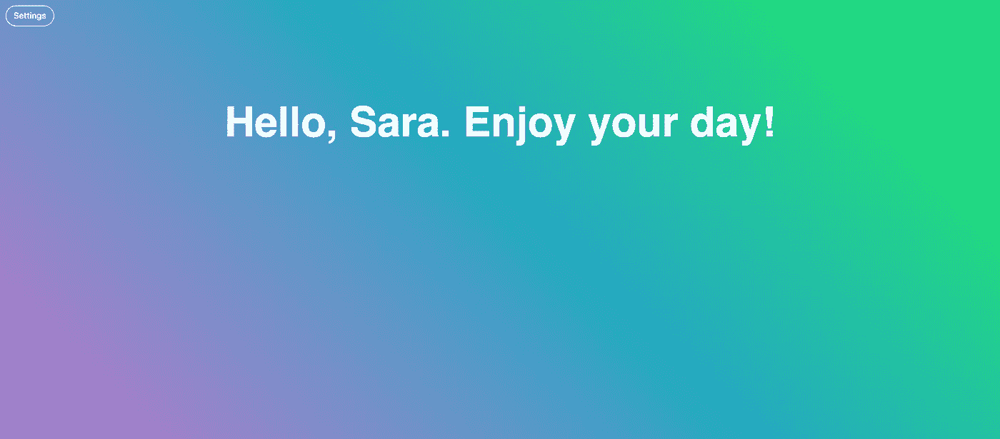

# 如何用普通 JavaScript 构建一个简单的 Chrome 扩展

> 原文：<https://javascript.plainenglish.io/https-medium-com-javascript-in-plain-english-how-to-build-a-simple-chrome-extension-in-vanilla-javascript-e52b2994aeeb?source=collection_archive---------0----------------------->

今天，我将向你展示如何用普通的 JavaScript 来制作 Chrome 扩展——也就是说，没有任何其他框架(如 React、Angular 或 Vue)的普通 JavaScript。

构建一个 Chrome 扩展并不困难——在我编程的第一年，我发布了两个扩展，我只用 HTML、CSS 和普通 JavaScript 就完成了这两个扩展。在本文中，我将在几分钟内带您了解如何实现同样的目标。

我将向您展示如何从头开始制作一个简单的 Chrome 扩展仪表板。然而，如果你对扩展有自己的想法，并且只是想知道在你现有的项目文件中添加什么来让它在 Chrome 中工作，你可以跳到定制你自己的`manifest.json`文件和图标这一节。



# 关于 Chrome 扩展

Chrome 扩展本质上只是一组定制你在谷歌 Chrome 浏览器中的体验的文件。有一些不同种类的 Chrome 扩展；有些在满足特定条件时激活，比如当你在商店结账页面时；有些只有当你点击一个图标时才会弹出；有些在每次打开新标签时出现。我今年发布的两个扩展都是“新标签”扩展；第一个是 [Compliment Dash](http://bit.ly/complimentdash) ，一个保存待办事项列表并赞美用户的仪表盘，第二个是牧师的工具，名为 [Liturgical.li](http://liturgical.li/) 。如果你知道如何编写一个基本的网站，那么你可以编写这种扩展，没有太大的困难。

# 先决条件

我们将保持事情简单，所以在本教程中，我们将只使用 HTML、CSS 和一些基本的 JavaScript，以及定制一个我将在下面包括的`manifest.json`文件。Chrome 扩展的复杂程度各不相同，所以构建一个 Chrome 扩展可以是简单的，也可以是复杂的。在您学习了这里的基础知识之后，您将能够使用您自己的技能来创建更复杂的东西。

# 设置您的文件

在本教程中，我们将创建一个简单的仪表板，通过名称来问候用户。让我们称我们的扩展为简单问候仪表板。

首先，您需要创建三个文件:`index.html`、`main.css`和`main.js`。把这些放到他们自己的文件夹里。接下来，用基本的 HTML 文档设置填充 HTML 文件，并将其连接到 CSS 和 JS 文件:

```
<!-- =================================Simple Greeting Dashboard================================= //--><!DOCTYPE html><html><head> <meta charset="utf-8" /> <title>Simple Greeting Dashboard</title> <link rel="stylesheet" type="text/css" media="screen" href="main.css" /></head><body> <!-- My code will go here --> <script src="main.js"></script></body></html>
```

# 定制您的 manifest.json 文件

这些文件不足以让你的项目成为 Chrome 的扩展。为此，我们需要一个`manifest.json`文件，我们将用一些关于我们的扩展的基本信息来定制它。您可以在 [Google 的开发者门户网站上下载该文件，](https://developer.chrome.com/extensions/getstarted)或者只需将以下几行复制/粘贴到一个新文件中，并将其作为`manifest.json`保存在您的文件夹中:

```
{
  "name": "Getting Started Example",
  "version": "1.0",
  "description": "Build an Extension!",
  "manifest_version": 2
}
```

现在，让我们用一些关于我们的扩展的信息来更新示例文件。我们只想更改代码的前三个值:`name`、`version`和`description`。让我们填写我们的名字和一行描述，因为这是我们的第一个版本，让我们保持这个值为 1.0。`manifest_version`号应该保持不变。

接下来，我们将添加几行代码来告诉 Chrome 如何处理这个扩展。

```
{
  "name": "Simple Greeting Dashboard",

  "version": "1.0",

  "description": "This Chrome extension greets the user each time they open a new tab",

  "manifest_version": 2 "incognito": "split",

  "chrome_url_overrides": {
    "newtab": "index.html"
  },

  "permissions": [
     "activeTab"
   ],"icons": {
    "128": "icon.png"
    }
}
```

值`"incognito": "split"`告诉 Chrome 在匿名模式下如何处理这个扩展。`"split"`当浏览器匿名时，将允许扩展在自己的进程中运行；有关其他选项，请参见 [Chrome 开发者文档](https://developer.chrome.com/extensions/manifest/incognito)。

正如你可能看到的，`"chrome_url_overrides"`告诉 Chrome 每当打开一个新标签页就打开`index.html`。`"permissions"`的值会给用户一个弹出窗口，让他们知道当他们试图安装时，这个扩展会覆盖他们的新标签。

最后，我们告诉 Chrome 显示什么作为我们的 favicon:一个名为`icon.png`的文件，大小为 128 x 128 像素。

# 创建图标

由于我们还没有图标文件，接下来，我们将为简单的问候破折号创建一个图标。随便用我下面做的那个。如果你想自己制作，你可以使用 Photoshop 或者像 Canva 这样的免费服务。只需确保尺寸为 128 x 128 像素，并将其作为`icon.png`保存在与 HTML、CSS、JS 和 JSON 文件相同的文件夹中。


My 128x128 icon for Simple Greeting Dash

# 上传您的文件(如果您正在编写自己的页面)

以上信息是你真正需要知道的，来创建你自己的新的标签 Chrome 扩展。在您定制您的`manifest.json`文件之后，您可以用 HTML、CSS 和 JavaScript 设计您想要的任何类型的新标签页，并上传它，如下所示。但是如果你想知道我是如何制作这个简单的仪表板的，请跳到“创建设置菜单”

一旦你完成了新标签页的设计，你的 Chrome 扩展也就完成了，可以上传到 Chrome 了。要自己上传，在你的浏览器中打开**chrome://extensions/****，在右上角打开开发者模式。**

****

**刷新页面，然后点击“加载解包”**

****

**接下来，选择存储 HTML、CSS、JS 和`manifest.json`文件以及`icon.png`的文件夹，然后上传。每次你打开一个新的标签时，这个扩展都应该工作！**

**一旦你完成了你的扩展，并亲自测试了它，你就可以得到一个开发者帐户，并把它放到 Chrome 扩展商店。[这个关于发布扩展的指南](https://developer.chrome.com/webstore/publish)应该会有所帮助。**

**如果你现在还没有创建自己的扩展，只是想看看 Chrome 扩展有什么功能，请继续阅读，看看如何制作一个非常简单的问候仪表板。**

# **创建设置菜单**

**对于我的扩展，我想做的第一件事是创建一个输入，用户可以在其中添加他们的名字。由于我不想让这个输入一直可见，所以我将把它放在一个名为`settings`的 div 中，只有当单击 Settings 按钮时，它才可见。**

```
<button id="settings-button">Settings</button><div class="settings" id="settings"> <form class="name-form" id="name-form" action="#"> <input class="name-input" type="text"
        id="name-input" placeholder="Type your name here..."> <button type="submit" class="name-button">Add</button> </form></div>
```

**现在，我们的设置如下所示:**

****

**So beautiful!**

**…所以我要给他们一些 CSS 中的基本样式。我将给出按钮并输入一些填充和轮廓，然后在设置和表单之间留出一点空间。**

```
.settings { display: flex; flex-direction: row; align-content: center;}input { padding: 5px; font-size: 12px; width: 150px; height: 20px;} button { height: 30px; width: 70px; background: none; /* This removes the default background */ color: #313131; border: 1px solid #313131; border-radius: 50px; /* This gives our button rounded edges */ font-size: 12px; cursor: pointer;}form { padding-top: 20px;}
```

**现在我们的设置看起来好一点了:**

****

**但是让我们在用户没有点击设置时隐藏它们。我将通过向`.settings`添加以下内容来实现这一点，这将导致姓名输入从屏幕的一侧消失:**

```
transform: translateX(-100%);transition: transform 1s;
```

**现在让我们创建一个名为`settings-open`的类，当用户点击设置按钮时，我们将在 JavaScript 中打开和关闭这个类。当`settings-open`被添加到`settings`时，它不会被应用任何变换；在正常位置只能看到它。**

```
.settings-open.settings { transform: none;}
```

**让我们在 JavaScript 中实现类切换。我将创建一个名为`openSettings()`的函数来打开或关闭类`settings-open`。为此，我将首先通过元素的 ID`"settings"`获取元素，然后使用`classList.toggle`添加`settings-open`的类。**

```
function openSettings() { document.getElementById("settings").classList.toggle("settings-open");}
```

**现在，我将添加一个事件侦听器，每当单击 Settings 按钮时，它都会触发该函数。**

```
document.getElementById("settings-button").addEventListener('click', openSettings)
```

**这将使您的设置在您单击“设置”按钮时出现或消失。**

# **创建个性化问候**

**接下来，让我们创建问候消息。我们将在 HTML 中创建一个空的`h2`，然后在 JavaScript 中使用 innerHTML 填充它。我要给`h2`一个 ID，这样我以后可以访问它，并把它放在一个名为`greeting-container`的`div`中，使它居中。**

```
<div class="greeting-container"> <h2 class="greeting" id="greeting"></h2></div>
```

**现在，在 JavaScript 中，我将使用用户名创建一个基本的问候。首先，我将创建一个变量来保存名称，现在我将它保留为空，以后再添加。**

```
var userName;
```

**即使`userName`不为空，如果我只是将`userName`放入我的 HTML 中的一个问候语，如果我在另一个会话中打开它，Chrome 也不会使用相同的名称。为了确保 Chrome 记得我是谁，我将不得不使用本地存储。所以我做一个函数叫`saveName()`。**

```
function saveName() { localStorage.setItem('receivedName', userName);}
```

**函数`localStorage.setItem()`有两个参数:第一个是我稍后用来访问信息的关键字，第二个是它需要记住的信息；在这种情况下，`userName`。我将通过`localStorage.getItem`获取保存的信息，我将使用它来更新`userName`变量。**

```
var userName = localStorage.getItem('receivedName');
```

**在我们将它链接到表单中的事件监听器之前，我想告诉 Chrome 如何称呼我，如果我还没有告诉它我的名字的话。我将使用 if 语句来实现这一点。**

```
if (userName == null) { userName = "friend";}
```

**现在，让我们最后把用户名变量连接到表单上。我想在函数内部这样做，这样我就可以在名字更新的时候调用那个函数。让我们调用函数`changeName()`。**

```
function changeName() { userName = document.getElementById("name-input").value; saveName();}
```

**我想在每次有人使用表单提交名字时调用这个函数。我将用一个事件监听器来做这件事，在这个监听器中，我将调用函数`changeName()`并防止页面在提交表单时默认刷新。**

```
document.getElementById("name-form").addEventListener('submit', function(e) { e.preventDefault() changeName();});
```

**最后，让我们创建我们的问候。我也将把它放在一个函数中，这样当页面被刷新时，以及每当`changeName()`发生时，我都可以调用它。函数如下:**

```
function getGreeting() { document.getElementById("greeting").innerHTML  = `Hello, ${userName}. Enjoy your day!`;} getGreeting()
```

**现在我将在我的`changeName()`函数中调用`getGreeting()`，并结束今天的工作！**

# **最后，设计你的页面**

**现在是时候添加最后的润色了。我将使用 flexbox 将我的页眉居中，使其变大，并在 CSS 中为主体添加渐变背景。为了让按钮和`h2`在渐变的背景下弹出，我将它们设置为白色。**

```
.greeting-container { display: flex; justify-content: center; align-content: center;}.greeting { font-family: sans-serif; font-size: 60px; color: #fff;}body { background-color: #c670ca; background-image: linear-gradient(45deg, #c670ca 0%, #25a5c8 52%, #20e275 90%);}html { height: 100%;}
```

**就是这样！您的页面将如下所示:**

****

**Your very own Chrome extension!**

**它可能不多，但它是你创建和设计自己的 Chrome 仪表盘的一个很好的基础。如果您有任何问题，请告诉我们，并随时通过 Twitter 联系我，电话:[@ Sara laugh](https://twitter.com/SaraLaughed)。**