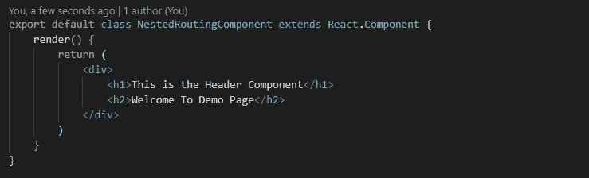
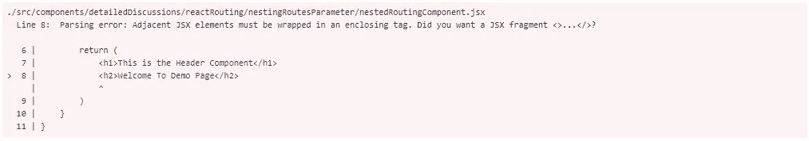

# 22 反应性能优化技术

> 原文：<https://javascript.plainenglish.io/https-medium-com-mayank-gupta-6-88-21-performance-optimizations-techniques-for-react-d15fa52c2349?source=collection_archive---------0----------------------->

## React 编程的最佳优化技术。

Optimize React with Simple Steps !!!

[**techno funnel**](https://www.youtube.com/channel/UCo-h1M-5M6Y5D4Lgut8ge4w)**带来另一篇关于**优化 React 性能**的文章，步骤简单。只需尝试实现这些优化步骤并获得增强的性能。React 为设计高性能 react 应用程序提供了许多优化，通过遵循这些最佳实践可以实现这些优化。本文涵盖了 React 版本 16.8 及更高版本中的最新特性。**

**父组件和子组件通常在以下情况下重新呈现:**

1.  **在同一个组件或父组件中调用`setState`时。**
2.  **从父母那里得到的“支持”价值的变化。**
3.  **在组件中调用`forceUpdate`。**

****React 性能优化**通过以下简单步骤即可轻松实现。**使用下面提到的步骤优化您的 React 应用程序**。在列表之后，您可以查找关于每种方法的详细讨论**

*   **使用 React [纯组件](#8d03)减少重新渲染**
*   **使用 [React 钩子](#50f6)并使用函数编程**
*   **使用 [React.memo](#cbb7) 进行组件记忆**
*   **使用 [shouldComponentUpdate](#c635) 生命周期事件**
*   **使用[惰性加载](#677f)反应组件**
*   **使用[反应片段](#d063)以避免额外的标记**
*   **不要使用 [React 内联函数定义](#1827)**
*   **避免 [componentWillMount()](#0a31) 中的异步请求**
*   **[在构造函数早期绑定函数](#67cc)**
*   **[箭头函数](#f147) vs 构造函数中的绑定**
*   **避免[使用内嵌样式](#cb48)属性**
*   **[优化 React 中的条件渲染](#a1c2)**
*   **[不要在渲染方法中导出数据](#d287)**
*   **为组件创建[错误边界](#ed88)**
*   **[组件的不可变数据结构](#cc36)**
*   **使用[唯一键进行迭代](#c550)**
*   **[节流和去抖动](#f459)事件**
*   **将[cdn](#8dcb)用于外部资源**
*   **[CSS 动画](#9676)而不是 JavaScript 动画**
*   **在 Web 服务器上启用 [gzip 压缩](#c30b)**
*   **使用[网络工作者](#d2b1)处理 CPU 扩展任务**
*   **React 组件的服务器端渲染**

# ****1。使用纯组件****

****

**Pure Components in React Programming**

**如果 React 组件为相同的状态和属性呈现相同的输出，则可以认为它是纯的。**

**对于这样的类组件，React 提供了`PureComponent` 基类。扩展`React.PureComponent`类的类组件被视为纯组件。**

**除了`PureComponents`负责`shouldComponentUpdate`之外，它和普通组件是一样的——它对状态和道具数据进行简单的比较。**

**如果前一个状态和属性数据与下一个属性或状态相同，则组件不会被重新渲染。**

## ****什么是浅层渲染？****

**当前一个属性和状态与下一个进行比较时，一个简单的比较将检查原语是否具有相同的值(例如:`1`等于`1`或`true`等于`true`)，以及在更复杂的 JavaScript 值(如对象和数组)之间*引用*是否相同。**

**与更新组件视图相比，比较原始引用和对象引用是一种成本更低的操作。**

**所以寻找状态和道具值的变化会更快，而不是做不必要的更新。**

**在上面的例子中，状态被传播到子组件`RegularChildComponent`和`PureChildComponent`。`PureChildComponent`是纯成分。**

**一秒钟后，调用`setState`，这将重新触发组件的视图渲染。由于初始道具和新道具值相同，组件(`PureChildComponent`)将不会被重新渲染。**

**状态的简单比较表明，属性或状态的数据都没有变化，因此组件不需要呈现，使组件更有效。**

**有关纯组件的视频教程，请参考以下内容:**

**[https://www.youtube.com/watch?v=X94LfGK7I9Y](https://www.youtube.com/watch?v=X94LfGK7I9Y)**

# ****2。使用 React.memo 进行组件记忆****

**`React.memo`是高阶分量。**

**它类似于一个`PureComponent`，但是`PureComponent`属于`Component`的类实现，而“memo”用于创建功能组件。**

**类似于纯组件，如果输入属性相同，组件渲染将被跳过，使组件更快更有效。**

**它会记住某个输入属性的最后一次执行的输出，并提升应用程序的性能。即使在这些组件中，比较也是肤浅的。**

**您还可以为此组件传递自定义比较逻辑。**

**自定义逻辑可以使用户能够寻找对象的深层比较。如果比较函数返回`false`，组件将被重新渲染，否则，没有组件的重新渲染。**

**上面的组件将对上一个和下一个道具的值做一个简单的比较。**

**在我们将对象引用作为道具传递给`memo`组件的情况下，需要一些自定义登录来进行比较。在这种情况下，我们可以将比较函数作为第二个参数传递给`React.memo`函数。**

**假设 props 值(`user`)是一个对象引用，包含特定用户的`name`、`age`和`designation`。**

**在这种情况下，需要做一个深层次的比较。我们可以创建一个自定义函数，查找前一个和下一个 props 值的`name`、`age`和`designation`的值，如果它们不相同，则返回`false`。**

**这样，我们的组件将不会重新呈现，即使我们有引用数据作为`memo`组件的输入。**

**上面的代码提供了用于比较的自定义逻辑。**

**有关高阶分量的视频指南，请参考以下内容:**

**Working with React Higher Order Components**

# **3.使用 shouldComponentUpdate 生命周期事件**

**这是组件重新呈现之前触发的生命周期事件之一。**

**我们可以有效地利用这个事件来决定组件何时需要重新呈现。如果组件属性改变或`setState`被调用，该函数返回一个`Boolean`值。**

**在这两种情况下，组件都倾向于重新呈现。我们可以在这个生命周期事件中放置一个自定义逻辑来决定是否调用组件的渲染函数。**

**该函数将`nextState`和`nextProps`作为输入，并可以与当前的道具和状态进行比较，以决定是否需要重新渲染。**

**让我们借助一个场景来理解它:**

**我想在网页上显示员工的详细信息。每个雇员包含几个属性，如姓名、年龄、职务、工资、现任经理、前任经理、奖金等。**

**在所有这些细节中，我只想在我的网页上呈现所选员工的姓名和年龄。在某个时刻，员工的名称会更新。**

**由于雇员名称不是视图的一部分，理想情况下，视图不需要更新。我们可以在组件中添加定制逻辑，看看我们是否需要组件来更新视图。**

**让我们在程序的帮助下看看这个场景:**

**这里，即使组件中的`designation`发生了变化，也不会对应用程序的视图产生影响。**

**当`setState`被调用时，组件倾向于重新渲染，因为`designation`的改变不会改变/影响组件的视图，所以在名称改变时重新渲染组件将是开销。**

**为了避免这种开销，我们可以定制逻辑来检查`name`或`age`是否正在更新，因为视图只受`Name`或`Age`的影响。**

**`shouldComponentUpdate`将输入参数作为状态和道具的新值。**

**我们可以比较姓名和年龄的当前值和新值。如果它们中的任何一个发生变化，我们可以触发重新渲染。**

**从`shouldComponentUpdate`传递`true`通知组件可以被重新渲染，反之亦然。因此，如果正确使用`shouldComponentUpdate`，我们可以优化应用组件的性能。**

**比较初始状态和道具，我们可以决定组件是否需要重新渲染。这将通过减少重新渲染周期来提高应用程序的性能。**

# **4.使用组件的延迟加载**

**捆绑是将多个文件导入并合并为一个文件的过程，这样应用程序就不必导入大量外部文件。**

**所有主要组件和外部依赖项被合并到一个文件中，并通过网络发送，以启动和运行 web 应用程序。**

**这节省了大量的网络调用，但也导致了一个问题，即这个单个文件变成了一个大文件，消耗了大量的网络带宽。**

**应用程序一直在等待这个大文件的加载和执行，因此这个文件在网络上传输的延迟会导致应用程序的渲染时间更长。**

**为了解决这个问题，我们可以引入*代码分割*的概念。**

**像 [webpack](https://webpack.js.org/) 这样的捆绑包支持代码分割的概念，它可以为应用程序创建多个捆绑包，并且可以在运行时动态加载。**

**运行时加载减少了创建的初始包的大小。**

**我们可以计划以某种方式分解包，以便最初没有加载到应用程序中的组件可以推迟到以后需要时再加载。**

**这将减小主包的大小，并减少应用程序的加载时间。为此，我们使用`Suspense`和`lazy`。**

**在上面的代码中，我们有一个条件语句，它查找 props 值，并根据指定的条件，在主组件中加载两个组件中的任何一个。**

**最初在主包中加载这两个组件会增加包的整体大小。在任何时候，我们都需要渲染两个组件中的一个。**

**因此，加载视图中可能添加也可能不添加的所有组件会降低性能。**

**我们可以在需要时延迟加载组件，这些组件是单独块的一部分，在运行时加载，这增强了应用程序的整体性能。**

**我们可以借助另一个例子来理解这一点。**

**让我们假设有两个不同的组件是根据用户是否登录来呈现的。**

**呈现两个组件中的一个:`WelcomeComponent`或`GuestComponents`，这取决于用户是否登录。**

**我们可以根据以后的情况延迟组件的加载，而不是在初始的包文件中加载这两个组件。**

**在上面的代码中，我们可以使用组件顶部的`import`关键字预加载上面的两个组件，但是，我们没有预加载组件`WelcomeCompoment`和`GuestComponents`，而是进行了条件检查。**

**如果用户名存在或不存在，根据指定的条件，我们决定哪个组件需要作为单独的包来加载。**

**为了使初始包不包含这两个组件，将根据指定的条件动态加载一个新包。**

## **该方法的优势**

1.  **主包的大小将会减小，因为初始包中没有加载`WelcomeCompoment`和`GuestComponents`，初始包加载消耗的网络时间更少。**
2.  **根据指定的条件，加载所需组件的单独请求是动态进行的。单独加载的包是一个小的包文件，可以很快加载。**

**我们可以寻找应用程序来决定哪些组件可以在以后加载，从而减少应用程序的初始加载时间。**

# **5.使用 React 片段来避免额外的标签**

**使用片段减少了包含的额外标签的数量，只是为了满足 React 组件中有一个公共父元素的要求。**

**在用户创建新组件的情况下，每个组件应该有一个父标签。两个标签不能位于父级，所以我们需要在顶层有一个公共标签。**

**为了迎合这个需求，我们经常在组件的顶部添加一个额外的标签。**

**请参见下面的示例:**

****

**在上面指定的组件中，我们需要一个额外的标记来为要呈现的组件提供一个公共父级。**

**这个额外的`div`除了作为组件的父标签之外没有任何其他用途。添加它只是因为组件不能有两个父标记。**

**顶层有多个标记会导致以下错误:**

****

**因此，作为一种形式，我们需要一个额外的标签来封装位于同一层的标签。**

**为了解决这个问题，我们可以将元素放在一个片段中。**

**该片段没有向组件引入任何额外的标签，但是它仍然向两个相邻的标签提供父标签，从而满足了在组件的顶层具有单个父标签的条件。**

**在上面的代码中，没有额外的标签来包含标签，因此节省了渲染器在页面上渲染额外元素的工作量。**

**请参考以下网址了解更多信息:**

** [## 添加片段 API 以允许从渲染问题#2127 facebook/react 返回多个组件

### 来自维护者的提示:我们知道这是一个问题，我们确切地知道哪一组问题可以被解决。我们也想要这个…

github.com](https://github.com/facebook/react/issues/2127)** 

# **6.不要使用内联函数定义**

**如果我们使用内联函数，那么每次调用“render”函数时，都会创建该函数的一个新实例。**

**当 React 进行虚拟 DOM 区分时，它每次都会找到一个新的函数实例，因此在呈现阶段，它会绑定新的函数，并将旧的实例留给垃圾收集。**

**因此，直接绑定内联函数会导致垃圾收集器上的额外工作以及绑定到 DOM 的新函数。**

**下面是组件中内联函数的示例:**

**上面的函数创建了内联函数。每次调用 render 函数时，都会创建函数的新实例，render 函数会将函数的新实例绑定到按钮。**

**此外，最后一个函数实例可用于垃圾收集，因此增加了 React 应用程序的大量工作。**

**不要使用内联函数，而是在组件内部创建一个函数，并将事件绑定到该函数本身。这样做不会在每次调用 render 时创建单独的函数实例。**

**作为参考，请参见下面的组件。**

# **7.避免 componentWillMount()中的异步请求**

**将在组件呈现之前调用`componentWillMount`。**

**这个功能用的不多。它可以用来配置组件的初始配置，但这可以通过`constructor`方法本身来完成。**

**该方法无法访问 DOM 元素，因为组件仍未安装。**

**尽管有些开发人员认为这是可以进行异步数据 API 调用的函数。但是，这样做没有任何好处。**

**由于 API 调用是异步的，组件在调用`render`函数之前不会等待 API 返回数据。因此，组件在初始呈现时没有任何数据。**

**在上面的代码中，我们进行了一个异步调用来获取数据。由于数据调用是异步的，因此需要一段时间才能获取。**

**在检索数据时，React 触发组件的`render`功能。因此，调用的第一个呈现仍然不包含所需的数据。**

**因此，最初，组件用空数据呈现，后来数据被检索，调用`setState`，组件被重新呈现。在`componentWillMount`阶段进行 AJAX 调用没有太大的好处。**

**我们应该避免在这个函数中发出`Async`请求。相反，这样的函数和调用可以延迟到`componentDidMount`生命周期事件。**

****注意** : `componentWillMount`在 React 16.3 中已被弃用。如果您正在使用 React 的最新版本，请避免使用此生命周期事件。**

# **8.在构造函数的早期绑定函数**

**当我们在 React 中创建函数时，我们需要使用`bind`关键字将函数绑定到当前上下文。**

**绑定可以在构造函数中完成，也可以在我们将这个函数绑定到 DOM 元素的地方完成。**

**这两者之间似乎没有太大的区别，但是性能影响是不同的。**

**有关更多详细信息，请参见下面的代码:**

**在上面的代码中，我们在绑定`render`函数时将功能绑定到按钮。**

**上面代码的问题在于，每次调用 render 函数时，都会创建并使用一个绑定到当前上下文的新函数。**

**每次渲染时使用已经存在的函数比每次渲染时创建新函数更有效。**

**让我们看看如何为此优化代码:**

**上面的代码优化了每次调用 render 函数时重新创建函数的问题。**

**与其每次在 render 时绑定函数，不如在构造函数调用期间用绑定到当前上下文的函数覆盖`handleButtonClick`函数。**

**这将减少将函数绑定到当前上下文并在每次渲染时重新创建函数的开销，从而提高应用程序的性能。**

# **9.箭头函数与构造函数中的绑定**

**使用箭头函数是处理类时的标准做法。如果我们使用箭头函数，执行的上下文将被保留。**

**我们不需要在调用函数时将它绑定到上下文。**

**箭头功能似乎是一个很大的优势，但好处也有不好的一面。**

**当我们添加一个箭头函数时，这个函数被添加为对象实例，而不是类的原型属性。这意味着，如果我们多次重用该组件，那么从该组件创建的每个对象中将会有这些功能的多个实例。**

**对于这些功能，每个组件都有一个单独的实例，可重用性降低了。此外，因为它是对象属性而不是原型属性，所以这些函数在继承链中不可用。**

**所以，尽管 arrow 函数看起来很有用，也很容易实现，但是它也有缺点。实现函数的最佳方式是在构造函数中绑定函数，如上面所述。**

# **10.避免使用内联样式属性**

**使用内联样式，浏览器花费更多的时间编写脚本和渲染。**

**大量时间花费在脚本上，因为它必须将所有样式规则映射到实际的 CSS 属性，这增加了组件的呈现时间。**

**在上面创建的组件中，我们将内联样式附加到组件上。添加的内联样式是一个 JavaScript 对象，而不是样式标签。**

**样式`backgroundColor`需要被转换成一个等价的 CSS 样式属性，然后样式将被应用。这样做包括编写脚本和执行 JavaScript。**

**更好的方法是将 CSS 文件导入到组件中。**

# ****11。优化 React 中的条件渲染****

**安装和卸载 React 组件是昂贵的操作。为了确保应用程序有更好的性能，我们需要确保减少安装和卸载操作的数量。**

**在许多情况下，我们可以有条件地呈现组件，条件是我们可以呈现或不呈现特定的元素。**

**有关更多详细信息，请参见下面的场景。**

**在上面的代码中，我们有一个条件语句，其中组件根据指定的条件呈现。如果状态包含名称值`Mayank`，则不呈现`AdminHeaderComponent`。**

**条件操作符和`if else`条件看起来不错，但是下面的代码有一个性能缺陷。**

**我们来评价一下上面的代码。**

**每次调用渲染函数并且值在`Mayank`和另一个值之间切换时，执行不同的`if else`语句。**

**diffing 算法将运行检查，比较每个位置的元素类型。在 diffing 算法中，`AdminHeaderComponent`似乎不可用，需要渲染的第一个组件是`HeaderComponent`。**

**React 将观察元素的位置。位置 1 和位置 2 的组件似乎已经更改，并将卸载这些组件。**

**组件`HeaderComponent`和`ContentComponent`将被卸载并重新安装在位置 1 和位置 2。这在理想情况下是不需要的，因为这些组件不会改变，但是我们仍然必须卸载并重新装载这些组件。**

**这是一个昂贵的手术。下面的代码可以这样优化:**

**在上面的代码中，当`name`不是`Mayank`时，React 将`null`放在位置 1。**

**当发生 DOM diffing 时，位置 1 的元素从`AdminHeaderComponent`变为`null`，但是位置 2 和位置 3 的组件保持不变。**

**由于元素是相同的，组件没有被卸载，因此减少了应用程序中组件的`Unmounting`和`Mounting`。**

**有关更深入的文档，请参考以下内容:**

** [## 优化 React 中的条件渲染

### 我们知道 React 将从上到下爬行虚拟 DOM，寻找组件树中的变化，并更新…

medium.com](https://medium.com/@cowi4030/optimizing-conditional-rendering-in-react-3fee6b197a20)** 

# **12.不要在 Render 方法中派生数据**

**`Render`方法是 React 开发人员最熟悉的生命周期事件。**

**与任何其他生命周期事件不同，我们的核心原则是将`render()`函数作为一个纯函数。**

## ****纯函数对于 render 方法意味着什么？****

**保持函数的纯粹性意味着我们应该确保不调用`setState`、对原生 DOM 元素的查询以及任何可以修改应用程序状态的东西。**

**该函数不应该更新应用程序的状态。**

**更新组件状态的问题是，当状态更新时，它会触发另一个`Render`循环，这在内部可以触发另一个`Render`循环，并且这可以递归地继续下去。**

**在上面的代码中，每次调用 render 函数时，它都会更新状态。一旦状态更新，组件就会被重新呈现。因此，更新状态会导致递归调用`render`函数。**

**render 函数应该保持`Pure`，以确保组件以一致的方式运行和呈现。**

# ****13。为组件创建误差边界****

**您很容易遇到组件渲染导致错误的情况。**

**在这种情况下，组件错误应该不会破坏整个应用程序。创建错误边界可以确保在特定组件出错的情况下应用程序不会中断。**

**错误边界是一个 React 组件，它捕捉子组件中任何地方的 JavaScript 错误。我们可以包含错误，记录错误消息，并为 UI 组件故障提供一个回退机制。**

**误差边界基于高阶分量的概念。**

**有关高阶组件的更多详细信息，请参考以下内容:**

** [## React 高阶组件(hoc)介绍

### 简单地说，高阶函数是要么以函数为参数，要么返回一个新的…

levelup.gitconnected.com](https://levelup.gitconnected.com/introduction-to-reacts-higher-order-components-hocs-c42182fb634) 

误差边界涉及一个高阶组件，包含这些方法:`static getDerivedStateFromError()`和`componentDidCatch()`。

`static`函数用于指定回退机制，并从收到的错误中为组件导出新状态。

`componentDidCatch`功能用于将错误信息记录到应用程序中。

有关错误边界，请参考下面的代码:

当`name`更新为`Anshul`时，上面的代码抛出错误。

组件`ShowData`是嵌入在`ErrorBoundaries`组件中的。

因此，如果错误是从`ShowData`函数抛出的，它会在父组件中被捕获，我们使用`static getDerivedStateFromError`函数部署回退 UI，并在`componentDidCatch`生命周期事件中记录数据。** 

# **14.组件的不可变数据结构**

**React 是以函数式编程为中心和焦点的。如果我们希望一个组件一致地工作，那么 React 组件中的状态和属性数据应该是不可变的。**

**对象的突变会导致不一致的输出。**

**让我们看看下面的代码就明白了:**

**我们可以看到，在`shouldComponentUpdate`函数中，我们指定，如果`userInfo`的初始值不同于`userInfo`的新值，组件应该被重新渲染。如果不是，它不应该重新呈现组件。**

**有关更多详细信息，请参考以下链接:**

** [## React 中的不变性:改变对象没有任何问题

### 当你开始使用 React 的时候，你学到的第一件事就是你不应该变异(修改)…

blog.logrocket.com](https://blog.logrocket.com/immutability-in-react-ebe55253a1cc/)** 

# **15.使用唯一键进行迭代**

**当我们需要呈现项目列表时，我们应该为项目添加一个键。**

**关键字有助于识别已更改、添加或删除的项目。键给元素一个稳定的标识。对于列表中的每个元素，键应该保持唯一。**

**如果开发人员没有提供该元素的键，它会将一个`index`作为默认键。在下面的代码中，我们默认不添加任何键，所以`index`将被用作列表的默认键。**

**使用`index`作为一个键将解决维护组件的唯一身份的问题，因为`index`将唯一地标识被呈现的组件。**

**我们可以在下面的场景中使用`index`作为键:**

1.  **列表项是静态的，不随时间变化。**
2.  **`Items`没有唯一的 id。**
3.  **`List`不会被重新排序或过滤。**
4.  **不会从顶部或中间添加或移除项目。**

## ****向列表添加项目****

**使用`index`作为键会增加出错的机会，并降低应用程序的性能。**

**默认情况下，每当向列表中添加新元素时，React 都会同时遍历新创建的列表和旧列表，并根据需要进行变异。**

**当一个新元素被添加到列表的顶部时，包含索引作为键，所有已经存在的组件的索引被更新。**

**最初将`key`作为`1`的元素现在具有`2`的`key`值，因为该元素的索引已经更新。这导致 React 解释所有组件都已更改的事实，并对列表中的所有组件进行更新，从而导致性能下降。**

**上面的代码允许用户向列表顶部添加一个新项目。在顶部插入一个元素效果最差。**

**一旦项目被添加到列表中，React 就会比较原始列表和新列表。它发现顶部的元素发生了变化，试图用新列表中键值为`1`的元素来评估旧列表中键值为`1`的元素，观察到有变化，并最终重新呈现该元素。**

**对另一个组件也进行类似的比较。由于所有元素的索引都已更新，因此列表中的所有项目都将更新，从而导致性能下降。**

**因此，我们应该始终确保我们用作键的值始终代表一个可以唯一地标识列表中的元素的值。**

**所以，总结一下:**

*   **`key`不仅仅是性能，更多的是身份(这反过来会带来更好的性能)。随机分配和改变值不是同一性。**
*   **在不知道您的数据是如何建模的情况下，我们实际上无法提供键。如果你没有 id，我建议你使用某种散列函数。**
*   **当我们使用数组时，我们已经有了内部键，但它们是数组中的索引。当你插入一个新元素时，那些键是错误的。**

**有关详细信息，请参考以下链接:**

** [## 和解-反应

### React 提供了一个声明式 API，因此您不必担心每次更新时会发生什么变化。这使得…

reactjs.org](https://reactjs.org/docs/reconciliation.html#recursing-on-children)  [## 索引作为键是一种反模式

### 我见过很多次开发人员在呈现列表时使用项目的索引作为键。

medium.com](https://medium.com/@robinpokorny/index-as-a-key-is-an-anti-pattern-e0349aece318) 

# 16。节流和去抖动事件

节流和反跳可用于控制在指定时间内调用的事件处理程序的数量。

事件处理程序是响应不同事件而调用的函数，比如鼠标点击和页面滚动。事件触发事件处理程序的速率不同。

## 节流概念

节流意味着延迟函数的执行。

这些功能不会立即执行，在触发事件发生之前会增加几毫秒。

在页面滚动的情况下，我们不会过于频繁地触发滚动事件，而是将事件延迟一段时间，以便多个事件可以堆叠在一起。

它确保该函数在特定的时间段内至少被调用一次。这意味着如果某个函数最近运行过，它将阻止该函数运行。它确保该功能以固定的时间间隔定期运行。

当我们拥有无限滚动并且当用户接近页面底部时必须获取数据时，我们可以使用 throttling。

如果不使用限制，每向页面底部滚动一页都会触发多个事件，并且会触发多个网络调用，从而导致性能问题。

## **去抖概念**

去抖指的是忽略事件处理程序调用，直到调用停止一段时间。

假设我们有一个`debounce`时间为一秒的事件。一旦用户停止触发事件，该事件的事件处理程序将在一秒钟后被触发。

典型的例子是当用户在自动完成搜索框中键入数据时。

一旦用户停止输入，AJAX 查询就会从 API 获取数据。在每次按键时进行 AJAX 调用将导致对数据库的多次查询。

因此，我们对事件进行反跳，直到用户停止在流中输入更多数据，从而触发更少的网络调用，提高应用程序的性能。

我们可以使用第三方库来实现和使用节流和去抖动功能。一个这样的库是*。参考下面的链接，使用本库实现节流。*

* [## 节流去抖

### 节流和去抖功能。

点击链接，了解如何在您的应用程序中使用该特性。www.npmjs.com](https://www.npmjs.com/package/throttle-debounce)* 

# *17.将 cdn 用于外部资源*

*谷歌、亚马逊、微软和许多其他公司提供了许多内容交付网络。*

*这些 cdn 是可以在您的应用程序中使用的外部资源。我们甚至可以创建私人 cdn，托管我们的文件和资源。*

*出于以下原因，使用 cdn 是有益的:*

## ***1。不同的域***

*浏览器将单个域的并发连接限制在特定数量，这可能因浏览器而异。*

*让我们假设允许的并发连接数是 10。如果要从一个域中检索 11 个资源，那么在同一时刻只能同时检索 10 个，使得其中一个请求等待另一个请求完成。*

*cdn 托管在不同的域/服务器上。因此，资源文件可以分布在不同的域中，以便在同一时刻满足多个请求。*

## ***2。文件可能已被缓存***

*多个网站使用这些 cdn，因此很有可能您试图访问的资源已经缓存在浏览器中。*

*因此，应用程序将访问文件的已缓存版本，这减少了网络调用以及脚本和文件执行的延迟。这增加了应用程序的性能。*

## ***3。高容量基础设施***

*这些 cdn 由大公司托管，因此可用的基础设施种类非常多。他们将数据中心分布在全球各地。*

*当向 CDN 发出请求时，会通过最近的可用数据中心来满足这些请求，从而减少延迟。*

*这些公司对服务器进行负载平衡，以确保请求到达最近的服务器，并减少网络延迟，使应用程序性能更好。*

*这些是 cdn 提供的一些好处。如果安全性是一个大问题，使用 CDN，或者考虑创建私有 CDN。*

# ***18。CSS 动画代替 JavaScript 动画***

*如今有多种方式来处理动画。*

*在 HTML5 和 CSS3 之前，动画曾经是 JavaScript 的领域，但是随着 HTML5 和 CSS3 的引入，提供动画的责任开始重叠。动画甚至可以由 CSS3 处理。*

*由于责任重叠，我们现在可以制定一些规则:*

*   *如果 CSS 比 JavaScript 更有优势，那就去做吧。*
*   *如果 HTML 比 JavaScript 能实现什么，那就去做吧。*

*以下是证明这一点的一些理由:*

1.  *残破的 CSS 规则和样式不会导致残破网页的错误，JavaScript 就不是这样。*
2.  *CSS 很容易解释，因为它是声明性的。我们可以并行创建样式的内存表示，并且可以将样式属性的计算推迟到元素绘制完成之后。*
3.  *为动画加载 JavaScript 库的成本相对较高，会消耗网络带宽和计算时间。*
4.  *即使 JavaScript 可以提供比 CSS 更多的优化，即使优化的 JavaScript 代码也可能锁定 UI 并导致 web 浏览器失败。*

*在您的场景中，还有其他参数来决定哪一个更有性能。*

*有关更多详细信息，您可以参考以下内容:*

* [## CSS 与 JavaScript 动画|网络基础|谷歌开发者

### 你可以用 CSS 或者 JavaScript 制作动画。你应该使用哪一种，为什么？

developers.google.com](https://developers.google.com/web/fundamentals/design-and-ux/animations/css-vs-javascript)* 

# *19.在 Web 服务器上启用 gzip 压缩*

*压缩是节省网络带宽和提高应用程序速度的最简单方法。*

*我们可以启用网络资源将它们压缩到较小的大小。 [Gzip](https://www.gzip.org/) 是一种能够快速压缩和解压文件的数据压缩算法。*

*它可以压缩几乎任何类型的文件，如图像、文本、JavaScript 文件、样式文件等。在 web 页面上，gzip 减少了传输到客户端的数据量。*

*当 web 服务器收到请求时，它会提取文件数据并查找`Accept-Encoding`头，以确定如何对应用程序进行编码。*

*如果服务器支持使用 gzip 压缩，资源将被压缩并通过网络发送。每个资源的压缩副本都添加了`Content-Encoding`头，指定资源使用 gzip 编码。*

*然后，浏览器在将内容呈现给用户之前，将其解压缩为原始的未压缩版本。*

*尽管 gzip 压缩是有代价的，但是文件的压缩和解压缩会触发 CPU 密集型任务。即便如此，还是建议对网页使用 gzip 压缩。*

* [## Gzip 压缩真的能提高 Web 性能吗？

### 我们运行了三种不同的配置，看看 Gzip 压缩或未压缩的网站是否有最好的页面速度。阅读…](https://royal.pingdom.com/can-gzip-compression-really-improve-web-performance/)* 

# ***20。使用网络工作者处理 CPU 扩展任务***

*JavaScript 是处理所有同步执行的单线程应用程序。*

*当网页被渲染时，它需要执行多个任务:*

*处理 UI 交互、处理响应数据、操纵 DOM 元素、启用动画等。所有这些任务都由一个线程负责。*

*Workers 可以被看作是减少主线程执行负载的一个选项。*

*工作线程是后台线程，可以让用户在不中断主线程的情况下执行多个脚本和 JavaScript。*

*每当有需要大量 CPU 资源的长时间执行的任务时，这些逻辑块可以使用 workers 在单独的线程上执行。*

*它们在隔离的环境中执行，并且可以使用进程间线程通信与主线程进行交互。同时，主线程可以处理渲染和 DOM 操作任务。*

*有关更多详细示例，请查看以下 URL:*

* [## 使用 Web Workers 优化 React 应用程序性能

### 网络是一个古怪的平台，虽然非常吸引人，但在压力下会导致严重的心痛。

medium.com](https://medium.com/prolanceer/optimizing-react-app-performance-using-web-workers-79266afd4a7)* 

# *21.React 组件的服务器端呈现*

*服务器端呈现是减少初始页面加载延迟的方法之一。*

*我们可以让 web 页面从服务器端加载初始页面，而不是在客户端呈现。它大大提高了网页搜索引擎的优化。*

*服务器端呈现是指显示的第一个组件的内容是从服务器本身发送的，而不是在浏览器级别进行处理。更多的页面直接从客户端加载。*

*因此，它为我们提供了初始服务器端内容呈现和客户端部分页面加载的能力，以满足未来的请求。*

*以下是其他好处:*

1.  *性能:包含数据的初始页面内容是从服务器本身加载的，因此我们不需要添加加载器和微调器，并且在浏览器上加载初始页面后等待初始组件的加载。*
2.  *SEO 优化:爬虫在应用程序初始加载时寻找页面内容。当您处理客户端呈现时，初始网页不包含所需的组件。一旦加载了 React 脚本和其他相关文件，这些组件就会呈现在 web 页面上。*

*服务器端渲染的一个选项是使用第三方库，比如 [Next.js](https://nextjs.org/) 。详情可在以下网站上找到:*

* [## next . js-React 框架

### 生产级反应可扩展的应用。世界领先的公司使用 Next.js 构建服务器渲染的…

nextjs.org](https://nextjs.org/) 

您还可以在下面找到一个关于服务器端渲染的示例项目。要运行该应用程序，只需从项目存储库中执行以下步骤:

1.  `npm install`
2.  `npm start`

 [## mayankgupta 688/reactServerRendering

### 在 GitHub 上创建一个帐户，为 mayankgupta 688/reactserverendering 开发做出贡献。

github.com](https://github.com/Mayankgupta688/reactServerRendering) 

应用程序的“pages”文件夹中的文件是可以使用服务器端呈现加载的初始 URL。

如需进一步了解，您可以联系我。

# 22.使用 React 挂钩

React 挂钩是 React 16.8 版本的新增功能。它基于函数式编程。React 现在可以使用函数式编程来创建状态组件。React 挂钩的好处将在单独的文章中介绍:

[https://www.youtube.com/watch?v=X94LfGK7I9Y](https://www.youtube.com/watch?v=X94LfGK7I9Y)

 [## React 挂钩简介

### 如何在 React 中使用状态挂钩

medium.com](https://medium.com/better-programming/introduction-to-react-hooks-e0102c038bf1)  [## 反应使用效果挂钩

### 关于 React 的使用效果挂钩，你需要知道的是

medium.com](https://medium.com/better-programming/https-medium-com-mayank-gupta-6-88-react-useeffect-hooks-in-action-2da971cfe83f)  [## React 中的 useMemo 挂钩

### 如何用 useMemo 钩子优化性能

medium.com](https://medium.com/better-programming/usememo-hook-in-react-d8d0eda6598a) 

# 参考

*   示例代码的 GitHub 存储库:

 [## Mayankgupta688/react-demos

### 在 GitHub 上创建一个帐户，为 Mayankgupta688/react-demos 的开发做出贡献。

github.com](https://github.com/Mayankgupta688/react-demos) 

*   React 优化技术:

 [## 优化性能-反应

### 在内部，React 使用了几种巧妙的技术来最小化更新…

reactjs.org](https://reactjs.org/docs/optimizing-performance.html) 

谢谢你的时间。

## 进一步阅读

 [## 帮助您在 React 中更快开发的 5 种工具和实践

### React 工具、技巧和最佳实践将帮助您更快地构建应用

javascript.plainenglish.io](/5-tools-practices-to-help-you-develop-faster-in-react-b884c1b20fc2) 

*更多内容请看*[***plain English . io***](https://plainenglish.io/)*。报名参加我们的* [***免费周报***](http://newsletter.plainenglish.io/) *。关注我们关于*[***Twitter***](https://twitter.com/inPlainEngHQ)[***LinkedIn***](https://www.linkedin.com/company/inplainenglish/)*[***YouTube***](https://www.youtube.com/channel/UCtipWUghju290NWcn8jhyAw)*[***不和***](https://discord.gg/GtDtUAvyhW) *。******