# 在 Web 应用中处理 CORS(跨源资源共享)

> 原文：<https://javascript.plainenglish.io/https-medium-com-shreyaaatiwari-handling-cors-cross-origin-resource-sharing-in-web-apps-166f670f508a?source=collection_archive---------1----------------------->

## 一步一步的指南，使跨起源的客户端-服务器通信，同时处理 CORS 错误的方式。

# 介绍

[CORS](https://developer.mozilla.org/en-US/docs/Web/HTTP/CORS) 是一种机制，它使用额外的 HTTP 报头来通知浏览器允许在一个来源运行的 web 应用程序访问来自不同来源的选定资源。当 web 应用程序请求具有不同来源的资源(即域、协议或端口)。

在复杂的跨源请求的情况下，例如，对于可能对服务器数据产生副作用的 HTTP 请求方法(特别是，除 GET 或 POST 之外的 HTTP 方法，带有某些 [MIME 类型](https://developer.mozilla.org/en-US/docs/Web/HTTP/Basics_of_HTTP/MIME_types))，浏览器会自动发出一个 [**预检**](https://developer.mozilla.org/en-US/docs/Web/HTTP/CORS#Functional_overview) 请求。这是 OPTIONS 请求，它检查服务器是否支持实际的请求。一旦期权请求成功，才进行实际的调用。

简而言之，预检请求是一种在发出请求之前请求实际请求许可的方式。服务器应该检查头**Access-Control-Request-Method**和**Access-Control-Request-Headers**以验证 HTTP 方法和请求的头都是有效的并且被接受的。

# 处理 CORS 错误

让我们从使用 javascript fetch api 逐步实现简单的客户机-服务器通信开始，并在出现错误时处理它们。

我有一个运行在 *localhost:3000/* 上的 react 应用程序和一个运行在 *localhost:5000/* 上的 express 服务器

## **1。访问控制允许来源**

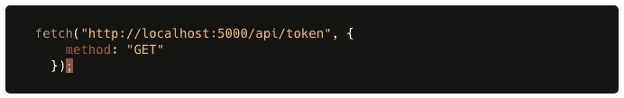

A simple GET request made from the react app

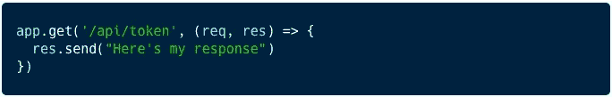

A text response by the express server. Note that no headers have been set.

上面的代码片段看起来都很好，客户机发出 GET 请求，服务器提供相同的服务，但是它会在浏览器控制台上导致下面的错误:

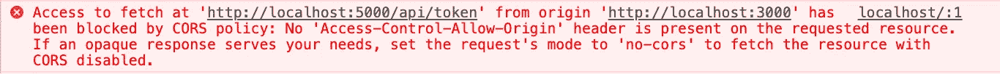

CORS error

如该错误所示，需要 Access-Control-Allow-Origin 标头才能从不同域中的服务器获取。让我们将这个头添加到 response 并继续。

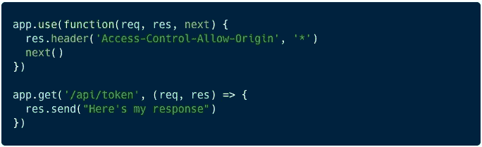

with wildcard *, the server is allowing requests from all origin to be able to fetch

现在我们已经允许 origin " * "从这个服务器获取数据，我们已经成功地使简单的客户端-服务器通信无缝地发生了。

## **2。访问控制允许凭证**

现在让我们对代码做一些调整，这样当调用 */token* 时，服务器会在客户端浏览器中设置一个 cookie。

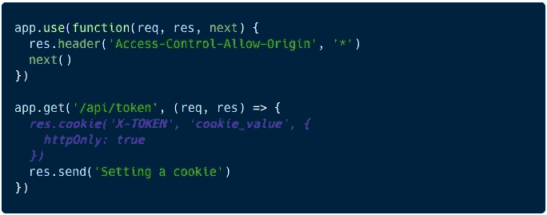

Setting an http-only cookie through the response, while all origins (*ie* *) are allowed

Note the value of credentials is set to include

现在我们都设置好了，让我们检查请求是否成功发出。
这里又出现了另一个 CORS 错误:

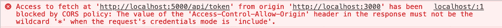

The value of Access-Control-Allow-Origin should not be * when credentials mode is include

好吧，这是有道理的。如果您的服务器试图设置一个 cookie，这主要是为了安全实现，最好只允许来自某些来源的请求，而不是由通配符“*”指定的所有来源。
同样，根据错误所述，我将允许服务器上的特定来源 *http://localhost:3000* 并继续。

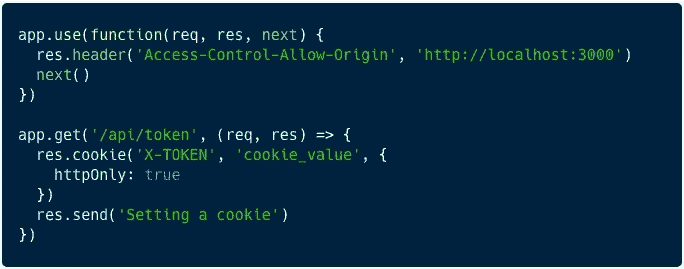

Access-Control-Allow-Origin set to “[http://localhost:3000](http://localhost:3000)”

将 Access-Control-Allow-Origin 标头从*更改为我们客户端的 Origin，解决了这个错误，但我的浏览器控制台上出现了下一个错误:

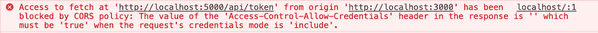

再次听取非常有用的 CORS 错误消息，我将继续更新我的代码，如下所示:

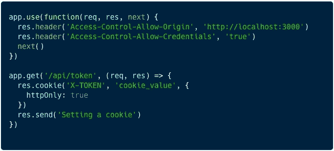

Setting the Access-Control-Allow-Credentials to true, as the request’s credentials mode is include

最后，我能够让我的服务器成功地向客户机发送一个文本响应并设置一个 cookie。

## **3。访问控制允许报头**

接下来，我将尝试从客户机向服务器发送一个定制的头。

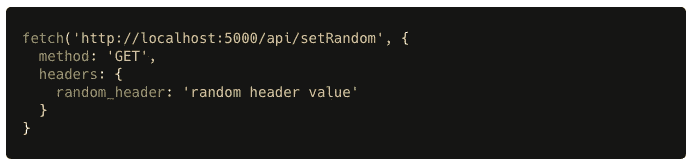

Sending random_header with the request

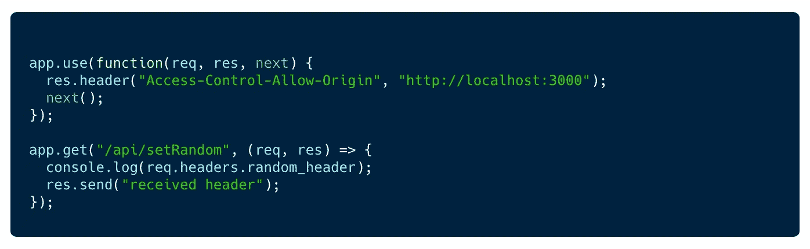

Server logs the received header

查看浏览器中的网络选项卡，我们可以看到正在发出选项请求。但是由于以下错误，我们的实际 get 调用无法通过:

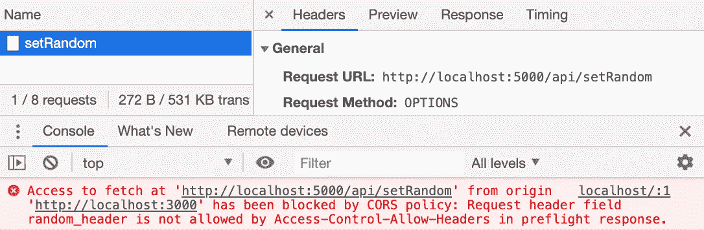

OPTIONS call made while sending custom headers

同样，按照上面 CORS 错误的建议更新代码，让我们针对 Access-Control-Allow-Headers 指定 random_header。

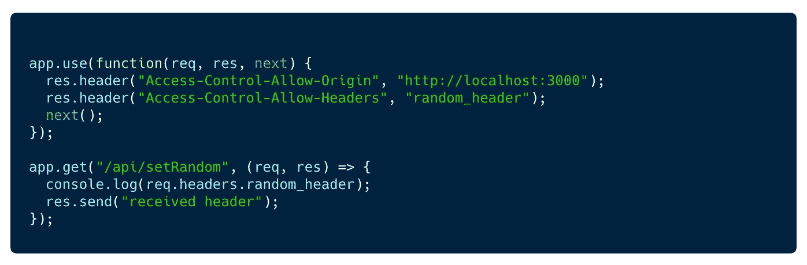

random_header allowed by specifying Access-Control-Allow-Headers

查看 network 选项卡，我们可以看到在 OPTIONS 调用成功后进行了 GET 调用。

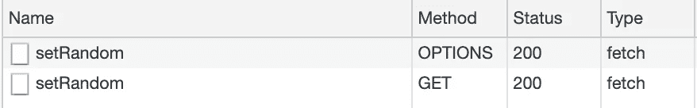

OPTIONS call made before the actual GET request

在那里，我们已经成功地将随机报头从客户端发送到服务器。我们可以使用自定义头作为一些特定的元数据，基于这些元数据，可以在后端代码上应用一个逻辑。

## **4。访问控制公开标题**

现在让我们尝试与上述场景相反的场景。让我们尝试发送一个带有响应的自定义头，并在浏览器上记录这个值。

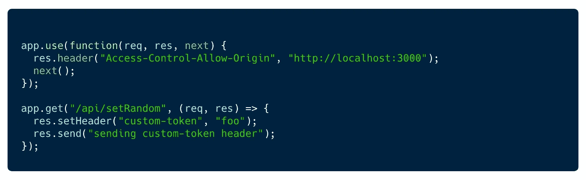

custom-token set as response header

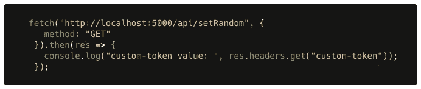

logging the custom-token value

现在，我们已经将自定义令牌添加到了响应中，并在客户端读取了相同的内容，让我们在浏览器中对此进行检查。

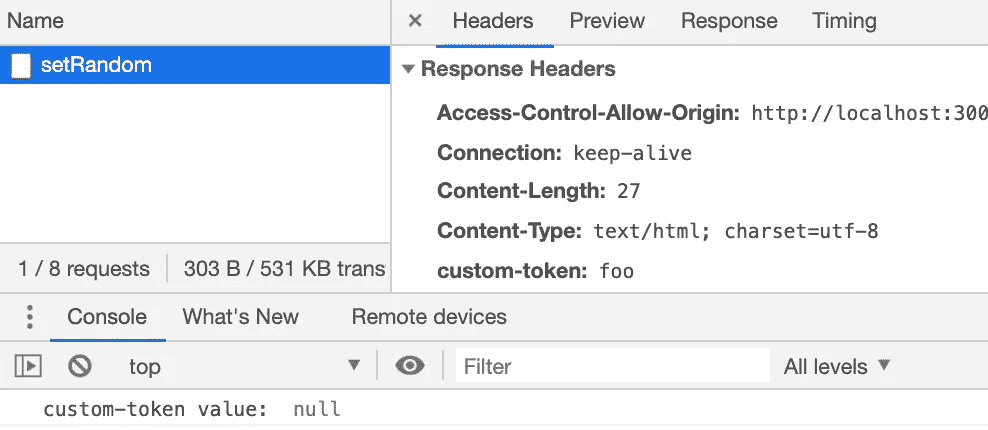

请注意，在接收到的头中可以看到自定义令牌，但是当尝试记录相同的内容时，无法读取值。之所以如此，是因为根据 CORS，只有 6 个 CORS- [安全列表](https://developer.mozilla.org/en-US/docs/Glossary/CORS-safelisted_response_header)响应头作为响应的一部分被暴露，其他的都被过滤了。要公开其他头，应该使用 Access-Control-Expose-Headers 响应头。现在让我们在响应中公开我们的自定义令牌。

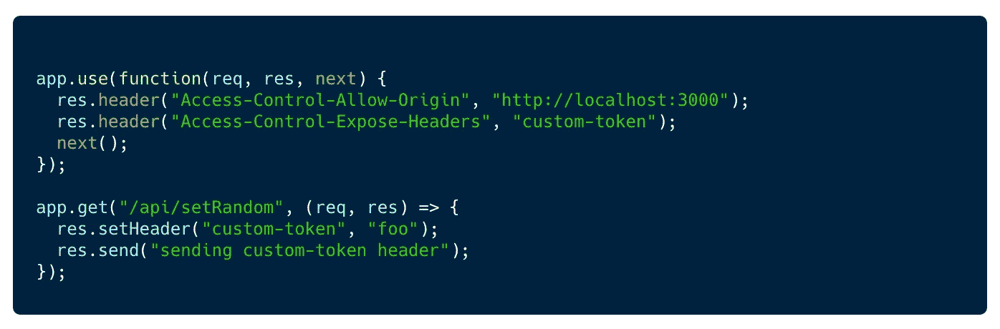

custom-token specified under Access-Control-Expose-Headers

检查网络调用，我们可以看到自定义令牌现在已经公开，并且可以被我们的 javascript 代码访问。

## **5。访问控制允许方法**

access-Control-Allow-Methods**response header 指定在访问资源以响应预检请求时允许的一种或多种方法。让我们试着做一个卖出请求，如上所述，它将请求一个期权买入。**

**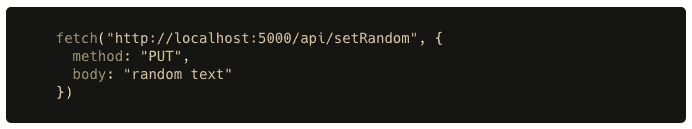****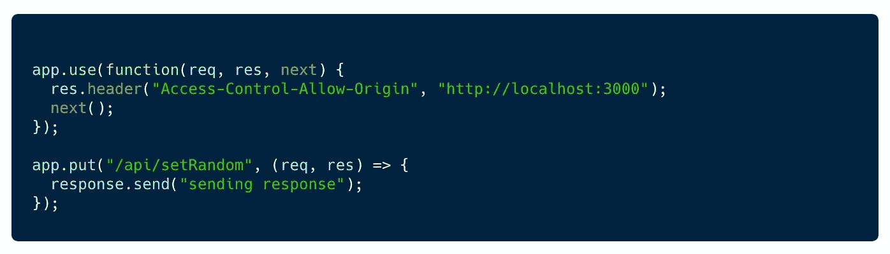****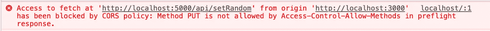**

**预检请求失败，因为它没有获得上传请求的批准，因此无法发出请求。我们需要我们的客户端使用 Access-Control-Allow-Methods 头来允许 PUT 请求。**

**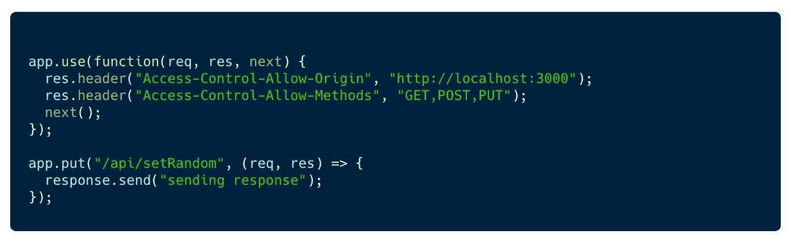**

**Allowing PUT requests using Access-Control-Allow-Methods**

**现在 OPTIONS 调用成功了，从而允许 PUT 请求通过。**

# **TL；博士:**

**让我们总结一下这篇文章的要点:**

****1。** **如果服务跨来源请求，则在响应中应设置访问控制允许来源**报头。**

****2** 。如果请求需要向服务器发送安全 cookie，或者期望响应中有 cookie，那么其**凭证**模式应该设置为**包含**。只有这样，它才能使用 http cookies。**

****3** 。在复杂的跨源请求的情况下，例如 HTTP 请求方法会对服务器数据产生副作用，浏览器会自动发出 [**预检**](https://developer.mozilla.org/en-US/docs/Web/HTTP/CORS#Functional_overview) 请求。**

****4。** **当凭证模式设置为包含时，Access-Control-Allow-Credentials**头应设置为真。**

****5。**当请求中需要自定义报头时，该报头应在**访问控制允许报头**报头下指定。**

****6。**当自定义标头与响应一起发送时，应在**Access-Control-Expose-Headers**标头下指定，以便客户端能够访问标头值。**

**7。**Access-Control-Allow-Methods**头应该指定会对服务器数据产生副作用的方法(如果有的话)。**