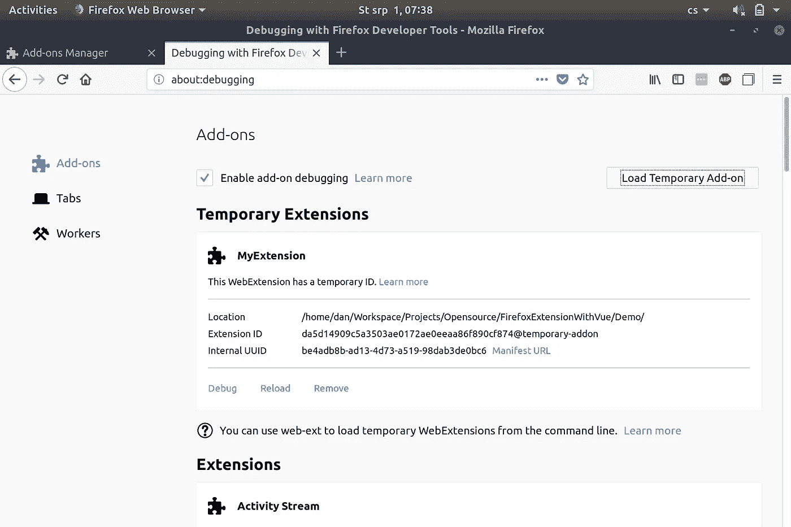

# 我如何用 Vue 构建浏览器扩展(第 1 部分)

> 原文：<https://javascript.plainenglish.io/i-built-a-browser-extension-with-vue-76779d0a6238?source=collection_archive---------1----------------------->

在本文中，我将向您展示如何使用流行的 JavaScript 框架 Vue 创建非常简单的 Firefox 扩展。

本文分为两部分。第一部分涵盖了创建 Firefox 扩展的所有必要基础知识，第二部分重点介绍了将其转换为 Vue 的过程。


If you look at this long enough, you’ll see an owl.

# 先决条件

尽管整篇文章中没有使用高级的 Vue 技术，并且 JavaScript 知识应该足够了，但建议读者至少对 Vue 有基本的了解。您还将看到我通过终端/命令行创建文件。虽然这是一种创建新文件和文件夹的好的、干净的方法，但这不是必需的——因为这些东西可以按照您喜欢的方式创建:)

# 目录

*   创建 Firefox 扩展
*   安装
*   做某事


Firefox + Vue + a random jigsaw piece = The meaning of life!

# 创建 Firefox 扩展

简而言之，Firefox 扩展是包含一些文件的目录。仅此而已。这听起来可能一点也不专业，但是对我来说，我稍后会谈到这一点。

记住这一点，让我们创建一个名为`MyExtension`的新目录并输入它。

```
mkdir MyExtension
cd MyExtension
```

一个 Firefox 扩展可能包含许多其他可选的目录和文件，所以让我们只讨论那些强制的。其实应该说是强制的那种。Firefox 扩展唯一需要的文件是`manifest.json`，它应该位于我们的扩展的根目录中。所以让我们创建一个

```
touch manifest.json
```

并用以下 json 对象填充它:

```
{
    "manifest_version": 2,
    "name": "MyExtension",
    "version": "1.0.0"
}
```

这是 Firefox 扩展能够工作的最小工作配置。正如你所猜测的，目前它并没有太大的用处，但是它是一个好的开始。

我希望`manifest.json`文件中的每个属性都是不言自明的，但是为了保险起见，这里有一个快速概述:

*   **manifest_version** —表示清单文件本身的版本。更多细节请访问 Mozilla 的文档。
*   名字**—这是我们给我们的扩展命名的名字**
*   ****版本** —这是一个字符串，表示我们的扩展的当前版本。你可以给它起任何你想要的名字，但是有一些惯例你可以遵循。更多信息参见 [Semver](https://semver.org) 。**

**现在我们的整个项目看起来像这样。**

****

**在我们用更多的功能扩展它之前，让我们看看如何安装和调试这样一个扩展。**

# **安装**

**首先，我们需要打开一个调试页面。在 Firefox 地址栏中输入`about:debugging`并回车。您应该会得到与此类似的结果:**

****

**点击*加载临时插件*按钮，打开`manifest.json`文件。现在你应该看到你的扩展被加载到*临时扩展*部分。**

****

# **做某事**

**现在您已经成功地创建并加载了一个临时的 Firefox 扩展！尽管这是一项伟大的成就，是值得骄傲的事情，但我们还是要面对现实。没用的。**

****

**A sad jigsaw = a sad life**

**它看起来什么都不像，也还没做什么；它只是坐在那里占用资源(几乎什么都没有，但这不是重点)。**

**所以让我们解决“看起来什么都不像”的部分。我的意思是，让我们给我们的扩展一个向世界展示自己的方式——一个图标。**

# **为扩展提供图标**

**目前我没有合适的图标候选人，但是我找到了一个我经常使用的图像，所以我会选择这个。我希望有一天你会原谅我；).当然你可以随意使用任何你喜欢的图片。**

**让我们创建一个文件夹，我们的图像和随后的大部分应用程序源代码将存放在这个文件夹中。**

```
mkdir -p assets/img
```

**`-p`选项表示该命令应该在该路径上创建所有目录，以防它们不存在。所以在这种情况下，它将创建一个`asset`目录和其中的`img`目录。将你选择的图标图片放在`img`文件夹中——以`logo.png`命名——你就可以开始了。**

**我们的项目现在看起来像这样**

```
MyExtension
    assets/
        img/
            logo.png
    manifest.json
```

**如果您点击`about:debugging`页面中的*重新加载*按钮，您会注意到什么也没有发生。要实际告诉扩展使用我们的图像作为图标，我们需要明确地告诉它。为此，让我们更新我们的`manifest.json`文件。**

**指定图标的关键属性是(你永远猜不到)一个叫做`icons`的属性。它是一个对象，其中键是图标的尺寸，值是它的路径。你可以在这里了解更多信息[。](https://developer.mozilla.org/en-US/docs/Mozilla/Add-ons/WebExtensions/manifest.json/icons)**

```
{
    "manifest_version": 2,
    "name": "MyExtension",
    "version": "1.0.0",
    "icons": {
        "48": "assets/img/logo.png"
    }
}
```

**现在，如果你点击重新加载按钮，而不是默认的扩展图标(拼图)，你提供的一个应该会出现。**

**现在它有了些样子，我们终于可以把它展示给朋友们了！但还是没多大作用。你知道吗？最好不要给任何人看…**

**相反，让我们看看如何让我们的扩展变得有用。**

# **浏览器动作**

**我们希望允许用户以某种方式与我们的扩展交互。浏览器操作是浏览器右上角的小按钮，通常会打开一个小弹出窗口，让你做一些事情。让我们来看看如何创建一个。**

****

**当你点击按钮时弹出的是一个简单的 html 页面，所以在我们创建按钮之前，让我们准备一个简单的 HTML 页面`app.html`。**

```
touch app.html
```

**现在你的文件结构应该是这样的**

```
MyExtension
    app.html
    assets/
        img/
            logo.png
    manifest.json
```

**并将以下内容填入`app.html`**

```
<!DOCTYPE html>
<html>
<head>
    <meta charset="utf-8">
</head>
<body>
    Hello Firefox extension!
</body>
</html>
```

**现在我们需要将这个 html 注册为`manifest.json`中的默认弹出窗口。**

```
{
    "manifest_version": 2,
    "name": "MyExtension",
    "version": "1.0.0",
    "icons": {
        "48": "assets/img/logo.png"
    },
    "browser_action": {
        "default_icon": "assets/img/logo.png",
        "default_title": "Opens MyExtension",
        "default_popup": "app.html"
    }
}
```

**注意描述默认弹出窗口的 *browser_action* 属性。请注意，我使用了相同的图像作为扩展标志和弹出图标。这两个可以不同，但我决定不这样做，以限制演示应用程序中使用的图像数量。**

***default_title* 是用户悬停在按钮上时显示的文本。
*default_popup* 是我们的 html，用作弹出窗口。你可以在[官方文档](https://developer.mozilla.org/en-US/docs/Mozilla/Add-ons/WebExtensions/manifest.json/browser_action)中阅读更多关于 *browser_action* 的内容。**

**继续，在`about:debugging`中重新加载你的扩展，你现在应该看到这个按钮了。**

****

**This is what success looks like ;)**

**恭喜你，你已经成功地创建了第一个功能性的 Firefox 扩展，这一次，它真的有所作为了！:)**

# **请求许可**

**在我们深入研究将我们的扩展转换成 Vue 之前，我们需要稍微改进一下。本文主要关注的不是您可以用您的扩展做什么，但是我认为至少演示一些它可以做的事情是有用的。让我们利用扩展的能力来访问一些常规浏览器应用程序中不可用的浏览器信息，例如访问打开的窗口和检索所有打开的标签的能力。**

**要做到这一点，我们需要明确要求访问浏览器选项卡，并且需要由用户授权给我们。这通常是在安装过程中完成的，安装过程中会询问用户是否同意授予扩展某些权限。**

**正如你可能猜到的，这又发生在`manifest.json`。这一次它是名为 *permissions* 的属性，它保存了扩展请求的所有权限的数组。因此，继续将`tabs`放入该数组。**

```
{
    "manifest_version": 2,
    "name": "MyExtension",
    "version": "1.0.0",
    "icons": {
        "48": "assets/img/logo.png"
    },
    "browser_action": {
        "default_icon": "assets/img/logo.png",
        "default_title": "Opens MyExtension",
        "default_popup": "app.html"
    },
    "permissions": ["tabs"]
}
```

**现在，当您尝试安装扩展时，系统会提示您授予扩展请求的权限。嗯，实际上你不会得到任何提示，因为我们在调试模式，但相信我，它会在那里。**

# **增加一些互动性**

**现在是接收和处理一些数据的时候了。我们将利用授予我们的*选项卡*权限，并通过`browser`对象访问它。**

**但在此之前，让我们在`app.html`中创建一个触发事件的按钮和一个显示结果的`ul`元素。**

```
...
<body>
    Hello Firefox extension!
    <button id="button">Show me tabs</button>
    <ul id="results"></ul>
</body>
...
```

**现在我们需要创建一个`loadTabs()`函数，并将其注册为 onlick 监听器。所以让我们创建一个名为`app.js`的文件，并将它放在我们的扩展的根文件夹中。在`app.html`中注册该功能并链接。**

```
...
<body>
    Hello Firefox extension!
    <button id="button">Show me tabs</button>
    <ul id="results"></ul> <script src="app.js"></script>
</body>
...
```

**最后是`app.js`**

```
const btn = document.querySelector('#button');
if (btn)
    btn.addEventListener('click', loadTabs);function loadTabs() {
    alert('Hello there!');
}
```

**重新加载扩展并单击按钮。如果它正确地显示了一个警告窗口，您应该会得到类似如下的内容:**

****

**最后要做的是移除对`alert`函数的调用，并替换为对浏览器的实际请求，以获取所有打开的选项卡:**

```
const btn = document.querySelector('#button');
if (btn)
    btn.addEventListener('click', loadTabs);function loadTabs() {
    // This is the request to obtain an array of active tabs. It returns a promise.
    // It accepts a config object (see docs)
    browser.tabs.query({ currentWindow:true })
        .then(tabs => {
            const results = document.querySelector('#results'),
                  parts = []; for (let tab of tabs) {
                parts.push(`<li>${tab.title}: ${tab.url}</li>`);
            } results.innerHTML = parts.join('');
        });
}
```

**现在，单击按钮后，您应该看到无序列表中列出的所有选项卡。恭喜你。**

**在结束本文的第一部分之前，让我向您展示最后一样东西。**

# **弹出调试**

**肯定会有这样的时候，你需要检查你的弹出窗口(一个 html 文档)的元素，作为一个普通的 html 页面。为此，在*临时扩展*部分的`Reload`按钮旁边有一个*调试*按钮。这不是秘密，因为按钮非常明显。但是一旦你开始调试，你会注意到一旦你点击检查器窗口来摆弄这些元素，你的弹出窗口就会关闭。这非常不方便，但幸运的是有一个修复方法。**

**点击检测窗口右上角的三点按钮，点击*禁用弹出自动隐藏*。**

****

**这就结束了本文的第 1 部分。在[第 2 部分](https://medium.com/javascript-in-plain-english/how-i-built-a-browser-extension-with-vue-part-2-2c4ab2dd752d)中，我们将通过利用 Vue 来构建我们的浏览器扩展接口，从而将 Vue 添加到组合中。**

**第 2 部分现在已经准备好了——你可以在这里阅读它！**

**这篇文章是作为一个开源项目发表在 Github 上的，所以如果你有任何建议，或者发现了任何打字错误，请不要犹豫投稿！**

# **信用**

**特别感谢 Sunil 和 Wyatt 对本文的贡献。**