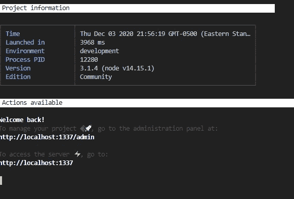

# 我用 Gatsby，Strapi，Heroku，Netlify 和 Github Actions 建立了我的个人网站

> 原文：<https://javascript.plainenglish.io/i-built-my-personal-website-using-gatsby-strapi-heroku-netlify-and-github-actions-879ca9098dab?source=collection_archive---------1----------------------->


Photo by [Sean Lim](https://unsplash.com/@seanlimm?utm_source=unsplash&utm_medium=referral&utm_content=creditCopyText) on [Unsplash](https://unsplash.com/s/photos/programming?utm_source=unsplash&utm_medium=referral&utm_content=creditCopyText)

我想建立我的网站，并有一些类似 CI/CD 管道的地方，以推动从本地开发到生产的变化很容易。我想有一个前端和后端分别部署，相互通信。

我在 Netlify 上建立了 Gatsby 前端站点，而内容由部署在 Heroku 上的 Strapi 管理。我还向 Strapi 添加了定制的 webhooks，以通过 Github Actions 工作流触发站点的构建。在 Github 上构建站点节省了我在 Netlify 上宝贵的构建时间(你每个月只能获得有限的构建时间)。

通过写这篇文章，我希望读者也能建立自己的环境，舒适地创建和管理个人网站。

这不是盖茨比或斯特拉皮的教程。这里有一个很棒的教程，它比我做得更好。

## 如何在本地安装和运行 Strapi

为了在本地运行 Strapi，Node.js 的最低版本是 12.x，建议使用 14.x。您还需要 Npm 版本 6.x。

如果你想跳过这一部分，可以在这里找到很多关于如何安装 Strapi [的文档。](https://strapi.io/documentation/v3.x/installation/cli.html)

使用 Npm 安装一个 Strapi 项目。

```
npx install create-strapi-app project-name --quickstart
```

Strapi 目前支持 SQLite、PostgreSQL、MySQL、MariaDB 和 MongoDB 作为数据库。该选项告诉 Strapi 使用 SQLite，坦白地说，这正是我使用 Strapi 进行本地开发所需要的。

跑 Strapi run

```
npm run develop
```

你会看到类似这样的东西



转到`http://localhost:1337/admin`并创建一个帐户。您将被重定向到管理页面。您现在有了一个工作的本地 Strapi 实例。

一旦你进入管理页面，你就可以创建和管理网站内容，无论是博客文章，关于我的信息，还是工作经验，任何你真正想要的东西。

## 盖茨比场景

Gatsby 文档非常简洁地解释了如何安装和使用 Gatsby。

与 Strapi 类似，确保系统上安装了 Node.js、NPM 和 Git。

安装 Gatsby CLI 工具

```
npm install -g gatsby-cli
```

要创建一个新的 gatsby 项目，您可以利用 Gatsby“starters”(带有一些默认配置的部分构建的站点)。

```
gatsby new gatsby-project-name https://github.com/gatsbyjs/gatsby-starter-hello-world
```

Github URL 指向一个包含 Gatsby 项目启动代码的存储库。要在本地运行 Gatsby，请键入

```
gtasby develop
```

默认情况下，您的本地 Gatsby 实例将在`http://localhost:8000`上运行。

## Gatsby 从 Strapi 检索内容

为了让 Gatsby 从 Strapi 获取内容，安装下面的 Gatsby 插件——Gatsby 有一个丰富的插件系统。

```
npm install gatsby-source-strapi
```

插件在`gatsby-config.js`文件中定义和配置。目前，本地 Strapi 实例的 URL 已经足够了。还指定了要检索的内容类型。

```
plugins : [
    {
        resolve: `gatsby-source-strapi`,
        options: {
            apiURL: `http://localhost:1337`,
            queryLimit: 1000, // default to a 100
            contentTypes: [`article`, `experience`],
            singleTypes: [`about`],
        }
    }
]
```

正如我之前提到的，我不会涉及如何使用 graphql 查询 Strapi 文档，因为它已经广泛涉及[这里](https://www.youtube.com/watch?v=asB-dUwpH4Y&t=12099s)，或者任何其他关于 Gatsby 的深入教程。

您的 Gatsby 现在可以从 Strapi 查询内容并在前端使用它。停止运行您当前的本地 Gatsby 项目。确保 Strapi 实例仍在运行，并执行以下命令

```
gatsby build
```

一个名为`public`的文件夹将出现在您的项目的根目录中。这是您的静态站点，它被编译到一个文件夹中，所有内容都来自 Strapi。

然后，您可以将该文件夹拖放到 Netlify 中进行部署。

## 在网络上部署公用文件夹

在 Netlify 上创建一个帐户。这是一个直截了当的过程。

一旦你有了一个团队的帐户，你就可以创建和部署一个新的站点，只需将你的`public` gatsby 文件夹拖放到 **Sites** 下的拖放区。

你的网站将需要一点时间来建立。完成后，您可以通过 Netlify 生成的长 URL 打开您的实时网站。你手上有一个工作地点！

每次更新后，我都在重复这个过程。拖放功能是惊人的，但我想要一个更好的体验，一个更适合开发人员的体验，在我将代码推送到 Github 库后，我的站点会更新。

## 将 Strapi 部署到 Heroku

Netlify 提供了从 Git 构建站点的选项。但是为了做到这一点，我必须有一个部署好的 Strapi API 版本，以便查询每个 Gatsby 构建的内容。`http://localhost:1337`对远程 Github 存储库上的代码没有任何意义。

Strapi 官网有[文档](https://strapi.io/documentation/v3.x/getting-started/deployment.html)介绍如何将 Strapi 部署到 Heroku、AWS、Azure、DigitialOcean、Google App Engine 等各种平台。我选择了 Heroku，因为我发现它最容易使用。

Heroku 部署指令相当广泛，你可以完全跳过这一部分。然而，我确实发现了一些细微的差别，我想详细说明一下。

你必须安装 git 和一个免费的 Heroku 帐户。此外，请确保安装 Heroku CLI。

您可以从命令行登录 Heroku

```
heroku login
```

这将把你重定向到 Heroku 网站，在那里你将被验证使用你的帐户。完成后，返回命令行。

更新您的`.gitignore`文件以包含`package-lock.json`。包含它可能会在 Heroku 上产生一些问题。我懒得去了解原因。我信任 Heroku！

您必须将您的 Strapi 项目初始化为 git 项目，该项目将由 Heroku 管理。确保您位于项目文件夹中。

```
cd project-folder
git init
git add .
git commit -m "First Commit"
```

现在你可以创建一个 Heroku 应用程序

```
heroku create
```

这个命令通常只在初始化的 git 存储库上使用。它在 Heroku 应用程序上创建了一个远程 git 存储库，您可以将本地存储库中的更改推送到这个存储库中。

现在你在 Heroku 上有了一个免费的应用程序(我相信一个用户总共可以得到三个免费的应用程序),并且配置了你的本地存储库。要让 Strapi 在 Heroku 上工作，您需要使用 PostgreSQL 或 MongoDB。就这么定了。

安装 Postgres 附加组件(Heroku 上的附加组件似乎相当于盖茨比的插件)。

```
heroku addons:create heroku-postgresql:hobby-dev
```

该插件将数据库凭证暴露在一个环境变量中，您可以通过 Heroku config 访问该变量

```
heroku config
```

这将打印一个 URL，显示为“postgres://USERNAME:PASSWORD @ HOST:PORT:DATABASE _ NAME”。

因为 Strapi 需要数据库凭证来连接数据库，所以您需要从上面的 URL 中解构变量。

用 npm 安装`pg-connection-string`模块；

```
npm install pg-connection-string --save
```

如果你看一下文件`./config/database.js`，你会看到它现在是

`env`让你访问环境变量。为了在 Heroku 上本地和生产中使用 Strapi，我们需要配置`database.js`，以便基于`process.env.NODE_ENV`使用不同的数据库。

如果节点环境是生产环境，我们使用来自`pg-connection-string`模块的解析函数，Heroku 就是这种情况。这个解析函数然后解构 Postgres 数据库 URL，并在 Heroku config 对象上设置不同的环境变量。

生产数据库连接使用 config 对象来访问连接到 Postgress 数据库所需的不同变量。

当 Strapi 在本地运行时，`NODE_ENV`等于“开发”，数据库连接由`devConnections`函数决定。

**这部分对我设置 Strapi 至关重要。**

我终于能够在两个 Strapi 实例分别工作的情况下，将开发模式的变更推进到生产模式。值得注意的是，您在本地创建的内容数据不会迁移到 Heroku，因为您使用的是两个完全不同的数据库。

我们还需要做些什么

```
heroku config:set NODE_ENV=production
```

最后，我们需要安装 pg 模块。

```
npm install pg
```

将所有这些更改添加到 git，并推送到 Heroku 远程 git 来更新应用程序。

```
git add .
git commit -m "configured pg database for Heroku"
git push heroku master
```

您可以从命令行打开您的应用程序

```
heroku open
```

您将再次需要为生产 Strapi 创建一个新的管理员用户，然后您可以管理 Heroku 上部署的 Strapi 上的内容。

要建立新的内容类型或者更新一些配置，在开发中添加变更，然后推送到 Heroku app。这是因为出于安全原因，Strapi 在生产模式下禁用了内容类型生成器。

斯特拉皮部署在赫罗库。盖茨比可以从这里开始建设。

## 从 Git 在 Netlify 上构建站点并使用 Heroku Strapi API

将您的 Gatsby 项目链接到 Github 上的远程 git 存储库。如果你去你的 Netlify 账户主页，会有一个绿色按钮，上面写着**‘来自 Git 的新网站’。**一旦按下，你将被提示从 Github、Gitlab 或 Bitbucket 中选择一个库。我用了 Github。

一旦您为 Netlify 设置了 Github 应用程序并成功连接了 Github 存储库，Netlify 将为您创建这个新站点，并自动构建和部署它。

因为我们想在 Heroku 上使用 Strapi，所以我们必须更新我们的`gatsby-config.js`文件。

如您所见，根据节点环境，Gatsby 将与相应的 Strapi 实例进行通信。

现在，每当您在本地更新 Gatsby 项目并将更改推送到您的远程 Github 存储库时，您的站点在 Netlify 上的构建和部署都会自动触发。

这太棒了。但是当你在 Heroku Strapi 上输入新内容时会发生什么呢？你在 Netlify 上的站点无法了解它。它不会用新内容更新。您必须手动将本地 Gatsby 中的内容推送到 Github 存储库中，以触发站点的重建。

这可能会很烦人，这也是我决定用 Strapi 实现 webhooks 的原因。

## Webhooks，带 Strapi，触发 Netlify 上的 Gatsby 站点构建

在您的 Netlify 网站上，进入**网站设置**。在左侧的选项中选择**构建&部署**。在页面上继续向下滚动，直到你看到**构建钩子**并点击**添加构建钩子。**给钩子起个名字，并保留默认的 Github 分支，它将从这个分支开始构建。

创建后，您将看到一个 HTTPS 地址。每次 Strapi 上的内容更新时，Strapi 上的 webhook 都应该向 build hook 发送一个 HTTPS 请求。这将自动触发网站重建并更新新内容。

要在 Heroku Strapi 上添加 webhook，请进入管理面板并在左侧菜单中选择**设置**。在全局设置下选择 **Webhooks** 。点击**添加新的网页挂钩**。给 webhook 起一个名字，并添加您刚刚在 Netlify 上创建的构建钩子的地址。

在**事件**下，勾选**条目**框。这告诉 Strapi 在每次创建、编辑或删除内容时向构建挂钩发送一个请求。

很好。我以为我的工作已经完成了，直到我意识到 Netlify 的构建时间有限。我想节省这些时间，在偶然发现这个伟大的[教程](https://www.youtube.com/watch?v=W37I5U6J2hI&t=870s)后，我意识到我可以做到。

## 通过使用动作在 Github 上构建来节省 Netlify 上的构建时间

您可以使用 Github actions 在 Github 上构建您的站点，并简单地将构建的站点部署到 Netlify。你将在 Netlify 上花费零构建分钟。如果我没弄错的话，Github Actions build 是无限的！

为此，您需要创建一个如下所示的`.github/workflows/main.yml`文件:

每次您将代码推送到 Github 上的 Gatsby 存储库时，都会执行这个工作流。

关于 Github 动作如何工作，我不会讲太多细节。

但是在每一次代码推送时，节点环境都会被设置。该站点将在该环境中构建，并部署到 Netlify 站点。您将需要获得您的 Netlify 站点 id，以及用于授权的 Netlify 身份验证令牌。

Netlify 站点 id 在**站点信息**框中的**站点设置**下找到，作为 **API ID。**复制这个值，并以名称 **NETLIFY_SITE_ID 作为秘密保存在 Github 存储库中。**

要访问 Netlify 身份验证令牌，请在 Netlify 页面的右上角单击您的个人资料头像，然后转到用户设置。在左侧菜单中选择**应用**并点击**个人访问令牌**下的**新访问令牌**。描述您拍摄的照片并复制其价值。将其作为秘密保存在 GitHub 存储库中。

最后，在**构建&部署**下，点击**构建设置**下的**编辑设置**，选择**停止构建**选项。这将确保当您的 Github Gatsby 存储库将构建的代码部署到 Netlify 时，Netlify 也不会构建它。

我们马上就要到了。当你在 Heroku Strapi 上的内容更新时会发生什么？

它将向 Netlify 构建挂钩发送一个 HTTPS 请求，通知它重建站点。但是 Netlify 不能再这样做了，因为我们停止了该网站上的所有构建。

## 定制 Webhooks 以触发存储库调度

您可以在 Strapi 上为您的内容编写生命周期方法。如果您检查本地 Strapi 的文件夹结构，您会发现一个包含内容模型的 **api** 文件夹。例如，我有一个**工作**内容类型，因此在 api 文件夹中有一个文件夹。

在我的工作文件夹中，我有文件夹**配置、控制器、模型、**和**服务。**在**模型中，**我打开了 **work.js** 文件，看起来是这样的

如果您想在任何内容更新时发送一个[存储库分派](https://docs.github.com/en/free-pro-team@latest/rest/reference/repos#create-a-repository-dispatch-event)，您可以在 Strapi 模型[生命周期挂钩](https://strapi.io/documentation/v3.x/concepts/models.html#lifecycle-hooks)中这样做。例如，每次更新内容实例后，都会创建`afterCreate`挂钩。

存储库调度是一个事件，您可以通过向特定的 Github 存储库 api URL 发送 Axios 请求来触发该事件。您需要创建一个 Github 令牌，并随请求一起发送。您还可以随请求发送一个有效负载，为您的存储库分派指定事件类型的名称。

您可以在 Github Actions 工作流中包含存储库调度，这样 Gatsby 站点就可以建立在任何事件类型为“created”的存储库调度之上。

因此，每次 Strapi 上的内容更新时，都会触发相应的生命周期挂钩。这又会向您的 Gatsby 存储库发送一个存储库分派事件，从而启动您的站点的构建。一旦建立了站点，它将被部署到 Netlify，您就拥有了更新的站点。

生命周期挂钩需要在本地添加，然后推送到 Strapi 的 Heroku 实例。

我希望你喜欢读这篇文章！请让我知道，如果我错过了什么或没有解释清楚一个步骤！。