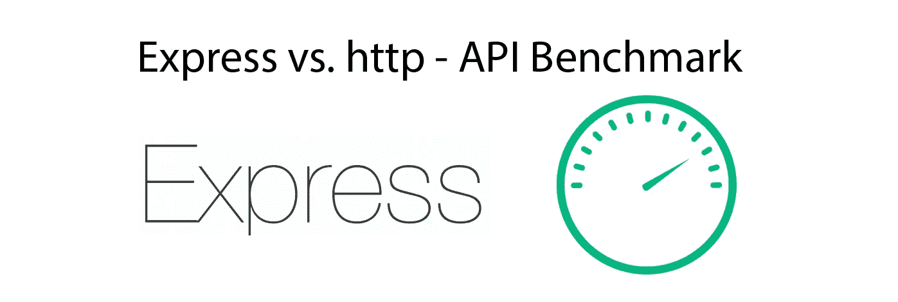

# 我用&不用 Express 构建了相同的 API。以下是不同之处。

> 原文：<https://javascript.plainenglish.io/i-built-the-same-api-with-without-express-here-are-the-differences-83bbeb7ddad?source=collection_archive---------0----------------------->

## 运行了一个基准测试



Source: The author

Express.js 现在是 Node.js 世界的标准。如果 backend 想要为 web 开发应用程序，那么`npm install express`是预编程的，并且已经成为我们大多数人的例行程序。

诚然，使用 Express.js 要愉快得多——当我学习 Node.js 时，我直接进入了 Express。在这个实验之前，我可能没有写过任何没有 Express.js 的东西。

这就是为什么我非常渴望对 Express 进行测试——并以一个小 API 的形式用本地方法进行测试。

所以我构建了同一个 API 两次，一次有，一次没有 Express。你可以看到下面的代码——首先是一个小提示。

当我对这两个 API 进行测试时，我注意到了以下情况:**Express 应用程序的响应大约高出 15%。**

如果您想制定一个衡量服务器性能的公平基准，这当然是有问题的。
不同的大小不是因为我们的响应内容，因为我们用`res.end()`从两个服务器发送相同的内容，而是发送到标题。

默认情况下，Express.js 在头中附带了一些东西，这只是表面上的——`X-Powered-By`标签。


X-Powered-By Express.js Tag

但是我们可以简单地停用它:`app.disable('x-powered-by')`

那么不同服务器的两个响应的大小应该完全相同。让我们看一下代码。

**express . js API:**

**不带 Express.js 的 API:**

从逻辑上讲，这两个 API 做的完全一样。它们只响应 */api-route* 并返回它们收到的查询参数。

# 基准和结果

作为基准工具，我决定使用 Apache Bench。它是一个简单的命令行工具，预安装在大多数系统上(Windows 除外)。

```
*ab -n 10000 -c 100 <url>*
```

*-n 10000* 是我们总共发送的请求， *-c 100* 代表我们同时打开的连接——真正让服务器升温。

Apache Bench 然后输出一些数据作为结果。最重要的列举如下。

*   每秒*请求越多*越好，同样适用于*传输速率。*
*   每个请求的*时间越少越好——单个请求应该被尽可能快地处理。*

首先我测试了原生服务器，也就是没有 Express 的那个。

**基准 1:**

```
Requests per second: 10882.52 [#/sec] (mean)
Time per request: 9.189 [ms] (mean)
Time per request: 0.092 [ms] (mean, across all concurrent requests)
Transfer rate: 988.35 [Kbytes/sec] received
```

**基准 2:**

```
Requests per second: 10876.13 [#/sec] (mean)
Time per request: 9.194 [ms] (mean)
Time per request: 0.092 [ms] (mean, across all concurrent requests)
Transfer rate: 987.77 [Kbytes/sec] received
```

**基准 3:**

```
Requests per second: 10928.75 [#/sec] (mean)
Time per request: 9.150 [ms] (mean)
Time per request: 0.092 [ms] (mean, across all concurrent requests)
Transfer rate: 992.55 [Kbytes/sec] received
```

现在遵循 Express.js API。

**基准 1:**

```
Requests per second: 4998.91 [#/sec] (mean)
Time per request: 20.004 [ms] (mean)
Time per request: 0.200 [ms] (mean, across all concurrent requests)
Transfer rate: 454.00 [Kbytes/sec] received
```

**基准 2:**

```
Requests per second: 5076.82 [#/sec] (mean)
Time per request: 19.697 [ms] (mean)
Time per request: 0.197 [ms] (mean, across all concurrent requests)
Transfer rate: 461.08 [Kbytes/sec] received
```

**基准 3:**

```
Requests per second: 5249.16 [#/sec] (mean)
Time per request: 19.051 [ms] (mean)
Time per request: 0.191 [ms] (mean, across all concurrent requests)
Transfer rate: 476.73 [Kbytes/sec] received
```

服务器的纯 Node.js 实现，完全没有 Express.js 这样的框架要快很多。

乍一看，我简直不敢相信，我再次确保我为两台服务器创造了相同的条件。因此，我运行了很多次基准测试，但结果还是一样。

然后，我在我的 3B 树莓派上运行了同样的基准测试——只是为了看看差异是否一样大。

虽然在我的 MacBook Pro 上的基准测试中，本机服务器的速度几乎是两倍，但 Raspberry Pi 上的本机服务器仅快 25%左右。

但是，有一个显著的区别——在任何基准测试中，Express 都无法接近简单 Node.js 服务器的性能。

就我个人而言，我原本预计 Express.js 会慢一些，但这种差异有时并不明显。最后，Express.js 走了一段弯路，构建在 Node.js 的 HTTP 模块上，我们将它用于原生服务器。

# 总结

是不是应该从此吸取教训，再也不用 Express.js 了？不，绝对不是。Express.js 非常棒——它使得开发后端应用程序变得非常容易。

任何价格的性能并不总是有意义的——毕竟，Express 应用程序也更容易维护，开发更快，这可以节省成本和时间。

仅在因特网上找到的关于 Express 的文档和资源就有很多，并且有很好的解释。

在如此短的时间内向服务器发送 10000 个请求也是一个相当不现实的场景——当然，使用 Express 的响应时间也更高，但在正常情况下，这应该不会给任何人造成任何问题。

感谢您的阅读！

这里有更多关于 web 框架性能的信息，让我们看看 Fastify 能做什么:

[](https://link.medium.com/X1Pc4yp4rab) [## 我用 Fastify，Express & Bare Node.js 构建了相同的 API，区别如下。

### Fastify -名字就是座右铭。至少 Node.js 的框架想要代表的是速度。在我们……

link.medium.com](https://link.medium.com/X1Pc4yp4rab) 

关于 Express.js 的更多信息:

[](https://medium.com/javascript-in-plain-english/3-express-js-features-you-need-to-know-8f78b0035f33) [## 你需要知道的 3 个 Express.js 特性

### 几乎所有主要的 Node.js 应用程序都依赖于 Express.js 框架，这里有一些你应该知道的重要特性。

medium.com](https://medium.com/javascript-in-plain-english/3-express-js-features-you-need-to-know-8f78b0035f33) 

[**加入我的邮件列表保持联系**](http://eepurl.com/hacY0v)