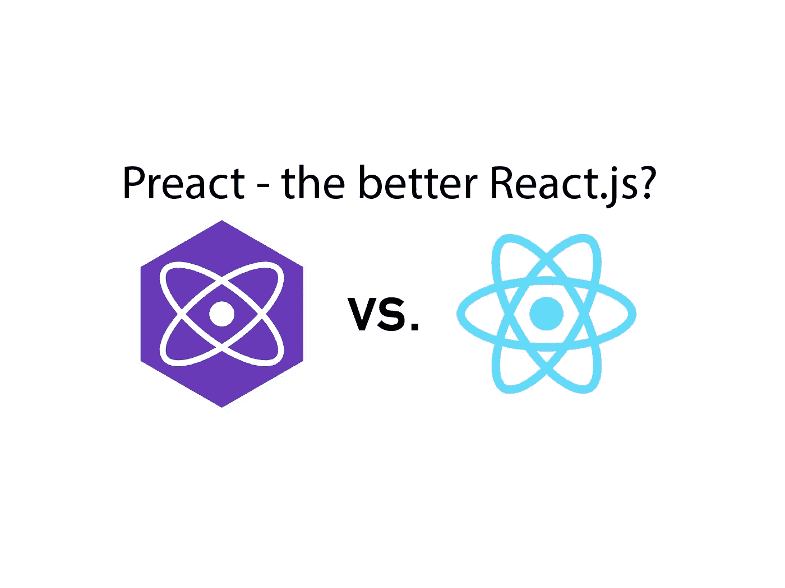
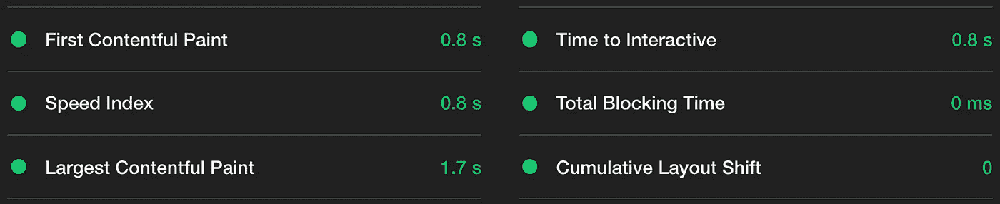
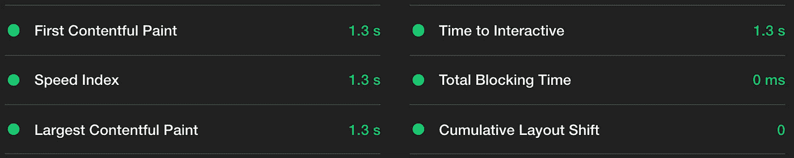
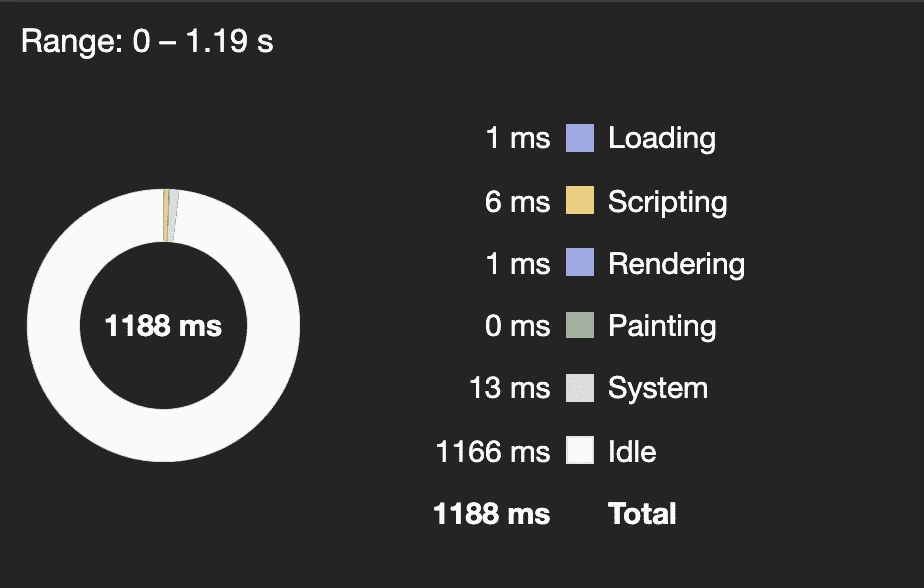
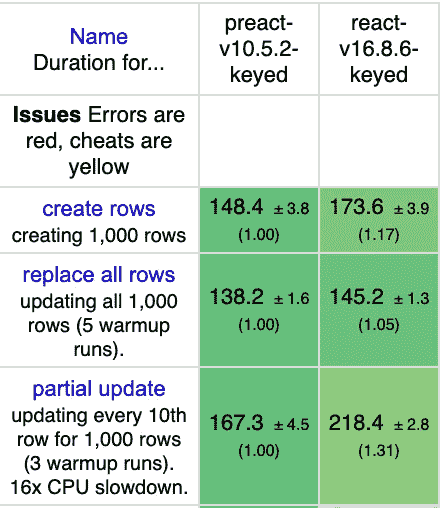
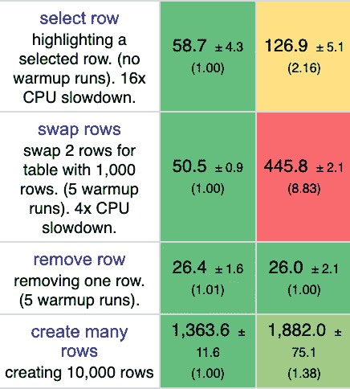
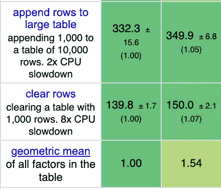

# 我用 React 和 Preact 构建了相同的应用程序。以下是不同之处

> 原文：<https://javascript.plainenglish.io/i-built-the-same-app-with-react-and-preact-here-are-the-differences-b0da382a6f72?source=collection_archive---------2----------------------->

## 以及测量的大小、性能和实现



Source: the author

听说过 [Preact](https://preactjs.com/) 吗？这是一个 React.js 的替代品，它称赞自己小得多，因此速度更快。尽管对 React.js 的兼容性很高。

我想知道 Preact 到底有多有用，所以我在 React.js 和 Preact 中构建了完全相同的应用程序。然后，我在一场公平的竞争中衡量了这两个应用程序的大小、差异和性能。

让我们从使用这两个库时的差异开始，然后我们来看看应用程序代码&测量性能。玩得开心！

# 创建反应项目和预反应项目

对于 React.js，应该已经知道了:`npm install -g create-react-app`和`create-react-app <project-name>`，要开始在项目目录中工作，只需`cd /<project-name>`——我们开始编辑文件。

现在让我们创建 Preact 项目:`npm install -g preact-cli`，然后是`preact create default <project-name>`——默认是我们将要使用的启动模板的名称。

# Preact 项目的文件结构

```
.
├── README.md
├── package-lock.json
├── package.json
├── src
│ ├── assets
│ ├── components
│ ├── index.js
│ ├── manifest.json
│ ├── routes
│ │ ├── home
│ │ │ ├── index.js
│ │ │ └── style.css
│ │ ├── index.js
│ │ └── style.css
│ ├── style
│ ├── sw.js
│ └── template.html
```

如您所见，Preact 中的文件结构本质上要复杂得多。有一个“资源，零部件，管线与样式”文件夹。是的，你没听错——一个 routes 文件夹，因为路由器默认在板上。

HTML 模板在源文件夹中保存为`template.html` ，而不是`public/index.html`。

# HTML 模板

这个模板是整个 React 和 Preact 应用程序构建的 HTML 外壳。两者语法不同，结构也不同。在 React.js 中把整个 app 挂载在`<div id="root"></div>`中，然而在 Preact 中，使用了一种模板语言:
`<body> <% preact.bodyEnd %> </body>`。此外，还有对文档头部区域的直接支持。

# 使用挂钩

当我第一次尝试创建 Preact 项目时，我在钩子上遇到了一些问题——确保 Preact 在新版本中。那么他们应该得到支持，没有问题。我使用 Preact 项目的 10.3.2 版本和 React.js 的 16.13.1 版本

Preact 中的钩子是分开存储的，因此它们的导入需要与 React.js 中的略有不同:`import { useState } from "preact/hooks"`。

在 React.js: `import { useState } from "react"`。

# 代码

让我自己感到惊讶的是——我们可以对两个项目使用完全相同的代码。我以为 Preact 中至少会有一些小的变化，但是没有。因为不同的文件结构，只有导入发生了变化——仅此而已。下面是在 React.js 和 Preact 中运行的代码。

App.js

**下面是代码中发生的事情:**

*   我们为待办事项列表创建一个状态。这个状态将是一个数组。在此之下，我为新 todo 的输入创建了一个状态。如果在文本字段中输入了内容，第二个状态将被写入此状态。
*   `SaveNewTodo`函数获取新输入的 todo，并将其置于现有 todo 的状态。这样就可以在不删除现有 todoss 的情况下扩展 todo。
*   JSX 部分首先检查 todo 数组的长度是否为 0，即 todo 列表是否为空。
*   使用 map 函数，我们从数组中呈现所有的 todos。为了有序，每个待办事项前面都有一行。

这基本上是全部代码。没什么复杂的，但是它很好地显示了 React 和 Preact 是多么的兼容。

在 React.js 和 Preact 中，index.js 中的 app 组件被导入并呈现。

# 基准预测和反应

在这两个应用程序中，我使用了完全相同的 CSS 代码，还调整了 HTML 模板，以便完全相同的应用程序应该出来。

## 应用的大小

Preact 宣传自己说它比 React.js 小得多，这是真的——下面是 Network 选项卡的结果。


Preact App


React.js App

正如我们所看到的，Preact 应用程序只有一半大小。

## 表演

Preact 在这里也是领先的。测试是用 Lighthouse 录制的，Preset 是低端手机。



Preact App



React.js App

Preact 在各方面都更胜一筹。这两个应用程序的数字当然都在绿色范围内，因为它不是一个特别复杂的应用程序。

如果您调用摘要，您可以很容易地看到应用程序的整体性能取决于哪些因素。



Preact App


React.js App

React.js 的加载时间逻辑上更长，因为应用程序也更大。在 app 没有足够加载之前，当然是不能渲染的。此外，引用 JavaScript 文件的脚本在更大的 React 应用程序中更复杂，但呈现同样复杂，至少在这个 todo list 应用程序中是如此。
我认为如果 Preact 有更快的渲染过程会令人惊讶——但事实并非如此。在另一个基准测试中，我发现 Preact 的渲染过程更快。



Source: [https://rawgit.com/krausest/js-framework-benchmark/master/webdriver-ts-results/table.html](https://rawgit.com/krausest/js-framework-benchmark/master/webdriver-ts-results/table.html)

# 总结

Preact 在性能方面可能优于 React 至少对于可以在两个库中实现的应用程序来说是如此。但是你能用 Preact 做多少事情，用 React.js 能做什么并不在本文讨论范围之内。值得看一下文档，看看 Preact 对您的下一个项目是否有意义。

[**加入我的邮件列表保持联系**](http://eepurl.com/hacY0v)

关于框架及其性能的更多信息:

[](https://medium.com/javascript-in-plain-english/javascript-frameworks-performance-60f71d321693) [## 框架永远不会像普通 JavaScript 那样快

### 在大多数情况下——这很好

medium.com](https://medium.com/javascript-in-plain-english/javascript-frameworks-performance-60f71d321693)