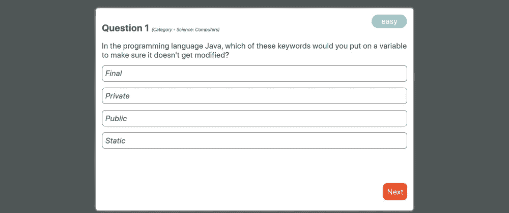
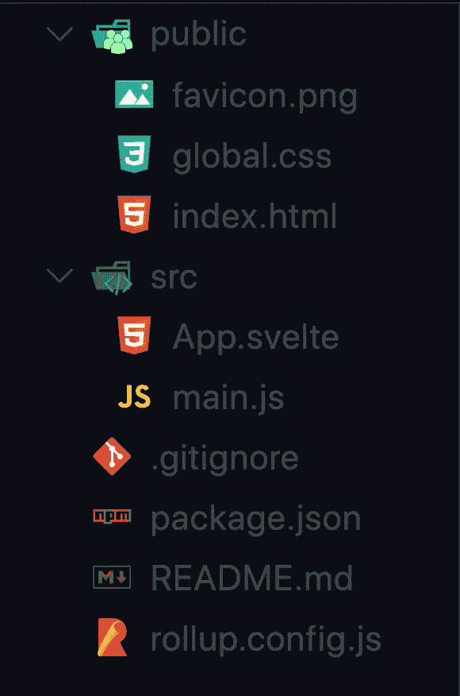
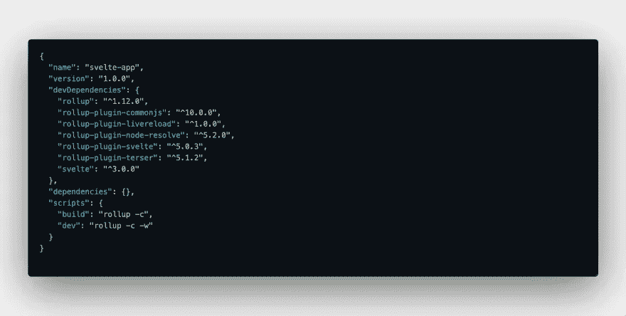

# 我使用 Svelte 创建了一个测验应用程序，现在我不能回到任何其他框架。

> 原文：<https://javascript.plainenglish.io/i-created-a-quiz-app-using-svelte-and-now-i-cannot-go-back-to-any-other-framework-3308fc87e7d?source=collection_archive---------1----------------------->



svelte-trivia-demo

> ***更新:*** 我已经用动画更新了这个项目，修正了 app 背后的逻辑。你可以在这里找到最新的版本和现场演示。

我听过很多关于苗条身材的说法，听了这个演讲后，我也想试一试。所以我做了，结果证明苗条是超级惊人的。我习惯了用 React 进行编程，一些明显的不同让我爱上了 Svelte。

# 什么是苗条

[Svelte](https://svelte.dev) 是一个编译器，它将我们声明性的基于组件的代码转换成可以直接操作 DOM 的 JavaScript。你可能听说过 Svelte 非常快，比其他任何框架都快，这是真的。这背后的原因是因为 Svelte 更像是一个编译器，而不是一个框架或库。Svelte 不使用影子 DOM 或虚拟 DOM 来执行 DOM 更新，这自然使它比虚拟 DOM 实现附带的框架或库快几个数量级。它试图消除大量的样板代码，是真正的反应式的。如果你像我一样来自一个反应型生态系统，苗条在很多方面挑战你的思维方式。

在这篇文章中，我们将创建一个小的琐事 app，看看 Svelte 如何比较反应。

让我们首先创建一个苗条的项目。就像`create-react-app`提供了一种引导苗条应用程序的方法。只需运行下面的代码即可开始运行。

```
npx degit sveltejs/template my-svelte-project 
cd my-svelte-project 
npm install 
npm run dev
```

我们的项目目录应该是这样的。



现在，如果你打开`package.json`，你会看到一些令人惊奇的东西。



它没有列出任何`dependencies`。所有的依赖都是`devDependencies`。这是因为 Svelte 是一个编译器，所有的依赖关系都是在生成构建时预先计算的，因此我们的最终代码不会附带任何依赖关系，这使得我们的构建规模小得多。

*   `main.js`文件是我们进入应用程序的主要入口点。它就像 React 项目中的`App.js`文件。
*   我们还看到了`App.svelte`文件。让我们打开文件，了解它的不同部分。
*   如果你熟悉 React，我们知道我们通常以扩展名`.jsx`结束 React 特定文件。类似地，在 svelite 中，我们所有的 svelite 特定文件都以扩展名`.svelte`结尾。
*   每个瘦文件要么只包含`markup (HTML tags)`，要么包含样式在`<style></style>`标签中的标记，要么包含 JavaScript 在`<script></script>`标签中，或者三者都包含。
*   关于苗条组件最好的部分是，它们内部的样式只限于该组件，因此你不会遇到样式会泄漏到其他组件的问题。
*   如果你习惯用 JS 和`JSX`编写 **HTML，Svelte 正好相反，你把所有东西都写在`svelte`文件中，这只是编写`HTML`文件的语法糖。**

注意:如果你来自 React 背景，你可能不习惯这种思维方式，但相信我，这将有助于你拓展自己的领域。

话虽如此，我们还是开始吧。

首先，我们要看一下`App.svelte`文件。这是我们的主文件/组件，作为应用程序的入口点。可以使用下面的代码作为参考。

```
<script>
  // import QuizArea from './QuizArea.svelte';
</script>

<style>
  main {
    text-align: center;
    padding: 1em;
    max-width: 240px;
    margin: 0 auto;
  }

  h1 {
    text-transform: uppercase;
    font-size: 4em;
    font-weight: 100;
  }

  @media (min-width: 640px) {
    main {
      max-width: none;
    }
  }
</style>

<main>
  <!-- <QuizArea></QuizArea> -->
</main>
```

*   正如你在代码中看到的，我们有组件的`script`、`style`和`markup`。此时，代码除了将一些样式应用于应用程序之外，没有什么特别的。
*   但是很快我们将取消对`QuizArea`组件的注释。

我希望你已经对一个细长文件/组件的不同部分有了一个基本的概念。

我没有在这篇文章中添加项目的所有文件，但是如果你想在任何时候引用代码，可以在这里找到。

现在，让我们创建一个新的`QuizArea`组件。为此，在 **src** 目录中创建一个名为`QuizArea.svelte`的文件。

我们将分别研究这三个部分。

*   首先我们有了`<styles></styles>`标签。您可以在`<style>`标记之间为该组件添加任何想要的样式。
*   在 Svelte 中，我们在组件本身中编写样式，而不是在单独的文件中编写`CSS`。
*   我已经在下面的代码中为`QuizArea`组件定义了样式，但是你可以按照你想要的方式来设计它。

```
<style>
  #main {
    position: absolute;
    left: 50%;
    top: 50%;
    transform: translateX(-50%) translateY(-50%);
    height: calc(100vh - 40%);
    width: calc(100vw - 40%);
    padding: 15px;

    background-color: white;
    border-radius: 6px;
    box-shadow: 0 0 5px white;

    text-align: left;
  }

  span {
    display: block;
    margin-top: 20px;
  }

  button {
    margin-top: 15px;
    margin-right: 15px;
    padding: 10px;
    float: right;

    color: white;
    background-color: #ff3e00;
    border: none;
    border-radius: 10px;
    cursor: pointer;
  }

  button:hover {
    box-shadow: 0 0 5px #ff3e00;
  }

  #heading {
    font-size: 24px;
    font-weight: bolder;
  }

  #difficulty {
    position: absolute;
    right: 16px;
    top: 16px;
    height: 25px;
    width: 80px;
    padding: 5px;

    background: rgb(97, 225, 230);
    color: white;
    text-align: center;
    border-radius: 16px;
  }

  #category {
    font-size: 12px;
    font-weight: normal;
  }

  #button-bar {
    position: absolute;
    bottom: 16px;
    right: 0;
  }

  #choice {
    margin-top: 16px;
    padding: 8px;

    border: 1px solid #4e5656;
    border-radius: 8px;
  }

  #choice:hover {
    cursor: pointer;
    background: green;
    border: 1px solid green;
    color: white;
  }

  #snackbar {
    position: absolute;
    left: 16px;
    bottom: 16px;
  }
</style>
```

这很容易，没有什么花哨或苗条的具体。唯一的事情是我们将`styles`和其他组件代码写在同一个文件中。

*   接下来我们要谈谈`<script></script>`标签。我们将在这个标签中编写所有的 JavaScript 代码，在这里我们将看到 Svelte 是如何做事情的。
*   所以，在 Svelte 中，我们将使用`let`或`const`来声明变量。我们声明的所有变量都是重要的`state`变量。并且`JavaScript`的所有规则都适用于这些变量，所以`const`变量不能被重新分配，而`let`变量可以被重新分配。
*   它们与我们在 React 中使用`useState()`声明的变量相同。
*   关于 Svelte 最好的部分是，每当状态变量的值改变时，组件自动重新呈现。但是不需要调用任何`set`函数。

```
// In Svelte
let name = 'Manan';

// Same thing in React
const [name, setName] = React.useState('Manan');

// causes component to re-render
name = 'Maitry';

// Same thing in React
setName('Maitry');
```

*   我们已经谈论过`state`，所以我们谈论`props`是很自然的。在 Svelte 中，只需在变量声明后面添加`export`关键字就可以声明一个道具。

```
// props in Svelte
export let name;
```

*   `name`道具现在可以用于其他组件。在 React 中，我们可以声明任意数量的道具。
*   我们甚至可以声明`functions`，它可以充当我们的`event handlers`或者可以服务于任何其他目的，比如获取数据、提供实用操作等等。

```
// on click handler
function handleClick(change) {
  snackbarVisibility = false;

  if (change === 'f') questionNo += 1;
  else questionNo -= 1;

  question = htmlDecode(data[questionNo].question);
  answerChoices = shuffle(
    [
      ...data[questionNo].incorrect_answers,
      data[questionNo].correct_answer
    ].map(a => htmlDecode(a))
  );
  answer = htmlDecode(data[questionNo].correct_answer);
  category = htmlDecode(data[questionNo].category);
  difficulty = data[questionNo].difficulty;
}
```

*   我们可以通过使用`import`关键字导入其他模块、包或组件。这类似于我们在 React 中所做的。

```
// imports the Snackbar component
import Snackbar from './Snackbar.svelte';
```

这一部分的主要内容是，我们可以写任何我们想写的东西，编译器会为我们完成剩下的工作。

现在的问题是我们如何在 HTML 标记中使用 JavaScript 变量。因此，对于应用程序的最后一部分，我们将研究这一点。

*   呈现任何变量都非常简单。我们只是像这样用花括号把变量括起来`{variableName}`。

```
<!-- see how simple it is :smiley:-->
<p>Hello {name}!</p>

<!-- outputs -->
Hello Manan
```

*   请记住，一个瘦文件中的标记是 Html 格式的，因此我们可以使用内置的瘦表达式来执行一些事情，如有条件地呈现某些内容或循环给定值。
*   为了有条件地表达某事，我们用`{#if expression}<div></div> {/if}`。这里的`expression`可以是范围内的任何有效变量或表达式(即在`<script>`标签内声明的)

```
{#if name}
<div id="snackbar">
  <Snackbar message="{correct}"></Snackbar>
</div>
{/if}
```

*   为了遍历一个数组，我们使用了`{#each expression as exp}<div></div>{/each}`。这里的`expression`是一个可迭代值，而`exp`是该可迭代值的每个条目。

```
{#each answerChoices as choice}
<div id="choice" on:click="{(e) => handleAnswerChoice(e)}">
  <i>{choice}</i>
</div>
{/each}
```

这只是冰山一角，你可以在这里了解更多关于 Svelte 可以做的事情。

有了这个，我们现在可以把组件缝合在一起了。将下面给出的代码复制并粘贴到您的`QuizArea.svelte`文件中

```
<script>
  import { onMount } from 'svelte';
  import { htmlDecode, shuffle } from './utils.js';
  import Snackbar from './Snackbar.svelte';

  let data;

  let questionNo = 0;
  let question = 'loading...';
  let answerChoices;
  let answer;
  let category = 'loading...';
  let difficulty = 'loading...';

  let correct = false;
  let snackbarVisibility = false;
  $: score = 0;

  // function for fetching data
  function fetchData() {
    fetch('https://opentdb.com/api.php?amount=10')
      .then(resp => resp.json())
      .then(res => {
        data = res.results;
        question = htmlDecode(data[questionNo].question);
        answerChoices = shuffle(
          [
            ...data[questionNo].incorrect_answers,
            data[questionNo].correct_answer
          ].map(a => htmlDecode(a))
        );
        answer = htmlDecode(data[questionNo].correct_answer);
        category = htmlDecode(data[questionNo].category);
        difficulty = data[questionNo].difficulty;
      })
      .catch(e => console.error(e));
  }

  onMount(fetchData);

  // function for moving onto next/prev question
  function handleClick(change) {
    snackbarVisibility = false;

    if (change === 'f') questionNo += 1;
    else questionNo -= 1;

    question = htmlDecode(data[questionNo].question);
    answerChoices = shuffle(
      [
        ...data[questionNo].incorrect_answers,
        data[questionNo].correct_answer
      ].map(a => htmlDecode(a))
    );
    answer = htmlDecode(data[questionNo].correct_answer);
    category = htmlDecode(data[questionNo].category);
    difficulty = data[questionNo].difficulty;
  }

  // function to check the correctness of an answer
  function handleAnswerChoice(e) {
    if (e.target.innerText === answer && !correct) {
      correct = true;
      score += 1;
    } else if (correct) correct = false;
    snackbarVisibility = true;
  }
</script>

<style>
  #main {
    position: absolute;
    left: 50%;
    top: 50%;
    transform: translateX(-50%) translateY(-50%);
    height: calc(100vh - 40%);
    width: calc(100vw - 40%);
    padding: 15px;

    background-color: white;
    border-radius: 6px;
    box-shadow: 0 0 5px white;

    text-align: left;
  }

  span {
    display: block;
    margin-top: 20px;
  }

  button {
    margin-top: 15px;
    margin-right: 15px;
    padding: 10px;
    float: right;

    color: white;
    background-color: #ff3e00;
    border: none;
    border-radius: 10px;
    cursor: pointer;
  }

  button:hover {
    box-shadow: 0 0 5px #ff3e00;
  }

  #heading {
    font-size: 24px;
    font-weight: bolder;
  }

  #difficulty {
    position: absolute;
    right: 16px;
    top: 16px;
    height: 25px;
    width: 80px;
    padding: 5px;

    background: rgb(97, 225, 230);
    color: white;
    text-align: center;
    border-radius: 16px;
  }

  #category {
    font-size: 12px;
    font-weight: normal;
  }

  #button-bar {
    position: absolute;
    bottom: 16px;
    right: 0;
  }

  #choice {
    margin-top: 16px;
    padding: 8px;

    border: 1px solid #4e5656;
    border-radius: 8px;
  }

  #choice:hover {
    cursor: pointer;
    background: green;
    border: 1px solid green;
    color: white;
  }

  #snackbar {
    position: absolute;
    left: 16px;
    bottom: 16px;
  }

  @media screen and (max-width: 960px) {
    #main {
      width: calc(100vw - 15%);
    }
    #difficulty {
      top: -16px;
    }
  }
</style>

<div id="main">
  <span id="heading"
    >Question {questionNo + 1}
    <i id="category">(Category - {category})</i></span
  >
  <span>{question}</span>
  <div id="difficulty">{difficulty}</div>

  {#if answerChoices} {#each answerChoices as choice}
  <div id="choice" on:click="{(e) => handleAnswerChoice(e)}">
    <i>{choice}</i>
  </div>
  {/each} {/if}

  <div id="button-bar">
    {#if !(questionNo > 10)}
    <button value="Next" on:click="{() => handleClick('f')}">Next</button>
    {/if} {#if questionNo > 0}
    <button value="Back" on:click="{() => handleClick('b')}">
      Previous
    </button>
    {/if}
  </div>

  {#if snackbarVisibility}
  <div id="snackbar">
    <Snackbar message="{correct}"></Snackbar>
  </div>
  {/if}
</div>
```

这是一个完全用纤巧的语言编写的应用程序。继续使用`npm run dev`查看您的应用程序运行情况。这是一个非常小的应用程序，演示了我们可以用 Svelte 做什么，对我来说，这可能会彻底改变我们为网络设计的方式，我对我们即将面临的事情感到非常兴奋。

这篇文章的主要目的是给你一个苗条身材的概述，以及它有多棒。我希望你现在对使用 Svelte 感觉舒服一点。

# 思想💭

请在下面的讨论区让我知道你对苗条身材的想法。此外，如果你在应用程序的某个地方卡住了，或者想了解更多，或者对任何部分感到困惑，请不要犹豫，提出任何问题。

感谢您的阅读！

一如既往地在[推特](https://twitter.com/Manan_30)和 [Instagram](https://www.instagram.com/manan__joshi/) 上和我联系。

直到下一次，和平和快乐编码！！！

干杯。

*原载于 2019 年 11 月 24 日*[*https://dev . to*](https://dev.to/manan30/i-created-a-quiz-app-using-svelte-and-now-i-cannot-go-back-to-any-other-framework-1jeo)*。*