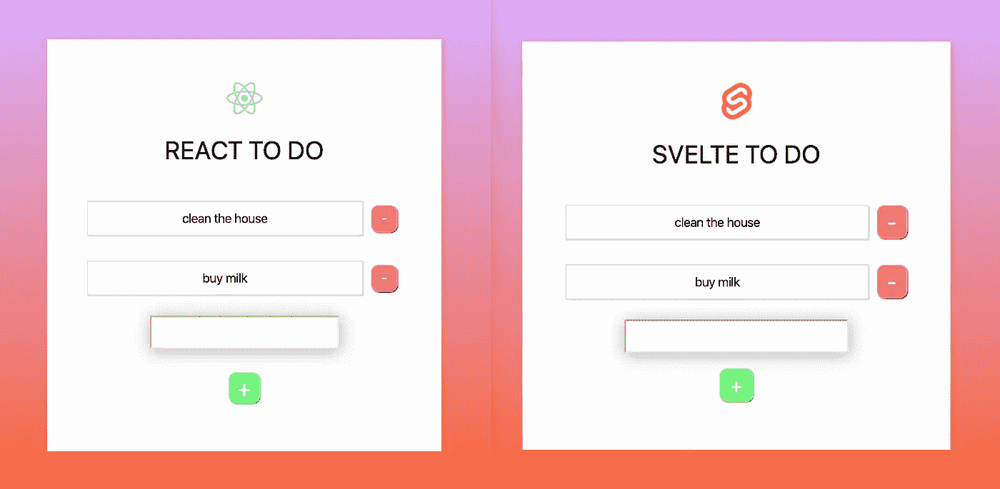
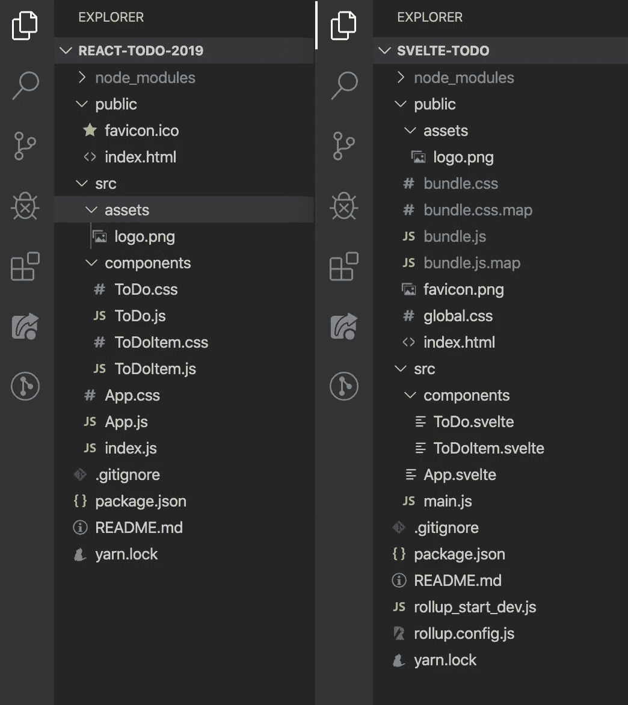
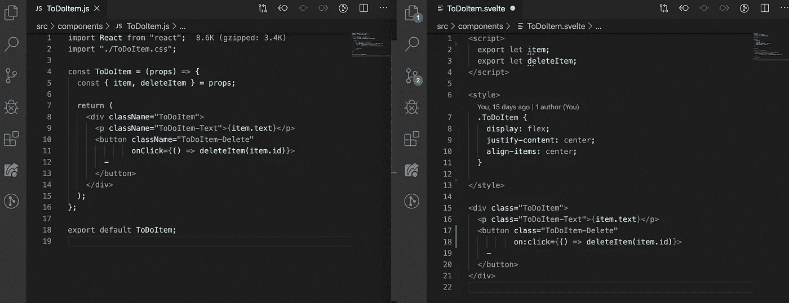
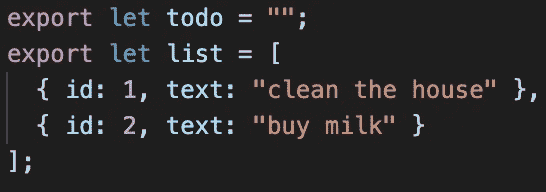

# 我在 React 和 Svelte 中创建了完全相同的应用程序。以下是不同之处。

> 原文：<https://javascript.plainenglish.io/i-created-the-exact-same-app-in-react-and-svelte-here-are-the-differences-c0bd2cc9b3f8?source=collection_archive---------0----------------------->

## 反应 vs 苗条。最后一个并列代码对比！因为你已经听到了关于苗条的大惊小怪，现在你想知道炒作是怎么回事。

在工作中使用过 React 之后，我对它有了相当扎实的理解。然而，我听说过 Svelte——一种新的 JavaScript 框架，最近开始在 web 开发领域获得关注。作为一名好奇的 Web 开发人员，我一直很想知道栅栏另一边的草是什么样的——在这种情况下，草是细长的。

我读了苗条的医生，看了几个视频，虽然它们很有用，但我真正想知道的是苗条和反应有什么不同。我说的*【不同】*，并不是指诸如 Svelte 是否使用了虚拟 DOM 或者它如何渲染页面之类的事情。我希望有人花时间解释一下，如果我用苗条的身材写了同样的东西，我的 React 代码会是什么样子！我想找一篇花时间解释这一点的文章，以便刚刚接触 React 或 Svelte(或整个 Web 开发)的人能够更好地理解这两者之间的区别。

不幸的是，我找不到任何解决这个问题的方法。所以我意识到，我必须自己动手建造它，才能看到相似之处和不同之处。在这样做的时候，我想我应该把整个过程记录下来，这样一篇关于这个的文章就会最终存在。


React vs Svelte: A new challenger approaches!

我决定尝试构建一个相当标准的待办事项应用程序，允许用户在列表中添加和删除项目。这两款应用都是使用 CLIs 构建的(`create-react-app`用于 React，`sveltejs/template`用于 Svelte)。

顺便说一下, *CLI 代表命令行界面。🤓*

# 无论如何，这个介绍已经比我预期的要长了。让我们先来快速了解一下这两款应用的外观:



React vs Svelte. The two apps look the same, but does the code look the same too?

两个应用程序的 CSS 代码完全相同，但是它们的位置不同。记住这一点，接下来让我们看看这两个应用程序的文件结构:



React on the left. Svelte on the right.

你会看到它们的结构在这里有很大的不同。

React 在 **src** 文件夹中拥有所有组件、样式和资产，而 Svelte 要求资产直接位于 **public** 文件夹中。您还会注意到没有任何**。这是因为样式是在**中定义的。纤细的**文件(稍后会详细介绍)。**

您还会注意到——对于 Svelte——有一些用于汇总的**配置**文件。对于那些不知道的人，Rollup 基本上是一个 Webpack 等价物，Svelte 选择使用它。

最后，你会注意到在**公共**文件夹中已经有一些**包**文件。这些是我在我的本地主机上试着提供苗条的 ToDo 应用程序后创建的。与 React 不同，Svelte 的 CLI 会在您尝试启动本地服务器时自动生成这些文件。这些实际上是提供给你的文件，是来自**的所有代码的编译。苗条的**文件。

这是 Svelte 反应不同的一个关键点。在 React 中，如果你要编译你的代码以便准备好发送到产品并在线发布，你通常会在你的**公共**文件中结束类似的结构，但是在开发时，如果你要将你的 React ToDo 应用程序提供给本地服务器，你不会看到这些**捆绑**文件， 当你的代码被 Webpack 编译，然后在你的本地主机上提供给你——并且有效地位于缓存中的某个地方，而 Rollup 编译苗条的代码并使它在 **public** 文件夹中对你可见。 这里引起的另一个区别是 React 的 Webpack 设置允许热模块重新加载(这基本上意味着代码将在您的浏览器中非常快速地更新，因为您在开发期间进行了更新。对于 Svelte 的 Rollup 设置，这是不可能的，因为每当你点击保存按钮对代码进行更新时，那些**包**文件就会被有效地重新编译，尽管速度很快。

最终，文件结构和编译方法实现了同样的事情，只是方式不同。

*喜欢这篇文章吗？如果有，获取更多类似内容通过* [***订阅解码，我的 YouTube 频道***](https://www.youtube.com/channel/UCtipWUghju290NWcn8jhyAw) ***！***

暂时回到 React 的 CSS 设置，没什么可说的，您不能继续前进，以不同的方式构造您的 CSS，以采用将您的样式放在与组件相同的文件中的东西。真的归结为个人喜好。您将会听到来自开发社区的关于 CSS 应该如何构建的大量讨论，特别是关于 React，因为有许多 CSS-in-JS 解决方案，如 styled-components 和 emotion。顺便说一下，CSS-in-JS 就是字面上的意思。虽然这些都很有用，但现在，我们将只遵循两个 CLI 中的结构。

## 在我们继续之前，让我们快速看一下一个典型的 React 和 like 组件是什么样子的:



现在，让我们进入本质的细节！

# 创建新的应用程序

## 反应

使用 npm，在您的终端/命令行中运行以下命令:

```
npx create-react-app react-todo
```

这将为您创建一个名为“react-todo”的项目，其中包含您开始工作所需的一切。我们对为本文创建的应用程序使用了相同的过程。

## 苗条的

使用 npm，在您的终端/命令行中运行以下命令:

```
npx degit sveltejs/template svelte-todo
```

这将为您创建一个名为“svelte-todo”的项目，其中包含您开始所需的一切。我们对为本文创建的应用程序使用了相同的过程。

# 我们如何改变数据？

但是首先，我们所说的“变异数据”是什么意思？听起来有点专业，不是吗？它基本上只是意味着改变我们已经存储的数据。所以，如果我们想把一个人的名字从约翰改成马克，我们就要“改变数据”。因此，我们改变数据的方式展示了 React 和 Svelte 之间的关键区别。

虽然 Svelte 本质上允许数据自由更新(例如，我们可以将项目推入数据数组，重新分配我们的数据等)，但 React 通过所谓的状态挂钩来处理这一点。

让我们看看下图中两者的设置，然后我们将解释接下来会发生什么:



React on the left. Svelte on the right.

因此，您可以看到，我们将相同的数据传递给了两者，但结构略有不同。

使用 React——或者至少从 2019 年开始——我们通常会通过一系列挂钩来处理状态。如果你以前没有见过这种类型的概念，这些可能看起来有点奇怪。基本上，它的工作方式如下:

假设我们想要创建一个待办事项列表。我们可能需要创建一个名为`list`的变量，它可能需要一个字符串或者对象的数组(如果我们想给每个`todo`字符串一个 ID 或者一些其他的东西。我们可以通过写`const [list, setList] = useState([])`来设置这个。这里我们使用了 React 称之为钩子的东西 useState。这基本上让我们在组件中保持本地状态。

另外，你可能已经注意到我们在`useState()`中传递了一个空数组`[]`。我们放在里面的是我们希望`list`最初被设置的值，在我们的例子中，我们希望它是一个空数组。然而，你会从上面的图片中看到，我们在数组内部传入了一些数据，这些数据最终成为了`list`的初始化数据。想知道`setList`是干什么的？稍后会有更多关于这个的内容！

现在用 Svelte，你会注意到我们有两个变量要输出。这些文件位于我们的 **ToDo.svelte** 文件中，但是如果我们愿意，也可以放在 route **App.svelte** 文件中更高的位置。

无论如何，让我们再看一看它们，然后我们会解释这是怎么回事:

```
export let todo = "";
export let list = [
  { id: 1, text: "clean the house" },
  { id: 2, text: "buy eggs" }
];
```

所以对于 Svelte，如果我们想在我们的文件中引用像`todo`和`list`这样的东西，我们需要在同一个文件的某个地方创建一个对它们的引用。

这与 React 或大多数其他 JavaScript 没有什么不同，无论是通过创建变量、导入变量，还是将变量作为道具传递给组件。这里的不同之处在于，我们实际上是在创建新的变量(*与* `*let*` *，而不是* `*const*` *，因为那样会阻止我们对其进行变异——或者如果我们想从技术上了解* `*const*` *如何工作*)的话，可以对其进行重新分配。我之所以提到我们必须创建新的变量，是因为你稍后会注意到，我们必须在我们想要引用它们的每个文件中这样做，即使它们已经作为道具传递了。基本上，Svelte 会将值传递给那些新创建的变量。如果你感到困惑，就继续读下去，当我们以后再次提到它时，你会看到它是如何工作的。

那么，我们如何在我们苗条的应用程序中引用可变数据呢？

好吧，假设我们有一些名为`name`的数据，它被赋予了一个值`‘Sunil**’**`。

在 Svelte 中，这个`let name = Sunil`，要么在一个组件中被创建并作为道具传递给另一个组件，要么在创建它的组件内部被使用。不管我们如何使用`name`，我们都可以通过简单地重新分配`name`来更新它。所以我可以写`name = ‘John'`，我们可以在 UI 的屏幕上看到更新。我不确定我被叫做约翰是什么感觉，但是嘿，事情发生了！😅

在 React 中，由于我们有用`useState()`创建的更小的状态片段，很可能我们会按照`const [name, setName] = useState('Sunil')`的思路创建一些东西。在我们的应用程序中，我们将通过简单地调用`name`来引用相同的数据。现在这里的关键区别是，我们不能简单地编写`name = ‘John’`，因为 React 有适当的限制来防止这种容易的、无忧无虑的变异。所以在 React 中，我们会写`setName('John')`。这就是`setName`位发挥作用的地方。基本上，在`const [name, setName] = useState('Sunil')`中，它创建了两个变量，一个成为`const name = 'Sunil'`，而第二个`const setName`被赋予一个函数，使`name`能够用一个新值重新创建。

Effectively React 和 Svelte 在这里做着同样的事情，即创建可以更新的数据。默认情况下，每当有数据更新时，Svelte 本质上结合了自己版本的`name`和`setName`。所以简而言之，React 要求你用里面的值调用`setName()`来更新状态，Svelte 假设如果你曾经试图更新出现在 DOM 中的值(即我们可以在浏览器屏幕上看到的值)。那么为什么 React 还要费心从函数中分离出值，为什么还需要`useState()`？这是因为这意味着无论何时状态改变，它都需要重新渲染。它会知道状态已经改变，因为调用了 useState 函数。


Bean knew best.

现在我们已经有了一些变化，让我们看看如何在我们的待办事项应用程序中添加新的项目，从而进入本质。

# 我们如何创建新的待办事项？

## 反应:

```
**const createNewToDoItem = () => {** const newId = list.length ? 
                Math.max.apply(null, list.map(t => t.id)) + 1 :
                1; const newToDo = { id: newId, text: toDo };  
  setList([...list, newToDo]);
  setToDo("");**};**
```

## React 是怎么做到的？

在 React 中，我们的输入字段有一个名为 **value 的属性。**每当这个值通过所谓的 **onChange 事件监听器**改变时，这个值就会自动更新。JSX(基本上是 HTML 的一种变体)如下所示:

```
<input type="text" 
       value={toDo} 
       onChange={handleInput}/>
```

所以每次值改变时，它更新状态。`handleInput`函数看起来像这样:

```
**const handleInput = (e) => {**
  setToDo(e.target.value);
**};**
```

现在，每当用户按下页面上的 **+** 按钮来添加新项目时，就会触发**createnewdoitem**功能。让我们再来看一下这个函数，以分解正在发生的事情:

```
**const createNewToDoItem = () => {** const newId = list.length ? 
                Math.max.apply(null, list.map(t => t.id)) + 1 :
                1; const newToDo = { id: newId, text: toDo };  
  setList([...list, newToDo]);
  setToDo("");**};**
```

本质上，`newId`函数基本上是创建一个新的 ID，我们将赋予新的`toDo`项目。`newToDo`变量是一个对象，它有一个`id`键，键的值来自`newId`。它还有一个`text`键，将来自`toDo`的值作为其值。这与输入值改变时更新的`toDo`相同。

然后我们运行`setList`函数，并传入一个数组，该数组包含我们的整个`list`以及新创建的`newToDo`。

如果`...list`位看起来很奇怪，那么开头的三个点就是所谓的 spread 运算符，它基本上传递来自`list`的所有值，但作为单独的项，而不是简单地将整个项数组作为数组传递。迷茫？如果是这样，我强烈推荐阅读 spread，因为它很棒！

总之，最后我们运行`setToDo()`并传入一个空字符串。这使得我们的输入值为空，准备好输入新的 toDos。

## 苗条:

```
**createNewToDoItem() {** const newId = list.length ? 
                Math.max.apply(null, list.map(t => t.id)) + 1 :
                1;

  list.push({ id: newId, text: todo });
  todo = "";**}**
```

## 斯维尔特是怎么做到的？

在 Svelte 中，我们的**输入**字段有一个名为 **bind:value** 的句柄。这允许我们做一些被称为**双向绑定**的事情。让我们快速查看一下我们的输入字段，然后我们将解释这是怎么回事:

```
<input type="text" bind:value={todo} />
```

**bind:value** 将这个字段的输入绑定到一个我们称为`todo`的变量。当页面加载时，我们将`todo`设置为空字符串，如下:`let todo = ‘’`。如果这里已经有了一些数据，比如`let todo = ‘add some text here’`**，我们的输入字段就会加载一些已经在输入字段里面的文本*。无论如何，回到空字符串，我们在输入字段中输入的任何文本都会绑定到`todo`的值。这是有效的双向绑定(输入字段可以更新`todo`并且`todo`可以更新输入字段)。***

***所以回头看看前面的**createnewdoitem()**代码块，我们看到我们将`todo` 的内容推入`list` 数组，然后将`todo` 更新为空字符串。***

***我们还使用了 React 示例中使用的相同的`newId()`函数。***

# ***我们如何从列表中删除？***

## ***反应:***

```
***const deleteItem = (item) => {**
  setList(list.filter((todo) => todo.id !== id));
**};***
```

## ***React 是怎么做到的？***

***因此，虽然`deleteItem()`函数位于 **ToDo.js** 内，但我可以很容易地在 **ToDoItem.js** 内引用它，首先，将`deleteItem()` 函数作为道具传递给`<ToDoItem/>`:***

```
*<ToDoItem deleteItem={deleteItem}/>*
```

***这首先将功能向下传递，使孩子可以访问它。然后，在 **ToDoItem** 组件中，我们执行以下操作:***

```
*<button className="ToDoItem-Delete" 
        onClick={() => deleteItem(item.id)}> - </button>*
```

***要引用父组件中的函数，我只需引用 **props.deleteItem** 。现在你可能已经注意到，在代码示例中，我们只是写了`deleteItem`而不是`props.deleteItem`。这是因为我们使用了一种被称为**析构**的技术，它允许我们获取**道具**对象的一部分，并将它们分配给变量。所以在我们的 **ToDoItem.js** 文件中，我们有如下内容:***

```
***const ToDoItem = (props) => {**
  const { item, deleteItem } = props;
**}***
```

***这为我们创建了两个变量，一个叫做`item`，它被赋予与`props.item`相同的值，另一个叫做`deleteItem`，它被赋予来自`props.deleteItem`的值。我们可以通过简单地使用`props.item`和`props.deleteItem`来避免整个析构过程，但是我认为这值得一提！***

## ***苗条:***

```
*const deleteItem = id => {
  list = list.filter(item => item.id !== id);
};*
```

## ***斯维尔特是怎么做到的？***

***在 Svelte 中部署了非常相似的方法。在我们的 **ToDo.svelte** 文件中，我们将`deleteItem`函数传递给`<ToDoItem/>`，如下所示:***

```
*<ToDoItem {item} deleteItem={deleteItem}/>*
```

***然后在我们的 **ToDoItem.svelte** 文件中，我们通过写`export let deleteItem;`在文件顶部创建一个变量引用。这允许我们像平常一样引用`deleteItem`。最后，我们将函数传递给 **ToDoItem.svelte** 中的“删除”按钮，如下所示:***

```
*<button class=”ToDoItem-Delete” 
        on:click={() => deleteItem(item.id)}> - </button>*
```

***如您所见，我们的“删除”按钮与我们在 React 中使用的按钮完全相同。***

# ***我们如何传递 DOM 事件侦听器？***

## ***反应:***

***诸如点击事件等简单事件的事件侦听器是直接的。以下是我们如何为创建新 ToDo 项目的按钮创建 click 事件的示例:***

```
*<button className=”ToDo-Add” onClick={createNewToDoItem}>+</button>.*
```

***这里非常简单，看起来就像我们用普通 JavaScript 处理 onclick 一样。***

## ***苗条:***

***在苗条的时候，它也是非常直截了当的。我们简单地在:句柄上使用**，然后使用我们想要的事件监听器的类型。例如，要添加一个点击事件监听器，我们可以写 **on:click** ，如下例所示:*****

```
*<button class="ToDo-Add" on:click={createNewToDoItem}>+</button>*
```

***苗条事件监听器的一个很酷的事情是，你也可以把一堆东西链接到它们上面，比如 **once** 防止事件监听器被触发不止一次。***

# ***我们如何将数据/道具传递给子组件？***

## ***反应:***

***在 react 中，我们在创建子组件时将道具传递给子组件。比如:***

```
*<ToDoItem key={key.id} item={todo} />*
```

***这里我们看到两个道具被传递给了 **ToDoItem** 组件。从这一点开始，我们现在可以通过 this.props 在子组件中引用它们。因此要访问 **item.todo** prop，我们只需调用 **props.item** 。***

## ***苗条:***

***苗条的话，差不多也是这样:***

```
*<ToDoItem {item} on:deleteItem={deleteItem} />*
```

***这里的一个不同之处是，我们不必将一个键传递给我们的 **ToDoItem** ，而是先保留这个想法，因为我们将在稍后讨论这个问题。***

***另一个不同是，我们可以通过简单地编写`{item}`来传递`item`。这是因为道具名称和实际道具具有相同的名称。写`item={item}`也是一样的，但是我的苗条设置自动将其修改为简单的`{item}`。***

***一旦完成，我们必须在我们的 **ToDoItem.svelte** 文件中创建一个名为`item`的变量，方法是将`export let item;`写到文件的 **<脚本>** 部分的顶部。这样我们可以在文件中引用`item`,而不会因为试图引用一个不存在的变量而出错。这里你要记住的是，在编译过程中，Svelte 会检查我们的 **ToDoItem** 是否被传递了一个名为`item`的道具。在我们的例子中，它有，所以作为道具传递的`item`的值将被分配给我们的`export let item;`。这使得我们的应用程序能够像我们期望的那样工作。然后可以在孩子中通过它们的名字引用它们——所以在我们的例子中，是**‘todo**’。***

# ***我们如何将数据发送回父组件？***

## ***反应:***

***我们首先将函数传递给子组件，在调用子组件的地方将它作为一个道具进行引用。然后我们通过引用**props . whateverthefunction 称为**——或者**whateverthefunction 称为**(如果我们使用了析构的话),通过任何方式在子节点上添加函数调用，比如 **onClick** 。这将触发父组件中的函数。我们可以在“如何从列表中删除”一节中看到整个过程的示例。***

## ***苗条:***

***这与 React 中的处理方式非常相似。我们可以在“如何从列表中删除”一节中看到整个过程的示例。***

# ***我们如何在组件内部循环数据？***

## ***反应***

***在 React 中，我们通常使用更高阶的函数，如`map()`、`filter()`等来循环遍历数据，将数据传递给 html 元素或子组件。这是我们在代码中实现它的方式:***

```
***{list.map((item) => {**
   **return** <ToDoItem key={item.id} 
                    item={item} 
                    deleteItem={deleteItem} />;
**})}***
```

***这与我们在常规 JavaScript 中使用它们的方式非常相似。***

## ***苗条的***

***在 Svelte 中，我们用的是`#each`，专门针对 Svelte 的。这是一种循环数据的方法。这是我们在代码中实现它的方式:***

```
***{#each list as item, i (item.id)}**
  <ToDoItem {item} on:deleteItem={deleteItem} />
**{/each}***
```

***你会注意到，然后我们取我们的`list`变量，并在它后面跟随`as item`。这基本上就是说，以我们的`list`为例，把它分解成我们称之为`item`的单个项目。然后我们给每个`item`一个我们称之为`i`的索引，然后在我们想要使用的索引后面的括号中写下，在这种情况下，就是我们的`item.id`。你还会注意到，我们不需要在这里传递一个`key`给我们的`<ToDoItem/>`，因为 Svelte 无论如何都会分配它。***

# ***我们做到了！🎉***

***我们已经了解了如何添加、删除和更改数据，如何以 props 的形式将数据从父节点传递到子节点，以及如何以事件侦听器的形式将数据从子节点发送到父节点。当然，React 和 Svelte 之间还有许多其他的小差异和怪癖，但是希望这篇文章的内容有助于为理解它们如何处理东西提供一点基础。***

***如果您对本文中使用的样式感兴趣，并想制作您自己的等效作品，请随时这样做！👍***

# ***Github 链接到两个应用程序:***

***react ToDo:[https://github.com/sunil-sandhu/react-todo-2019](https://github.com/sunil-sandhu/react-todo-2019)***

***苗条的托多:[https://github.com/sunil-sandhu/svelte-todo](https://github.com/sunil-sandhu/svelte-todo)***

# ***比较 Svelte 和 Vue 呢？***

***很高兴你问了！以下是链接:***

***[https://medium . com/@ sunilsandhu/I-created-the-exact-same-app-in-vue-and-svelte-here-are-the-differences-c 649 F8 d 4 ce 0a](https://medium.com/@sunilsandhu/i-created-the-exact-same-app-in-vue-and-svelte-here-are-the-differences-c649f8d4ce0a)***