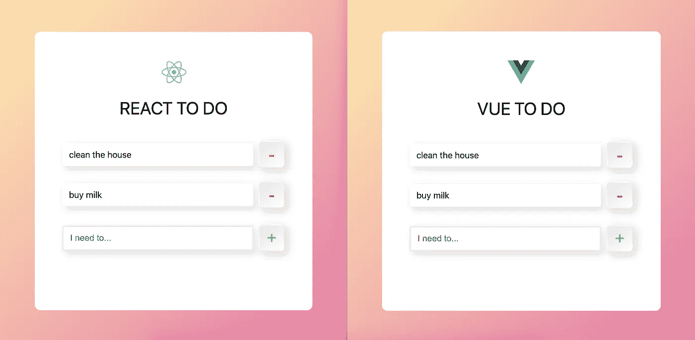
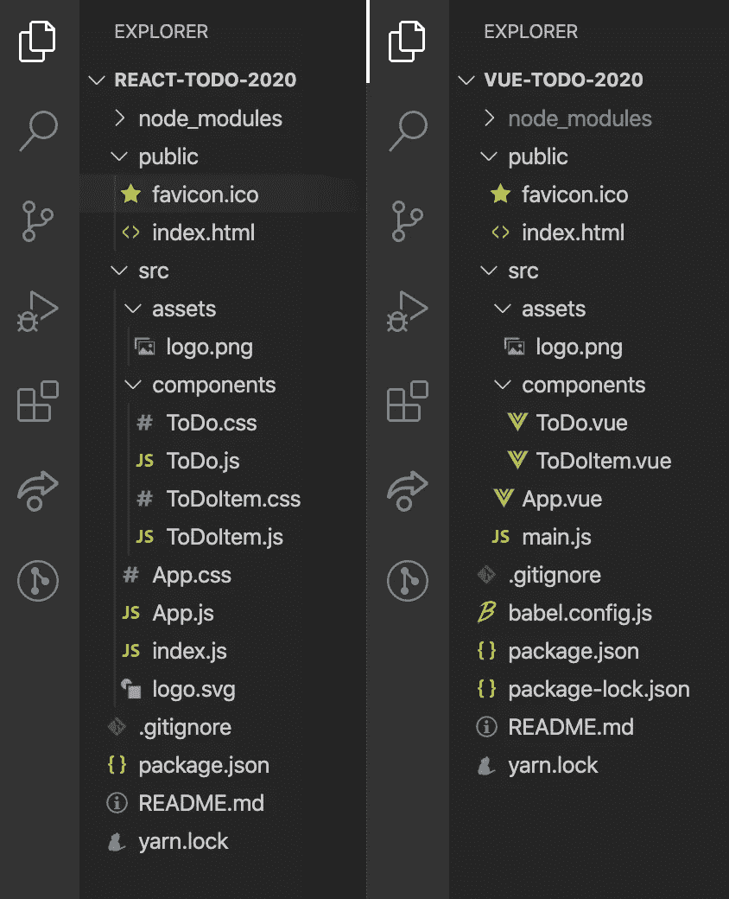
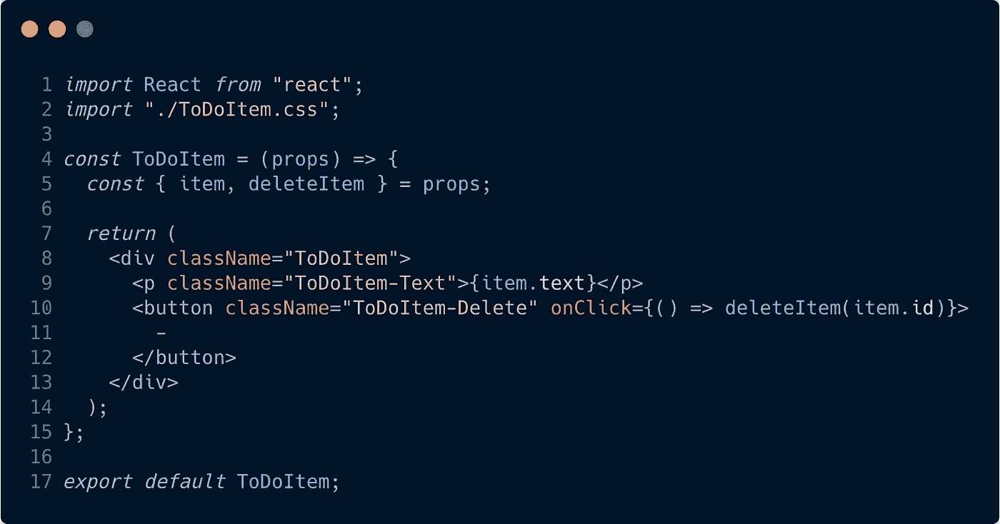
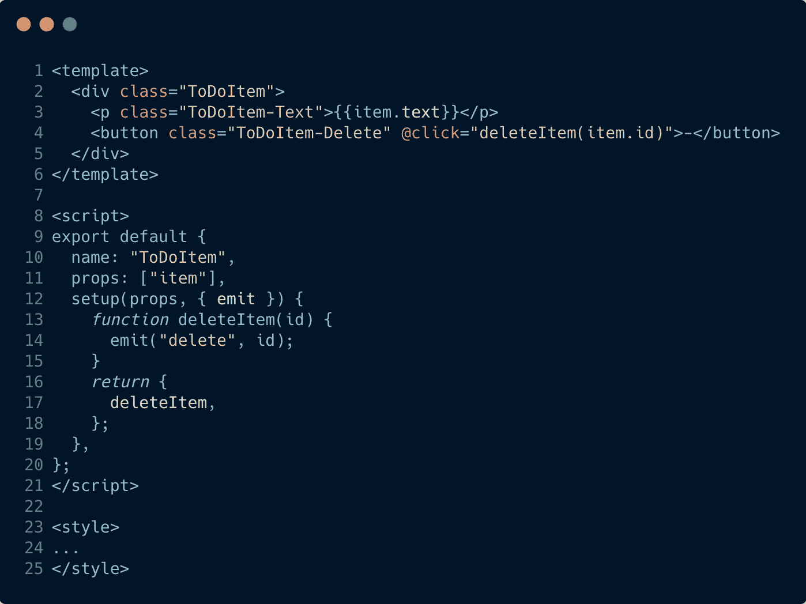
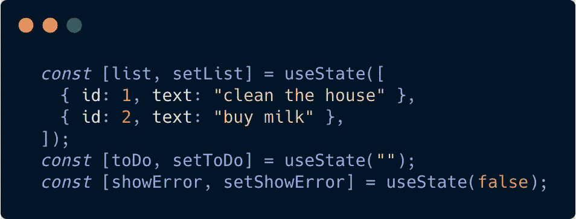
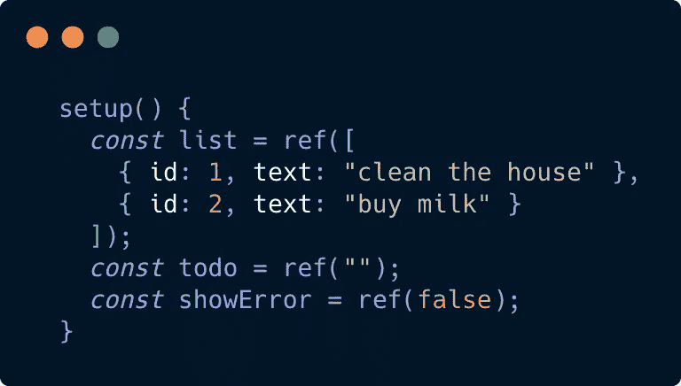

# 我在 React 和 Vue 中创建了完全相同的应用程序。以下是不同之处。[2020 版]

> 原文：<https://javascript.plainenglish.io/i-created-the-exact-same-app-in-react-and-vue-here-are-the-differences-2020-edition-36657f5aafdc?source=collection_archive---------0----------------------->

## React vs Vue:现在有了 React Hooks Vue 3 合成 API！

# React vs Vue:传奇继续

几年前，我决定尝试在 React 和 Vue 中构建一个相当标准的 Do App。这两个应用程序都是使用默认 cli 构建的(react 使用 create-react-app，vue 使用 vue-cli)。我的目标是写一些不偏不倚的东西，并简单地提供如何使用这两种技术执行某些任务的快照。

当 React 钩子发布时，我用一个' [2019 版](https://medium.com/javascript-in-plain-english/i-created-the-exact-same-app-in-react-and-vue-here-are-the-differences-2019-edition-42ba2cab9e56)'跟踪了原始文章，它用函数钩子替换了类组件的使用。**随着 Vue 版本 3 及其组合 API 的发布，现在是时候再次用‘2020 版’更新这篇文章了。**

# 让我们快速看一下这两款应用的外观:



两个应用程序的 CSS 代码完全相同，但是它们的位置不同。记住这一点，接下来让我们看看这两个应用程序的文件结构:



你会发现它们的结构也很相似。到目前为止，关键的区别是 React 应用程序有两个 CSS 文件，而 Vue 应用程序没有。这样做的原因是因为 create-react-app 创建其默认 react 组件，并为其样式创建单独的 CSS 文件，而 Vue CLI 创建包含其默认 Vue 组件的 HTML、CSS 和 JavaScript 的单个文件。

最终，它们都实现了同样的事情，没有什么可以说你不能继续在 React 或 Vue 中以不同的方式构建你的文件。真的归结为个人喜好。您将会听到来自开发社区的关于 CSS 应该如何构建的大量讨论，特别是关于 React，因为有许多 CSS-in-JS 解决方案，如 styled-components 和 emotion。顺便说一下，CSS-in-JS 就是字面上的意思。虽然这些都很有用，但现在，我们将只遵循两个 CLI 中的结构。

但是在我们继续之前，让我们快速看一下典型的 Vue 和 React 组件是什么样子的:

**一个典型的 React 文件:**



**一个典型的 Vue 文件:**



现在，让我们进入本质的细节！

# 我们如何改变数据？

但是首先，我们所说的“变异数据”是什么意思？听起来有点专业，不是吗？它基本上只是意味着改变我们已经存储的数据。所以，如果我们想把一个人的名字从约翰改成马克，我们就要“改变数据”。所以这就是 React 和 Vue 的关键区别所在。Vue 本质上创建了一个数据对象，其中的数据可以自由更新，而 React 通过所谓的状态挂钩来处理这个问题。

让我们看看下图中两者的设置，然后我们将解释接下来会发生什么:

**反应状态:**



**Vue 状态:**



因此，您可以看到，我们将相同的数据传递给了两者，但结构略有不同。

使用 React——或者至少从 2019 年开始——我们通常会通过一系列挂钩来处理状态。如果你以前没有见过这种类型的概念，这些可能看起来有点奇怪。基本上，它的工作方式如下:

假设我们想要创建一个待办事项列表。我们可能需要创建一个名为 list 的变量，它可能需要一个字符串或者对象的数组(如果我们想给每个 todo 字符串一个 ID 或者一些其他的东西。我们可以通过写`const [list, setList] = useState([])`来设置它。这里我们使用了 React 称之为钩子的东西——称为`useState`。这基本上让我们在组件中保持本地状态。

另外，你可能已经注意到我们在`useState()`中传递了一个空数组`[]`。我们在里面放的是我们希望 list 最初被设置的值，在我们的例子中，我们希望它是一个空数组。然而，你会从上面的图片中看到，我们在数组内部传递了一些数据，这些数据最终成为 list 的初始化数据。想知道 setList 是干什么的吗？稍后会有更多关于这个的内容！

在 Vue 中，您通常会将组件的所有可变数据放在一个`setup()`函数中，该函数返回一个包含您想要公开的数据和函数的对象(这基本上意味着您希望能够在您的应用程序中使用的东西)。您会注意到，我们应用程序中的每个状态数据(也就是我们希望能够变异的数据)都被包装在一个`ref()`函数中。这个`ref()`函数是我们从 Vue 导入的，它使得我们的应用程序可以在任何数据发生变化/更新时进行更新。简而言之，如果您想在 Vue 中创建可变数据，可以为`ref()`函数分配一个变量，并将任何默认数据放入其中。

# 那么，我们如何在应用程序中引用可变数据呢？

好吧，假设我们有一些名为 name 的数据，它被赋予了一个值`Sunil`。

在 React 中，由于我们有用`useState()`创建的更小的状态片段，很可能我们会按照`const [name, setName] = useState('Sunil')`的思路创建一些东西。在我们的应用程序中，我们可以通过简单地调用名字来引用相同的数据。现在这里的关键区别是，我们不能简单地写`name = 'John'`，因为 React 有适当的限制，以防止这种容易的，无忧无虑的变异。所以在 React 中，我们会写`setName('John')`。这就是 setName 位发挥作用的地方。基本上，在`const [name, setName] = useState('Sunil')`中，它创建了两个变量，一个变成了`const name = 'Sunil'`，而第二个`const setName`被赋予了一个函数，使得 name 可以用一个新值重新创建。

在 Vue 中，这将位于`setup()`函数内部，并被称为`const name = ref(‘Sunil')`。在我们的应用程序中，我们将通过调用`name.value`来引用它。使用 Vue，如果我们想使用在`ref()`函数中创建的值，我们在变量上寻找`.value`，而不是简单地调用变量。换句话说，如果我们想要保存状态的变量的值，我们寻找`name.value`，*而不是* `name`。如果你想更新`name`的值，你可以通过更新`name.value`来实现。比如说，我想把我的名字从 Sunil 改成 John。我会通过写`name.value = "John"`来做到这一点。我不确定我被叫做约翰是什么感觉，但是嘿，事情发生了！😅

Effectively React 和 Vue 在这里做着同样的事情，那就是创建可以更新的数据。默认情况下，每当一个`ref()`函数中的一段数据被更新时，Vue 本质上组合了它自己版本的 name 和 setName。React 要求您调用 setName()并在其中包含值，以便更新状态，Vue 假设如果您试图更新数据对象中的值，您会希望这样做。那么，为什么 React 还要费心将值从函数中分离出来，为什么还需要`useState()`？本质上，React 希望能够在状态改变时重新运行某些生命周期挂钩。在我们的例子中，如果调用了`setName()`，React 将知道一些状态已经改变，因此可以运行那些生命周期挂钩。如果您直接改变状态，React 将不得不做更多的工作来跟踪变化以及运行什么生命周期挂钩等等。

现在我们已经有了一些变化，让我们看看如何在我们的待办事项应用程序中添加新的项目，从而进入本质。

# 我们如何创建新的待办事项？

## 反应:

```
const createNewToDoItem = () => {
    const newId = generateId();
    const newToDo = { id: newId, text: toDo };
    setList([...list, newToDo]);
    setToDo("");
};
```

## React 是怎么做到的？

在 React 中，我们的输入字段有一个名为 **value 的属性。**每当这个值通过所谓的 **onChange 事件监听器**发生变化时，这个值就会自动更新。JSX(基本上是 HTML 的一种变体)如下所示:

```
<input
    type="text"
    placeholder="I need to..."
    value={toDo}
    onChange={handleInput}
    onKeyPress={handleKeyPress}
/>
```

所以每次值改变时，它更新状态。handleInput 函数如下所示:

```
const handleInput = (e) => {
    setToDo(e.target.value);
};
```

现在，每当用户按下页面上的 **+** 按钮来添加新项目时，就会触发**createnewdoitem**功能。让我们再来看一下这个函数，以分解正在发生的事情:

```
const createNewToDoItem = () => {
    const newId = generateId();
    const newToDo = { id: newId, text: toDo };
    setList([...list, newToDo]);
    setToDo("");
};
```

基本上，`newId`函数基本上是创建一个新的 ID，我们将赋予新的`toDo`项目。`newToDo`变量是一个对象，它具有一个 id 键，该键的值来自 newId。它还有一个`text`键，将来自`toDo`的值作为它的值。这与输入值改变时更新的`toDo`相同。

然后我们运行 setList 函数，并传入一个数组，该数组包含我们的整个`list`以及新创建的`newToDo`。

如果`...list`，位看起来很奇怪，那么开头的三个点就是所谓的 spread 运算符，它基本上传递来自`list`的所有值，但作为单独的项，而不是简单地将整个项数组作为数组传递。迷茫？如果是这样，我强烈推荐阅读 spread，因为它很棒！

总之，最后我们运行`setToDo()`，传入一个空字符串。这使得我们的输入值为空，准备好输入新的 toDos。

## Vue:

```
function createNewToDoItem() {
    const newId = generateId();
    list.value.push({ id: newId, text: todo.value });
    todo.value = "";
}
```

## Vue 是怎么做到的？

在 Vue 中，我们的**输入**字段上有一个名为 **v-model** 的句柄。这允许我们做一些被称为**双向绑定**的事情。让我们快速查看一下我们的输入字段，然后我们将解释这是怎么回事:

```
<input
    type="text"
    placeholder="I need to..."
    v-model="todo"
    v-on:keyup.enter="createNewToDoItem"
/>
```

V-Model 将该字段的输入与我们在`setup()`函数顶部创建的一个变量联系起来，然后在我们返回的对象内部公开为一个键。到目前为止，我们还没有涉及从对象返回的内容，所以为了您的信息，这里是我们从 **ToDo.vue** 中的`setup()`函数返回的内容:

```
return {
    list,
    todo,
    showError,
    generateId,
    createNewToDoItem,
    onDeleteItem,
    displayError
};
```

在这里，`list`、`todo`和`showError`是我们的有状态值，而其他的都是我们希望能够在应用程序的其他地方调用的函数。好了，从我们的切线回来，当页面加载时，我们将`todo`设置为空字符串，如下:`const todo = ref("")`。如果这里已经有一些数据，比如`const todo = ref("add some text here"):`，我们的输入字段将加载*在这里添加一些文本*已经在输入字段内。无论如何，回到空字符串，我们在输入域中输入的任何文本都会被绑定到`todo.value`。这实际上是双向绑定——输入字段可以更新 ref()值，ref()值可以更新输入字段。

所以回头看看前面的`createNewToDoItem()`代码块，我们看到我们将`todo.value`的内容推入`list`数组——通过将`todo.value`推入`list.value`——然后将`todo.value`更新为一个空字符串。

我们还使用了与 React 示例中相同的 newId()函数。

# 我们如何从列表中删除？

## 反应:

```
const deleteItem = (id) => {
    setList(list.filter((item) => item.id !== id));
};
```

## React 是怎么做到的？

因此，虽然 deleteItem()函数位于 **ToDo.js** 中，但我可以很容易地在 **ToDoItem.js** 中引用它，首先将 **deleteItem()** 函数作为一个属性传递给:

```
<ToDoItem key={item.id} item={item} deleteItem={deleteItem} />
```

这首先将功能向下传递，使孩子可以访问它。然后，在 **ToDoItem** 组件中，我们执行以下操作:

```
<button className="ToDoItem-Delete" onClick={() => deleteItem(item.id)}>
    -
</button>
```

要引用父组件中的函数，我只需引用 **props.deleteItem** 。现在你可能已经注意到，在代码示例中，我们只写了 deleteItem 而不是 props.deleteItem。这是因为我们使用了一种称为**析构**的技术，这种技术允许我们获取部分 **props** 对象并将它们赋给变量。所以在我们的 **ToDoItem.js** 文件中，我们有如下内容:

```
const ToDoItem = (props) => {
    const { item, deleteItem } = props;
}
```

这为我们创建了两个变量，一个叫做 item，它被赋予与 props.item 相同的值，另一个叫做 deleteItem，它被赋予来自 props.deleteItem 的值。我们可以通过简单地使用 props.item 和 props.deleteItem 来避免整个析构过程，但是我认为这是值得一提的！

## Vue:

```
function onDeleteItem(id) {
    list.value = list.value.filter(item => item.id !== id);
}
```

## Vue 是怎么做到的？

在 Vue 中需要一种稍微不同的方法。我们必须做三件事:

首先，在我们想要调用函数的元素上:

```
<button class="ToDoItem-Delete" @click="deleteItem(item.id)">
    -
</button>
```

然后我们必须创建一个 emit 函数作为子组件内部的方法(在本例中是 **ToDoItem.vue** )，如下所示:

```
function deleteItem(id) {
    emit("delete", id);
}
```

与此同时，你会注意到当我们在 **ToDo.vue** 内添加 **ToDoItem.vue** 时，我们实际上引用了一个**函数**:

```
<ToDoItem v-for="item in list" :item="item" @delete="onDeleteItem" :key="item.id" />
```

这就是所谓的自定义事件侦听器。它监听任何使用字符串“delete”触发发出的情况。如果它听到这个消息，就会触发一个名为 **onDeleteItem** 的函数。该函数位于 **ToDo.vue** 中，而不是 **ToDoItem.vue** 中。如前所述，这个函数只是从`list.value`数组中过滤出`id`。

这里值得注意的是，在 Vue 示例中，我可以简单地在`@click`侦听器中编写`$emit`部分，如下所示:

```
<button class="ToDoItem-Delete" @click="emit("delete", item.id)">
    -
</button>
```

这会将步骤数从 3 个减少到 2 个，这完全取决于个人偏好。

简而言之，React 中的子组件将通过 **props** 访问父函数(假设您正在向下传递 props，这是相当标准的做法，您将在其他 React 示例中多次遇到这种情况)，而在 Vue 中，您必须从子组件发出事件，这些事件通常将在父组件中收集。

# 我们如何传递事件侦听器？

## 反应:

诸如点击事件等简单事件的事件侦听器是直接的。以下是我们如何为创建新 ToDo 项目的按钮创建 click 事件的示例:

```
<button className="ToDo-Add" onClick={createNewToDoItem}>
    +
</button>
```

这里非常简单，看起来很像我们用普通 JS 处理内嵌 onClick 的方式。正如在 Vue 一节中提到的，每当按下 enter 按钮时，设置一个事件监听器来处理它要花一点时间。这实际上要求输入标记处理 onKeyPress 事件，如下所示:

```
<input
    type="text"
    placeholder="I need to..."
    value={toDo}
    onChange={handleInput}
    onKeyPress={handleKeyPress}
/>
```

每当该函数识别出“输入”键被按下时，就会触发**createnewdoitem**函数，如下所示:

```
const handleKeyPress = (e) => {
    if (e.key === "Enter") {
    createNewToDoItem();
    }
};
```

## Vue:

在 Vue 中，这是非常直接的。我们简单地使用`@`符号，然后是我们想要做的事件监听器的类型。例如，要添加一个点击事件监听器，我们可以编写如下代码:

```
<button class="ToDo-Add" @click="createNewToDoItem">
    +
</button>
```

注:`@click`其实是`v-on:click`的简写。Vue 事件侦听器最酷的一点是，您还可以将许多东西链接到它们上面，比如。once 防止事件侦听器被触发多次。在编写处理击键的特定事件侦听器时，也有许多快捷方式。我发现，每当按下 enter 按钮时，在 React 中创建一个事件侦听器来创建新的 ToDo 项会花费相当长的时间。在 Vue 中，我可以简单地写下:

```
<input type=”text” v-on:keyup.enter=”createNewToDoItem”/>
```

# 我们如何将数据传递给子组件？

## 反应:

在 react 中，我们在创建子组件时将道具传递给子组件。比如:

```
<ToDoItem key={item.id} item={item} deleteItem={deleteItem} />;
```

这里我们看到两个道具被传递给了 **ToDoItem** 组件。从这一点开始，我们现在可以通过 this.props 在子组件中引用它们。你可能已经注意到还有一个`key`道具(所以从技术上来说我们实际上传递了三个道具)。这主要是针对 React 的内部，因为它使得在同一组件的多个版本之间进行更新和跟踪更改变得更加容易(我们在这里这样做是因为每个 **todo** 都是`ToDoItem`组件的副本)。确保您的组件有惟一的键也很重要，否则 React 会在控制台中警告您。

## Vue:

在 Vue 中，我们在创建子组件时将道具传递给子组件。比如:

```
<ToDoItem v-for="item in list" :item="item" @delete="onDeleteItem" :key="item.id" />
```

完成后，我们将它们传递给子组件中的 props 数组，如下所示:`props: [ "todo" ]`。然后可以在孩子中通过它们的名字引用它们——因此在我们的例子中是`todo`。如果您不确定在哪里放置那个`prop`键，下面是整个`export default`对象在我们的子组件中的样子:

```
export default {
    name: "ToDoItem",
    props: ["item"],
    setup(props, { emit }) {
        function deleteItem(id) {
        emit("delete", id);
        }
        return {
        deleteItem,
        };
    },
};
```

*有一点你可能已经注意到了，当在 Vue 中循环数据时，我们实际上只是循环了* `*list*` *而不是* `*list.value*` *。试图通过* `*list.value*` *循环在这里是行不通的*

# 我们如何将数据发送回父组件？

## 反应:

我们首先将函数传递给子组件，在调用子组件的地方将它作为一个道具进行引用。然后我们通过引用**props . whateverthefunction 称为**——或者**whateverthefunction 称为**(如果我们使用了析构)来添加对子进程的函数调用。这将触发父组件中的函数。我们可以在*‘我们如何从列表中删除’一节中看到整个过程的例子。*

## Vue:

在我们的子组件中，我们只需编写一个函数，将值发送回父函数。在我们的父组件中，我们编写了一个函数来监听何时发出该值，然后触发一个函数调用。我们可以在“如何从列表中删除”一节中看到整个过程的示例。

# 我们做到了！🎉

我们已经了解了如何添加、删除和更改数据，如何以 props 的形式将数据从父节点传递到子节点，以及如何以事件侦听器的形式将数据从子节点发送到父节点。当然，React 和 Vue 之间还有许多其他的小差异和怪癖，但是希望本文的内容有助于为理解这两个框架如何处理东西提供一点基础。

如果您对本文中使用的样式感兴趣，并想制作您自己的等效作品，请随时这样做！👍

## Github 链接到两个应用程序:

https://github.com/sunil-sandhu/vue-todo-2020

https://github.com/sunil-sandhu/react-todo-2020

## 本文的 2021 版

[](/i-created-the-exact-same-app-in-react-and-vue-here-are-the-differences-2021-edition-a7ebfc19a9d) [## 我在 React 和 Vue 中创建了完全相同的应用程序。以下是不同之处。[2021 版]

### React vs Vue。Vue 和 React 的并列代码对比！🎉

javascript.plainenglish.io](/i-created-the-exact-same-app-in-react-and-vue-here-are-the-differences-2021-edition-a7ebfc19a9d) 

## 本文的 2019 版

[](/i-created-the-exact-same-app-in-react-and-vue-here-are-the-differences-2019-edition-42ba2cab9e56) [## 我在 React 和 Vue 中创建了完全相同的应用程序。以下是不同之处。[2019 版]

### React vs Vue。最后是 Vue 和 React 的并列代码对比！🎉[2019 年更新:现在与 React…

javascript.plainenglish.io](/i-created-the-exact-same-app-in-react-and-vue-here-are-the-differences-2019-edition-42ba2cab9e56) 

## 本文的 2018 版

[](/i-created-the-exact-same-app-in-react-and-vue-here-are-the-differences-e9a1ae8077fd) [## 我在 React 和 Vue 中创建了完全相同的应用程序。以下是不同之处。

### React vs Vue。最后是 Vue 和 React 的并列代码对比！🎉

javascript.plainenglish.io](/i-created-the-exact-same-app-in-react-and-vue-here-are-the-differences-e9a1ae8077fd) 

如果你想把这篇文章翻译成另一种语言，请继续这样做——当它完成时让我知道，以便我可以把它添加到上面的翻译列表中。

## **用简单英语写的 JavaScript**

喜欢这篇文章吗？如果有，通过 [**订阅获取更多类似内容解码，我们的 YouTube 频道**](https://www.youtube.com/channel/UCtipWUghju290NWcn8jhyAw) **！**

*最初发布于:*[*sunilsandhu.com*](http://sunilsandhu.com)