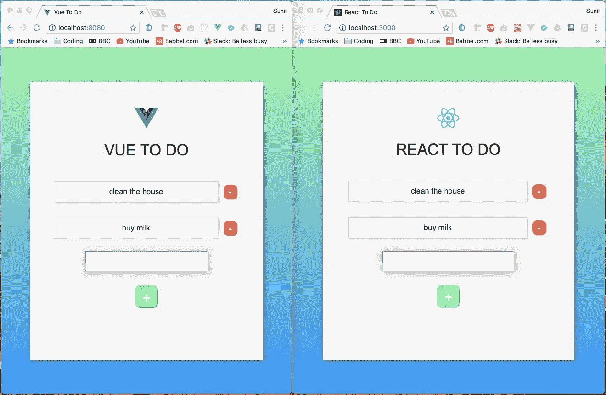
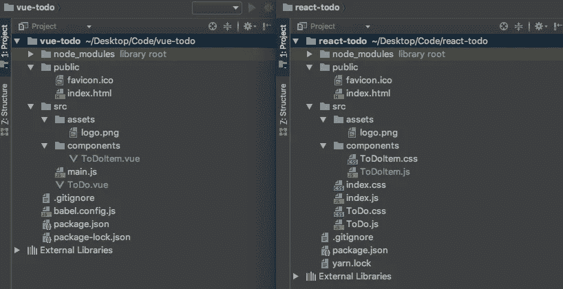
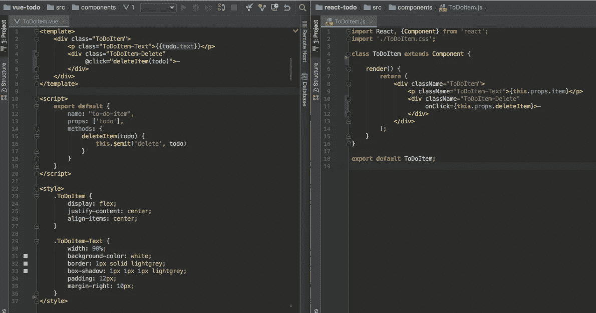
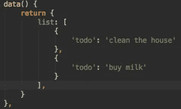
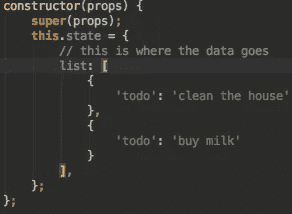

# 我在 React 和 Vue 中创建了完全相同的应用程序。以下是不同之处。

> 原文：<https://javascript.plainenglish.io/i-created-the-exact-same-app-in-react-and-vue-here-are-the-differences-e9a1ae8077fd?source=collection_archive---------0----------------------->

在工作中使用过 Vue 之后，我对它有了相当扎实的理解。然而，我很好奇栅栏另一边的草是什么样的——这种情况下的草会有什么反应。

我读了 React 文档，看了一些教程视频，虽然它们都很棒，但我真正想知道的是 React 和 Vue 有什么不同。我说的“不同”并不是指他们是否都有虚拟 DOMS 或者他们如何渲染页面。我希望有人花时间来解释代码！我想找一篇花时间解释这一点的文章，以便刚接触 Vue 或 React(或整个 Web 开发)的人能够更好地理解这两者之间的区别。

不幸的是，我找不到任何解决这个问题的方法。所以我意识到，我必须自己动手建造它，才能看到相似之处和不同之处。在这样做的时候，我想我应该把整个过程记录下来，这样一篇关于这个的文章就会最终存在。

*注意:这里有这篇文章的新版本:*

[](/i-created-the-exact-same-app-in-react-and-vue-here-are-the-differences-2021-edition-a7ebfc19a9d) [## 我在 React 和 Vue 中创建了完全相同的应用程序。以下是不同之处。[2021 版]

### React vs Vue。Vue 和 React 的并列代码对比！🎉

javascript.plainenglish.io](/i-created-the-exact-same-app-in-react-and-vue-here-are-the-differences-2021-edition-a7ebfc19a9d) 

Who wore it better?

我决定尝试构建一个相当标准的待办事项应用程序，允许用户在列表中添加和删除项目。这两个应用程序都是使用默认 cli 构建的(react 使用 create-react-app，vue 使用 vue-cli)。顺便说一下，CLI 代表命令行界面。🤓

# 无论如何，这个介绍已经比我预期的要长了。让我们先来快速了解一下这两款应用的外观:



Vue vs React: The Irresistible Force meets The Immovable Object

两个应用程序的 CSS 代码完全相同，但是它们的位置不同。记住这一点，接下来让我们看看这两个应用程序的文件结构:



Who wore it better?

你会发现它们的结构也几乎相同。这里唯一的区别是 React 应用有三个 CSS 文件，而 Vue 应用没有。这样做的原因是，在 create-react-app 中，react 组件将有一个附带的文件来保存其样式，而 Vue CLI 采用一种无所不包的方法，其中样式在实际的组件文件中声明。

最终，它们都实现了同样的事情，没有什么可以说你不能继续在 React 或 Vue 中构造不同的 CSS。这实际上取决于个人偏好——你会从开发社区听到很多关于 CSS 应该如何构造的讨论。现在，我们将遵循两个 CLI 中的结构。

但是在我们继续之前，让我们快速看一下典型的 Vue 和 React 组件是什么样子的:



Vue on the left. React on the right

现在，让我们进入本质的细节！

***顺便说一下，如果你喜欢目前的内容，*** *我刚刚推出了一个 YouTube 频道！如果你能通过* [***订阅我的 YouTube 频道***](https://www.youtube.com/channel/UCtipWUghju290NWcn8jhyAw?sub_confirmation=true) ***来支持我，那就太棒了！***

# **我们如何突变数据？**

但是首先，我们所说的“变异数据”是什么意思？听起来有点专业，不是吗？它基本上只是意味着改变我们已经存储的数据。所以，如果我们想把一个人的名字从约翰改成马克，我们就要“改变数据”。所以这就是 React 和 Vue 的关键区别所在。Vue 本质上创建了一个数据对象，可以自由地更新数据，而 React 创建了一个状态对象，执行更新需要更多的跑腿工作。现在，React 以很好的理由实现了额外的跑腿工作，我们稍后将对此进行深入探讨。但是首先，让我们来看看 Vue 的**数据**对象和 React 的**状态**对象:



Vue data object on the left. React state object on the right.

因此，您可以看到，我们将相同的数据传递给了两者，只是它们的标签不同。因此，将初始数据传递到我们的组件中是非常非常相似的。但是正如我们提到的，我们如何着手改变这两个框架之间的数据是不同的。

假设我们有一个名为 **name: 'Sunil'** 的数据元素。

在 Vue 中，我们通过调用 **this.name** 来引用它。我们也可以通过调用**this . name****=‘John’**来更新它。这会把我的名字改成约翰。我不确定我被叫做约翰是什么感觉，但是嘿，事情发生了！😅

在 React 中，我们将通过调用 **this.state.name** 来引用相同的数据。现在，这里的关键区别是，我们不能简单地编写 **this.state.name** = 'John '，因为 React 有适当的限制来防止这种容易的、无忧无虑的变异。所以在 React 中，我们会按照**this . setstate({ name:' John ' })**的思路写一些东西。

虽然这基本上与我们在 Vue 中实现的一样，但额外的编写是存在的，因为 Vue 基本上在默认情况下每当有数据更新时都会组合自己的 setState 版本。简而言之，React 需要 setState 和其中的更新数据，而 Vue 假设如果您要更新数据对象中的值，您会希望这样做。那么 React 为什么还要为此费心，为什么还需要 setState 呢？让我们把这个交给 [Revanth Kumar](https://medium.com/@revanth0212) 来解释:

> “这是因为 React 希望在状态发生变化时重新运行某些生命周期挂钩，[如] componentWillReceiveProps、shouldComponentUpdate、componentWillUpdate、render、componentDidUpdate。当您调用 setState 函数时，它会知道状态已经改变。如果您直接改变状态，React 将不得不做更多的工作来跟踪变化以及运行什么生命周期挂钩等等。所以为了简单起见，React 使用 setState。


Bean knew best

现在我们已经有了一些变化，让我们看看如何在我们的待办事项应用程序中添加新的项目，从而进入本质。

# 我们如何创建新的待办事项？

## **反应过来**:

```
createNewToDoItem = () => {
    **this**.setState( ({ list, todo }) => ({
      list: [
          ...list,
        {
          todo
        }
      ],
      todo: ''
    })
  );
};
```

## React 是怎么做到的？

在 React 中，我们的输入字段有一个名为**值的属性。**这个值通过使用几个函数自动更新，这些函数结合在一起创建了一些类似于 Vue 处理**双向绑定**的东西(如果你以前从未听说过这个，在这之后的“*Vue 是如何做到的”*一节中有更详细的解释)。我们通过将一个附加的 **onChange 事件监听器**附加到**输入**字段来创建它。让我们快速看一下**输入**字段，这样您就可以看到发生了什么:

```
<input type="text" 
       value={**this**.state.todo} 
       onChange={**this**.handleInput}/>
```

每当输入字段的值发生变化时，就会运行 handleInput 函数。它通过将状态对象中的 **todo** 设置为输入字段中的内容来更新它。这个函数看起来像这样:

```
handleInput = e => {
  **this**.setState({
    todo: e.target.value
  });
};
```

现在，每当用户按下页面上的 **+** 按钮来添加新项目时，**createnewdoitem**函数就会运行 this.setState 并向其传递一个函数。这个函数有两个参数，第一个是来自状态对象的整个**列表**数组，第二个是 **todo** (由 **handleInput** 函数更新)。该函数然后返回一个新对象，它包含之前的整个**列表**，然后在它的末尾添加 **todo** 。整个列表是通过使用一个 spread 操作符添加的(如果您以前没有见过这个，请使用 Google 这是 ES6 语法)。

最后，我们将 **todo** 设置为空字符串，这将自动更新**输入**字段中的**值**。

## **Vue:**

```
createNewToDoItem() {
    **this**.list.push(
        {
            'todo': **this**.todo
        }
    );
    **this**.todo = '';
}
```

## Vue 是怎么做到的？

在 Vue 中，我们的**输入**字段有一个句柄叫做 **v-model** 。这允许我们做一些被称为**的双向绑定**。让我们快速查看一下我们的输入字段，然后我们将解释这是怎么回事:

```
<input type="text" v-model="todo"/>
```

V-Model 将这个字段的输入与我们的数据对象 toDoItem 中的一个键联系起来。当页面加载时，我们必须将 toDoItem 设置为一个空字符串，如下: **todo: ''** 。如果这里已经有一些数据，比如 **todo:'在这里添加一些文本'**，我们的输入字段将加载已经在输入字段内的*在这里添加一些文本*。无论如何，回到空字符串，我们在输入字段中输入的任何文本都会绑定到 **todo** 的值。这实际上是双向绑定(输入字段可以更新数据对象，数据对象可以更新输入字段)。

所以回头看看前面的**createnewdoitem()**代码块，我们看到我们将 **todo** 的内容推入 **list** array ，然后将 **todo** 更新为空字符串。

# **我们如何从列表中删除？**

## **做出反应:**

```
deleteItem = indexToDelete => {
    **this**.setState(({ list }) => ({
      list: list.filter((toDo, index) => index !== indexToDelete)
    }));
};
```

## React 是怎么做到的？

因此，虽然 deleteItem 函数位于 **ToDo.js** 内部，但我可以很容易地在 **ToDoItem.js** 内部引用它，首先将 **deleteItem()** 函数作为属性传递给 **< ToDoItem/ >** :

```
<ToDoItem deleteItem={this.deleteItem.bind(this, key)}/>
```

这首先将功能向下传递，使孩子可以访问它。在这里你会看到，我们还绑定了**这个**并传递了 key 参数，因为 key 是函数用来区分点击时哪个 **ToDoItem** 试图删除的。然后，在 **ToDoItem** 组件中，我们执行以下操作:

```
<div className=”ToDoItem-Delete” onClick={this.props.deleteItem}>-</div> 
```

我所要做的就是引用父组件中的函数，就是引用 **this.props.deleteItem** 。

## Vue:

```
onDeleteItem(todo){
  **this**.list = **this**.list.filter(item => item !== todo);
}
```

## Vue 是怎么做到的？

在 Vue 中需要一种稍微不同的方法。我们必须做三件事:

首先，在我们想要调用函数的元素上:

```
<div class=”ToDoItem-Delete” @click=”deleteItem(todo)”>-</div>
```

然后我们必须创建一个 emit 函数作为子组件内部的方法(在本例中是 **ToDoItem.vue** )，如下所示:

```
deleteItem(todo) {
    **this**.$emit('delete', todo)
}
```

与此同时，你会注意到当我们在 **ToDo.vue** 内添加 **ToDoItem.vue** 时，我们实际上引用了一个**函数**:

```
<ToDoItem v-for="todo in list" 
          :todo="todo" 
          **@delete="onDeleteItem" //** <-- this :)
          :key="todo.id" />
```

这就是所谓的自定义事件侦听器。它监听任何使用字符串“delete”触发发出的情况。如果它听到这个消息，就会触发一个名为 **onDeleteItem** 的函数。这个函数位于 **ToDo.vue，**中，而不是 **ToDoItem.vue** 中。这个函数，如前所述，简单地过滤内的 **todo 数组**和**数据对象**来移除被点击的项目。

这里值得注意的是，在 Vue 示例中，我可以简单地在 **@click** 侦听器中编写 **$emit** 部分，如下所示:

```
 <div class=”ToDoItem-Delete” @click=”$emit(‘delete’, todo)”>-</div> 
```

这会将步骤数从 3 个减少到 2 个，这完全取决于个人偏好。

简而言之，React 中的子组件将通过 **this.props** 访问父函数(假设您正在向下传递 props，这是相当标准的做法，您将在其他 React 示例中多次遇到这种情况)，而在 Vue 中，您必须从子组件发出事件，这些事件通常将在父组件中收集。

# **我们如何传递事件监听器？**

## 反应:

诸如点击事件等简单事件的事件侦听器是直接的。以下是我们如何为创建新 ToDo 项目的按钮创建 click 事件的示例:

```
<button className=”ToDo-Add” onClick={this.createNewToDoItem}>+</div>.
```

这里非常简单，看起来很像我们用普通 JS 处理内嵌 onClick 的方式。正如在 Vue 一节中提到的，每当按下 enter 按钮时，设置一个事件监听器来处理它要花一点时间。这实际上要求输入标记处理 onKeyPress 事件，如下所示:

```
<input type=”text” onKeyPress={this.handleKeyPress}/>.
```

每当该函数识别出“输入”键被按下时，它就会触发**createnewdoitem**函数，如下所示:

```
handleKeyPress = (e) => {if (e.key === ‘Enter’) {this.createNewToDoItem();}};
```

## **Vue:**

在 Vue 中，这是非常直接的。我们简单地使用 **@** 符号，然后是我们想要做的事件监听器的类型。例如，要添加一个点击事件监听器，我们可以编写如下代码:

```
<button class=”ToDo-Add” @click=”createNewToDoItem()”>+</div> 
```

注: **@click** 其实是简写 **v-on:click** 。Vue 事件侦听器最酷的一点是，您还可以将许多东西链接到它们上面，比如。once 防止事件侦听器被触发多次。在编写处理击键的特定事件侦听器时，也有许多快捷方式。我发现，每当按下 enter 按钮时，在 React 中创建一个事件侦听器来创建新的 ToDo 项会花费相当长的时间。在 Vue 中，我可以简单地写下:

```
<input type=”text” v-on:keyup.enter=”createNewToDoItem”/>
```

## 我们如何将数据传递给子组件？

## 反应:

在 react 中，我们在创建子组件时将道具传递给子组件。比如:

```
<ToDoItem key={key} item={todo} />
```

这里我们看到两个道具被传递给了组件 **ToDoItem** 。从这一点开始，我们现在可以通过 this.props 在子组件中引用它们。因此要访问 **item.todo** 道具，我们只需调用 **this.props.item** 。

## Vue:

在 Vue 中，我们在创建子组件时将道具传递给子组件。比如:

```
<ToDoItem v-for="todo in list" 
            :todo="todo"
            :key="todo.id"
            @delete="onDeleteItem" />
```

完成后，我们将它们传递给子组件中的 props 数组，如下: **props: [ 'todo' ]** 。然后可以在孩子中通过它们的名字引用它们——所以在我们的例子中，是**‘todo**’。

# **我们如何将数据发送回父组件？**

## 反应:

我们首先将函数传递给子组件，在调用子组件的地方将它作为一个道具进行引用。然后我们通过引用**this . props . whateverthefunctioniscalled**，以任何方式在子节点上添加函数调用，比如 **onClick** 。这将触发父组件中的函数。我们可以在*“如何从列表中删除”一节中看到整个过程的示例。*

## Vue:

在我们的子组件中，我们只需编写一个函数，将值发送回父函数。在我们的父组件中，我们编写了一个函数来监听何时发出该值，然后触发一个函数调用。我们可以在*“如何从列表中删除”一节中看到整个过程的示例。*

# 这就是我们想要的！🎉

我们已经了解了如何添加、删除和更改数据，如何以 props 的形式将数据从父节点传递到子节点，以及如何以事件侦听器的形式将数据从子节点发送到父节点。当然，React 和 Vue 之间还有许多其他的小差异和怪癖，但是希望本文的内容有助于为理解这两个框架如何处理东西提供一点基础🤓

如果你觉得这很有用，一定要给很多很多的掌声👏。*提示，最多可以留 50！*

## 翻译

[*中文*](https://zhuanlan.zhihu.com/p/41623240)

[*印尼文*](https://medium.com/@fauzanlubis23/membuat-aplikasi-yang-sama-dengan-menggunakan-react-dan-vue-inilah-perbedaannya-202ae7784cd2)

[*日语*](https://medium.com/@ochrotomys.nuttalli/react%E3%81%A8vue%E3%81%A7%E5%90%8C%E3%81%98%E3%82%A2%E3%83%97%E3%83%AA%E3%82%92%E4%BD%9C%E6%88%90%E3%81%97%E3%81%A6%E3%82%8F%E3%81%8B%E3%81%A3%E3%81%9F%E3%81%93%E3%81%A8-%E9%81%95%E3%81%84%E3%81%AF%E3%81%93%E3%81%93%E3%81%AB%E3%81%82%E3%81%A3%E3%81%9F-8013cfedf9f0)

[*韩语*](https://medium.com/@erwinousy/%EB%82%9C-react%EC%99%80-vue%EC%97%90%EC%84%9C-%EC%99%84%EC%A0%84%ED%9E%88-%EA%B0%99%EC%9D%80-%EC%95%B1%EC%9D%84-%EB%A7%8C%EB%93%A4%EC%97%88%EB%8B%A4-%EC%9D%B4%EA%B2%83%EC%9D%80-%EA%B7%B8-%EC%B0%A8%EC%9D%B4%EC%A0%90%EC%9D%B4%EB%8B%A4-5cffcbfe287f)

[波斯 ](http://blog.loremsaz.com/%D8%A7%DB%8C%D8%AC%D8%A7%D8%AF-%DB%8C%DA%A9-%D8%A8%D8%B1%D9%86%D8%A7%D9%85%D9%87-%DB%8C%DA%A9%D8%B3%D8%A7%D9%86-%D8%AF%D8%B1-vue-%D9%88-react-%D8%AA%D9%81%D8%A7%D9%88%D8%AA-%D8%AF%D8%B1-%DA%86%DB%8C/)

[*打磨*](https://geek.justjoin.it/napisalem-aplikacje-vue-reactcie-zobaczie-roznice/)

[*葡萄牙语*](https://medium.com/javascript-in-plain-english/criei-o-mesmo-app-em-react-e-vue-eis-as-diferen%C3%A7as-2455d86d173c)

[*俄语*](https://habr.com/company/ruvds/blog/419373/)

[T21 西班牙](https://medium.com/@marianvilla/cre%C3%A9-la-misma-aplicaci%C3%B3n-en-react-vue-aqu%C3%AD-las-diferencias-605465a2e18c)

[台语](https://ithelp.ithome.com.tw/articles/10201091)

如果你有兴趣把这篇文章翻译成另一种语言，让它更容易理解，请随时这样做。😄

## 为什么不用 React 钩子或者 Vue Composition API？

实际上这篇文章的一个更新版本同时使用了它们！ [**最新版在这里阅读**](https://sunilsandhu.com/posts/i-created-the-exact-same-app-in-react-and-vue-2020-edition) ！但是在你点击链接之前，如果你喜欢这篇文章，请一定留下一些掌声，因为它们有助于支持我们正在做的工作。

## 角度对比呢？

很高兴你问了！因为[山姆·博瑞克](https://medium.com/u/64aa2d000776?source=post_page-----e9a1ae8077fd--------------------------------)已经写了这篇文章的[第二部分](https://medium.com/javascript-in-plain-english/i-created-the-exact-same-app-in-react-and-vue-part-2-angular-39b1aa289878)。

## 现在做得苗条些！

已经做好了— [就在这里](https://medium.com/javascript-in-plain-english/i-created-the-exact-same-app-in-react-and-svelte-here-are-the-differences-c0bd2cc9b3f8)！

## 【插入框架/库】怎么样？

[HyperApp](https://dev.to/citizen428/fighting-boredom-with-a-hyperapp-experiment-12a)

[AppRun](https://medium.com/@yiyisun/i-also-created-the-exact-same-app-using-apprun-dd1860cb8112)

[文学元素](https://medium.com/@westbrook/litelement-to-do-app-1e08a31707a4)

[超栈](https://medium.com/@mitch_23203/the-exact-same-app-in-hyperstack-7f281cef46ca)

[刺激+铁轨](https://mariochavez.io/desarrollo/2019/12/23/i-created-the-same-app-with-rails-and-javascript.html)

如果您对本文中使用的样式感兴趣，并想制作您自己的等效作品，请随时这样做！一定要让我知道，这样我就可以添加一个链接到你的文章👍

## Github 链接到两个应用程序:

https://github.com/sunil-sandhu/vue-todo

react ToDo:[https://github.com/sunil-sandhu/react-todo](https://github.com/sunil-sandhu/react-todo)

## 我最近在伦敦网络表演上谈到了这篇文章

看这里的谈话！[https://www.youtube.com/watch?v=dnNF8szmxXg](https://www.youtube.com/watch?v=dnNF8szmxXg)

*更多内容请看* [***说白了就是***](https://plainenglish.io/) *。报名参加我们的* [***免费每周简讯***](http://newsletter.plainenglish.io/) *。关注我们关于* [***推特***](https://twitter.com/inPlainEngHQ) ， [***领英***](https://www.linkedin.com/company/inplainenglish/) ***，***[***YouTube******，***](https://www.youtube.com/channel/UCtipWUghju290NWcn8jhyAw)*[***不和***](https://discord.gg/GtDtUAvyhW)*