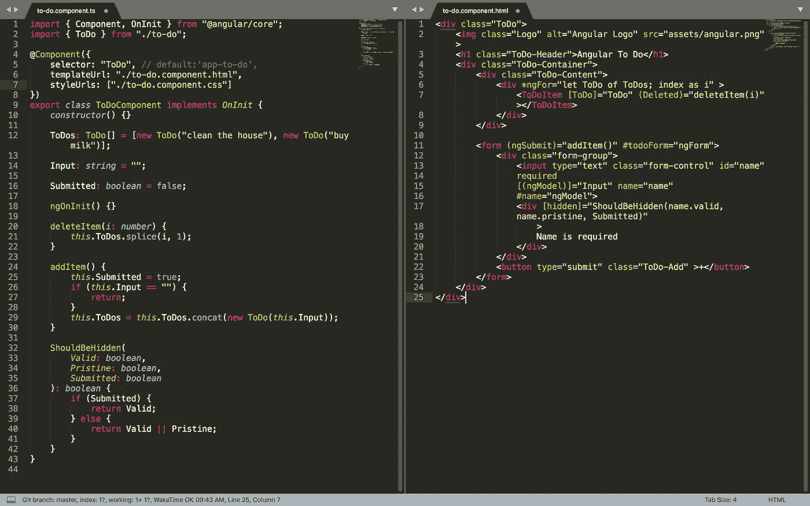
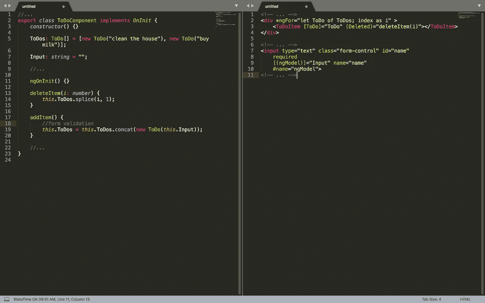

# 我在 React 和 Vue 中创建了相同的应用程序(第 2 部分:Angular)

> 原文：<https://javascript.plainenglish.io/i-created-the-exact-same-app-in-react-and-vue-part-2-angular-39b1aa289878?source=collection_archive---------1----------------------->

## 在 React 和 Vue 中创建了相同的应用程序后，我们将 Angular 融入其中是正确的！

***还没看完第 1 部分吗？查看*** [***此处***](https://medium.com/javascript-in-plain-english/i-created-the-exact-same-app-in-react-and-vue-here-are-the-differences-e9a1ae8077fd) ***。***

**更新:**你好！我创建了一个叫做每周项目俱乐部的组织。每周你都会在收件箱里收到一个项目创意。你可以努力解决问题，而且你会得到整个俱乐部的帮助，让你保持在正轨上。

如果你正在寻找一种尝试 React、Vue 和 Angular 的方法，你可以加入 3 周，尝试每一种方法！这是测试一个框架的好方法。

要了解更多信息并加入每周项目俱乐部，[点击此处](https://weeklyproject.club)。

我每天都在工作中使用 Angular，但是在 JavaScript 世界中，人们不能不听说其他所有的框架。我也喜欢比较苹果和苹果！所以当我看到[苏尼尔·桑德胡](https://medium.com/u/a7b125868703?source=post_page-----39b1aa289878--------------------------------)关于 [React vs Vue](https://medium.com/javascript-in-plain-english/i-created-the-exact-same-app-in-react-and-vue-here-are-the-differences-e9a1ae8077fd) 的文章时，我不得不伸出援手！所以我们在这里，反应 vs Vue vs Angular！

# 这些应用程序看起来怎么样？


Player 3 Has Entered The Game

就像第 1 部分一样，css 与其他两个几乎相同，除了它们的位置。


这个 Angular app 是由 Angular CLI(命令行界面)生成的。由于 Angular 经常被缩写为‘ng’，所以制作这个 app 的命令是`ng generate ng-todo`。

相比 Vue 和 React，Angular 有一个*吨*的档。这样做的一个重要原因是，Vue 将一个组件的所有内容放在一个文件中，React 将 css 分解到自己的文件中，Angular 将 CSS 放在一个文件中，html 放在另一个文件中，组件代码放在另一个文件中。虽然我们可以将所有这些放在一个文件中，但最好将它们分开。

所有文件的另一个原因是 Angular 使用 TypeScript。TypeScript 是“JavaScript 的一个超集，它提供了可选的静态类型、类和接口”。让我们稍微打开包装。


TypeScript 实际上只是在 JavaScript 的基础上添加了一些东西。如果我们在我们的 TypeScript 代码中写一行 JavaScript，它会工作得很好。TypeScript 让您可以轻松地创建类，并强制使用它们。

在我们的项目中，我们创建了一个 ToDo 类:

```
export class ToDo { constructor(item: string) {
    this.Item = item;
   } Item: string;
}
```

这个类本身不会做很多事情。我们可以编写要求*ToDo 的函数，如果我们试图给它其他的东西，TypeScript 编译器会对我们大喊大叫。*

例如:

```
function PrintToDo(myToDo: ToDo) { //the argument is of type ToDo
  console.log(myToDo.Item)} //this will generate a compiler error
this.PrintToDo("not a ToDo type")//this will not
this.PrintToDo(new ToDo("a real ToDo"))
```

当然，我们可以对任何我们想要的类型这样做，而不仅仅是类:

```
function PrintString(myString: string) {
  console.log(myToDo)}//this will generate a compiler error
this.PrintToDo(new ToDo("not a string type"))//this will not
this.PrintToDo("A string!")
```

TypeScript 只是 JavaScript，只是它有时会抛出类型错误，并防止在 JavaScript 中会变成运行时错误的愚蠢错误。

随着应用程序变得越来越复杂，像这样的类真的会派上用场！它们为现实生活中的事物提供了一个很好的模型，比如产品、工作或人。在角度世界中，我们称它们为模型。

# 我们如何创建新的待办事项？

这是我们的 todo 组件:



ToDoComponent (Full Code)

该组件中发生的大多数事情都与样式和输入表单有关。我们稍后会谈到这些，所以让我们把注意力集中在待办事项列表本身



ToDoComponent (Abbreviated)

当我们认真对待它时，我们的列表组件只是一个待办事项列表！可以获取我们的列表并显示每个项目，就像 foreach 会做的那样。这里最大的不同是 Angular 将为我们处理更新！当我们得到一些有效的输入时，我们需要做的就是将字符串传递给一个新的 to do 对象，并将其添加到我们的列表中。Angular 负责剩下的！

```
this.ToDos = this.ToDos.concat(new ToDo(this.Input));
```

就是这样！我们还希望能够确保用户没有提交空的 ToDo，那么我们如何防止这种情况呢？

# 角度形式验证

我们可以使用角形来代替检查回车键，或者自己检查字符串内容来抛出错误。如果您查看完整的 ToDoComponent，我们声明了一个`form`元素，

```
<form (ngSubmit)="addItem()" #todoForm="ngForm">
```

当提交按钮被按下或者用户按下回车键时，那个`ngSubmit`绑定将被触发！它也只能在表单处于有效状态时触发。

ngForm 还为表单中的每个输入创建一个组件成员变量，在本例中称为`name`。我们可以检查输入处于什么状态，并显示错误或其他有用的消息。在这种情况下，我们使用`valid`、`pristine`，并且我们还跟踪自己该表单以前是否被提交过。

有趣的是，我们还可以为 Angular 编写自定义验证器！我们在这里不需要它们，但是我们可以有一个知道电话号码应该如何格式化的表单，并为我们做所有的验证！整洁，对不对？

这解决了我们的列表，但是实际显示待办事项呢？

这是我们的待办事项组件:


Our ToDo Item Component

# 我们如何改变数据？

在 Angular 中，要显示一些数据，我们只需要做两件事:

1.  在我们的组件中有一个成员，在这个例子中是 ToDo
2.  用花括号`{{ToDo.Item}}`在模板中引用它

就是这样！当我们改变 ToDo。项目，Angular 将为我们更新视图。React 并没有真正提供这些钩子，因为调用 setState 无论如何都会为我们重新呈现组件。

# 与组件通信

因为这个组件只关心显示一个 ToDo，所以 ToDoComponent 需要能够给 ToDo Item 组件一个 ToDo 来显示！我们还需要能够告诉 ToDoComponent 用户已经单击了“删除”按钮。Angular 通过“输入”和“输出”实现这一点

输入很简单，可以是我们想要的任何类型，会为我们绑定！在这个组件中，我们只有一个 ToDo 作为输入。我们告诉 Angular 一个特定的成员是一个输入，方法是在它前面放上`@Input()`装饰器。

```
[@Input](http://twitter.com/Input)() ToDo: ToDo = new ToDo(""); 
```

然后，我们的父组件只需像这样向 ToDoItem 组件传递一个 ToDo:

```
<ToDoItem [ToDo]=”ToDo”></ToDoItem>
```

然后我们使用一个绑定来显示我们的 ToDo！

输出略有不同。一个输出不仅仅是一些数据，它还是一个事件来触发任何正在监视该输出的东西。角度输入可以是任何类型(如字符串)，但输出必须是类型`EventEmitter`。EventEmitters 发出一个值，它可以是我们想要的任何类型！因此，如果我们想输出一个字符串，我们只需创建一个修饰成员，如下所示:

```
[@Output](http://twitter.com/Output)() Example: EventEmitter<string> = new EventEmitter();
```

父组件可以像这样订阅事件:

```
<ExampleComponent (Example)="exampleHandler($event)"></ExampleComponent>
```

既然我们已经掌握了输出的知识，我们如何删除一个 ToDo 呢？

# 删除待办事项

我们不需要从 ToDoItem 组件传递任何东西，我们只需要触发一个事件。Typescript 需要知道我们的输出是什么类型，但是既然我们不在乎，我们就把它做成`any`，所以我们的输出看起来是这样的:

```
[@Output](http://twitter.com/Output)() Deleted: EventEmitter<any> = new EventEmitter();
```

我们仍然需要在 ToDoItem 内触发此事件。我们已经有了一个格式良好的 div，看起来像第 1 部分中的按钮，我们只需要将一个函数挂接到 click 事件上。

```
<div class="ToDoItem-Delete" (click)="deleteItem()">-</div>
```

然后`deleteItem`在`Deleted`呼叫`.emit()`:

```
deleteItem() {
  this.Deleted.emit();
 }
```

Angular 会将事件传递给 ToDoComponent。

回到我们的 ToDoComponent，我们已经将`deleteItem`函数绑定到 ToDoItem 组件。我们还将当前 ToDo 的索引传递给它，这样我们就知道要删除哪个。

```
<div *ngFor="let ToDo of ToDos; index as i" >
    <ToDoItem [ToDo]="ToDo" (Deleted)="deleteItem(i)"></ToDoItem>
</div>
```

然后，我们需要做的就是删除该索引处的 to do，Angular 将更新显示。

```
deleteItem(i: number) {
  this.ToDos.splice(i, 1);
}
```

我们开始了，一个待办事项列表应用程序！

即使是一个很小的 Angular 应用程序也比 React 或 Vue 应用程序有更多的功能。Angular 真正的好处是，你需要的大部分功能都在 Angular 本身之内。Angular 包括页面路由、保护对页面的访问、http 调用、模块延迟加载等等。一个重量级的框架有很大的学习曲线。然而，好处是我很少需要走出 Angular 去寻找我所需要的解决方案。

当我不写 Angular 的时候，我喜欢帮助人们弄清楚他们应该学习什么编程语言。当选择一个 JavaScript 框架时，有很多不同的优先级需要考虑。这就是为什么我创造了 PickAFramework.com。我写关于做出重大技术决策的文章，并帮助人们做出自己的决定。

如果你正在纠结在你的下一个项目中是使用 React，Vue 还是 Angular，请考虑报名参加我的电子邮件课程。除了比较代码之外，我还谈到了选择框架的方法。这是完全免费的，你可以随时退订。

点击了解更多关于特色渔业[的信息。](https://pickaframework.com/feature_fishing/)

感谢阅读！感谢[苏尼尔·桑德胡](https://medium.com/u/a7b125868703?source=post_page-----39b1aa289878--------------------------------)让这一切发生！如果你还没有读过第一部分，这里有一个链接。你可以在 Github 上的这里找到源代码[。](http://github.com/mibzman/ng-todo)