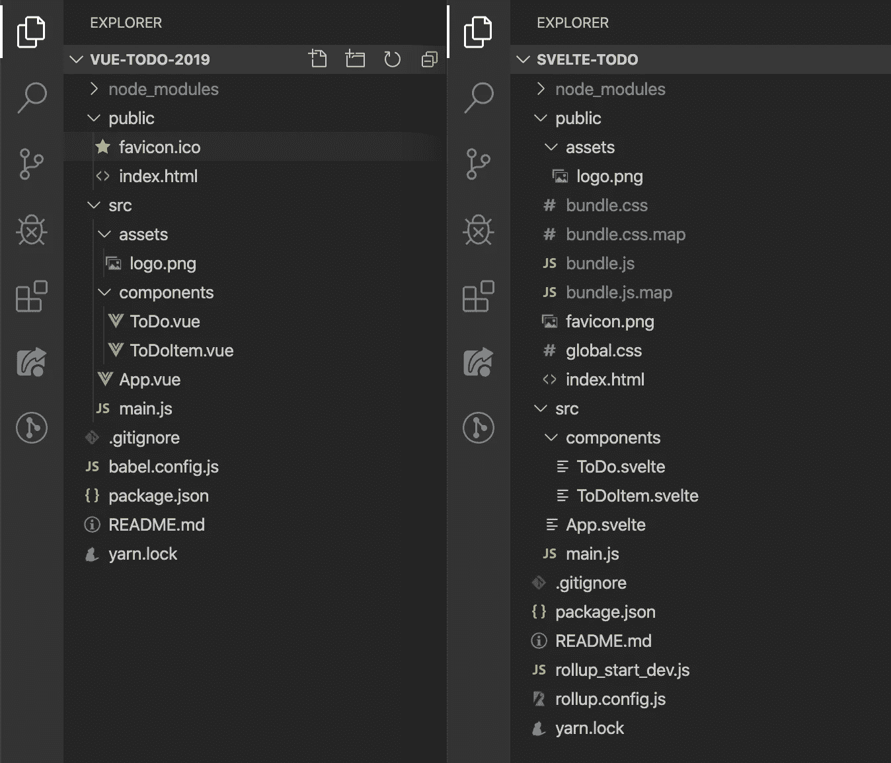

# 我在 Vue 和 Svelte 中创建了完全相同的应用程序。以下是不同之处。

> 原文：<https://javascript.plainenglish.io/i-created-the-exact-same-app-in-vue-and-svelte-here-are-the-differences-c649f8d4ce0a?source=collection_archive---------0----------------------->

## Vue vs 苗条。最后一个并列代码对比！因为你已经听到了关于苗条的大惊小怪，现在你想知道炒作是怎么回事。

在工作中使用过 Vue 之后，我对它有了相当扎实的理解。我最近听说了 Svelte——一种新的 JavaScript 框架，最近开始在 web 开发领域获得关注。作为一名好奇的 Web 开发人员，我一直很想知道栅栏另一边的草是什么样的——在这个场景中的草是细长的。

我读了苗条的医生，看了几个视频，虽然它们很有用，但我真正想知道的是苗条和 Vue 有什么不同。我说的*【不同】*，并不是指诸如 Svelte 是否使用了虚拟 DOM 或者它如何渲染页面之类的事情。我希望有人花时间解释一下，如果我用苗条的身材写了同样的东西，我的 Vue 代码会是什么样子！我想找一篇花时间解释这一点的文章，以便刚接触 Vue 或 Svelte(或整个 Web 开发)的人能够更好地理解两者之间的差异。

不幸的是，我找不到任何解决这个问题的方法。所以我意识到，我必须自己动手建造它，才能看到相似之处和不同之处。在这样做的时候，我想我应该把整个过程记录下来，这样一篇关于这个的文章就会最终存在。

我决定尝试构建一个相当标准的待办事项应用程序，允许用户在列表中添加和删除项目。这两款应用都是使用 CLIs 构建的(`@vue/cli`用于 Vue，`sveltejs/template`用于 Svelte)。

顺便说一下, *CLI 代表命令行界面。🤓*

# 无论如何，这个介绍已经比我预期的要长了。让我们先来快速了解一下这两款应用的外观:


Vue vs Svelte: A new challenger approaches!

两个应用程序的 CSS 代码完全相同，但是它们的位置不同。记住这一点，接下来让我们看看这两个应用程序的文件结构:



Vue on the left. Svelte on the right.

你会看到它们的结构在这里有很大的不同。

Vue 在 **src** 文件夹中有所有的组件、样式和资产，而 Svelte 要求资产直接位于 **public** 文件夹中。两者都没有任何**。css** 文件作为样式在实际的**中定义。vue** 和**。纤细的**文件。

您还会注意到——对于 Svelte——有一些用于汇总的**配置**文件。对于那些不知道的人，Rollup 基本上是一个 Webpack 等价物，Svelte 选择使用它。

最后，你会注意到在**公共**文件夹中已经有一些**包**文件。这些是我在我的本地主机上试着提供苗条的 ToDo 应用程序后创建的。与 Vue 不同，Svelte 的 CLI 会在您尝试启动本地服务器时自动生成这些文件。这些实际上是提供给你的文件，是来自**的所有代码的编译。苗条的**文件。

这是 Svelte 与 Vue 不同的一个关键点。在 Vue 中，如果你要编译你的代码以便准备好发送到生产并在线发布，你通常会在你的**公共**文件中结束类似的结构，但是在开发时，如果你要将你的 Vue ToDo 应用程序提供给本地服务器，你不会看到这些**捆绑包**文件， 当你的代码被 Webpack 编译，然后在你的本地主机上提供给你——并且有效地位于缓存中的某个地方，而 Rollup 编译苗条的代码并使它在 **public** 文件夹中对你可见。 这里引起的另一个不同是，Vue 的 Webpack 设置允许热模块重载(这基本上意味着，当您在开发期间进行更新时，代码将在您的浏览器中非常快速地更新。在 Svelte 的 Rollup 设置中，这在默认情况下是不可能的，因为那些**捆绑包**文件实际上正在被重新编译，尽管很快，每次你点击保存按钮来更新你的代码。如果需要的话，有一些软件包可以帮助你实现热模块的重新加载，但是在我写这篇文章的时候，这些软件包还没有“开箱即用”。

最终，文件结构和编译方法实现了同样的事情，只是方式不同。

## 在我们继续之前，让我们快速看一下典型的 Vue 和苗条组件是什么样子的:


现在，让我们进入本质的细节！

# 创建新的应用程序

## 某视频剪辑软件

使用 npm，在您的终端/命令行中运行以下命令来安装 Vue CLI:

```
npm install -g @vue/cli
```

安装后，您可以运行:

```
vue create vue-todo
```

这将为您创建一个名为“vue-todo”的项目，其中包含您开始所需的一切。我们对为本文创建的应用程序使用了相同的过程。

## 苗条的

使用 npm，在您的终端/命令行中运行以下命令:

```
npx degit your-name/template svelte-todo
```

这将为您创建一个名为“svelte-todo”的项目，其中包含您开始所需的一切。我们对为本文创建的应用程序使用了相同的过程。

# 我们如何改变数据？[从这里继续]

但是首先，我们所说的“变异数据”是什么意思？听起来有点专业，不是吗？它基本上只是意味着改变我们已经存储的数据。所以，如果我们想把一个人的名字从约翰改成马克，我们就要“改变数据”。Vue 和 Svelte 以相同的方式处理突变，本质上允许数据自由更新(例如，我们可以将项目推入数据数组，重新分配我们的数据等)。

让我们看看下图中两者的设置，然后我们将解释接下来会发生什么:


Vue on the left. Svelte on the right.

因此，您可以看到，我们将相同的数据传递给了两者，但结构略有不同。

在 Vue 中，您通常会将组件的所有可变数据放在一个`data()`函数中，该函数返回一个包含您的数据的对象。

现在用 Svelte，你会注意到我们有两个变量要输出。这些文件位于我们的 **ToDo.svelte** 文件中，但是如果我们愿意，也可以放在 route **App.svelte** 文件中更高的位置。

无论如何，让我们再看一看它们，然后我们会解释这是怎么回事:

```
export let todo = "";
export let list = [
  { id: 1, text: "clean the house" },
  { id: 2, text: "buy eggs" }
];
```

所以对于 Svelte，如果我们想在我们的文件中引用像`todo`和`list`这样的东西，我们需要在同一个文件的某个地方创建一个对它们的引用。

这与 Vue 或大多数其他 JavaScript 没有什么不同，无论是通过创建变量、导入变量，还是将变量作为道具传递给组件。这里的不同之处在于，我们实际上是在创建新的变量(*与* `*let*` *，而不是* `*const*` *，因为那样会阻止我们对它进行变异——或者如果我们想从技术上了解* `*const*` *如何工作*，就重新分配它)。我之所以提到我们必须创建新的变量，是因为你稍后会注意到，我们必须在我们想要引用它们的每个文件中这样做，即使它们已经作为道具传递了。基本上，Svelte 会将值传递给那些新创建的变量。如果你感到困惑，就继续读下去，当我们以后再次提到它的时候，你会看到它是如何工作的。

## 那么我们如何在 Vue 和 Svelte 应用中引用可变数据呢？

好吧，假设我们有一些名为`name`的数据，它被赋予了一个值`‘Sunil**’**`。

在 Vue 中，它将位于`data()`对象的内部，并被称为`name: ‘Sunil'`。在我们的应用程序中，我们将通过调用`this.name`来引用它。我们也可以通过调用`this.name = ‘John’`来更新它。这会把我的名字改成约翰。我不确定我被叫做约翰是什么感觉，但是嘿，事情发生了！😅

简单来说，这个`let name = Sunil`，要么在一个组件中被创建并作为道具传递给另一个组件，要么在创建它的组件内部被使用。不管我们如何使用`name`，我们都可以通过简单地重新分配`name`来更新它。所以我可以写`name = ‘John'`，我们可以在 UI 的屏幕上看到更新。

现在我们已经有了一些变化，让我们看看如何在我们的待办事项应用程序中添加新的项目，从而进入本质。

# 我们如何创建新的待办事项？

## Vue:

```
**createNewToDoItem() {** const newId = this.list.length ? 
                Math.max.apply(null, this.list.map(t => t.id)) + 1 :
                1;

  this.list.push({ id: newId, text: this.todo });
  this.todo = "";**}**
```

## Vue 是怎么做到的？

在 Vue 中，我们的**输入**字段上有一个名为 **v-model** 的句柄。这允许我们做一些被称为**双向绑定**的事情。让我们快速查看一下我们的输入字段，然后我们将解释这是怎么回事:

```
<input type="text" v-model="todo"/>
```

V-Model 将这个字段的输入与我们的数据对象 toDoItem 中的一个键联系起来。当页面加载时，我们必须将 toDoItem 设置为一个空字符串，如下: **todo: ''** 。如果这里已经有一些数据，比如 **todo:“在这里添加一些文本”**，我们的输入字段将加载已经在输入字段内的*在这里添加一些文本*。无论如何，回到空字符串，我们在输入字段中输入的任何文本都会绑定到 **todo** 的值。这实际上是双向绑定(输入字段可以更新数据对象，数据对象可以更新输入字段)。

所以回头看看前面的**createnewdoitem()**代码块，我们看到我们将 **todo** 的内容推入 **list** array ，然后将 **todo** 更新为空字符串。

## 苗条:

```
**createNewToDoItem() {** const newId = list.length ? 
                Math.max.apply(null, list.map(t => t.id)) + 1 :
                1;

  list.push({ id: newId, text: todo });
  todo = "";**}**
```

## 斯维尔特是怎么做到的？

在 Svelte 中，我们的**输入**字段有一个句柄，名为 **bind:value** 。这允许我们做一些被称为**双向绑定**的事情。让我们快速查看一下我们的输入字段，然后我们将解释这是怎么回事:

```
<input type="text" bind:value={todo} />
```

**bind:value** 将该字段的输入绑定到一个我们称为`todo`的变量。当页面加载时，我们将`todo`设置为一个空字符串，比如:`let todo = ‘’`。如果这里已经有了一些数据，比如`let todo = ‘add some text here’`**我们的输入字段将会加载一些文本 ***这里*** 已经在输入字段里面了。无论如何，回到空字符串，我们在输入字段中输入的任何文本都会绑定到`todo`的值。这实际上是双向绑定(输入字段可以更新`todo`，而`todo`可以更新输入字段)。**

**所以回头看看前面的**createnewdoitem()**代码块，我们看到我们将`todo` 的内容推入`list` 数组，然后将`todo` 更新为空字符串。**

**我们还使用了与 Vue 示例中相同的`newId()`函数。**

## **那个 newId 变量是什么？**

**本质上，`newId`变量被分配给一个函数的结果，这个函数基本上是创建一个新的 ID，我们将把这个 ID 赋予新的`toDo`项。我们对 Vue 和 Svelte 使用了相同的函数。**

# **我们如何从列表中删除？**

## **Vue:**

```
onDeleteItem(id){
  **this**.list = **this**.list.filter(todo => todo.id !== id);
}
```

## **Vue 是怎么做到的？**

**在 Vue 中需要一种稍微不同的方法。我们必须做三件事:**

**首先，在我们想要调用函数的元素上:**

```
<div class=”ToDoItem-Delete” @click=”deleteItem(item)”>-</div>
```

**然后我们必须创建一个 emit 函数作为子组件(在本例中是 **ToDoItem.vue** )内部的方法，如下所示:**

```
deleteItem(id) {
    **this**.$emit('delete', id)
}
```

**与此同时，你会注意到当我们在 **ToDo.vue** 内添加 **ToDoItem.vue** 时，我们实际上引用了一个**函数**:**

```
<ToDoItem v-for="todo in list" 
          :todo="todo" 
          **@delete="onDeleteItem" //** <-- this :)
          :key="todo.id" />
```

**这就是所谓的自定义事件侦听器。它监听任何使用字符串“delete”触发发出的情况。如果它听到这个消息，就会触发一个名为 **onDeleteItem** 的函数。该函数位于 **ToDo.vue，**内，而不是 **ToDoItem.vue** 内。这个函数，如前所述，简单地过滤****数据对象**中的 **todo 数组**，以移除被点击的项目。****

****这里还值得注意的是，在 Vue 示例中，我可以简单地在 **@click** 侦听器中编写 **$emit** 部分，如下所示:****

```
**<div class=”ToDoItem-Delete” @click=”$emit(‘delete’, item)”>-</div>**
```

****这会将步骤数从 3 个减少到 2 个，这完全取决于个人偏好。****

## ****苗条:****

```
**const deleteItem = event => {
  const { id } = event.detail;
  list = list.filter(item => item.id !== id);
};**
```

## ****斯维尔特是怎么做到的？****

****苗条身材也需要类似的方法。我们必须做三件事:****

****如果我们从上往下开始，首先是你刚才看到的`deleteItem`函数。这位于 **ToDo.svelte** 的内部。如你所见，我们析构了`event`对象，将`event.detail.id`传递给`const id`。您可以将这部分看作是试图从输入字段中获取`event.target.value`。这里的不同之处在于当调用`deleteItem`函数时，`event`是作为参数(或有效载荷/数据)传入的。但是这个`deleteItem`是在 **ToDoItem.svelte** 中调用的。那么，我们是如何做到这一点的呢？****

****然后我们把我们的`deleteItem`函数作为道具传递下去，就像这样:****

```
**<ToDoItem {item} on:deleteItem={deleteItem} />**
```

****但是在 **ToDoItem.svelte** 内部，我们不能只是简单的调用`deleteItem`。您可能已经注意到，在上面的代码块中，我们没有使用相同的属性名传递我们的`deleteItem`函数，而是将它作为一个名为`on:deleteItem`的属性来传递。这基本上创建了一个名为`deleteItem`的事件监听器。因此，为了调用它，我们现在需要将一个调用“分派”回`deleteItem`，此时，如果需要，我们还可以传递一个有效载荷(一些数据)。那么我们该怎么做呢？****

****在 **ToDoItem.svelte** 内部，我们必须首先从 svelte 导入`createEventDispatcher`，就像这样:****

```
**import { createEventDispatcher } from "svelte";**
```

****然后我们创建一个`const dispatch`并将其分配给`createEventDispatcher()`，如下所示:****

```
**const dispatch = createEventDispatcher();**
```

****然后我们可以创建一个函数来调用我们新创建的`dispatch`函数，就像这样:****

```
****const handleDelete = id => {**
  dispatch("deleteItem", { id });
**};****
```

****最后，我们可以从“删除”按钮调用我们的`handleDelete`函数，就像这样:****

```
**<button class="ToDoItem-Delete" 
        on:click={() => handleDelete(item.id)}> 
- 
</button>**
```

****如果我们愿意，我们可以通过编写以下代码跳过创建`handleDelete`函数:****

```
**<button class="ToDoItem-Delete" 
        on:click={() => dispatch("deleteItem", { item.id })}> 
- 
</button>**
```

****这完全取决于个人喜好。****

****简而言之，Vue 和 Svelte 中的子组件可以以几乎相同的方式访问父组件。区别只是语义上的，Vue 称之为“发射”数据，而 Svelte 称之为“调度”数据。****

****对于 Svelte，我们有另一种方法可以将函数作为道具传递下去，这与 React 采用的类似方法类似。然而，出于本教程的目的，我们选择使其类似于 Vue。****

# ****我们如何传递 DOM 事件侦听器？****

## ****Vue:****

****在 Vue 中，这是非常直接的。我们简单地使用 **@** 符号，然后是我们想要做的事件监听器的类型。例如，要添加一个点击事件监听器，我们可以编写如下代码:****

```
**<button class=”ToDo-Add” @click=”createNewToDoItem()”>+</div>**
```

****注: **@click** 其实是简写 **v-on:click** 。Vue 事件侦听器最酷的一点是，您还可以将许多东西链接到它们上面，比如。once 防止事件侦听器被触发多次。在编写处理击键的特定事件侦听器时，也有许多快捷方式。在 Vue 中，我可以简单地写下:****

```
**<input type=”text” v-on:keyup.enter=”createNewToDoItem”/>Svelte:**
```

****在苗条的时候，它也是非常直截了当的。我们简单地在:句柄上使用**，然后使用我们想要的事件监听器的类型。例如，要添加一个点击事件监听器，我们可以写 **on:click** ，如下例所示:******

```
<button class="ToDo-Add" on:click={createNewToDoItem}>+</button>
```

**苗条事件监听器的一个很酷的事情是，你也可以把一堆东西链接到它们上面，比如 **once** 防止事件监听器被触发不止一次。**

# **我们如何将数据/道具传递给子组件？**

## **Vue:**

**在 Vue 中，我们在创建子组件时将道具传递给子组件。比如:**

```
<ToDoItem v-for="item in list" 
  :item="item" 
  @delete="onDeleteItem" 
  :key="item.id" />
```

**完成后，我们将它们传递给子组件中的 props 数组，如下: **props: [ 'todo' ]** 。然后可以在孩子中通过它们的名字引用它们——所以在我们的例子中，是**‘todo**’。**

## **苗条:**

**苗条的话，差不多也是这样:**

```
<ToDoItem {item} on:deleteItem={deleteItem} />
```

**这里的一个不同之处是，我们不需要向我们的 **ToDoItem** 传递一个密钥，但是先不要急着这么想，我们稍后会谈到这一点。**

**另一个区别是，我们可以通过简单地编写`{item}`来传递`item`。这是因为道具名称和实际道具具有相同的名称。写`item={item}`也是一样的，但是我的苗条设置自动将其修改为简单的`{item}`。**

**一旦完成，我们必须在我们的 **ToDoItem.svelte** 文件中创建一个名为`item`的变量，方法是将`export let item;`写到文件的 **<脚本>** 部分的顶部。这样我们可以在文件中引用`item`,而不会因为试图引用一个不存在的变量而出错。这里你要记住的是，在编译过程中，Svelte 会检查我们的 **ToDoItem** 是否被传递了一个名为`item`的道具。在我们的例子中，它有，所以作为道具传递的`item`的值将被分配给我们的`export let item;`。这使得我们的应用程序能够像我们期望的那样工作。然后可以在孩子中通过它们的名字引用它们——所以在我们的例子中，是**‘todo**’。**

# **我们如何将数据发送回父组件？**

## **Vue:**

**在我们的子组件中，我们只需编写一个函数，将值发送回父函数。在我们的父组件中，我们编写了一个函数来监听何时发出该值，然后触发一个函数调用。我们可以在*“如何从列表中删除”一节中看到整个过程的示例。***

## **苗条:**

**在我们的子组件中，我们简单地编写了一个分派函数，它将一个值发送回父函数。在我们的父组件中，我们编写了一个函数来监听何时发出该值，然后触发一个函数调用。我们可以在“如何从列表中删除”一节中看到整个过程的示例。**

# **我们如何在组件内部循环数据？**

## **某视频剪辑软件**

**在 Vue 中我们用的是`v-for`，这是 Vue 特有的。这是一种循环数据的方法。你可以在这里看到，由于我们只是循环通过我们的数据来输出多个**到数据项**，我们实际上可以直接在`<ToDoItem/>`组件上使用`v-for`。这是我们在代码中实现它的方式:**

```
<ToDoItem v-for="item in list" 
          :item="item" @delete="onDeleteItem" 
          :key="item.id" />
```

## **苗条的**

**在 Svelte 中，我们用的是`#each`，专门针对 Svelte 的。这是一种循环数据的方法。这是我们在代码中实现它的方式:**

```
**{#each list as item, i (item.id)}**
  <ToDoItem {item} on:deleteItem={deleteItem} />
**{/each}**
```

**你会注意到，然后我们取我们的`list`变量，并在它后面跟随`as item`。这基本上就是说，以我们的`list`为例，把它分解成我们称之为`item`的单个项目。然后我们给每个`item`一个我们称之为`i`的索引，然后在我们想要使用的索引后面的括号中写下，在这种情况下，就是我们的`item.id`。你还会注意到，我们不需要在这里传递一个`key`给我们的`<ToDoItem/>`，因为 Svelte 无论如何都会分配它。**

# **我们做到了！🎉**

**我们已经了解了如何添加、删除和更改数据，如何以 props 的形式将数据从父节点传递到子节点，以及如何以事件侦听器的形式将数据从子节点发送到父节点。当然，Vue 和 Svelte 之间还有许多其他的小差异和怪癖，但是希望这篇文章的内容有助于为理解它们如何处理事情提供一点基础。**

**如果您对本文中使用的样式感兴趣，并想制作您自己的等效作品，请随时这样做！👍**

# **Github 链接到两个应用程序:**

**https://github.com/sunil-sandhu/vue-todo-2019**

**苗条的托多:[https://github.com/sunil-sandhu/svelte-todo](https://github.com/sunil-sandhu/svelte-todo)**

# **但是反应呢？！**

**很高兴你问了！以下是我们的对比产品:**

****React vs Vue:**[https://medium . com/JavaScript-in-plain-English/I-created-the-exact-same-app-in-React-and-Vue-here-are-the-differences-2019-edition-42 ba 2 cab 9 e 56](https://medium.com/javascript-in-plain-english/i-created-the-exact-same-app-in-react-and-vue-here-are-the-differences-2019-edition-42ba2cab9e56)**

****React vs Svelte:**[https://medium . com/JavaScript-in-plain-English/I-created-the-exact-same-app-in-React-and-Svelte-here-is-the-differences-c 0 BD 2c C9 B3 f 8](https://medium.com/javascript-in-plain-english/i-created-the-exact-same-app-in-react-and-svelte-here-are-the-differences-c0bd2cc9b3f8)**