# 我在 React 和 Redux 中创建了完全相同的应用程序。以下是不同之处。

> 原文：<https://javascript.plainenglish.io/i-created-the-exact-same-app-with-react-and-redux-here-are-the-differences-6d8d5fb98222?source=collection_archive---------0----------------------->

## 使用 Redux 的初学者指南，以及 React 内置的有 Redux 和没有 Redux 的确切应用程序的并行代码比较。

# 因为学习 Redux 可能很难——刚开始。

一旦你学会了如何使用 React，并且自信地开发了一些应用程序，这种感觉会很棒。你能够管理状态，一切似乎都很好。然而，很有可能到了你必须学习 Redux 的时候。

这可能是因为您正在开发的应用程序变得越来越大，您发现自己到处都在传递状态，需要一种更好的方法来管理您的数据。或者，这可能只是因为你已经注意到，大量的招聘广告需要了解 Redux 以及反应。无论哪种方式，知道如何使用 Redux 都是一个很好的知识，因此，你应该学会它。

然而，有一件事很难理解，那就是为了理解它是如何工作的，你必须要考虑大量的额外代码。我个人也觉得那里的文档，包括官方的 Redux 文档，展示了如此多的使用 Redux 的不同方法，以至于 Redux 不再让人感觉触手可及。

在某种程度上，这是一件好事，因为它鼓励你以你认为合适的方式使用 Redux，而不是说*“这正是你应该使用它的方式，如果你不这样做，那么你就是一个糟糕的开发人员”。*然而，只有当你知道你在用 Redux 做什么的时候，这种美好才会到来，在那之前，它只会让你很难学会。

那么我们要怎么学习 Redux 呢？

## 通过用 React 构建一个 app，然后用 Redux 构建一模一样的 app！

哦，顺便说一下，当我说“*用 Redux* 构建一个应用”时，我们仍然在使用 React——我们只是用 Redux 管理数据流。但从这里开始，除了沿途的一些切线，当我提到用 Redux 构建的 app 时，我真正的意思是用 React 和 Redux 构建。

# 无论如何，这个介绍已经比我预期的要长了。因此，让我们先来快速了解一下这两款应用的外观:

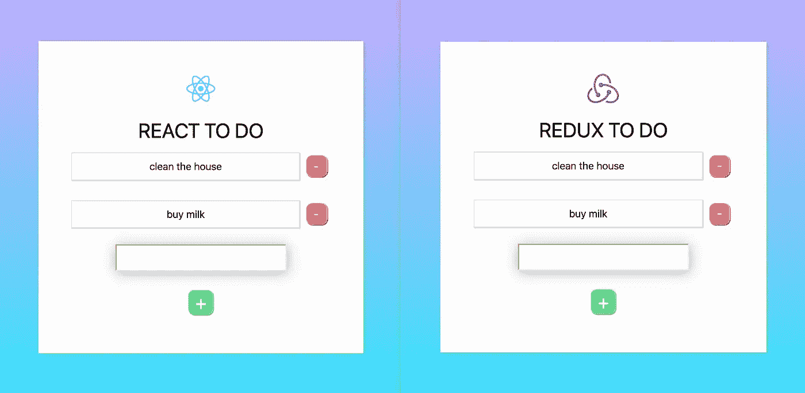

React vs Redux. Not a battle as such, but rather a variation of approach to your app.

因为这两个 React 应用都是用 **create-react-app、**创建的，它们的文件结构基本相同，除了 redux 应用内的 **redux** 文件夹。现在让我们来看看文件结构:

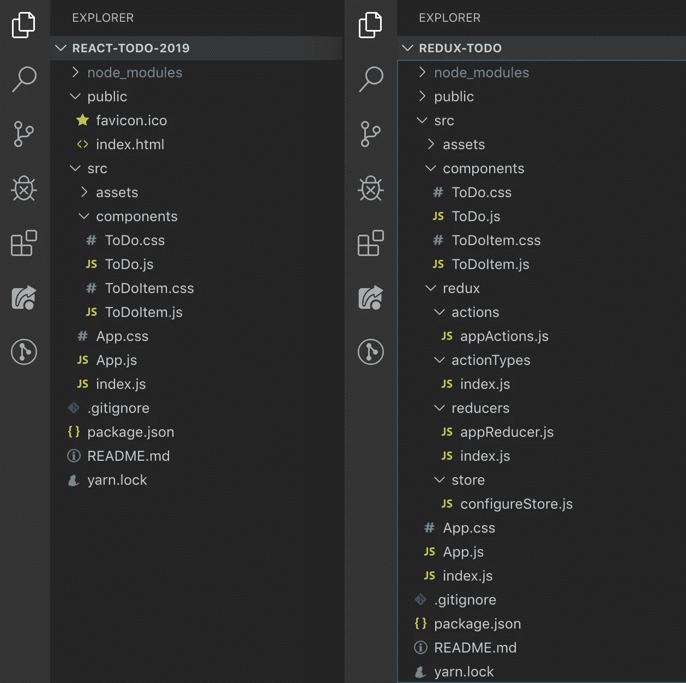

React on the left. Redux on the right.

现在，假设这两个应用程序实现了完全相同的事情，你可能会想为什么 Redux 需要这么多额外的文件，以及它们的用途是什么。

您将注意到的第一件事是，为了让 Redux 为您的应用程序设置，需要大量的初始样板代码。这在很大程度上是它所应用的心智模型——Redux 也植根于函数式编程，但是让我们把这个兔子洞留到另一个场合。无论如何，当构建更大的应用程序时，这些额外的代码真的很有价值，这些应用程序有大量的数据从各种组件、API 等流入流出。一开始，这个简单的应用程序看起来有点大材小用，但是请坚持使用我们，因为我们并不是鼓励你在简单的应用程序中使用 Redux，而是我们在一个简单的应用程序中使用它，以便让 Redux 更容易掌握和理解。

# 在我们深入研究代码之前，让我们先向前推进，多解释一下 Redux。

Redux 通过三个关键原则处理数据流:

## **1。商店**

也称为单一来源的真理，存储基本上只是一个对象，你用一些状态初始化，然后每当我们想更新它，我们用它的新版本覆盖存储。无论如何，您可能已经在 React 应用程序中使用了这些相同的原则，因为通常认为最好的做法是重新创建状态，而不是改变它。为了进一步澄清这里的区别，如果我们有一个数组，我们想把一个新的条目压入其中，我们不会通过把一个新的条目压入数组来更新我们的存储，而是用它的一个更新版本来覆盖存储。

## 2.还原剂

所以我们的商店通过一个叫做 reducer 的东西来更新。这些基本上是我们发送新版本状态的机制。这可能还没有多大意义，所以让我们详细说明一下。假设我们有一个 store 对象，它有一个如下所示的数组:`list: [{‘id: 1, text: ‘clean the house’}]`。如果我们有一个向数组中添加新项目的函数，我们的 reducer 将向我们的商店解释商店的新版本将是什么样子。所以在我们的`list`数组的情况下，我们可能会获取我们的列表的内容，通过`...`语法将它和我们想要添加的新项目一起传播到一个新的`list`数组中。因此，我们用于添加新项目的缩减器可能看起来像这样:`list: [...list, newItem]`。这也是我们在这里讨论如何为商店创建新的状态副本，而不是将新的项目推入商店的现有部分时的意思。

## 3.行动

现在，为了让我们的 reducers 知道哪些新数据要放入我们的状态，他们可以访问一个有效载荷。这个有效载荷通过一个动作发送给我们的 reducer。就像我们创建的任何功能一样，一个动作通常可以通过 props 在我们应用程序的组件中访问。因为这些动作在我们的组件中，所以我们可以向它们传递参数——这些参数成为有效负载。

## **考虑到这一点，**

我们可以这样看待 Redux:我们的应用程序可以访问**动作。**这些动作从我们的应用程序中携带数据(或通常所说的有效载荷)。**动作**具有与**减速器**共用的类型。每当**动作** *类型*被触发时，它就获取有效载荷并告诉我们的**存储**它现在应该是什么样子——我们通常指的是我们的数据对象现在应该是什么样子，因为它已经被更新了。

## 这个 Redux 心智模型还有其他部分，比如动作创建者和动作类型，等等——但是这些额外的元素并不是我们的 To Do 应用程序所必需的。

这里的 Redux 设置对您来说可能是一个很好的起点，当您开始更熟悉 Redux 时，您可能会决定偏离这个设置。考虑到这一点，虽然我最初说过 Redux 文档可能有点令人不知所措，但是在创建自己的设置时，回顾所有不同的方法应该被视为灵感的来源。

## **向 React 应用添加 Redux。**

因此，我们可以像创建 React 应用程序一样创建 React 应用程序。之后，使用 yarn 或 npm 安装以下两个包:`redux`和`react-redux`然后就万事大吉了！还有一个叫做`redux-devtools-extension`的开发依赖项，在确保你的 Redux 应用按照你想要的方式运行时，它会非常有用。然而，它是可选的，所以如果你不想安装，不要觉得你必须安装它。

# **我们之前提到过所有的样板文件。让我们解释一下它的作用。**

我们将从查看应用程序的根文件开始，这个文件是 **main.js**

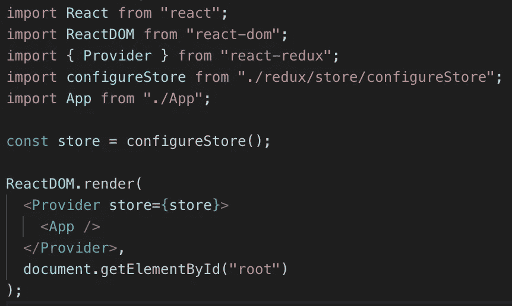

main.js

这里我们有五个导入。前两个是针对 React 的，所以我们不会费心讨论它们，第五个导入只是我们的`App`组件。第三和第四个进口是我们将重点关注的。第三个入口，`Provider`基本上是我们 Redux 商店的入口(我们之前谈到过的东西)。实际上，这种工作方式还有更多的内容，因为我们需要选择哪些组件可以访问我们的商店，但是我们稍后将讨论这种工作方式。

正如您将看到的，我们用一个`<Provider>`组件包装了我们的`<App/>`组件。从上面的截图中你还会注意到一件事，那就是我们的`Provider`得到了一个商店道具，我们在变量`store`中传递了这个道具。你会看到我们的第四个导入，`configureStore`实际上是一个我们已经导入的函数，然后将它的输出返回给我们的`store`变量，如下:`const store = configureStore();`。

现在这个`configureStore`基本上，你可能已经猜到了，是我们的商店配置。这包括我们想要传入的初始状态。这是一个实际上由我们自己创建的文件，稍后我们将对此进行更详细的讨论。简而言之，我们的 **main.js** 文件导入我们的存储，并用它包装我们的根`App`组件，从而提供对它的访问。

不幸的是，需要更多的样板文件，所以让我们向前一步，看看我们的根`App`组件中的附加代码:

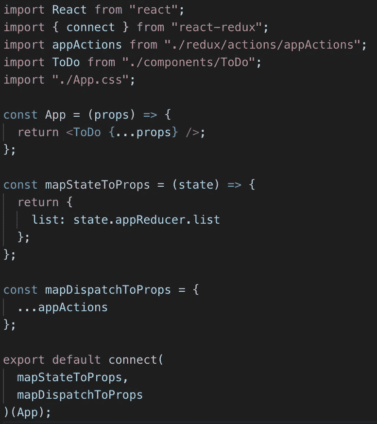

所以我们有另一个包含五个导入的文件。第一个是 React，第四个是 React 组件，第五个是 css 文件，所以我们不要再讨论这些了。还记得我说过，我们如何为组件提供对商店的访问，还有更多内容吗？这就是我们的第二个导入，`connect`开始发挥作用的地方。

如果你看上面截图的底部，你会看到我们没有导出我们的`App`组件，而是导出了`connect`，这基本上是一个 curried 函数。curried 函数基本上是一个返回另一个函数的函数。`connect`在这里所做的基本上是获取`mapStateToProps`和`mapDispatchToProps`的内容——我们稍后将讨论这两个内容——然后获取我们的`App`组件并将`mapStateToProps`和`mapDispatchToProps`的内容添加到其中，最后返回添加了新功能的`App`组件。原来如此，但是那些`mapStateToProps`和`mapDispatchToProps`的内容是什么呢？

嗯，`mapStateToProps`从我们的存储中获取状态，并将其作为道具传递给我们连接的`App`组件。在这种情况下，我们给它一个`list`的键，因为它遵循了我们在商店内部给它的命名约定(稍后会有更多介绍)。不过我们不需要遵循这个约定，我们可以随意命名它——无论如何，`list`是我们在应用程序中想要访问州的特定部分时所引用的名称。现在你会看到`mapStateToProps`是一个以`state`为参数的函数。在这种情况下，`state`基本上就是我们的`store`对象(稍后会详细介绍)。但是作为参考，如果我们把一个`console.log('store', store)`放在`mapStateToProps`里面，就像这样:

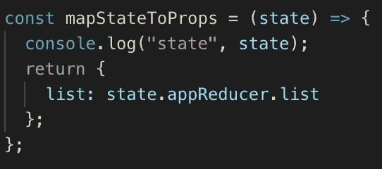

这是输出结果:

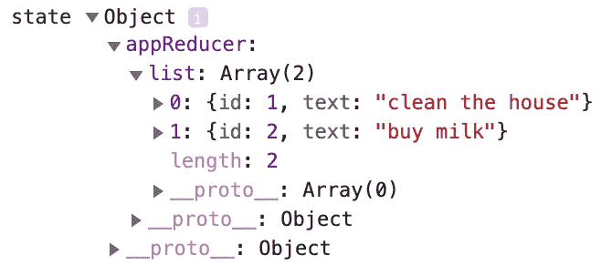

记住这一点，我们基本上只是访问我们的`store`的某些部分，并且我们通过 props 将这些部分附加到我们的`App`——在这种情况下，我们可以从控制台中看到我们的状态是一个名为`appReducer`的对象，其中包含一个`list`数组。因此，我们通过我们的`mapStateToProps`函数将它附加到我们的`App`组件，该函数返回一个键为`list`值为`state.appReducer.list`的对象。起初这一切看起来有点陌生和冗长，但希望这有助于分解这里正在发生的事情。

那么`mapDispatchToProps`呢？这将我们带到我们的 **App.js** 文件中的第三个导入，即`appActions`。这是我们创建的另一个文件，我们稍后将深入研究它。现在，我们只需要知道`mapDispatchToProps`是一个普通的对象，它接受我们将要创建的**动作**，并将它们作为道具传递给我们连接的**应用**组件。在 Redux 术语中，**分派**指的是*分派一个动作*，这基本上是我们在执行一个函数的一种花哨说法。所以`mapDispatchToProps`有点像说 mapFunctionsToProps，或者 mapActionsToProps。然而，React 文档称之为 mapDispatchToProps，所以我们在这里将坚持这个命名约定。

这里我想注意的一点是，在一个典型的大型 React 应用程序中，我们的`mapStateToProps`函数可能在返回的对象中有许多不同的键/值对。这也可能来自 Redux 应用程序中的**商店**的各种不同的**减速器**，因为如果需要，您可以拥有商店的访问点。同样的情况也适用于`mapDispatchToProps`，从某种意义上来说，虽然我们的 simple To Do 应用程序只有一个文件来管理我们的操作——`appActions`——一个更大的应用程序可能有几个文件来管理特定于应用程序某些部分的操作。你的`mapDispatchToProps`文件可以从不同的地方获取动作，然后将它们作为道具传递给你的`App`组件。同样，如何选择编写应用程序完全取决于您自己。

我们已经看了从 Redux 溢出到我们的根文件中的主要样板文件，现在让我们看看在我们的 **Redux** 文件夹中发生了什么，在最后看一下我们如何在我们的 React 子组件中把所有这些放在一起(这里我指的是不是根 **App.js** 组件的任何东西)。

## Redux 文件夹

这里有很多东西需要打开。在我们开始之前，让我们再看一下我们的应用程序的文件结构:

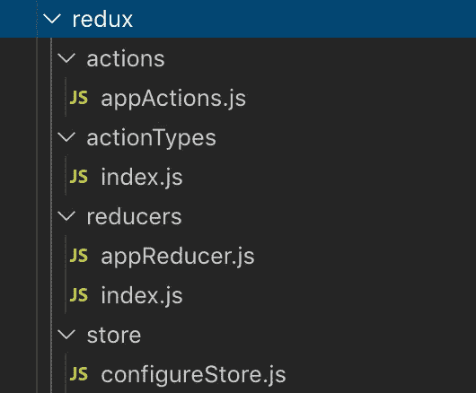

我们将按照上面截图中文件出现的顺序来解决这个问题:

## 行动


actions/appActions.js

如果我们记得前面的话，我们的 **appActions** 文件就是我们导入到 **App.js** 文件中的文件。这包含了从我们的应用程序中携带数据(也称为有效载荷)的函数。对于我们的待办事项应用程序，我们需要三项功能:

1.  保存输入数据的能力
2.  添加项目的能力
3.  删除项目的能力

现在，第一个功能——*保存输入数据的能力*——实际上将在我们的 **ToDo** 组件内部进行本地处理。我们本可以选择以“Redux 方式”来处理这种情况，但我想证明，如果在您看来这样做没有意义，那么并非所有事情都必须通过 Redux 来处理。在这种情况下，我想简单地在组件级别处理输入数据，同时用 Redux 在中央级别维护实际的待办事项列表。因此，让我们来看看另外两个必需的功能:添加和删除条目。

这些函数只需要一个有效载荷。对于添加新的待办事项，我们需要传递的有效负载很可能是新的待办事项。因此，我们的函数最终看起来像这样:

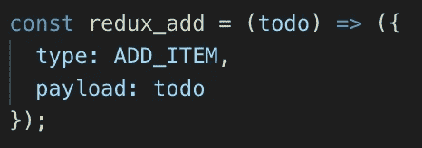

appActions.js

我们在这里看到，这个函数接受一个我选择调用的参数`todo`，并返回一个有`type`和`payload`的对象。我们将`todo`参数的值分配给`payload`键。现在，正如您可能从上面的截图中注意到的，这里的`types`实际上是从我们的 **actionTypes** 文件夹中导入的变量，但是更多的是关于动作类型的。

我们也有`redux_delete`功能，将`id`作为其有效载荷，以便我们附带的减速器知道要移除哪个待办事项。最后，我们有一个`appActions`对象，它将我们的`redux_add`和`redux_delete`功能作为关键字和值。这也可以写成:

```
const appActions = {
    redux_add: redux_add,
    redux_delete: redux_delete
};
```

如果那样对你更有意义。我还想知道这里使用的所有命名，比如`appActions`和我们函数的前缀`redux_`不是要求，它只是我自己的命名约定。

## 操作类型

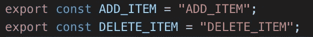

actionTypes/index.js

现在你可能还记得我之前提到过，有一种方式，我们的减少者和行动者知道如何相互作用——这是通过使用**类型**。我们的**减速器**也将访问这些相同的**动作类型**。正如您所看到的，这些只是变量，其名称与分配给它的字符串相匹配。

这一部分并不完全必要，如果您愿意，您可以避免完全创建这个文件和模式。然而，我们这样做是作为 Redux 的最佳实践，因为它为我们所有的**动作类型**提供了一个中心位置，这减少了我们需要更新的地方。考虑到我们的**减速器**也将使用这些，我们可以确信名称总是正确的，因为我们总是将它们从一个地方拉进来。说起**减速机** …

## 还原剂

这里有两个部分:我们的 appReducer 和我们的 rootReducer。在较大的应用程序中，您可能会有许多不同的减压器。这些都将被拉入您的 rootReducer 中。在我们的例子中，考虑到我们应用程序的小尺寸，我们本可以用一个减速器来处理这个问题。然而，我选择在这里保留两个，因为您可能会以这种方式操作。哦，这里的名字是我的惯例——你可以随便叫你的减速器。

让我们看看我们的**评估器**。

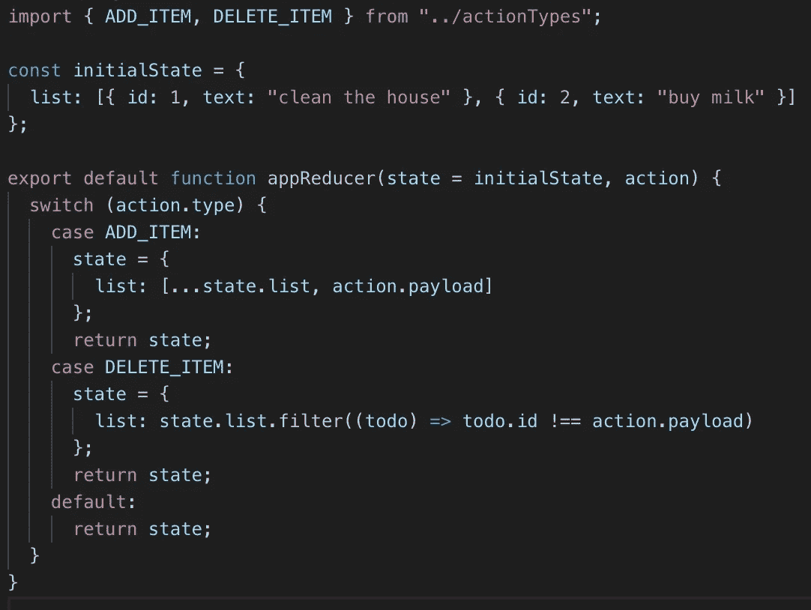

reducers/appReducer.js

我们看到的第一件事是，我们正在导入与我们的**动作**相同的**动作类型**。下一位是我们的`initialState`变量，它是我们的状态。这是我们将用来初始化我们的商店，以便我们有一些初始状态开始。如果你不需要任何初始状态，你可以在你自己的项目中选择一个空对象——同样，这取决于对你的项目起作用的任何东西。

下一位是我们的`appReducer`函数，它有两个参数:第一个是一个`state`参数，它是我们想要开始的状态。在我们的例子中，我们使用默认参数将第一个参数默认为我们的`initialState`对象。这阻止了我们进一步传递任何东西。第二个参数是我们的`action`。现在，每当我们的`appActions.js`文件中的一个函数被触发时，这个`appReducer`函数就会被触发——我们稍后会看到这些函数是如何被触发的，但现在只需知道这些函数最终会在我们的 **ToDo.js** 文件中结束。总之，每次这些函数中的一个被触发时，我们的`appReducer`会运行一系列的`switch`语句来找到与传入的`action.type`相匹配的语句。为了了解被触发的数据是什么样的，让我们用`console.log` 表示`action`，如下所示:

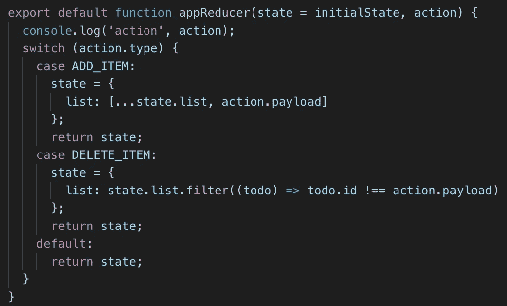

现在，在我们的应用程序中，假设我们创建了一个新的待办事项，在输入框中输入“拿出垃圾”并按下+按钮。执行此操作时，我们会在控制台中看到以下内容:

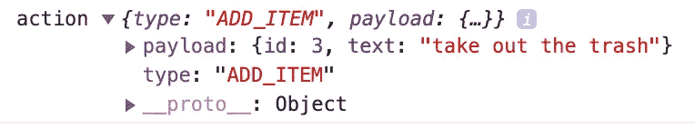

现在除了有效载荷，我们可以看到我们的`action`有一个`"ADD_ITEM"`的`type`。这与我们的`switch`语句中的`ADD_ITEM`变量相匹配:

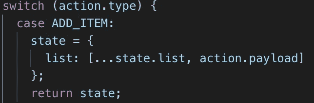

当有匹配时，它执行这个，这基本上告诉我们的存储它的新状态应该是怎样的。在这种情况下，我们告诉我们的存储，状态现在应该等于一个`list`数组，它包含`list`数组以前的内容，以及我们传入的新的`payload`，如果我们再看一下控制台中记录的内容:


现在记住，`action`承载有效载荷——这部分由我们在 **appActions.js** 中看到的**动作**处理。我们的**减速器**拾取**动作**并根据哪个`action.type`匹配进行处理。

现在让我们来看看我们的 **rootReducer** :

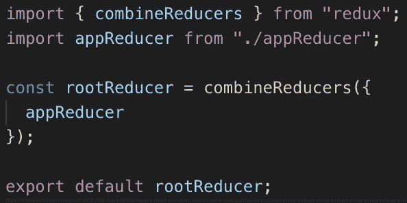

reducers/index.js

我们的第一个进口货是`combineReducers`。这是一个 Redux helper 函数，它基本上收集了所有不同的 reducers，并将它们转换成一个对象，然后可以将该对象传递给我们的`store`中的`createStore`函数，稍后我们将对此进行介绍。第二个导入是我们之前创建和讨论的`appReducer`文件。

如前所述，我们并不真的需要这一步，因为我们的应用程序相当简单，但我决定出于学习目的保留这一步。

## 商店

让我们来看看我们的 **configureStore.js** 文件:

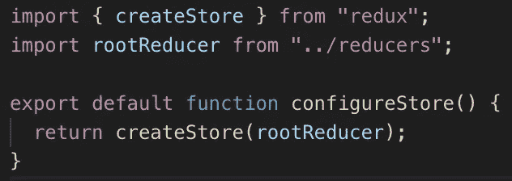

store/configureStore.js

这里的第一个导入是`createStore`，它保存了应用程序的完整状态。只能有一家**店**。你可以有许多有自己`initialState`的减速器。理解这里的区别很重要，基本上你可以有许多提供某种形式状态的**还原器**，但是你只能有一个**存储器**从你的**还原器**中获取所有数据。

这里的第二个导入是我们的`rootReducer`，我们之前已经介绍过了。您将看到创建了一个名为`configureStore`的简单函数，它将我们的`createStore`导入作为一个函数返回，该函数将我们的`rootReducer`作为其唯一的参数。

同样，这是我们可以跳过的，只需在我们的根`index.js`文件中创建存储。相反，我将它保存在这里，因为您可能会发现自己为您的**商店**做了很多配置。这可以从设置中间件到启用额外的 Redux 开发工具。这种情况很常见，但如果现在就讨论这些就太过分了，我已经从`configureStore`中删除了这个应用不需要的任何东西。

好了，现在我们已经在我们的 **Redux** 文件夹中设置好了一切，并且我们已经将 Redux 连接到我们的 **index.js** 文件和我们的根 **App.js** 组件。现在怎么办？

# 在我们的应用中触发 Redux 功能

我们现在在最后冲刺阶段。我们已经设置好了一切，我们连接的组件可以通过`mapStateToProps`访问我们的商店，通过`mapDispatchToProps`访问我们的动作，就像`props`一样。我们像平常在 React 中一样访问这些道具，但仅供参考:

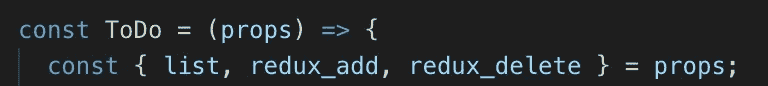

ToDo.js

这三个道具和我们传入的是一样的:`list`包含我们的`state`，而`redux_add`和`redux_delete`是我们的添加和删除函数。

然后我们只在需要的地方使用它们。在我们的例子中，我维护了我在我们的 *vanilla* React 应用程序中使用的相同函数，除了不是使用来自`useState`钩子的某种`setList()`函数在本地更新状态，而是使用所需的有效负载调用我们的`redux_add`或`redux_delete`函数。让我们来看看:

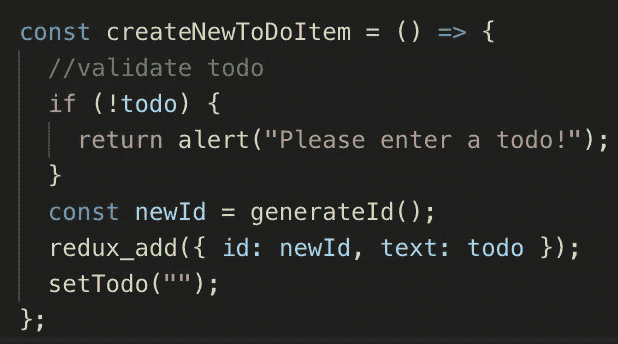

Adding items

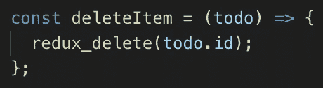

Deleting items

让我们用我们的`deleteItem`函数来回顾导致应用程序状态更新的每一步。

`redux_delete`从我们想要删除的待办事项中获取 ID。

如果我们看一下我们的 **appActions.js** 文件，我们会看到我们传入的 ID 变成了我们的`payload`的值:

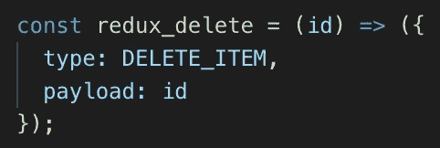

appActions.js

然后我们在我们的 **appReducer.js** 文件中看到，无论何时在我们的`switch`语句中命中`DELETE_ITEM`类型，它都会返回我们状态的一个新副本，其中过滤掉了来自有效负载的 ID:

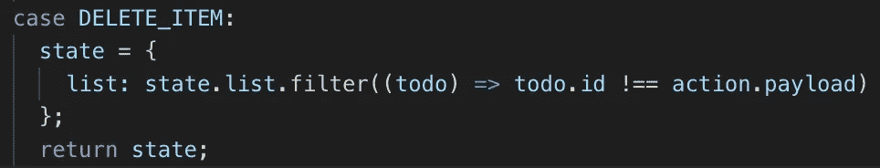

appReducer.js

随着新状态的更新，应用程序中的 UI 也会更新。

# 这就是 Redux！

我们已经了解了如何将 Redux 添加到 React 项目中，如何配置存储，如何创建携带数据的动作，以及如何创建更新存储的 reducers。我们还研究了如何将我们的应用程序连接到 Redux，以便能够访问我们的所有组件。我希望你已经发现这很有用，并且已经更好地理解了一个应用程序如何使用 Redux。

## 但是等等，刚刚用的 app that 呢？我以为这是个比较品？

我们的目标是创建一个功能与 React 完全相同的应用程序。然而，在写这篇文章时，很明显需要花很多时间来解释 Redux 是如何工作的，所以它最终变成了 Redux 的初学者指南，演示如何将 Redux 添加到现有的 React 应用程序中。现有的有问题的 React 应用程序已经在这里审查过了: [**我创建了与 React 和 Vue 中创建的完全相同的应用程序。这里是差异**。](https://medium.com/javascript-in-plain-english/i-created-the-exact-same-app-in-react-and-vue-here-are-the-differences-2019-edition-42ba2cab9e56)所以请随时查看，这样您就可以自己查看不同之处。

## 你是否考虑过使用 Redux 挂钩来帮助简化一些代码？

我确实做了！事实上，我写了一篇关于这个主题的文章——我强烈建议你继续阅读，找出如何减少 React-Redux 的一些样板文件:[https://medium . com/JavaScript-in-plain-English/how-I-Redux-app-by-using-Redux-hooks-b19c 926419 ea](https://medium.com/javascript-in-plain-english/how-i-reduced-the-amount-of-code-in-my-redux-app-by-using-redux-hooks-b19c926419ea)

# Github 链接到两个应用程序:

react ToDo:[https://github.com/sunil-sandhu/react-todo-2019](https://github.com/sunil-sandhu/react-todo-2019)

redux ToDo:[https://github.com/sunil-sandhu/redux-todo-2019](https://github.com/sunil-sandhu/redux-todo-2019)

如果您对本文中使用的样式感兴趣，并想制作您自己的等效作品，请随时这样做！👍