# 我用 Jest，Enzyme，Testing Library 和 Cypress 测试了一个 React app。以下是不同之处。

> 原文：<https://javascript.plainenglish.io/i-tested-a-react-app-with-jest-testing-library-and-cypress-here-are-the-differences-3192eae03850?source=collection_archive---------0----------------------->

## 最后，对最流行的 React 测试工具进行并行代码比较。请看我们试图用 Jest、Enzyme、Testing Library 和 Cypress 编写完全相同的测试。

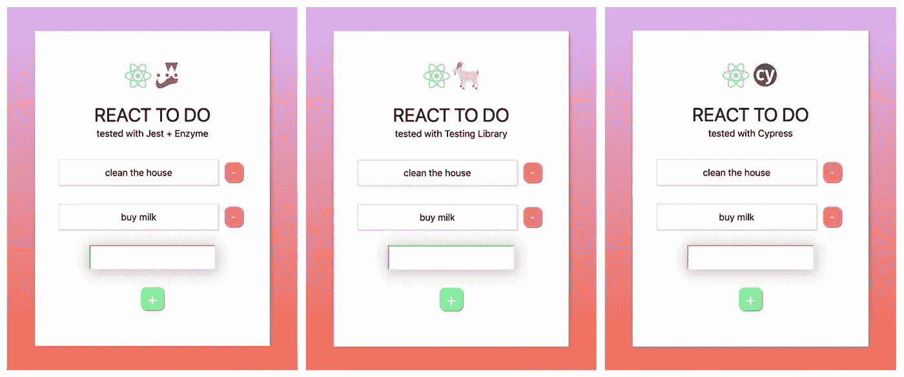

Jest vs Testing Library vs Cypress: The results of the tests are in!

## 您可能知道知道如何测试您的代码很重要。

许多技术领域的工作需要至少一个测试工具/框架/库的测试知识。

在这里，我们将向您展示如何使用三种不同的工具编写测试，这样您不仅可以看到它们之间的差异，还可以开始理解如何使用每种工具编写测试，并形成您自己的观点，在某些情况下哪种工具可能比另一种工具更好。

我们将从我以前的一篇文章中选取 React To Do 应用程序— [**我在 React 和 Vue 中创建了完全相同的应用程序。下面是不同之处**](https://medium.com/javascript-in-plain-english/i-created-the-exact-same-app-in-react-and-vue-here-are-the-differences-2019-edition-42ba2cab9e56)**——并将使用 **Jest、**测试其所有核心功能，这是由脸书(他也创建了 React)创建的测试工具、**测试库**(以前的 React 测试库)，这是 React 文档中实际推荐使用的工具，以及 **Cypress** ，这是一个 e2e 测试工具(稍后将详细介绍这意味着什么)。**

***注意:你通常会听到这些测试工具被称为测试库，但是我想试着明确区分测试库和* ***测试库*** *。因此，当我们提到小写的测试库时，我们称它为测试工具。***

## **什么是玩笑？**

**根据他们的网站，*“Jest 是一个 JavaScript 测试框架，旨在确保任何 JavaScript 代码库的正确性。它允许你用一个平易近人的、熟悉的、功能丰富的 API 来编写测试，并快速给出结果。Jest 有很好的文档记录，需要很少的配置，并且可以扩展以满足您的需求。”***

**现在，为了用 Jest 进行测试，我们还选择了一个叫做 Enzyme 的工具。根据他们网站的说法，Enzyme 是一个*“React 的 JavaScript 测试工具，可以更容易地测试 React 组件的输出”*。所以在这里，我们使用它来呈现我们的应用程序及其组件，以便 Jest 可以在上面运行测试。Enzyme 还为我们提供了在测试中模拟事件的能力，比如点击和输入等等。Jest 和 Enzyme 一起使用是很常见的，所以我决定在这里做同样的事情，以便为您提供更广泛的工具。**

## **什么是测试库？**

**根据他们的网站，“Testing Library 系列库是一个非常轻量级的测试解决方案，不需要所有的实现细节。它提供的主要实用工具包括查询节点，类似于用户查找节点的方式。通过这种方式，testing-library 有助于确保您的测试让您对 UI 代码充满信心。”他们的哲学是“*你的测试越像你的软件被使用的方式，他们就能给你越多的信心”。***

## **柏树是什么？**

**根据他们的网站，Cypress 是一个端到端(e2e)“为人类建造的测试运行程序”，测试“易于阅读和理解”，可以在你的浏览器中运行，“以你的浏览器可以呈现的速度运行”。最后，Cypress 提供了“可读的错误消息，帮助你快速调试”。你可能已经注意到了，我从网站上找不到很好的文本，但是我不得不从他们的页面上挑选句子。**

## **两者有什么区别？**

**我在这里应该提到的一个关键区别是 Jest 和测试库通常是您可能会提到的单元测试和集成测试库，而 Cypress 通常用于端到端(e2e)测试。这意味着您将从头到尾测试您的应用程序，就好像您是一个使用您的应用程序的用户一样(包括所有的点击和页面导航等等)。**

**这并不是说你不能为 e2e 使用 Jest 和测试库，或者你不能为单元和/或集成测试使用 Cypress。您甚至会发现，您决定采用一种混合的方法，并且在您的测试中使用不止一种工具。当谈到你认为什么是最好的解决方案时，这真的取决于你。**

## **在我们查看测试之前，让我们快速回顾一下我们的 React To Do 应用程序，并列出我们将测试的所有功能。**

**我们有三个文件: **App.js** 、 **ToDo.js、**和 **ToDoItem.js** 。**

****App.js** 只是我们的根组件，它呈现了我们的 **ToDo.js** 。 **ToDo.js** 是我们的主文件，处理我们所有的应用程序逻辑——把它想象成我们的待办事项应用程序的大脑。默认情况下，我们的待办事项应用有两项。这些被映射到 **ToDoItem.js** ，这意味着我们最终在 **ToDo** 组件中呈现了两个 **ToDoItem** 。**

**如果你对检查代码感兴趣，这里有一个没有测试的回购链接:[https://github.com/sunil-sandhu/react-todo-2019](https://github.com/sunil-sandhu/react-todo-2019)。**

## **我们将测试什么？**

**我们将测试我们的应用程序是否能够做到以下几点:**

1.  **不崩溃地渲染**
2.  **呈现两个默认待办事项**
3.  **呈现用于键入新待办事项的输入字段**
4.  **呈现用于添加待办事项的“添加”按钮**
5.  **如果按下“添加”按钮，但输入字段为空，则阻止创建新的待办事项**
6.  **如果按下“添加”按钮，但输入字段为空，则向用户显示警告**
7.  **如果按下“添加”按钮并且输入字段有内容，则添加新的待办事项**
8.  **当按下单个待办事项的“删除”按钮时，从应用程序中删除该待办事项**
9.  **在 ToDo 的两个默认项目中，如果第一个 ToDo 项目已经从应用程序中删除，第二个项目现在应该成为第一个(也是唯一的)项目。**
10.  **对于作为道具从 ToDo 传递到 ToDoItem 的数据，每个 ToDoItem 都应该呈现传递给它的文本。**
11.  **每个 ToDoItem 应呈现一个“删除”按钮。**

**对于一个相当简单的应用程序，我们至少要进行 11 次测试。这应该给我们一个很好的介绍，让我们了解每个测试工具，看看他们如何处理这些。让我们快速看一下这三个应用程序的文件结构。**

**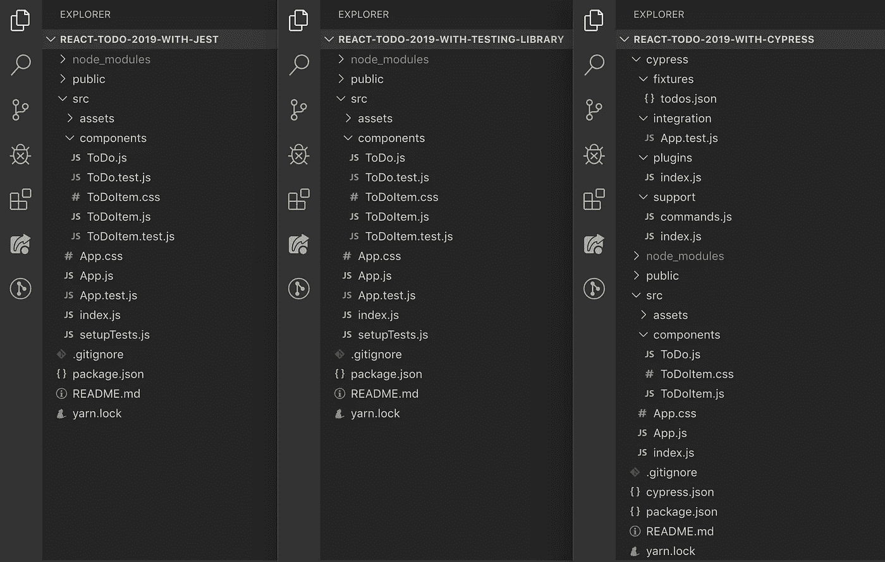**

**我想指出的一点是，我们已经使用创建-反应-应用程序(CRA)来引导我们的反应应用程序。这意味着它默认安装了 Jest。我们不会把它从我们的设置中删除，因为 Jest 实际上在更多的地方会派上用场，而不仅仅是在 Jest 设置中。当然，如果你愿意，你可以把它完全去掉。**

# **玩笑**

**让我们再来看看我们的文件结构:**

**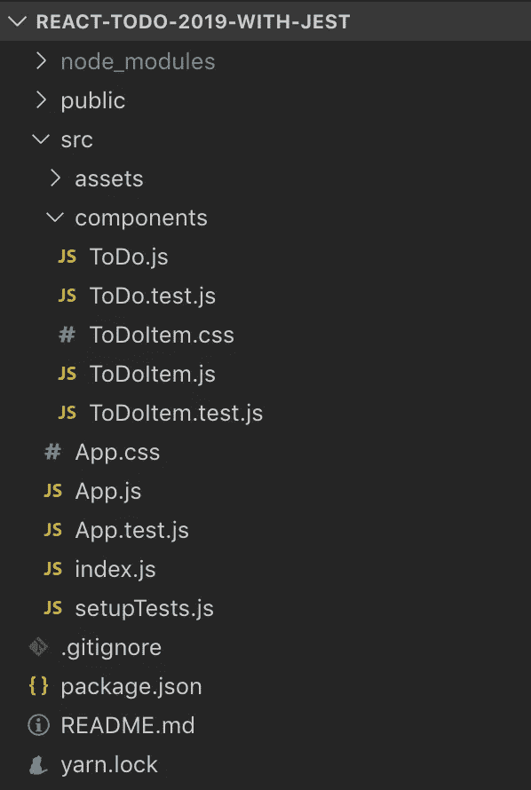**

**我们在这里可以看到，我们的 Jest 设置中有三个测试文件: **App.test.js** 、 **ToDo.test.js** 和 **ToDoItem.test.js** 。现在我想注意的第一件事是把这些文件放在它们的**旁边。js** 同行没必要。如果我们愿意，我们可以把这些都放在一个名为 **Tests** 的文件夹中。这是因为 **create-react-app** 设置为自动搜索文件名中包含 **.test.js** 的任何文件，因此它们可以放在任何地方。对于如何命名和放置它们，还有其他的选择，但是我们在这里不再深入讨论。这同样适用于**测试库**和 **Cypress** 设置。**

**无论如何，让我们来看看我们的一个 Jest 测试，这样您就可以预览语法是什么样子了:**

**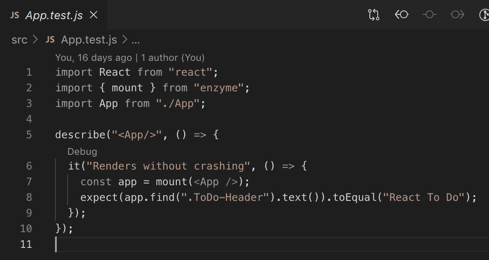**

**App.test.js, tested with Jest**

**稍后我们将详细讨论这一切意味着什么。**

**现在，如果你回头看看我们之前附上的显示 Jest 应用程序的文件夹/文件结构的截图，你可能会记得在 **src** 文件夹中看到一个名为 **setupTests.js** 的文件。让我们花点时间解释一下这个文件的用途。**

## **setupTests.js**

**这个文件基本上是向我们的测试环境发出信号，要求在任何**测试**文件中包含这个代码。这个设置是不必要的，因为我们可以将它添加到每个**测试**文件中。然而，本着保持代码干燥的精神，我们选择创建这个文件。需要注意的一点是，我们不必告诉我们的应用程序去获取这个文件，因为 **create-react-app** 已经有了一个内部设置，可以在 **src** 目录中查找这个文件。在我们的例子中，我们只需创建文件并添加以下代码行:**

**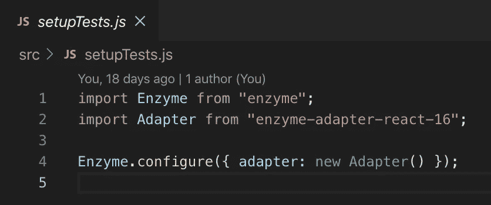**

**这基本上引入了酶和一个适配器，使酶可以与最新版本的 React 一起使用。然后我们通过添加`Enzyme.configure`函数来设置它。这不是我自己创造的东西，而是从酶网站上的文档中获得的。**

# **测试库**

**让我们再看一下我们的文件结构，然后我们将进入每个文件并回顾正在发生的事情:**

**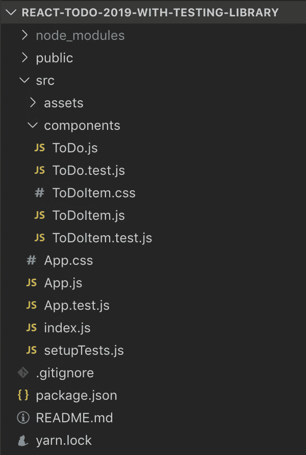**

**对于测试库，您可以看到我们有与 Jest 完全相同的文件结构。这意味着我们有三个测试文件， **App.test.js** 、 **ToDo.test.js** 和 **ToDoItem.test.js** 。**

**和 Jest 一样，让我们看一下我们的一个测试库测试文件，这样您就可以预览语法的样子:**

**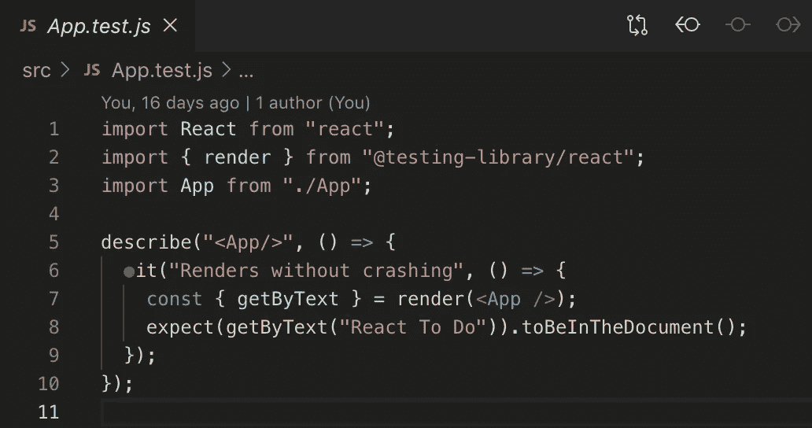**

**App.test.js, tested with Testing Library**

**和 Jest 一样，我也无法在这些截图中包含所有的测试，因为有些文件有很多行。但是我想在这里展示的是这些文本中使用的语言(或者说是语法)。**

**现在你可能会注意到，测试库的设置与 Jest 非常相似。在测试库的情况下，它实际上使用并扩展了 Jest 的`expect()`断言的功能。**

**我想指出的是，虽然我们已经允许测试库在我们的设置中包含 Jest 的部分，但你不必使用 Jest 测试库。我们选择它是因为我们的 **create-react-app** 已经默认捆绑了 Jest。**

**我们还使用了一个 **setupTests.js** 文件。这个文件的目的与 Jest 相同，但是让我们花一点时间来解释一下我们在这个文件中包含了什么。**

## **setuptests.js**

**正如我们的 Jest 设置一样，我们选择通过创建这个文件来保持代码尽可能的干燥。**

**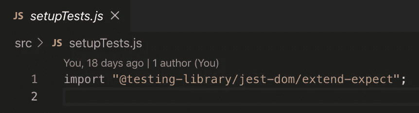**

**如您所见，它只有一行代码，从测试库包中导入一个模块，扩展了`expect`断言的功能。这使得我们能够使用像`toBeInTheDocument()`这样的东西作为我们断言的一部分。**

**这符合测试库的测试方法，即模拟用户如何使用你的应用程序/网站。用户并不关心一个应用程序/网站是如何实现的，而是关心它是否做了它应该做的事情。因此，如果我们使用我们提到的最后一个断言，用户会关心某些元素是否出现在页面上。如果元素意味着"*在文档"*中，我们用`toBeInTheDocument`进行测试。**

**你会从测试库中的测试文件中看到，我们正在从`”@testing-library/react”`导入一个`render`函数。这基本上相当于我们在 Jest + Enzyme 设置中使用了`mount`函数。**

**Jest 和 Testing Library 的一个关键区别在于，Testing Library 的查询标准基于必须添加到组件元素中的`data`标签。例如，如果我想获取一个特定的 input 元素，我不会通过寻找一个`input`元素来获取它，或者甚至是我们的`input`元素正在使用的一个特定的类。相反，我们会给我们的`input`元素添加一个`data-testid`标签。然后它看起来像这样:**

```
<input
**data-testid=”todo-input”** type=”text”
value={toDo}
onChange={handleInput}
onKeyPress={handleKeyPress}
/>
```

**然后在我们的 **ToDo.test.js** 文件中，我们将通过编写`getByTestId(“todo-input”)`来查询它。**

**测试库遵循由`data-testid`查询的哲学的原因是因为这些 id 在应用程序的生命周期中通常不会改变，因此，您的测试不会因为某个类名的改变而变得脆弱和容易被破坏。现在，我们实际上可以通过添加`data-testid`并通过它们进行查询来遵循 Jest 中相同类型的模式。如果我们这样做，我们的测试可能看起来像这样:**

**`app.find(“[data-testid=’ToDoInput’]”)`**

**公平地说，如果使用任何测试工具，这很可能是一个鼓励采用的模式，因为`data-testid`属性比 css `className`更不容易改变。所以，如果你用 Jest 或者其他工具编写测试，请记住这一点。现在我们将继续通过对 html 元素或类进行分类来测试 Jest(和 Cypress ),但是请注意，根据数据属性抓取是更好的实践。**

# **柏树**

**让我们再看一下我们的文件结构，然后我们将进入每个文件并回顾正在发生的事情:**

**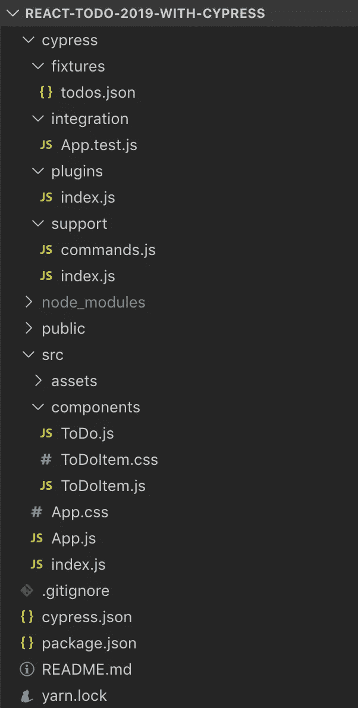**

**Cypress 和其他两个测试工具的最大区别是 Cypress 有自己的文件夹来处理测试文件。因此，我们没有单独的 **test.js** 文件用于 App、ToDo 和 ToDoItem，而是有一个文件 **App.test.js** ，它位于 **integration** 文件夹中。**

**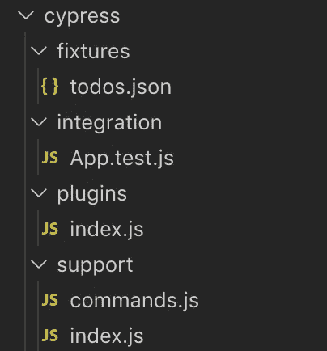**

**cypress/integration/App.test.js**

**因为 Cypress 用于端到端(e2e)测试，所以我们在设置中只需要一个文件。这是因为 Cypress 有效地打开了一个浏览器并运行了所有需要的测试。我们可以用三个独立的文件来完成这个任务，但是这意味着我们必须运行三个独立的 e2e 测试。这仍然可行，但不是最佳的方法。**

***注意:Cypress 提供了其他功能，比如一个****fixtures****文件夹，它将是我们存储模拟数据的地方。我们也可以选择在* ***支持*** *文件夹中扩展 Cypress 的功能。我们的测试不需要这些，所以我们不会在这里讨论它们。***

**与 Jest 和测试库一样，让我们看一下我们的 Cypress 测试文件，这样您就可以预览语法的样子:**

**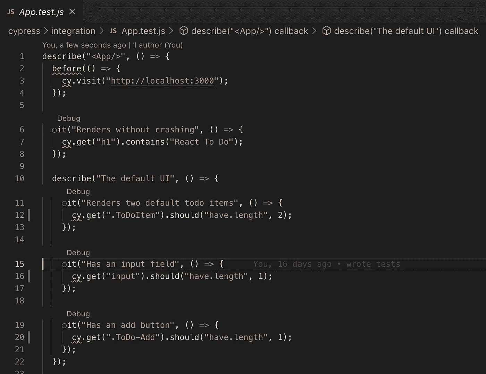**

**App.test.js, tested with Cypress**

**注意:与 Jest 和 Cypress 相比，我们在这里展示了更多的预览。这不是故意的。这仅仅是因为我们将所有的测试都放在一个文件中，所以截图最终显示了更多的测试结果。**

## **我们所有的测试都使用了`describe()`块和 it()函数**

**你会从我们所有例子的测试中注意到一个相似之处，那就是它们都遵循相同的模式，每个测试都有一个包含一些`it()`语句的`describe()`块。还有其他方法来构建这些，比如使用`test()`而不是`it()`，但是我们选择了这种方法，因为它通常是最常见的，这意味着我们可以更好地构建我们的测试，使它们看起来尽可能地相似。**

## **总之，到目前为止，我们已经讨论了很多东西，我们还没有真正地并排回顾测试。**

**因此，让我们一步一步地了解我们想要测试的每个标准，看看每个测试工具是如何处理它的。**

# **1.渲染时不崩溃。**

**这通常被称为“冒烟测试”,我们只是确保我们的应用程序不会抛出错误，并且实际上按照预期加载。在这种情况下，您可能会看到人们检查我们的组件是否返回长度 1。我真的不喜欢那些考试，因为它们不够有表现力。因此，我选择检查我们的待办事项应用程序的标题标签是否已经呈现。**

## **玩笑**

**这里我们创建了一个名为`app`的变量，并将其设置为`mount()`函数，该函数接收导入到同一个文件中的`App`组件。请注意，我们通过将组件作为`<App/>`传入，将组件作为 React 组件传入。**

**然后我们在 Jest 中使用`find()`函数，它的工作方式与 JavaScript 中的`querySelector`基本相同。但是我们没有写像`document.querySelector`这样的东西，而是写了`app.find`，因为`app`已经被分配给了我们的`<App/>`组件。您会注意到，我们将`text()`链接到它上面，它基本上从该元素返回文本。最后，我们检查它是否等于`"React To Do”`。这是区分大小写的，所以在我们的例子中，每个单词的大写字母的使用是至关重要的，因为这就是我们的待办事项应用程序。**

## **测试库**

**这里我们使用对象析构从我们的`render()`函数中捕获`getByText`的值，它已经被导入到文件中。这类似于 Jest 中使用的`mount()`函数。还有许多其他的值出现在`render()`函数中，但是对于这个测试，我们只需要`getByText`值。这基本上是从我们用来搜索的任何东西中抓取所有文本，在这个例子中，是我们的应用程序组件。**

**和 Jest 一样，我们已经导入了我们的`App`组件，然后用尖括号将它传递给我们的`render()`函数，这意味着`App`是作为`<App/>`传递的。在上面代码片段的第 4 行，你会看到我们将`"React To Do"`作为`getByText()`函数的参数传入。**

**最后，我们链接到它上面，`toBeInTheDocument()`。正如您可能已经猜到的，这将检查传入的值是否存在于文档中。**

## **柏树**

**这里我们从输入`cy`开始，这有点类似于在 jQuery 中使用`$`美元符号。在赛普拉斯，我们从`cy`开始所有的测试。然后我们使用`get()`，这类似于在 JavaScript 中使用`querySelector`。然后我们链接到它上面`contains()`，它接受一个参数。然后检查`h1`是否包含我们传入的参数— `"React To Do"` —在本例中是`React To Do`。**

**您可能还注意到，我们在顶部有一个`before()`函数，它基本上指示 Cypress 在运行任何测试之前先做这件事。 **App.test.js** 内的所有其他测试都位于主`describe()`程序块内的`describe()`程序块内。在一个文件中有多个`describe()`块并不是必需的——这实际上取决于您选择的测试的表达方式。**

**无论如何，我们实际上有一个根`describe()`块，然后在它里面有更多的`describe()`块。由于这种设置，我们在根`describe()`块中只需要一个`before()`函数。**

**关于 Cypress 另一件值得注意的事情是，因为我们正在测试一个我们正在本地开发的应用程序，它还没有编译。我们必须通过运行`yarn start` / `npm run start`来启动 **create-react-app** 的服务器。这必须在运行任何测试之前首先完成，否则 Cypress 将尝试访问 **localhost:3000** 并且那里什么也没有。**

**我们本可以在代码中添加另一个步骤，让 Cypress 为我们处理这个问题，但是在本文中我们选择了反对。**

# **2–4.呈现两个默认 ToDo 项；呈现用于键入新待办事项的输入字段；呈现用于添加待办事项的“添加”按钮。**

## **玩笑**

**Jest**

**这里我们使用了与之前类似的功能，但是使用了`length`来检查这里的长度。这与 JavaScript 中检查数组长度的方式相同。你会注意到我们在第一次测试中使用了`toBe`，但是在第二次和第三次测试中使用了`toEqual`。**

**通常对于我们上面使用的例子，我们只需要使用严格相等的`===`来检查`toBe`就可以了。因为我们处理的是原语，所以这应该没问题。当我们想要检查像对象这样的东西的深度相等时，我们通常会使用`toEqual`。在这里，我选择使用两者，这样您就可以知道两者都存在——并且两者都仍然可以处理数字和字符串等原语。**

****测试库****

**Testing Library**

**您在这里可以看到，我们的第一组测试与前面的测试库示例中使用的测试非常相似。然而，在第二次和第三次测试中，你会看到我们使用了一个`getByTestId`变量。这就是我们开始使用测试库最佳实践的地方，即将`data-testid`属性附加到我们计划测试的应用程序中的所有元素上。因此，在这些例子中，我们的应用程序中的元素看起来像这样:`<input data-testid=”todo-input”/>`和`<button data-testid=”add”/>`。**

**我们的`getByTestId`也是这样工作的，所以基本上就是一个`querySelector`。正如你所看到的，我们用和前面例子一样的方式使用`toBeInTheDocument()`。**

## **柏树**

**Cypress**

**这里你会看到我们从`cy.get()`开始每个测试，这和我们之前做的一样。在这些测试中，我们用`should()`链接每一个。这允许我们在代码中进行断言。你会看到在每个内部，有两个参数被传递。每个的第一个参数是`"have.length"`。当我们需要第二个参数时，我们使用`have.`，所以在我们的例子中，我们使用像`cy.get('.ToDo-Item').should('have.length', 2)`这样的东西。这是因为我们的应用程序默认呈现两个待办事项，所以页面上应该有两个带有`ToDo-Item`类的元素。**

**此外，我们的`should()`函数还有另一个选项，只需要一个参数。这是当我们不需要检查某个特定的值时，比如当我们检查我们的元素是否有特定的长度时。如果我们不需要传入一个值进行比较，而只是想检查某件事是真是假，我们可以考虑使用`be`。一个例子可能是类似`cy .get(‘h1’).should(‘be.visible’)`的东西，我们只是想检查 h1 标签在页面上是否可见，并且没有被 css 隐藏。**

# **5–7.如果按下“添加”按钮，但输入字段为空，则阻止创建新的待办事项；如果按下“添加”按钮，但输入字段为空，则向用户显示警告；如果按下“添加”按钮，并且输入字段有内容，则添加一个新的待办事项。**

## **玩笑**

**这里有三个新的东西需要回顾-`afterAll()`、`jest.fn()`和`simulate()`。奇怪的是，我们将按相反的顺序讨论这些问题。在上面代码片段的第 9 行，您将看到我们查询我们的应用程序，找到一个类别为`.ToDo-Add`的添加按钮。然后，我们链接上`simulate()`功能。这是我们可以从酶获得的东西。这允许我们模拟诸如点击和输入输入等事件。它接受参数，在我们的例子中，我们传入`"click"`。正如您所料，这模拟了点击我们的按钮，为我们的应用程序添加新的待办事项。**

**因为我们的应用程序有两个默认项目已经开始，我们对我们的应用程序说，我们仍然期望这是 2，即使点击添加按钮。其原因是，如果输入字段为空，我们的应用程序不允许添加新项目。我们的应用程序没有添加新项目，而是通过浏览器中的本机警报功能向用户显示警报。这就把我们带到了第二个我们想研究的新事物——T9。**

**Jest 允许我们模仿函数。这通常是当我们想要覆盖我们的应用程序的典型行为时，这可能是出于各种原因，从避免昂贵和/或缓慢的操作，如从 API 或数据库获取数据，到替换否则在我们的测试环境中不可用的函数，如位于浏览器窗口中的`alert()`函数。这里我们通过编写`window.alert = jest.fn()`来替换原生函数。这实际上阻止了我们的测试在遇到这一点时中断，因为它会因为缺少一个窗口而中断——结果是没有了`alert()`功能。**

**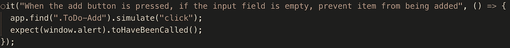**

**然后，您将看到下一个测试检查现在作为`window.alert`的函数是否已经被调用。这里我们用`toHaveBeenCalled()`。如果我们需要检查这个函数是否被调用了不止一次，那么这个方法是有变化的。**

**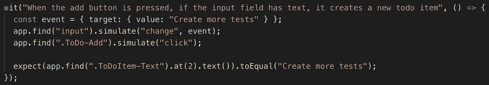**

**这里我们再次使用了`simulate()`函数，但是在这种情况下，我们使用`"change"`作为第一个参数。这与在 React 中检查`onChange`事件的方式是一样的，对于输入字段的改变也是如此。您会注意到，我们创建了一个名为 event 的变量，并传入一个键为`target`的对象，该对象的值是另一个键为`value`的对象的值`"Create more tests"`。这是为了模仿抓取输入字段的`event`对象时`event`对象的典型外观。**

**无论如何，我们将那个`event`变量作为第二个参数传递给我们的`simulate()`函数。之后，我们模拟一个点击事件。最后，我们用一个类`".ToDoItem-Text"`获取第三个元素——它的索引为零，为 2——并检查它是否等于我们之前传入的事件文本的值，即`"Create more tests"`。**

**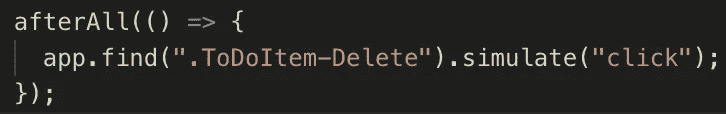**

**我们想要解释的第三个新特性是`afterAll()`函数。这基本上是在一个`describe()`块中的所有测试结束时运行的。我们运行这个只是为了将测试环境中待办事项的数量恢复为 2，这是默认的数量。我们通过找到第一个带有`".ToDoItem-Delete"`类的元素，并点击它来实现。这不是完全必要的，但我选择这样做。如果我们想更精确，我们真的想在我们的应用程序中寻找第三个删除按钮，因为这将与我们添加的新项目相对应。为此，我们应该编写如下代码:`app.find(".ToDoItem-Delete").at(2).simulate("click")`。**

## **测试库**

**这里的许多测试运行类似于我们在 Jest 中看到的那些。我们实际上使用 Jest 以完全相同的方式来模仿`window.alert`函数。您还可以看到，我们甚至检查是否通过使用`toHaveBeenCalled()`以相同的方式调用了该函数。这里唯一的变化是我们使用了`fireEvent.click()`而不是`simulate("click")`。您还会注意到，我们将想要点击的元素作为参数传入`fireEvent.click`中。**

**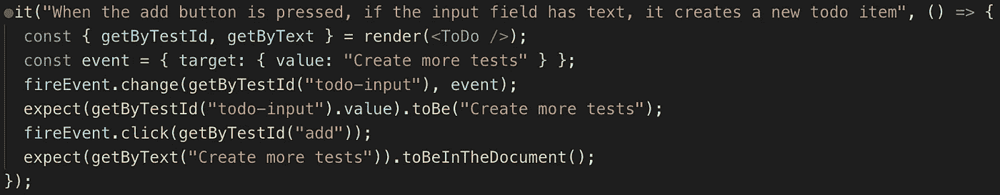**

**添加新项目的测试也与 Jest 的测试非常相似。我们创建了一个`event`变量，使用`fireEvent`来模拟输入字段上的输入变化，将我们的`event`作为第二个参数传入。**

**然后我们检查带有`todo-input`的`data-testid`的元素的值是否与我们的`event`变量的值相匹配。在我们的 Jest 例子中，我们没有这样做，我打算把它去掉，但是我会把它留在里面。**

**最后，我们单击在应用程序中添加新待办事项的按钮，然后通过`toBeInTheDocument()`检查文档中是否有文本值为`"Create more tests"`的元素。这个检查与我们之前检查输入值的测试不同，因为`getByText`寻找包含文本的 DOM 节点，而我们的输入 DOM 节点不包含文本，而是包含一个`event`对象。我们可以通过简单地注释掉测试中单击“add”按钮的行来测试这一声明的有效性，如下所示:**

**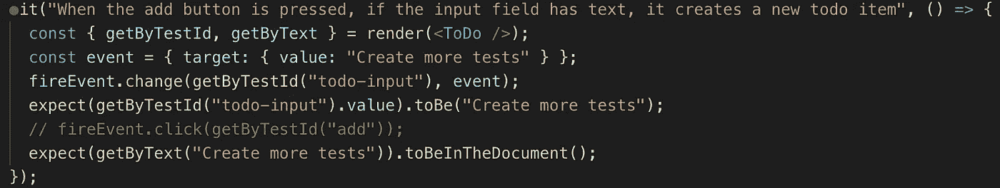**

**并检查我们的测试是否仍然通过——它没有通过。**

## **柏树**

**我们这里处理事情的方式完全不同。同样，这是因为我们的测试是在浏览器内部运行的。首先我们`get()`我们的添加按钮，它有一个类`".ToDo-Add"`并且通过链接`click()`来模拟一个点击事件。然后我们`get()`我们的输入字段，链接一个`type()`函数并传入`"Create more tests"`的值。**

**我们在这里继续链接一个`should()`函数，看看我们的输入字段现在是否有`have.value`的值`"Create more tests"`。同样，这最后一点可能是不必要的，但我保留它是为了测试库，所以我保留它是为了 Cypress。**

**继续，我们再一次`get()`我们的`".ToDo-Add"`按钮，并在上面链上一个`click()`。最后，我们通过在`.ToDo-Item`上运行`get()`函数来检查我们有多少待办事项，并检查它的长度是否为 3——这将是我们的两个默认事项，加上我们刚刚创建的事项。这涵盖了我们需要查看的检查，如果输入字段为空，是否阻止添加待办事项，因为如果没有阻止，我们的`cy.get(“.ToDoItem”).should(“have.length”, 3)`测试将失败，因为它的长度将为 4。**

# **8–9.当按下单个待办事项的“删除”按钮时，从应用程序中删除该待办事项。在 ToDo 的两个默认项目中，如果第一个 ToDo 项目已经从应用程序中删除，第二个项目现在应该成为第一个(也是唯一的)项目。**

## **玩笑**

**这里的测试与之前使用的测试类型相同。您将在这里看到的一个区别是，两个测试中间都链接了一个`first()`。因为有多个元素具有匹配的类名，所以我们可以使用`first()`来获取第一个实例。**

## **测试库**

**这里的一个区别是测试库作为查询项的独立值，类似于 JavaScript 如何使用`querySelector`和`querySelectorAll`。在测试库中我们有`getByTestId`和`queryAllByTestId`。所以我们创建了一个名为`deleteButtons`的变量，并给它赋值`queryAllByTestId`。**

**这里我们检查了待办事项的长度是 2。然后我们通过写`fireEvent.click(deleteButtons[0])`点击索引中的第一个元素。最后，我们检查了待办事项的长度现在是否为 1。**

**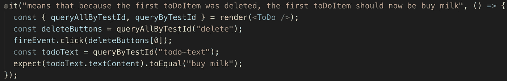**

**之后的测试非常相似。然而，在这种情况下，我们单击第一个“删除”按钮，然后检查第一个待办事项现在是否有值`"buy milk"`。这里的意义在于，这最初是我们的第二个待办事项。实际上，我们正在检查它是否已经从位置 2 移动到位置 1(或者位置 1 移动到位置 0，如果你指的是零索引)。**

## **柏树**

**在 Cypress 中，我们通过使用 CSS 中的`nth-child`选择器来查询条目。所以在这里，我们希望抓住`.ToDoItem-Delete`按钮位置 1 的`nth-child`并`click()`它。然后我们检查我们的`.ToDoItem` s 的位置 1 处的`nth-child`是否包含`"buy milk"`，以确保物品已经从位置 2 移动到位置 1。**

# **10–11.对于作为道具从 ToDo 传递到 ToDoItem 的数据，每个 ToDoItem 都应该呈现传递给它的文本；每个 ToDoItem 应呈现一个“删除”按钮。**

## **玩笑**

**这里我们隔离了我们的`ToDoItem`组件，并创建了一个名为`item`的变量，我们将它作为`ToDoItem`的道具传递给我们的`mount()`函数，如下所示:`mount(<ToDoItem item={item}/>`。**

**你可能会在酵素社区听到一些关于渲染组件时使用`mount()`还是`shallow()`的抱怨。简而言之，`mount()`将呈现该组件中的所有内容，包括子组件等等，而`shallow()`将尝试单独呈现该组件，因此子组件不会被包括在内。**

**我选择一直使用`mount()`,因为我觉得这更接近于你的用户看到你的应用程序 ie 的样子。他们将看到你的应用程序的整体，而不是孤立的组件。**

**无论如何，这里对`ToDoItem.test.js`的测试在这一点上非常简单。我们检查来自我们的`item`道具的文本是否通过书写来呈现:`expect(toDoItem.find(“p”).text()).toEqual(item.text)`。最后，我们检查 ToDoItem 组件是否有一个“删除”按钮。下面是这两种测试的样子:**

**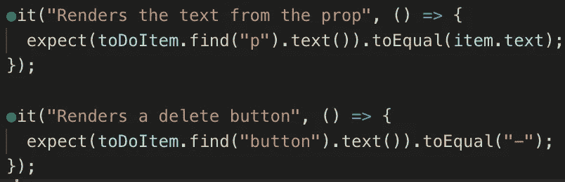**

**Remember that our item variable is an object with a key of text and a value of “Clean the pot”.**

## **测试库**

**至此，您大概可以推断出这些测试是如何工作的。它们也非常类似于那些为笑话而写的。**

## **柏树**

**我们没有这方面的测试。原因是我们在真实的浏览器中运行这些测试，因此，不能以这种方式模拟传递虚拟数据。这并不是一个真正的问题，因为能够在浏览器中直观地看到我们之前的两个待办事项就足以证明我们的数据以正确的格式正确地传递了。**

# **这就是我们想要的🎉**

**我们已经向您展示了如何用三种不同的测试工具编写十多个等价的测试！**

**当谈到测试时，有更多的功能，如处理异步代码、模拟和快照测试，但我希望阅读这篇文章至少让您对 Jest、Testing Library 和 Cypress 之间的差异有了基本的了解。现在至少拿起其中的一个，写一堆测试，并留下评论让我知道你是如何进行的！**

## **有兴趣看看代码吗？**

**以下是回复:**

**笑话:[https://github.com/sunil-sandhu/react-todo-2019-with-jest](https://github.com/sunil-sandhu/react-todo-2019-with-jest)**

**测试库:[https://github . com/sunil-sand Hu/react-todo-2019-with-testing-Library](https://github.com/sunil-sandhu/react-todo-2019-with-testing-library)**

**柏树:[https://github . com/sunil-sand Hu/react-todo-2019-with-cypress](https://github.com/sunil-sandhu/react-todo-2019-with-cypress)**

***更多内容看* [***说白了就是 io***](https://plainenglish.io/) *。报名参加我们的* [***免费周报***](http://newsletter.plainenglish.io/) *。关注我们关于*[***Twitter***](https://twitter.com/inPlainEngHQ)，[***LinkedIn***](https://www.linkedin.com/company/inplainenglish/)***，***[***YouTube***](https://www.youtube.com/channel/UCtipWUghju290NWcn8jhyAw)***，以及*******不和******