# 用这 4 个面试问题提高你的 JavaScript 水平

> 原文：<https://javascript.plainenglish.io/i-use-these-4-questions-to-find-outstanding-javascript-developers-4a468ea17155?source=collection_archive---------0----------------------->

## 准备 JavaScript 面试应该知道的事情。


Photo by [Headway](https://unsplash.com/@headwayio?utm_source=medium&utm_medium=referral) on [Unsplash](https://unsplash.com?utm_source=medium&utm_medium=referral)

JavaScript 是现在非常流行的编程语言，基于它衍生出了大量的库和框架。但无论上层生态系统如何进化，都离不开香草 JavaScript。在这里，我选择了 4 个 JavaScript 面试问题来测试程序员的普通 JavaScript 技能。

# 1.实现 Array.prototype.map

> 如何手工实现一个`Array.prototype.map`方法？

熟练使用数组的内置方法并不困难。但如果只是熟悉语法，不知道原理，就很难真正理解 JavaScript。

对于`Array.prototype.map`,它**创建一个新的数组**,其中填充了调用数组中每个元素的函数的结果。

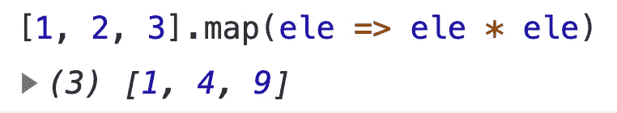

如果我们参考 [lodash](https://github.com/lodash/lodash) ，我们可以写一个这样的映射函数:

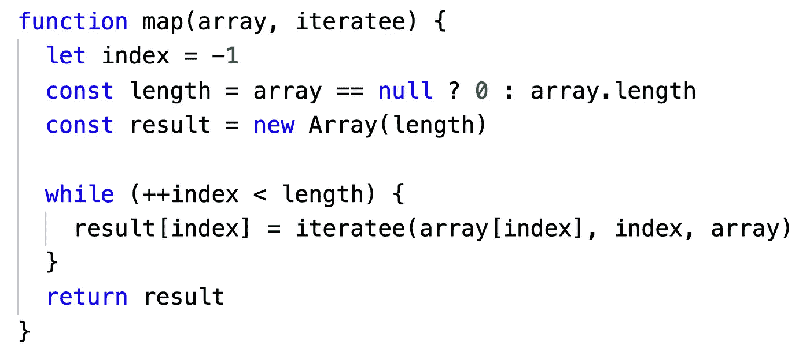

```
function map(array, iteratee) {
  let index = -1
  const length = array == null ? 0 : array.length
  const result = new Array(length) while (++index < length) {
    result[index] = iteratee(array[index], index, array)
  }
  return result
}
```

使用示例:

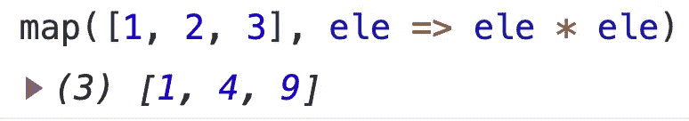

# 2.Object.defineProperty 属性和代理

如何实现这种代码效果？

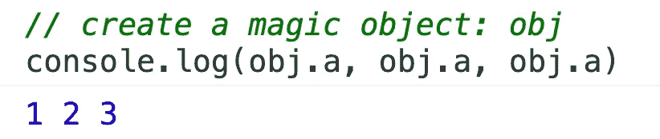

我们可以看到，当我们连续三次尝试打印`obj.a`时，我们会得到三种不同的结果。这看起来多么不可思议！

能否创造一个神秘的物体`obj`来达到这种效果？

事实上，这个问题有三个解决方案:

*   存取器属性
*   对象.定义属性
*   代理人

根据 ECMAScript，对象的属性有两种形式:

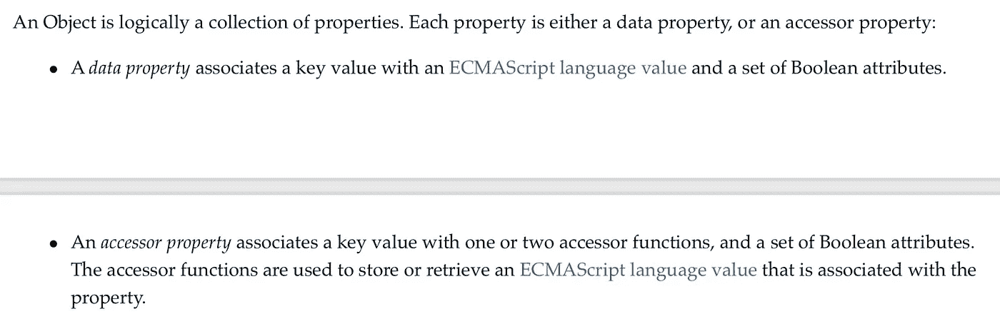

对象在逻辑上是属性的集合。每个属性要么是数据属性，要么是访问者属性:

*   *数据属性*将键值与 ECMAScript 语言值和一组布尔属性相关联。
*   *访问器属性*将一个键值与一个或两个访问器函数以及一组布尔属性相关联。访问器函数用于存储或检索与属性关联的 ECMAScript 语言值。

所谓数据属性就是我们平时写的:

```
let obj = {
  a: 1,
  b: 2
}
```

我们对一个对象的属性只有两个操作:读取属性和设置属性。对于访问器属性，我们使用`get`和`set`方法来定义属性，编写如下:

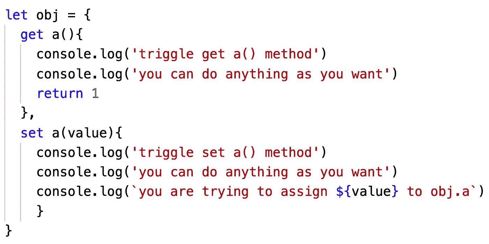

```
let obj = {
  get a(){
    console.log('triggle get a() method')
    console.log('you can do anything as you want')
    return 1
  },
  set a(value){
    console.log('triggle set a() method')
    console.log('you can do anything as you want')
    console.log(`you are trying to assign ${value} to obj.a`)
    }
}
```

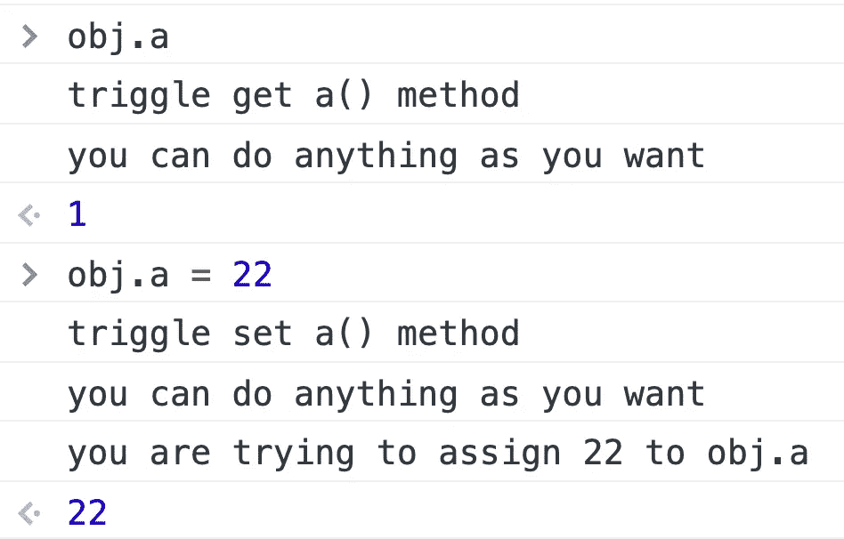

访问属性为我们提供了强大的元编程能力，因此我们可以通过以下方式完成我们的需求:

```
let obj = {
  _initValue: 0,
  get a() {
    this._initValue++;
    return this._initValue
  }
}console.log(obj.a, obj.a, obj.a)
```

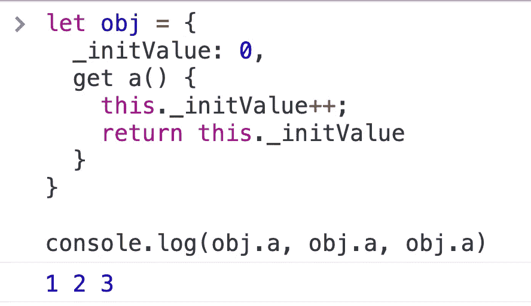

第二种方法是使用`Object.defineProperty`，它的工作方式与我们过去访问属性的方式相同，只是我们不是直接声明访问属性，而是通过`Object.defineProperty`配置访问属性。

这使用起来更灵活一点，所以我们可以这样写:

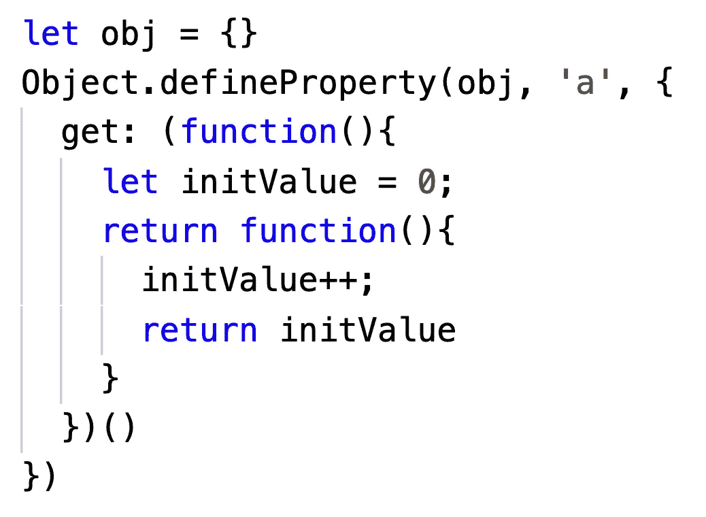

```
let obj = {}
Object.defineProperty(obj, 'a', {
  get: (function(){
    let initValue = 0;
    return function(){
      initValue++;
      return initValue
    }
  })()
})console.log(obj.a, obj.a, obj.a)
```

在这里的`get`方法中，我们使用了一个闭包，这样我们需要使用的变量`initValue`就隐藏在闭包中，不会污染其他作用域。

第三种方法是使用`Proxy`。如果你还不知道代理，你可以参考我之前写的一篇文章:

[](https://medium.com/javascript-in-plain-english/why-proxies-in-javascript-are-fantastic-db100ddc10a0) [## 为什么 JavaScript 中的代理如此神奇

### 4 个实际例子帮助您掌握 JavaScript 的这一强大特性

medium.com](https://medium.com/javascript-in-plain-english/why-proxies-in-javascript-are-fantastic-db100ddc10a0) 

通过代理，我们可以拦截对对象属性的访问。只要我们用代理拦截对 `obj.a`的访问，然后依次返回 1、2、3，就可以完成之前的要求:

```
let initValue = 0;
let obj = new Proxy({}, {
  get: function(item, property, itemProxy){
    if(property === 'a'){
      initValue++;
      return initValue
    }
    return item[property]
  }
})console.log(obj.a, obj.a, obj.a)
```

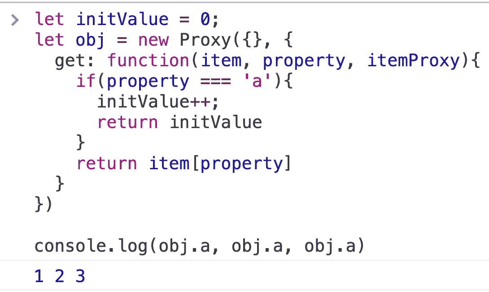

为什么理解这个问题很重要？因为`Object.defineProperty`和代理给了我们强大的元编程能力，我们可以适当地修改我们的对象来做一些特殊的事情。

在知名前端框架 Vue 中，其核心机制之一就是数据的双向绑定。在 Vue2.0 中，Vue 通过使用`Object.defineProperty`实现了这个机制；在 Vue3.0 中，代理是用来完成这个机制的。

如果你不掌握这个，你就无法真正理解像 Vue 这样的框架是如何工作的。掌握了这些原则，学习 Vue 就会事半功倍。

# 3.范围和结束

运行这段代码的结果是什么？

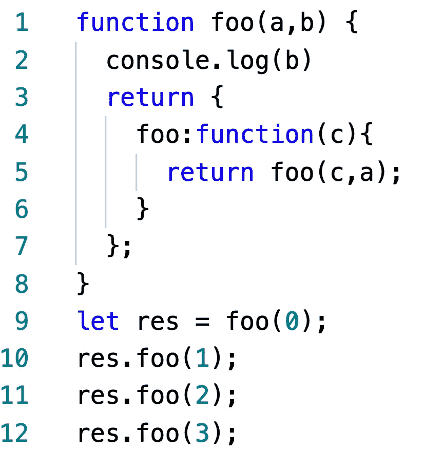

```
function foo(a,b) {
  console.log(b)
  return {
    foo:function(c){
      return foo(c,a);
    }
  };
}let res = foo(0); 
res.foo(1); 
res.foo(2); 
res.foo(3);
```

上面的代码有多个嵌套函数，嵌套函数中同时有三个 `foo`，乍一看非常繁琐。那么我们如何理解这一点呢？

首先，我们先确定一下上面的代码里有多少个函数？我们可以看到上面的代码中有两处使用了关键字`function`，所以上面的代码中有两个函数，分别是第一行`function foo(a,b) {`和第四行`foo:function(c){`。而且这两个函数同名。

第二个问题:第 5 行的`foo (c, a)`调用了哪个函数？如果你不确定，让我们看一个更简单的例子:

```
var obj={
  fn:function (){
    console.log(fn);
  }
};
obj.fn()
```

如果我们运行这段代码，它会抛出异常吗？答案是肯定的。

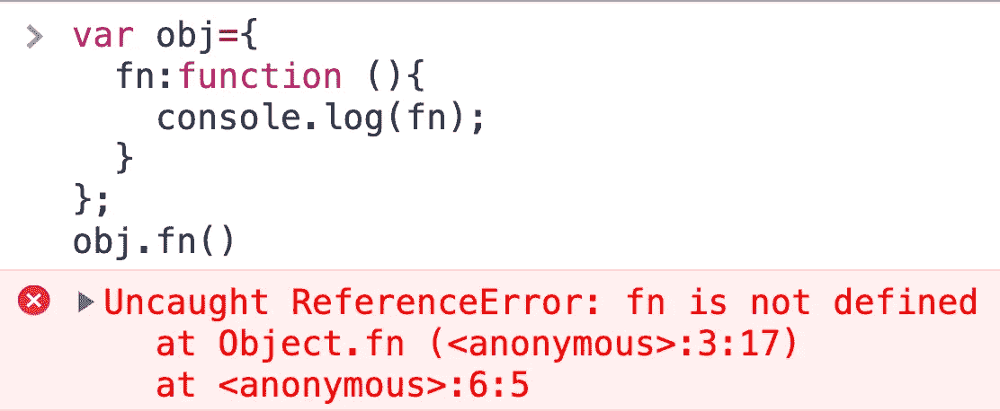

这是因为`obj.fn()`方法的上限范围是全局的，不能访问`obj`内部的`fn`方法。

回到我们之前的例子，按照同样的逻辑，当我们调用`foo(c, a)`时，我们实际上在第一行调用了`foo`函数。

而当我们调用 `res.foo(1)`时，调用的是哪个`foo`？显然，第 4 行的`foo`函数被调用。

因为这两个 foo 函数的工作方式不同，所以我们可以将其中一个函数的名称改为`bar`，以便我们更容易理解代码。

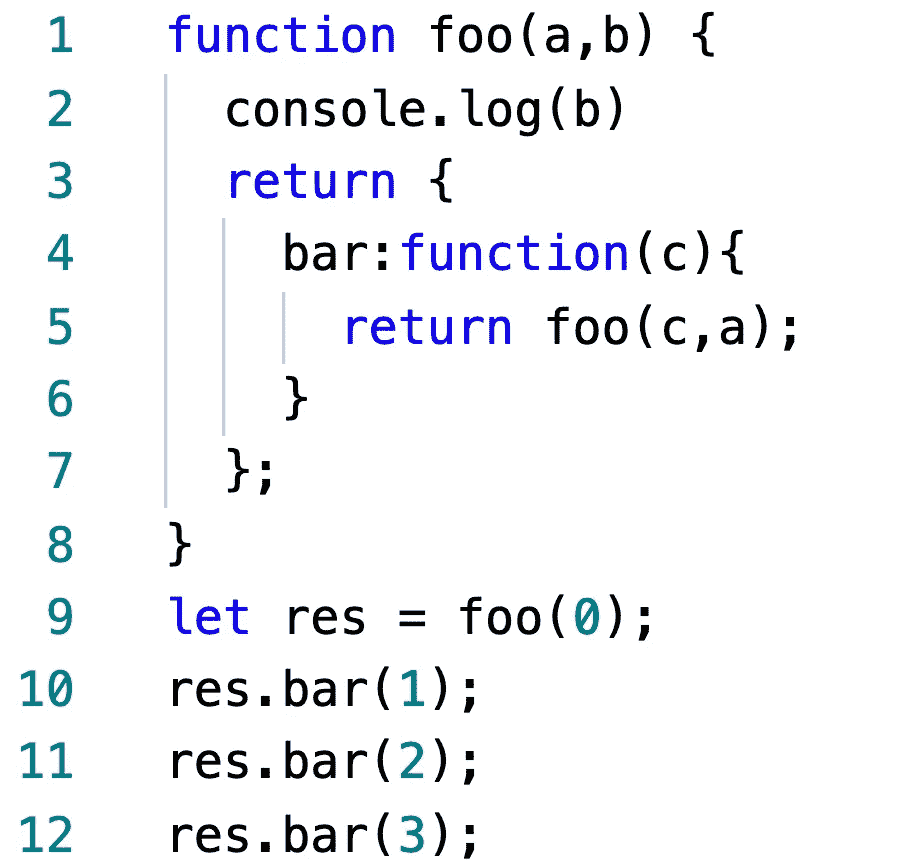

```
function foo(a,b) {
  console.log(b)
  return {
    bar:function(c){
      return foo(c,a);
    }
  };
}let res = foo(0); 
res.bar(1); 
res.bar(2); 
res.bar(3);
```

这种改变不会影响最终的结果，但会让我们更容易理解代码。如果你将来遇到类似的问题，试试这个技巧。

每次调用一个函数，都会创建一个新的作用域，所以我们可以绘制图表来帮助我们理解代码如何工作的逻辑。

当我们执行`let res = foo(0);`时，我们实际上是在执行`foo(0, undefiend)`。此时，程序中创建了一个新的作用域，在当前作用域中，`a=0`，`b=undefined`。所以我画的图表看起来像这样。

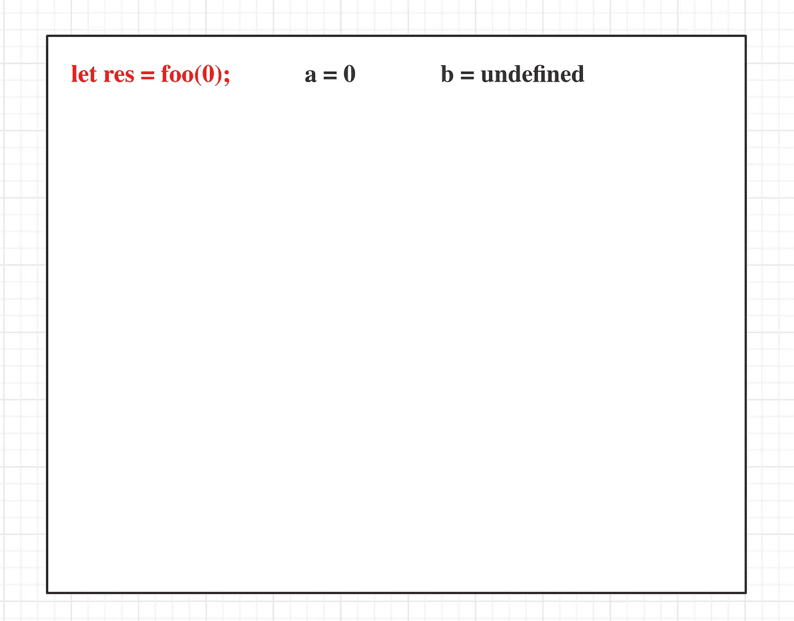

然后`console.log(b)`会被执行，所以它第一次在控制台打印出‘未定义’。

然后执行`res.bar(1)`，创建一个新的作用域，其中 c=1:

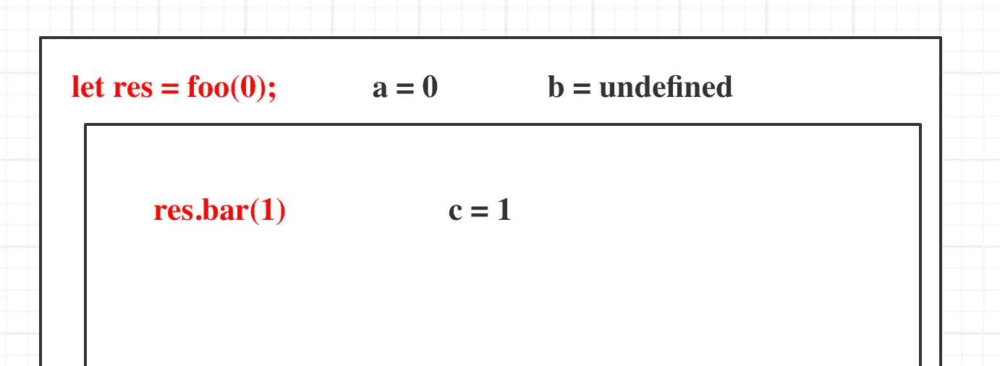

然后从上面的函数中再次调用`foo(c, a)`，实际上是`foo(1, 0)`，作用域看起来是这样的:

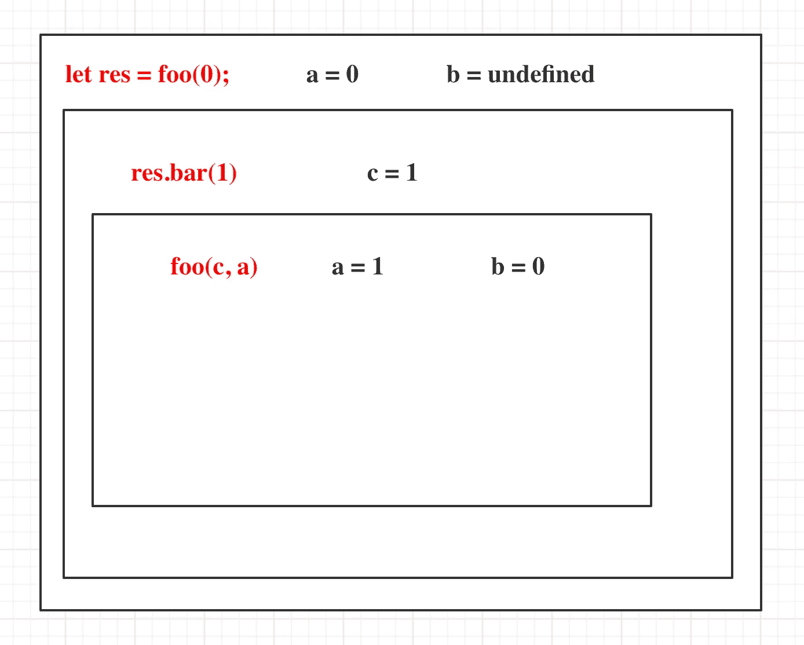

在新的范围中，`a`的值是 1，`b`的值是 0，因此控制台将打印出 0。

接下来再次执行`res.bar(2)`。注意`res.bar(2)`和`res.bar(1)`是平行关系，我们应该这样画范围图:

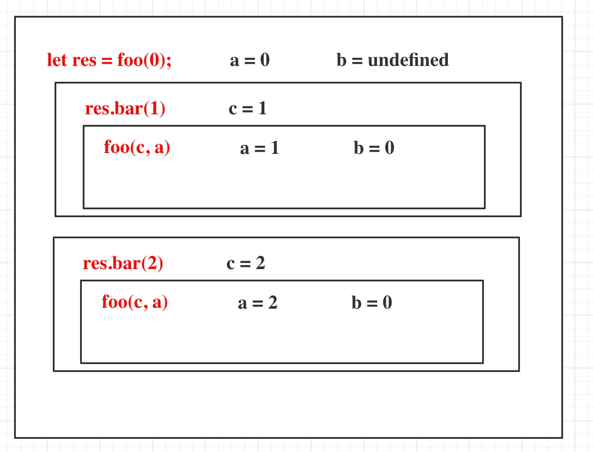

所以在这段代码中，控制台也输出了值 0。

执行`res.bar(3)`的进程也是如此，控制台仍然打印 0。

所以上面代码的最终结果是:

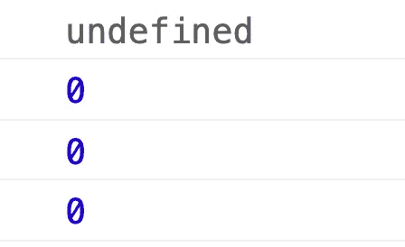

其实上面的问题可以换成其他方式。例如，它可以更改为以下内容:

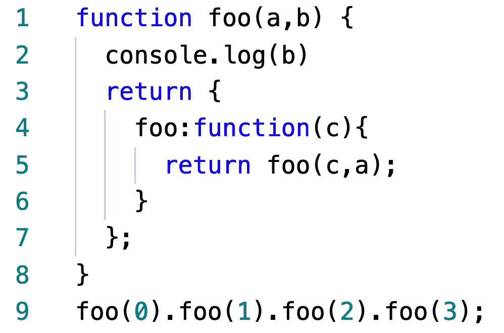

```
function foo(a,b) {
  console.log(b)
  return {
    foo:function(c){
      return foo(c,a);
    }
  };
}foo(0).foo(1).foo(2).foo(3);
```

在我们解决这个问题之前，我们需要做的第一件事是区分这两个不同的 foo 函数，所以上面的代码可以修改成这样:

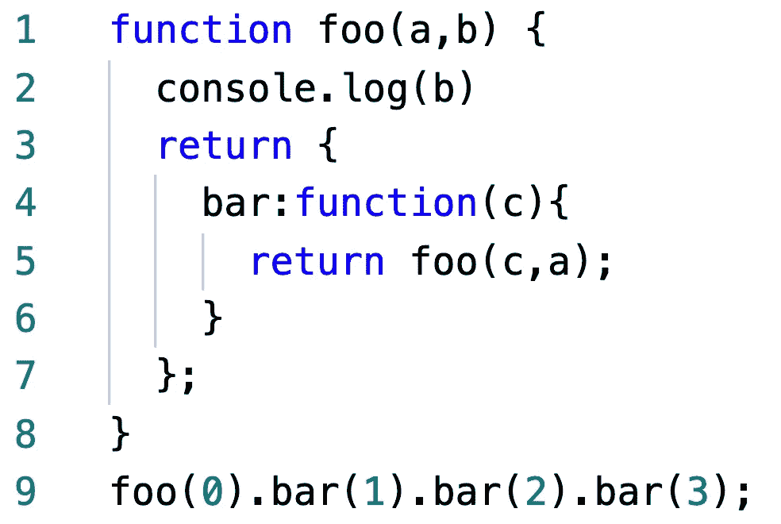

```
function foo(a,b) {
  console.log(b)
  return {
    bar:function(c){
      return foo(c,a);
    }
  };
}foo(0).bar(1).bar(2).bar(3);
```

当它执行`foo(0)`时，作用域和之前一样，然后控制台会打印出‘未定义’。


然后执行`.bar(1)`创建一个新的范围。这个参数 1 其实就是 c 的值。

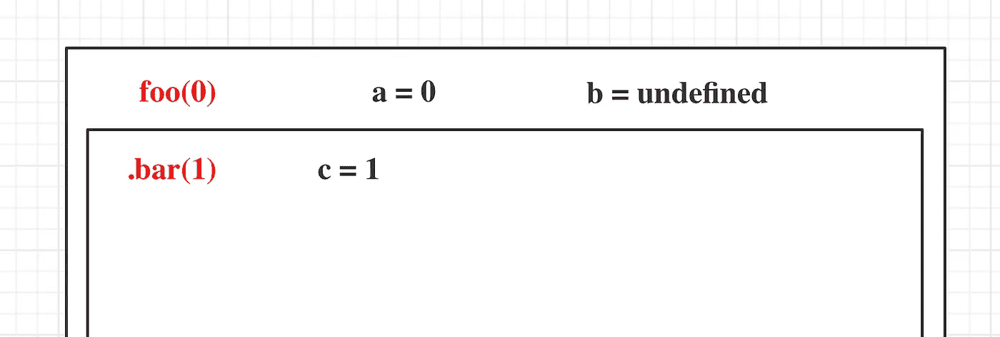

然后`.bar(1)`方法再次调用`foo(c, a)`，其实就是`foo(1, 0)`。这里的参数 1 实际上将是新作用域中`a`的值，而 0 将是新作用域中`b`的值。


所以控制台然后打印出`b`的值，它是 0。

`.bar(2)`再次被调用，新作用域中`c`的值为 2:

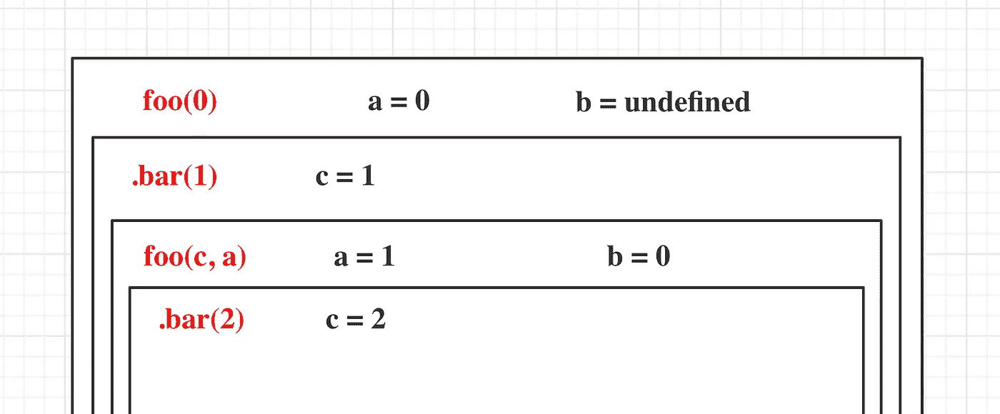

然后`.bar(2)`调用`foo(c, a)`，其实就是`foo(2, 1)`，其中 2 是新范围内`a`的值，1 是新范围内`b`的值。


于是控制台然后打印出`b`的值，也就是`0`。

然后它会执行`.bar(3)`，过程和之前一样，所以我不打算展开描述，这一步控制台打印出 2。

如上所述，代码运行的最终结果是:

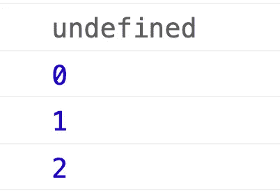

好吧，经过长途跋涉，我们终于得到了答案。这个问题很好地测试了受访者对闭包和作用域的理解。

# 4.构成

假设我们有一个这样的函数:

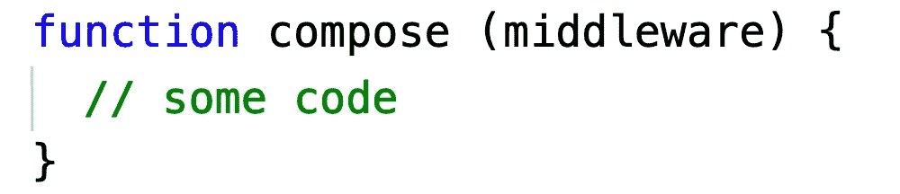

```
function compose (middleware) {
  // some code
}
```

compose 函数接受函数数组`middleware`:

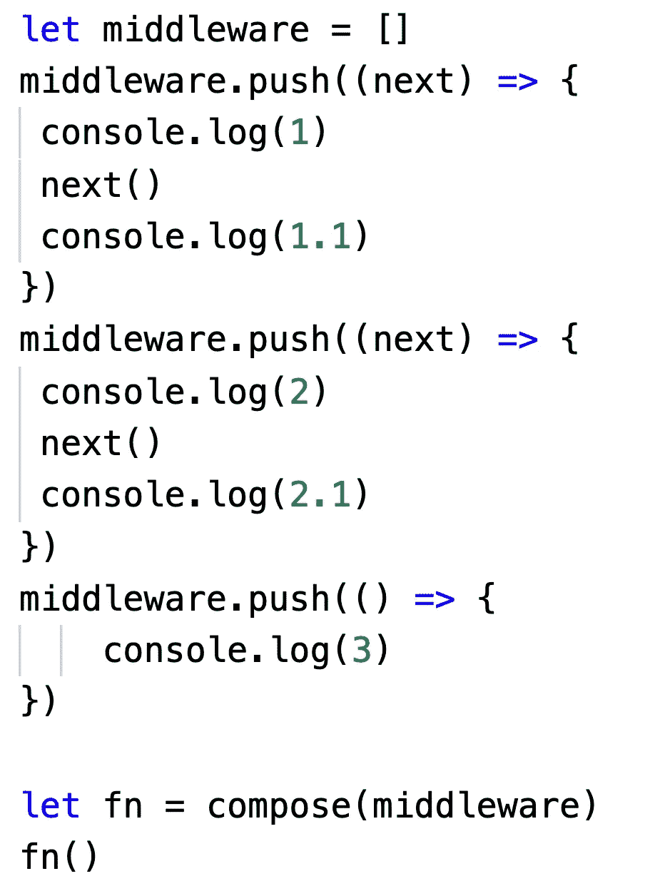

```
let middleware = []
middleware.push((next) => {
 console.log(1)
 next()
 console.log(1.1)
})
middleware.push((next) => {
 console.log(2)
 next()
 console.log(2.1)
})
middleware.push(() => {
    console.log(3)
})let fn = compose(middleware)
fn()
```

当我们试图执行`fn`时，它调用中间件中的函数，并将`next`函数作为参数传递给每个小函数。

如果我们在一个小函数中执行`next`，那么这个函数在中间件中的`next`函数被调用。如果你不执行`next`，程序就不会运行。

执行上述代码后，我们得到以下结果:

```
1
2
3
2.1
1.1
```

那么我们如何编写一个组合函数来完成这个任务呢？

首先，compose 函数必须返回一个组合函数，所以我们可以这样写代码:

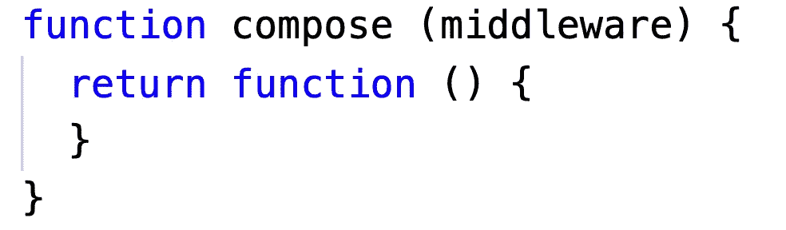

```
function compose (middleware) {
  return function () {
  }
}
```

然后，在返回的函数中，中间件的第一个函数开始执行。我们还将传递`next`函数作为它的参数。所以让我们这样写:

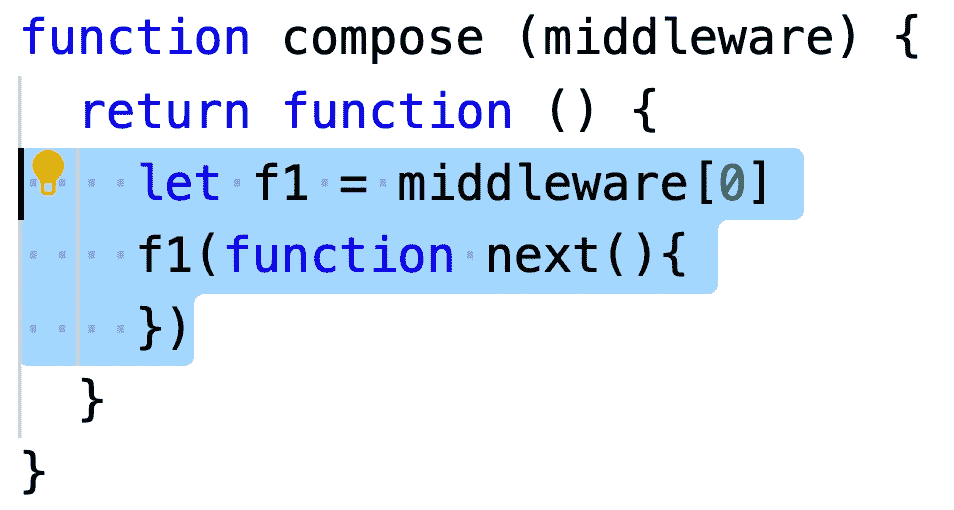

```
function compose (middleware) {
  return function () {
    let f1 = middleware[0]
    f1(function next(){
    })
  }
}
```

下一个函数作为一个开关继续通过中间件，看起来像这样:


```
function compose (middleware) {
  return function () {
    let f1 = middleware[0]
    f1(function next(){
      let f2 = middleware[1]
      f2(function next(){
        ...
      })
    })
  }
}
```

然后继续调用下一个函数中的第三个函数……等等，这看起来像递归！所以我们可以写一个递归函数来完成这个嵌套调用:

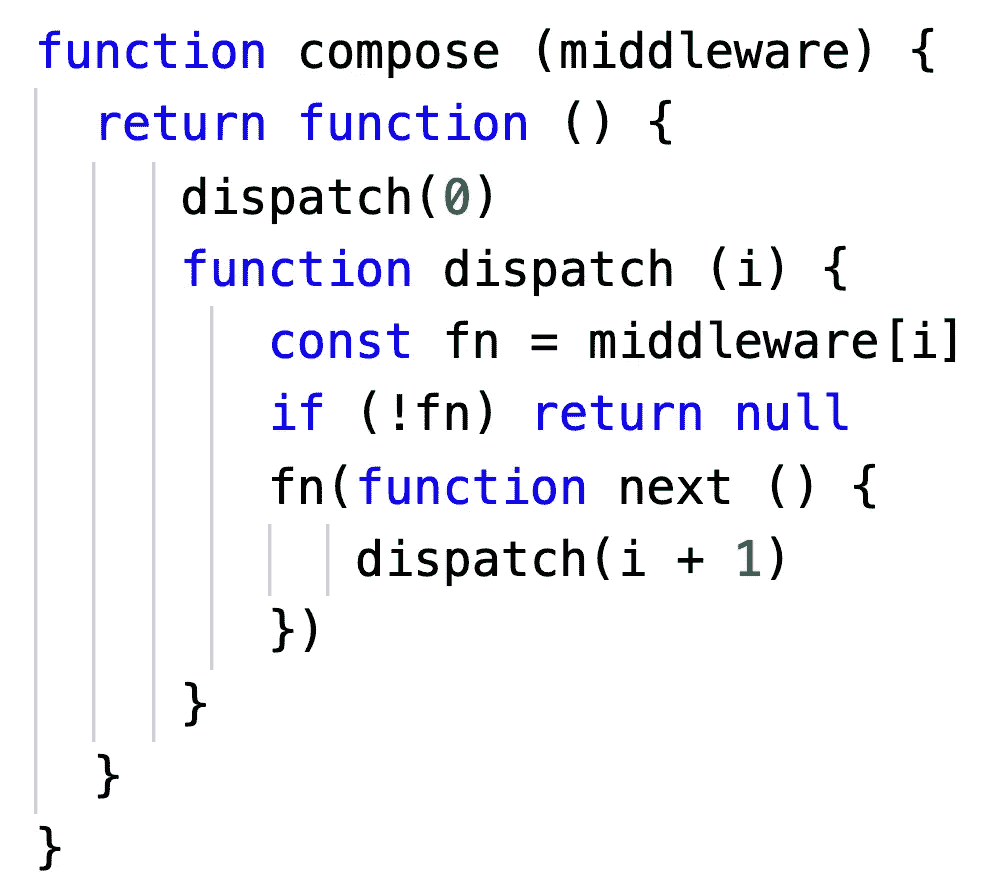

```
function compose (middleware) {
   return function () {
      dispatch(0)
      function dispatch (i) {
         const fn = middleware[i]
         if (!fn) return null
         fn(function next () {
            dispatch(i + 1)
         })
      }
   }
}
```

好了，这就是我们的合成函数，让我们来测试一下:

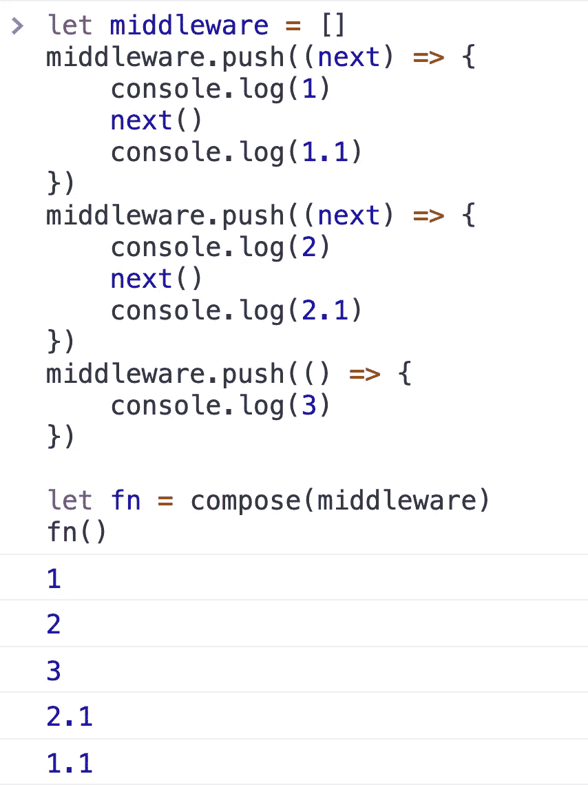

这个函数做了它需要做的事情。但是我们也可以优化我们的组合函数来支持异步函数。我们可以改进以下代码:

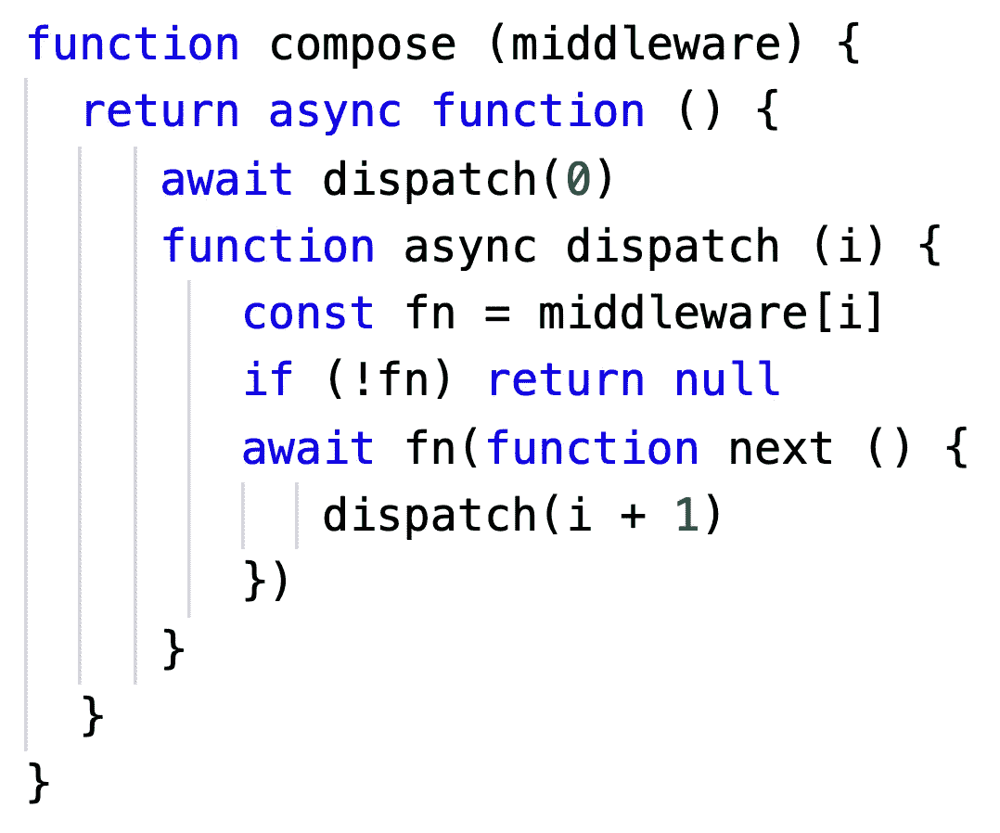

```
function compose (middleware) {
   return async function () {
      await dispatch(0)
      function async dispatch (i) {
         const fn = middleware[i]
         if (!fn) return null
         await fn(function next () {
            dispatch(i + 1)
         })
      }
   }
}
```

实际上，上面的`compose`函数就是众所周知的节点框架 [koa](https://github.com/koajs/koa) 的核心机制。

当我选择一个候选人时，我承认他/她不熟悉某些框架。毕竟，JavaScript 生态系统中有如此多的库和框架，没有人能够全部掌握。但是我确实希望候选人了解这些重要的普通 JavaScript 技巧，因为它们是所有库和框架的基础。

# 结论

其实我的草稿里还有一些其他的面试问题，由于文章篇幅有限，这里就不继续解释了。以后再和你分享。

本文主要讨论普通 JavaScript，而不是浏览器、节点、框架、算法、设计模式等。如果你也对这些话题感兴趣，欢迎发表评论。

感谢您的阅读！