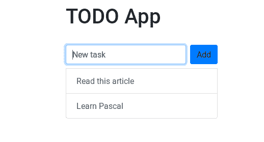

# 我用 Pascal 和 AlpineJS 写了同样的应用程序

> 原文：<https://javascript.plainenglish.io/i-wrote-the-same-app-in-pascal-and-alpinejs-305844b68930?source=collection_archive---------4----------------------->

## 因为还有谁会

AlpineJS 正在迅速获得关注，我想看看使用它是什么感觉。为了有个比较的对象，我用 AlpineJS 和 Pascal 开发了同一个 app(没错，这不是错别字)。

# 什么是 AlpineJS？

AlpineJS 是一个最小的声明式和反应式 UI 框架。它开销很低，速度很快，体积很小，非常适合嵌入式或轻量级应用。如果你以前没有听说过 AlpineJS，我建议你先看看这篇文章。

 [## 当反应过度时，AlpineJS 会起作用

### 如果你对 React 感到不知所措，读读这个

medium.com](https://medium.com/better-programming/when-react-is-too-much-alpinejs-will-do-the-trick-c165a2da4701) 

# 帕斯卡是什么？

Pascal 是一种命令式、过程式编程语言，于 50 年前的 1970 年首次推出。它最流行的实现是 [Turbo Pascal](https://en.wikipedia.org/wiki/Turbo_Pascal) 和 [Delphi](https://en.wikipedia.org/wiki/Delphi_(software)) 。它被用来开发驱动程序、操作系统和桌面应用程序(如 Photoshop)。现在，您可能会认为用 Pascal 开发 web 应用程序并将其与用 JavaScript 编写的应用程序进行比较是不明智的，您将是绝对正确的。在本文中，我想对比 AlpineJS 和一般反应式编程的一些特点，并将它们与一种古老的命令式语言进行比较，这就容易多了。而且，做起来很好玩。

# 最终结果

我们将开发一个简单的 TODO 应用程序，允许您将任务添加到列表中，并将它们标记为已完成。我试图让事情尽可能简单，因为 Pascal 和 AlpineJS 都没有考虑复杂的 web 应用程序。对了，你能猜到上面截图显示的是哪个吗？

# Pascal 实现

为此，我使用了 Pascal - > ES2015 编译器 [pas2js](https://wiki.freepascal.org/pas2js) 。它从 Pascal 源代码生成正确的 JS 代码，为 JS/Pascal 互操作提供库，并公开浏览器 API。我不会深入讨论实现细节，因为这篇文章不是 Pascal 教程，而且我不认为你想学习它。下面是源代码:

`index.html`有加载`Todo.js`的网页的源代码。`Todo.js`是编制的`Todo.pas`。我还使用了 [Bootstrap 4](https://getbootstrap.com/) 来简化造型。要查看它的运行，复制[回购](https://github.com/r3dm1ke/todo-app-pas2js)或查看[现场](https://r3dm1ke.github.io/todo-app-pas2js/)版本。

我写的 Pascal 代码非常不理想，几乎没有优化。但是，它确实有类型安全。此外，与[类型脚本](https://medium.com/javascript-in-plain-english/7-really-good-reasons-not-to-use-typescript-166af597c466)不同，类型安全在编译时和*运行时得到保证。*

# AlpineJS 实现

下面是代码清单:

您可以看到，AlpineJS 让我们直接在 HTML 中定义业务逻辑。此外，没有编译/传输阶段，因为没有使用特殊的语法。AlpineJS 所做的只是向 HTML 元素添加 13 个自定义属性和 5 个全局变量。要看到它的运行，克隆[回购](https://github.com/r3dm1ke/todo-app-alpinejs)或查看[现场](https://r3dm1ke.github.io/todo-app-alpinejs/)版本。

您可以在代码中看到的一些属性有`x-data`、`x-model`、`@click`、`x-text`、`x-for`和`x-bind`。对于那些使用[角尺](https://angular.io/)和/或[角尺](https://vuejs.org/)的人来说，这应该看起来很熟悉。更多信息，可以参考 [AlpineJS](https://github.com/alpinejs/alpine/) docs，真的很短。

# 我学到了什么

帕斯卡是所有问题的解决方案。开玩笑的。我真的很喜欢 AlpineJS，并开始真正欣赏反应式/声明式编程，因为它们确实比命令式/过程式解决方案更好地解决了 UI 问题。然而，这并不意味着它是一个万能的工具。总会有同时使用两者的情况，一个好的软件开发人员应该能够区分两者。

其次，我意识到这确实帮助我刷新了我的 JavaScript 技能。我不得不在没有任何 API 文档的情况下用一种翻译成 JavaScript 的语言编码，我不得不深入挖掘`pas2js`源代码，并将源代码与翻译进行比较。

您可能还会惊讶地发现 Pascal 版本更快。Pascal 版本的加载时间大约为 270 毫秒，AlpineJS 版本的加载时间大约为 350 毫秒。有效负载大小也是 7KB，所以我猜 AlpineJS 在幕后做了更多的工作。

# 结束语

感谢您的阅读，希望您对这篇文章感兴趣。如果你想让我更详细地解释 Pascal 实现或者建议另一种古老/深奥的编程语言，请在评论中告诉我。

# 资源

*   [阿尔卑斯山简介](https://medium.com/better-programming/when-react-is-too-much-alpinejs-will-do-the-trick-c165a2da4701)
*   [AlpineJS 回购](https://github.com/alpinejs/alpine/)
*   [pas2js 文档](https://wiki.freepascal.org/pas2js)
*   [Pascal 版本回购](https://github.com/r3dm1ke/todo-app-pas2js)
*   [AlpineJS 版本回购](https://github.com/r3dm1ke/todo-app-alpinejs)

