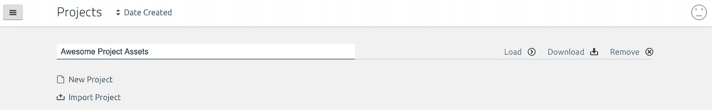
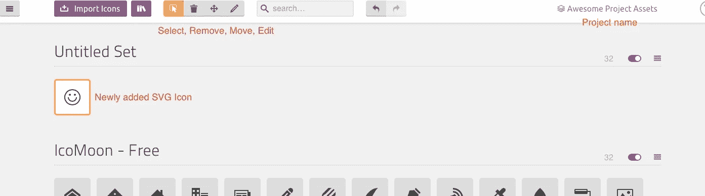
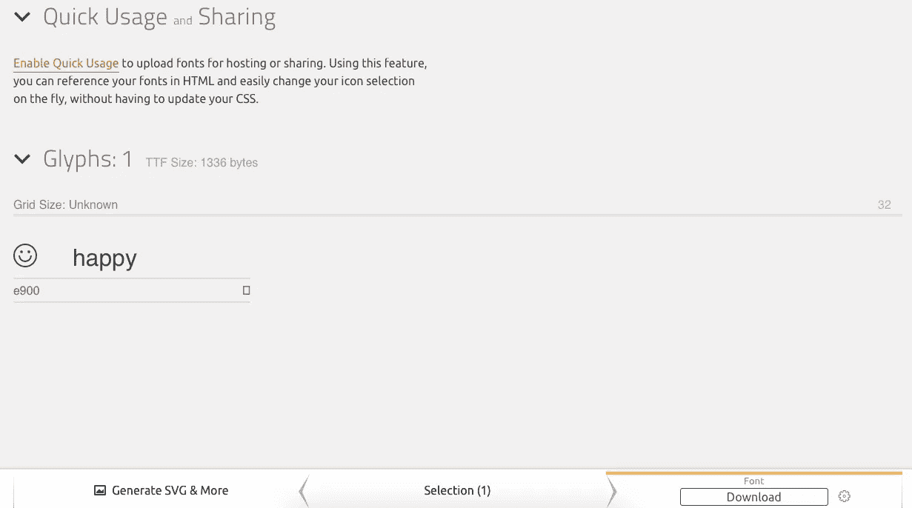
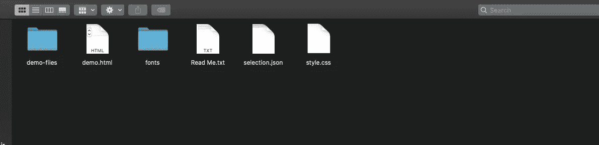
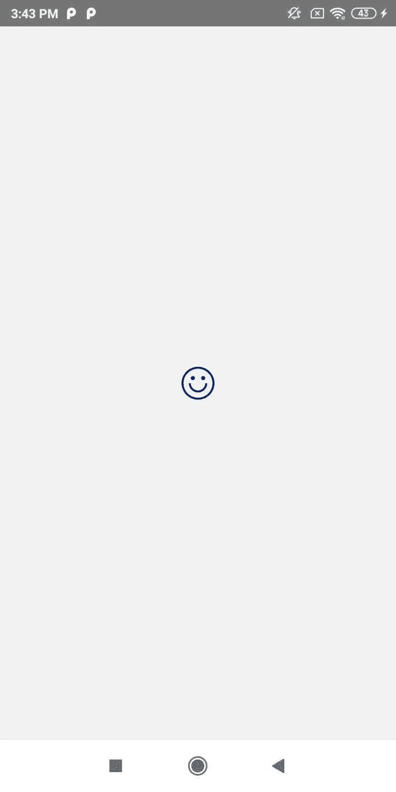
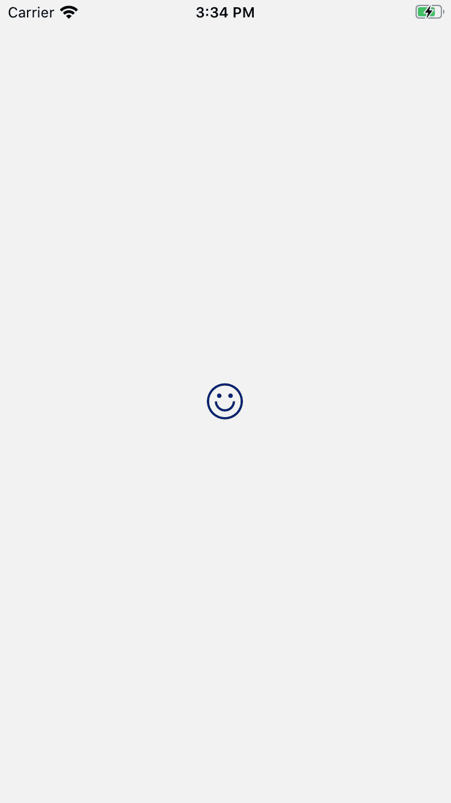

# 反应原生的 Icomoon

> 原文：<https://javascript.plainenglish.io/icons-in-react-native-android-and-ios-b855cd0ed635?source=collection_archive---------5----------------------->

## 使用 Icomoon 和 react-native-vector-icon 的 React Native 应用程序中的图标。

Photo by [Rami Al-zayat](https://unsplash.com/@rami_alzayat?utm_source=unsplash&utm_medium=referral&utm_content=creditCopyText) on [Unsplash](https://unsplash.com/s/photos/app-icons?utm_source=unsplash&utm_medium=referral&utm_content=creditCopyText)

图标是一个象形图，可以不言自明。在这篇短文中，我们将讨论在 Icomoon 的帮助下在 React Native 中包含图标。 [Icomoon](https://icomoon.io) 是一个图标字体生成器，以 SVG 图像为输入，转换成字体。为了将字体转换成图标，我们使用来自[react-native-vector-icons](https://www.npmjs.com/package/react-native-vector-icons)的方法‘createiconsetfromicoon’。

我们开始吧

**第一步。创建新项目**

*react-native init awesome project*

**第二步。安装矢量图标包**

*npm 安装—保存 react-native-vector-icons*

这个包将作为一个中间件来链接创建的图标和字体。我们将在后面看到这个包的用法。

**第三步。创建图标**

1.  转到 [https://icomoon.io](https://icomoon.io/)
2.  点击创建 IcoMoon 应用程序
3.  键入您的项目名称，然后单击“加载”
4.  现在你可以看到很多由 Icomoon 提供的默认图标。
5.  使用“导入图标”选择 SVG 图像。
6.  通过单击需要包含在图标集中的导入 SVG 图像来激活选择模式。
7.  点击屏幕底部的生成字体。它将显示图标及其名称的预览。默认情况下，图标的名称将是导入的 SVG 的名称。
8.  单击底部导航栏中的下载按钮。它将下载一个名为 icomoon.zip 的 zip 文件夹。解压缩后的文件夹包含演示文件、字体和一个名为 selection.json 的文件。Demo.html 文件包含我们创建的所有图标细节。

Icomoon Project

Imported Icon

Download Icons

Downloaded Icomoon folder

**第四步。导入字体**

在 Android 和 iOS 中导入创建的字体‘ico moon . TTF’。如果你需要任何帮助，请参考下面的博客。

 [## React Native 中的自定义字体

### “设计是人类创造的基本灵魂，最终在连续的外层空间中表现出来……

medium.com](https://medium.com/@ansonmathew/custom-fonts-in-react-native-880ca5035c04) 

**第五步。声明并实现图标**

将 selection.json 导入到项目中。这个文件包含图标信息，如名称、颜色、路径等。将文件传递给矢量图标包的 createIconSetFromIcoMoon 方法。

现在您可以使用<icon>来使用 RN 文件中的图标。</icon>

Android screen

IOS screen shot

请查找演示代码库。

 [## Ansonmathew/RNIcomoon

### 在 React Native 中实现 Icomoon。通过在…上创建帐户，为 anson Mathew/rnicomon 开发做出贡献

github.com](https://github.com/Ansonmathew/RNIcomoon) 

演示使用了来自 [FlatIcon](https://www.flaticon.com) 的图标。你可以用 attribute 免费使用无限的图标包。向[智能线](https://www.flaticon.com/authors/smartline)大声呼喊，获得令人敬畏的图标包。

*更多内容看* [***说白了就是***](https://plainenglish.io/) *。*

*报名参加我们的* [***免费每周简讯***](http://newsletter.plainenglish.io/) *。关注我们关于*[***Twitter***](https://twitter.com/inPlainEngHQ)，[***LinkedIn***](https://www.linkedin.com/company/inplainenglish/)*，*[***YouTube***](https://www.youtube.com/channel/UCtipWUghju290NWcn8jhyAw)*[***不和***](https://discord.gg/GtDtUAvyhW) ***。****

****对缩放您的软件启动感兴趣*** *？检查出* [***电路***](https://circuit.ooo?utm=publication-post-cta) *。**