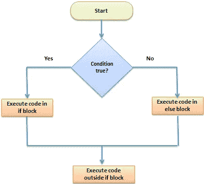

# JavaScript 中的 If / Else 语句与三元运算符

> 原文：<https://javascript.plainenglish.io/if-else-statements-vs-ternary-operators-in-javascript-d5238af4b516?source=collection_archive---------2----------------------->

当你第一次学习基本的 JavaScript 语法时，你首先要学习的是著名的 ***if / else 语句*** 以及它们在 JavaScript 世界中的重要性。然而，在你写了一会儿代码之后，你很有可能会遇到一种叫做 ***三元运算符*** 的东西。今天我们将看看 if / else 语句和三元运算符之间的主要区别，以及何时使用哪一个。

# If / Else 语句

我们将从看一个 ***if / else 语句*** 的基本例子开始。看一下下面的代码，看看您是否能猜出控制台将记录什么内容:

如果您猜测单词 **child** 将被记录到控制台，那么您是正确的，但是，如果您错了，您可以看看下面的视频来更好地了解 if / else 语句。

我们先来说说为什么控制台上印的是孩子这个词而不是成人这个词。首先，我们创建了一个名为 age 的新变量，并将其设置为等于数字 17，然后我们设置 if / else 语句来检查 age 是否大于或等于 18。如果该条件为真，则世界成人登录到控制台，如果为假，则儿童登录。由于年龄不大于或等于 18 岁，因此条件为假，在这种情况下，将记录到控制台的是 child。为了对它的工作原理有一个基本的了解，请看下图。

[Source](https://www.guru99.com/r-if-else-elif-statement.html)

太好了！现在我们知道了 if / else 语句是如何工作的，但是，当谈到 if / else 时，还有一件事你应该知道，那就是 else if 语句。Else if 语句是编写 if / else 语句的可选方式，它们允许我们为多个条件添加结果。让我们通过这个处理交通灯的例子来看看 if 语句是如何工作的。

正如您所看到的，这和常规 if / else 语句之间的唯一区别是中间的两个 else if 语句，但是它们是如何工作的呢？基本上，if 语句像往常一样开始，检查第一个条件是否为真。如果第一个条件是 ***不为真*** ，则执行第一个 else if 块，如果为假，则执行下一个，以此类推，直到我们最后的 else 语句，该语句仅在前面条件的所有*都为假时才执行。这意味着我们还可以添加任意多的 else if 语句，只要我们以最后的 else 语句结束。在这个例子中，单词 **Stop** 被记录到控制台，因为我们的变量 lightColor 不是绿色或黄色，而是红色。*

**

# *三元运算符*

*现在我们已经了解了 if / else 语句是如何工作的，让我们来看看 ***三元运算符*** 。三元运算符采用 3 个不同的参数，包括 ***条件*** ，条件为真时表达式*，条件为假时表达式*。这非常类似于 if / else 语句的工作方式，但是三元运算符的语法要简洁得多。让我们看一个三元运算符的基本例子。***

***在这个例子中，我们有一个函数来检查任何给定的 Medium 用户在他们的账户上花了多少钱。因为我是 Medium 的成员，所以我在 console.log 语句中将我们的 isMember 参数设置为 true。 **$5.00 /月**将被记录到控制台，因为如果条件为真，三元运算符将执行第一个表达式，如果条件为假，将执行第二个表达式。考虑三元运算符的一个很好的方法是简单地用一种简短的方式来写 if / else 语句。如果你想了解更多关于三元运算符的知识，你可以观看下面的视频。***

******

# ***何时使用哪个***

***使用 if / else 语句而不是三元运算符的一个原因是当您希望有两个以上的结果时，例如当您在 if /else 语句中编写 else if 时。如果您发现自己需要检查不止一个条件，那么包含 else if 的 if / else 语句很有可能是最佳选择。***

***使用三元运算符而不是 if / else 语句的一个很好的时机是当您使用简单的 if / else 语句时。任何可以放在一行代码中的东西都是使用三元运算符的最佳时机，因为它更紧凑、更易读。当你想给一个给定的变量设置一个值的时候，三元运算符也是非常有用的。***

******

# ***结论***

***希望这已经给了你一些关于 if / else 语句和三元运算符之间的关键区别的信息，因为它们可能看起来完全一样，只是最初用不同的方式编写。大多数时候，我发现在三元运算符上只使用 if / else 语句是有用的，但是知道这两者是很好的，因为它们在不同的情况下都能派上用场。如果你经常使用简单而简短的 if / else 语句，三元运算符可能是你重构代码的好方法！总的来说，大多数时候你可以交替使用它们中的任何一个，但是如果你遇到使用一个比另一个更实际的情况，我希望这能帮助你更好地理解！***

****来源*:***

**【https://www.guru99.com/r-if-else-elif-statement.html **

**[https://youtu.be/IsG4Xd6LlsM](https://youtu.be/IsG4Xd6LlsM)**

**[https://youtu.be/NpG1TY2-izM](https://youtu.be/NpG1TY2-izM)**