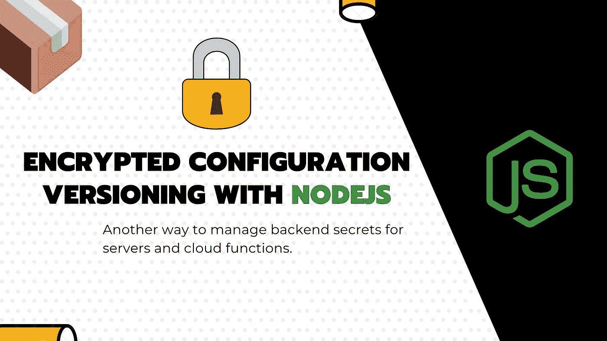
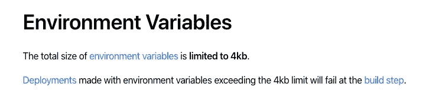
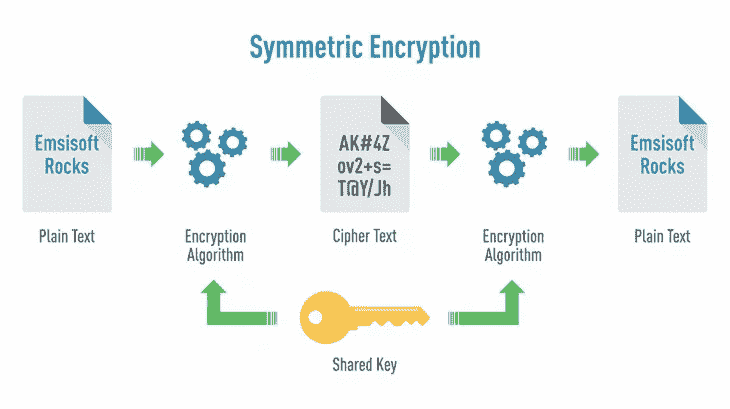

# 我现在在 Git 中对我的应用程序秘密进行版本控制，这就是为什么你应该做同样的事情。

> 原文：<https://javascript.plainenglish.io/im-now-versioning-my-app-secrets-in-git-here-is-why-you-should-do-the-same-2a72c1a49039?source=collection_archive---------2----------------------->

## 发展提示

## 这被认为是一个不好的实践，但是当你有很多配置并且管理秘密变得复杂时，你可能需要它。



我知道你可能会想:“**这是一个糟糕的做法……”**和“**可能是世界上最糟糕的想法**”。

**我承认我完全同意你的观点。**

**然而，**为了给出一些背景，让我们从一个关于**我为什么开始做这件事的简短故事开始，最重要的是以何种方式。**

# 为什么我从 environments secrets 切换到了带有 secrets 的版本化 JSON 配置？

一切从两年前我开始学习云计算开始。我的一个朋友在一家发布开源软件的公司工作，他被委派做一些演示和展示软件的概念验证。

开发的时候，我朋友在用公司银行卡给一些 [AWS EC2](https://aws.amazon.com/ec2) 沙箱供电。对于那些不知道这一点的人来说，这是一种可以按需填充的 VPS 机器，只要你保持开机，你就可以根据每小时的使用情况支付一定的费用。这真的很酷，因为你可以根据服务器负载来调整网络基础设施。

但是一个周五，在漫长的一周之后的周末之前，我的朋友无意中在一个公共 GitHub 存储库中提交了私有 API 密钥，该密钥允许任何拥有它的人控制 AWS 帐户并填充 EC2 或其他服务。这是一种上帝模式。

周一，该公司收到了几封电子邮件，提到**账单被点燃**并且在两天内达到了**15000€**。对于像这样的小失误来说，这并不酷… **事实是，这每年都会发生在很多人身上。**

你必须知道**那些键有一个特定的模式**和**有一群机器人正在网络上爬行搜索那个模式**。

发生的事情是，有人已经填充了几个最大的 CPU 优化虚拟机，以加密挖掘一些比特币(BTC)。

这个故事的寓意是:永远不要在任何地方提交任何敏感数据，以防止任何意外泄漏，即使是在你可能认为永远不会公开的小型存储库上。

为此，大多数云提供商服务允许以安全的方式管理秘密，这些秘密将在运行时通过环境变量直接注入云功能或虚拟机。这真的是一件很酷的事情，从那天开始，我在任何地方都应用它，甚至在我自己的私人存储库中，以防万一…

…直到上周，我还想在已经不那么小的秘密集合中增加一个 Firebase Service 帐户的序列化版本，这是一个 JSON 文件，其中包含完整的 rs a 字符串密钥。

# 关于秘密管理，对某些提供者有一些限制

尽管使用环境变量*(例如:RSA 密钥对、JSON 配置……)*管理复杂的秘密很困难，但还有一些其他限制……

*   [保留变量名称](https://zeit.co/docs/v2/serverless-functions/env-and-secrets?query=secrets#reserved-variables)
*   [秘密限制](https://docs.aws.amazon.com/secretsmanager/latest/userguide/reference_limits.html)(AWS 示例)

就像包裹在 AWS 外面的[Zeit Now](https://zeit.co/)*而言，秘密的规模是有上游限制的……*



这意味着，对于那些拥有 Firebase/ Google 凭据和服务帐户等“综合体”秘密的人来说，你很可能会突破这个限制。这发生在我和其他许多人身上。

**以上种种让我想到了另一种加密技术。**

# 使用版本化加密 JSON 配置从 99 个机密更改为 1 个机密

而不是将各种环境变量定义为秘密来存储我的私有配置并达到极限。我使用**对称加密**来存储一个完整的 JSON 文件**，其中包含我的安全配置**。

在 cloud secrets 存储中，唯一剩下的就是加密密钥，可能还有用于加密此配置对象的初始化向量(IV)。

**这种做法有如下一些好处:**

*   所有的配置站在一个地方。
*   您可以轻松地正确存储 JSON 结构和配置参数的命名空间。
*   很安全。
*   它的 IDE 和开发人员友好，与静态类型和自动完成。

一般来说，如果你不是一个新手并且应用了安全的基础知识，那么成功地突破了你的安全并且窃取了你的代码库**而没有通知你**的机会并不是很多。

但即使发生在这里，使用下面的策略，您也是安全的，因为，像您的数据库密码一样，您的整个配置是加密的。

这样，您就有了足够的时间来为任何服务无效化并生成新的访问密钥，并再次保护存储库的安全。

> 但等等……什么是对称加密？

**关于对称加密的快速提示**



Symmetric Encryption in a nutshell — **Wikipedia**

> **对称加密**是使用随机生成的密钥对文本*(这里是一个字符串化的 JSON)* 进行编码的动作。使用同一个密钥，程序能够稍后解密这一大块数据并恢复它。

除了密钥之外，每次我们加密字符串化的配置对象时，我们都会使用一个随机的数据块，称为**初始化向量(IV)。这防止了在对同一文档进行多次加密时产生相同的加密结果。**增加安全性。****

所有这些都是通过一种叫做**密码块链接(CBC)** 的技术来完成的，如果你想了解更多，请随意在谷歌上搜索或者在维基百科上搜索。

好消息是，在 NodeJS 中使用 CBC 密码非常容易。它使用 OpenSSL 上的`crypto`模块来支持开箱即用。

# 使用 Cipher IV CBC 加密云项目的 JSON 配置

以下示例分为两部分:

1.  **第一:加密。**我们将在开发人员的计算机上加密所需的 JSON 配置对象。我们可以在一些网站上这样做，比如这个网站，但是我不同意这种做法。您不应冒任何风险，将您的配置暴露在外部网站上和/或让他人生成您的加密密钥。否则加密什么都没用。一旦我们有了加密的字符串，我们只需将它添加到我们的存储库中，并与我们的源代码一起提交它。
2.  **第二:解密。**当代码引导时，我们将使用由 secrets provider 在我们的环境变量中注入的加密密钥对配置进行解密，并使其在我们的应用程序中可用。

准备好了吗？我们来编码吧！

这是我们将在本文中学习的演示的代码，请随意在另一个屏幕上打开它，并继续阅读解释。示例中提供的所有加密值都是存根，没有安全目的。由您自己来复制和指定与您的项目相匹配的加密数据，而不是给定的存根。

Code samples

## NodeJS 中的 JSON 配置加密

***本章指的是上面片段*** 中的 `***encrypt.js***` ***文件***

为了加密配置，我做了一个快速的 shell 脚本*(你可以改进它，或者有一天我也可以)*，它只有一个参数:用于加密配置的加密密钥。

下面的例子是使用`aes-256-cbc`算法，它需要**一个 256 位的加密密钥** *(即 32 个字符)*和一个 **16 字节的 IV** 。

*   **要得到一个加密密钥**，你需要一个真随机数。我个人一般使用[这个基于大气噪声](https://www.random.org/strings/)的网站。要求 4 串 8 个字母数字组成的字符，按照你想要的顺序连接起来，得到一个 32 个字符的随机字符串。
*   JSON 配置的加密版本将是一个十六进制字符串。

代码是自我解释的，所以只需使用您的加密密钥通过`node encrypt.js <encryption_key>`来加密您的`config.json`文件。并将加密的内容粘贴到`config.ts`片段中定义的占位符中。

## NodeJS 中的 JSON 配置解密

***本章所指的是*** `***config.ts***` ***文件中上面的片段***

这里我使用的是 **Typescript** ，它是一个著名的 Javascript 超集，为 Javascript 文件带来了静态类型和接口。这样，我就可以输入我的配置来利用 IDE 中的自动完成功能。

这里没有什么复杂的:在我的应用程序启动时，将需要`config.ts`文件，代码将被解释为解密我们的配置。

由于我的云提供商的 secrets 功能，用于加密上述数据的加密密钥被注入到使用环境变量的应用程序中。**加密的 JSON 配置以纯文本的形式出现在代码中。**

根据`NODE_ENV`变量，生产或暂存配置被延迟加载并作为`APP_CONFIG`常量公开，常量`Object.freeze`用于防止程序执行过程中的意外变化。如果使用错误的加密密钥，您将无法解密配置，潜在的黑客也无法解密。

**保管好加密密钥，避免共享它，因为它可以访问您的整个配置。另一方面，IV 不需要保密，而是在加密字符串中公开共享。**

请随意修改上面的例子及其行为以满足您的需求。

这就是我们，我们只是用两个变量替换了旧的 99 环境变量:`NODE_ENV`和`ENCRYPT_KEY`，所有这些都是以安全的方式进行的。

# 额外收获:内嵌一个 RSA / PEM 密钥，使其嵌入到 JSON 文件中

在某些情况下，您可能需要在 JSON 密钥中存储大量内容，当您使用 **RSA 密钥**(pem)进行 JWT 加密/解密。

放一个 RSA。pem 在一个 JSON 字符串中，你需要把它放在一行并转换隐藏的换行符，换成转义的换行符`\n`。

要实现该行为，您可以使用以下命令:

```
awk 'NF {sub(/\r/, ""); printf "%s\\n",$0;}' <your_key_file.pem>
```

对于那些懒惰的人来说，这里有一个版本可以在 Mac/Linux 上使用`pbcopy`直接将它放入剪贴板。基于`rsa_priv.pem`是我们的文件名和当前目录。

```
awk 'NF {sub(/\r/, ""); printf "%s\\n",$0;}' rsa_priv.pem | pbcopy
```

[**🇫🇷STOP！你是法国人吗🥖？您也可以访问 ici 网站，接收法国的私人通讯🙂**](https://codingspark.io)