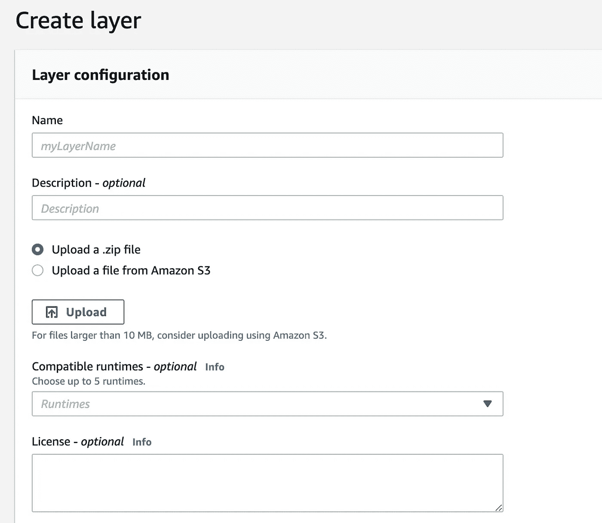
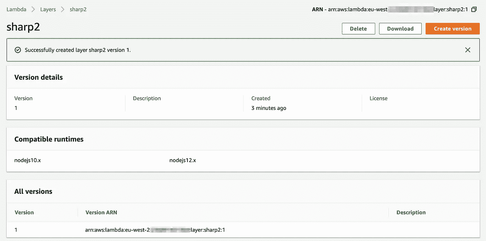

# 使用 Sharp、AWS Lambda 函数和图层以及 Claudia.js 进行图像处理

> 原文：<https://javascript.plainenglish.io/image-manipulation-with-sharp-aws-lambda-functions-layers-and-claudia-js-876d3dadcdb4?source=collection_archive---------3----------------------->


No manipulation here…

一段时间以来，我一直希望能够利用夏普([https://github.com/lovell/sharp/](https://github.com/lovell/sharp/))提供的强大而快速的图像处理功能，但我一直在努力寻找让它发挥作用的方法。我遇到了各种挑战，例如:

1.  sharp 的二进制文件依赖于平台。这意味着在 Mac 上开发并部署到 Lambda(一个 Linux 容器)意味着用于 Sharp 的二进制文件是不兼容的
2.  Sharp 相当大，所以将它包含在 lambda 函数包中确实是不可行的，因此，它应该在自己的层
    ***编辑:自从我写这篇文章以来，我已经了解了很多关于 lambda 的知识，该层仍然在每次冷启动时被复制到运行时中，因此分层对冷启动时间没有帮助。事实上，我已经不再使用夏普了。我倾向于选择吉姆的 ES 版本***
3.  如何在 Mac 环境中使用正确的二进制文件创建一个层
4.  如何从 lambda 内部引用 sharp

我试着按照说明[这里](https://github.com/lovell/sharp/issues/1702#issuecomment-499331245)做，但是它们是针对一个旧版本的，我只是不能让它这样做——提到的文件不再在 sharp 包中。它还要求你使用 Docker 来创建文件并打包，对我来说这似乎是一种冗长、工具繁重的方法。

我也将 [Claudia.js](https://claudiajs.com/) 用于 Lambda 和 API 网关部署，这虽然极大地简化了部署过程，但当试图让所有这些不同的部分很好地一起工作时，确实增加了额外的复杂性。

# 让一切运转起来

## 为 Sharp 创建图层

首先，您需要为 Sharp 创建一个包含正确二进制文件的项目。我是这样做的:

创建一个新文件夹并运行:

```
npm init -y
```

(如果您想覆盖任何初始化默认值，它不必有-y 标志)

然后你需要用 Linux 二进制安装 Sharp:

```
npm install --arch=x64 --platform=linux sharp
```

接下来选择您的文件夹的内容，这将是一个 node_modules 文件夹、package.json 和 package-lock.json，并将它们压缩。

不幸的是，还没有一种方法可以使用 Claudia.js 创建图层(尽管您可以引用 lambdas 的图层(我们很快就会谈到)

因此，我们将使用控制台创建它。登录你的 AWS 账户，搜索 Lambda 并选择图层。



Create a new layer

给你的图层一个信息丰富的名称和描述，让我们称之为夏普。

选择上传一个. zip 文件，并选择您刚刚压缩的文件。兼容的运行时，我选择了 node.js 10.x 和 12.x

创建完成后，您会看到一个确认屏幕，其中包含图层的 ARN，请记下它



Layer creation confirmation

ARN 的末尾是:1 —每上传一个新版本，这个值就会增加 1。

## 利用你的新尖层

Claudia.js 在部署之前执行一些简便的验证，包括确保存在任何依赖关系。因为这个函数将从一个层而不是本地安装的依赖关系中加载，所以你需要延迟加载 sharp 来规避依赖关系检查。

例如:

```
*export* *async* function *addPhoto*(contents) { const *sharp* = *require*('/opt/node_modules/sharp');
  const *smallImg* = *await sharp*(*contents*)
    *.resize*({ width: 200 })
    *.toBuffer*();
}
```

这里发生的事情是，sharp 依赖项是在使用它的函数中按需加载的。检索它的位置是/opt 中的 node_modules/sharp 文件夹，这是 AWS Lambda 环境在引用层中复制的位置。

如果有更好的方法来实现这一点，我很乐意在评论中听到。

## 部署

用 Claudia.js 部署 lambda 函数代码非常简单:

```
claudia create \
--description API for OMW Photos Backend \
--config deploy/dev/photos-dev \
--region eu-west-2 \
--handler build/functions/photos.handler \
--layers arn:aws:lambda:eu-west-2:XXXXXXXXX:layer:sharp:1 \
--name photos-dev \
--runtime nodejs12.x \
--role arn:aws:iam::XXXXXXXXX:role/lambda-some-role
```

注意这里有一个图层参数，它从我们的图层中获取 ARN(如果需要一个以上的图层，这可以是一个逗号分隔的 ARNs 数组)

这将创建你的 lambda 引用夏普层和你的图像处理代码应该像一个梦一样工作。

我已经在网上看到了使用无服务器框架的各种方法，但由于我们使用 Claudia.js 并在 MAC 上开发，我想我应该写下我所做的，以防它能节省一些时间。

任何改进的想法或建议都可以在评论中看到。

感谢阅读！

## **简明英语笔记**

你知道我们推出了一个 YouTube 频道吗？我们制作的每个视频都旨在教给你一些新的东西。点击 [**点击**](https://www.youtube.com/channel/UCtipWUghju290NWcn8jhyAw) 查看我们，并确保订阅该频道😎