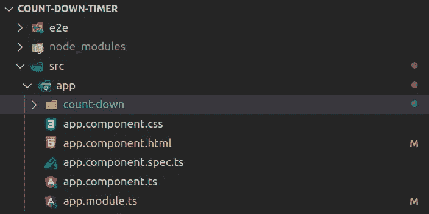

# 以角度 RxJS 实现倒计时定时器

> 原文：<https://javascript.plainenglish.io/implement-a-countdown-timer-with-rxjs-in-angular-3852f21a4ea0?source=collection_archive---------1----------------------->

## 实现一个简单的角度倒计时


Photo by [Eder Pozo Pérez](https://unsplash.com/@ederpozo?utm_source=medium&utm_medium=referral) on [Unsplash](https://unsplash.com?utm_source=medium&utm_medium=referral)

我们经常为一些特殊事件倒计时。

在本指南中，我将向你展示如何使用 RxJS 在 Angular 中实现一个简单有效的倒计时器。

到目前为止，2020 年是一个过山车年。我们实施一个到 2021 年的倒计时器怎么样？我们将实现的倒计时定时器将更新到秒。

事不宜迟，让我们直接进入代码。

# 创建角度应用程序

我们将通过 CLI 使用以下命令创建一个简单的 Angular 应用程序。

```
$ ng new count-down-timer --defaults
```

一旦应用程序被创建，进入它的根目录。

```
$ cd count-down-timer
```

然后添加一个名为 ***的新组件 count down***，它将包含使用以下 CLI 命令的倒计时定时器的逻辑。

```
ng g c count-down 
```

在这个阶段，你的项目结构应该和这个差不多。



# 实施倒计时逻辑

倒计时的逻辑并不复杂。我们需要找出 D 日(即我们活动的那一天)和当前时间之间的差异。

我们得到的时间差是以毫秒为单位的，因此我们将把它转换成相应的单位，即天、小时、分钟和秒。

为了确保时间保持每秒更新，我们将使用订阅间隔，它将获得每秒的时间差。

为了避免应用程序中的内存泄漏，每当 ***倒计时*** 组件被销毁时，我们将取消订阅。

组件代码应该如下所示。我更注重可读性而不是效率，所以如果你愿意，可以随意修改。

在本文中，我不会详细讨论时差计算，但是，我在结论部分提供了一篇关于时差计算的文章的链接。

在相应的模板代码中，即***count-down.component.html***，我们将使用如下插值以各自的单位显示开始日的时间。

向组件的样式模板添加一些 CSS 样式，如下所示。样式将我们的输出居中，并调整字体大小。

为了保持简单，CSS 非常简单。请随意调整。

# 显示计时器

为了显示 D 日的剩余时间，我们将把 ***倒计数*** 子组件注入到***app.component.html***父组件中，如下所示。

删除 app.component.html 中 ***的所有代码，替换为下面的单行代码。***

# 倒计时开始了

要在默认浏览器中提供应用程序，可以运行以下命令。

```
ng serve -o
```

下面是倒计时器的运行情况。


# 结论

这就是你要做的，一个简单的倒数计时器更新到秒的实现。

要获得用 JavaScript 计算时差的全面指南，你可以看看 Javascript Jeep 的指南🚙💨 [此处](https://medium.com/javascript-in-plain-english/find-difference-between-dates-in-javascript-80d9280d8598)。

## 进一步阅读

[](/create-a-multi-page-job-application-form-using-angular-f0b1640f4195) [## 使用 Angular 创建多页工作申请表

### 一步一步的教程，以建立一个多页的工作申请表使用 Angular 和 SurveyJS，一个免费的，开源的…

javascript.plainenglish.io](/create-a-multi-page-job-application-form-using-angular-f0b1640f4195) [](https://plainenglish.io/blog/create-an-employee-satisfaction-survey-using-angular-and-store-results-in-a-mongodb-collection) [## 使用 Angular 创建员工满意度调查，并将结果存储在 MongoDB 集合中

### 一步一步的教程来建立一个员工满意度调查使用 Angular 和 SurveyJS，一个免费的，开源的…

简明英语. io](https://plainenglish.io/blog/create-an-employee-satisfaction-survey-using-angular-and-store-results-in-a-mongodb-collection) 

*更多内容看* [***说白了就是***](https://plainenglish.io/) *。报名参加我们的* [***免费周报***](http://newsletter.plainenglish.io/) *。关注我们关于* [***推特***](https://twitter.com/inPlainEngHQ) ，[***LinkedIn***](https://www.linkedin.com/company/inplainenglish/)*，*[***YouTube***](https://www.youtube.com/channel/UCtipWUghju290NWcn8jhyAw)*，以及* [***不和***](https://discord.gg/GtDtUAvyhW) ***。***

***对缩放您的软件启动感兴趣*** *？检查出* [***电路***](https://circuit.ooo/?utm=publication-post-cta) *。*