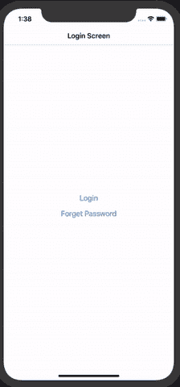

# 用 React-Navigation 实现一个简单的移动认证流程。

> 原文：<https://javascript.plainenglish.io/implement-a-simple-mobile-authentication-flow-with-react-navigation-6715f14daacd?source=collection_archive---------4----------------------->

## 一个简单的循序渐进的指南。


Photo by [Micah Williams](https://unsplash.com/@mr_williams_photography?utm_source=unsplash&utm_medium=referral&utm_content=creditCopyText) on [Unsplash](https://unsplash.com/@mr_williams_photography?utm_source=unsplash&utm_medium=referral&utm_content=creditCopyText)

> **认证**是每个移动应用程序必须具备的特性。它使应用程序能够向适当用户显示适当的内容。这个博客将帮助你构建一个实现 react 导航的应用程序来达到同样的目的。



This is what we are tying to build

```
**** Application Flow ****AppLoading  --Loading
   -- Decide App Screen     Authentication
   --Login Screen
   --Forget Screen
Application
   --Screen One
   --Screen Two
```

```
npm install react-navigation --save
npm install react-navigation-stack --save
```

> 您需要一个 **createSwitchNavigator(决定加载哪个堆栈)**和两个**createStackNavigator(app Stack 和 Auth Stack)**
> 
> **AppStack** 看起来像这样

```
const AppStack = createStackNavigator({
 [ScreenConstants.APP_FIRST_SCREEN]: {
   screen: AppScreen1,
   navigationOptions: () => ({
     headerTitle: ‘My First App Screen’,
   }),
  },
 [ScreenConstants.APP_SECOND_SCREEN]: {
   screen: AppScreen2,
   navigationOptions: () => ({
     headerTitle: ‘My Second App Screen’,
   }),
 },
});
```

和 **AuthStack** 很像

```
const AuthStack = createStackNavigator({
 [ScreenConstants.AUTH_LOGIN_SCREEN]: {
    screen: AuthScreen,
    navigationOptions: () => ({
      headerTitle: ‘Login Screen’,
    }),
 },
 [ScreenConstants.AUTH_FORGET_SCREEN]: {
   screen: ForgetPassword,
   navigationOptions: () => ({
     headerTitle: ‘Forget Password’,
   }),
 },
});
```

> 现在配置我们的 **SwitchNavigator。**它的作用是根据我们存储在本地存储器中的一些标志数据，决定应用程序启动时加载哪个屏幕。
> 
> 登录后，我们必须**设置**它，注销后，我们必须**重置**它。

这是我们的 **SwitchNavigator**

```
createSwitchNavigator({
  [ScreenConstants.LOADING_SCREEN]: ApploadingScreen,
  [ScreenConstants.AUTH_STACK]: AuthStack,
  [ScreenConstants.APP_STACK]: AppStack,
}),
```

> 现在**应用加载**屏幕负责决定加载哪个**堆栈**(即 **AppStack** 或 **AuthStack** )。

这是它看起来的样子

```
class ApploadingScreen extends React.Component {
   componentDidMount() {
     this._bootstrapAsync();
   }
   _bootstrapAsync = async () => {
     const userToken = await AsyncStorage.getItem(‘userAuthFlag’);
     this.props.navigation.navigate(
     userToken ? ScreenConstants.APP_STACK :
                 ScreenConstants.AUTH_STACK,
     );
   };
   render() {
     return (
       <SafeAreaView style={styles.safeAreaStyle}>
         <Text>Loading</Text>
       </SafeAreaView>
     );
  }
}
```

> 现在最后一件事是将 **userAuthFlag** 设置为某个值，以便应用程序加载屏幕可以决定加载哪个屏幕。
> 
> 因此，在**登录**屏幕中，我们设置了**用户验证标志**，在**注销**中，我们重置了该标志。
> 
> 所以在**上登录**，做一些类似

```
AsyncStorage.setItem(AsyncStoreConstant, ‘doneAuth’);//set some flag   
this.props.navigation.navigate(ScreenConstants.APP_STACK);
```

> 并在**上登出**像

```
AsyncStorage.setItem(AsyncStoreConstant, ‘’); // reset the flag
this.props.navigation.navigate(ScreenConstants.AUTH_STACK);
```

> 这里是一个文件中的**完整的**代码，以便于理解。只需创建一个新的 **react-native** 项目，并用下面的代码替换那个 **app.js** 。

Complete Code. Just paste it in your newly created App.js file.

> 感谢阅读。