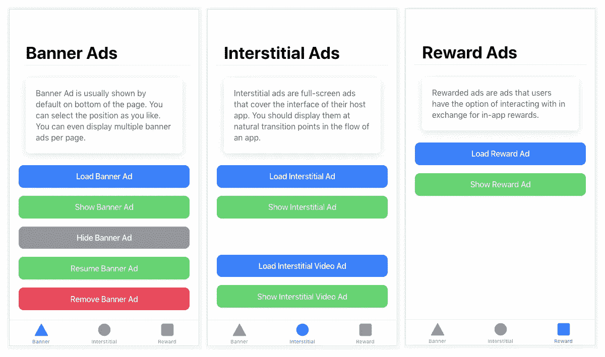
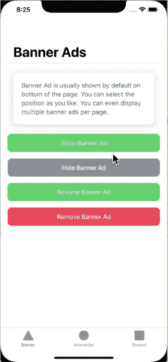
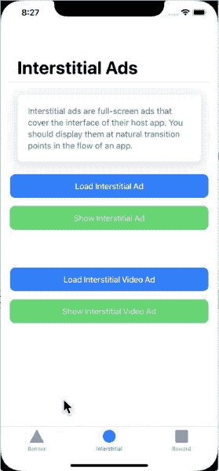
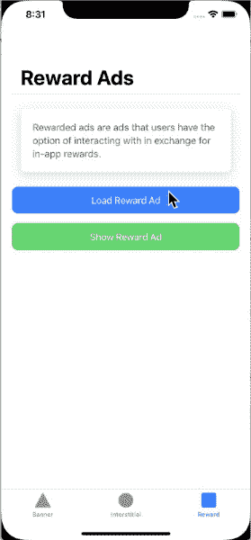

# 在离子反应电容应用中实现 AdMob

> 原文：<https://javascript.plainenglish.io/implement-admob-in-ionic-react-capacitor-apps-acbc382448b2?source=collection_archive---------11----------------------->


> 这篇文章是应我们成千上万的读者之一的特别要求而写的。如果你有更多的要求，请在评论中告诉我

在这篇文章中，你将学习如何在 Ionic React Capacitor 应用中实现 **AdMob 功能，**即谷歌广告。我们将在一个简单的 Ionic 应用程序中实现这一点，并在 iOS 模拟器和 Android 设备上进行测试。

# 什么是 Admob？

众所周知，广告是谷歌、脸书、推特等科技巨头的主要收入来源。谷歌广告是最受欢迎的广告之一，谷歌广告的移动版本被称为 AdMob。


An example of Google AdMob ad. The ad is prompting user to install certain app

## AdMob 广告类型

**横幅**:出现在设备屏幕顶部&底部的基本广告格式。

**插页**:整版广告出现在自然间断&过渡处，比如关卡完成。支持视频内容。

**奖励**:整页广告奖励用户观看短视频并与可播放的广告和调查互动。有利于免费游戏用户的货币化。支持视频内容。

**原生**:可定制的广告格式，与你的应用的外观&相匹配。广告与应用程序内容一起出现。支持视频内容。目前，原生广告只能在原生应用中出现，而不能在基于 Ionic 或 React Native 的混合应用中出现。

让我们看看这篇文章的基本框架。**如果你熟悉离子和电容，跳过这些部分，进入文章的代码部分。**

# 放弃

因为这篇文章是三个框架的混合体，所以你可能是误上了这里。如果您正在寻找 AdMob 登录

*   反应自然——请查看[这篇文章](https://enappd.com/blog/implement-admob-in-react-native-with-firebase/133)
*   离子反应(电容)应用——继续阅读😎

正如你从上面看到的，现在混合应用程序开发有不止一种选择，很容易混淆。这篇文章关注的是 **Ionic 框架**，其中 **React** 作为前端框架， [**Capacitor**](https://capacitor.ionicframework.com/docs/) 作为运行时和构建环境。

> ***本教程的代码可在 Github repo***[***ionic-react-capacitor-admob***](https://github.com/enappd/ionic-react-admob)上获得

让我们来看看对每个包含的框架的简要介绍:

1.  离子的
2.  电容器

# 什么是爱奥尼亚？

你可能已经知道离子，但我把它放在这里只是为了初学者。 **Ionic** 是一款混合移动应用开发 SDK。它提供了使用 CSS、HTML5 和 Sass 等 Web 技术开发混合移动应用程序的工具和服务。换句话说——如果你用 Android 创建原生应用，你就用 Java 编码。如果你在 iOS 中创建原生应用，你用 Obj-C 或 Swift 编码。这两种语言都是强大但复杂的语言。使用 Cordova(和 Ionic ),你可以为你的应用编写一段代码，它可以在 iOS 和 Android 上运行。)，HTML、CSS 和 JS 的简单性也是如此。

必须注意科尔多瓦/电容在其中的作用。Ionic 只是一个由 HTML、CSS、JS 组成的 UI 包装器。因此，默认情况下，Ionic 不能在 iOS 或 Android 设备中作为应用程序运行。Cordova/Capacitor 是一个构建环境，它封装了这个 Ionic web 应用程序，并将其转换为一个可安装在设备上的应用程序，同时为这个应用程序提供对 Camera 等本地 API 的访问。

# 电容器——它与科尔多瓦有何不同？

本节仅适用于已经使用 Ionic / Cordova 一段时间的人员。很长一段时间以来，科尔多瓦一直是 Ionic 应用开发者的唯一选择。Cordova 帮助将 Ionic web app 构建成一个设备可安装的应用程序。

> ***电容器与 Cordova 非常相似，但与 app 工作流程*** 有一些关键区别

以下是 Cordova 和 Capacitor 之间的区别(只有在您之前使用过 Cordova 的情况下，您才能体会到这些区别，否则您可以跳过)

1.  Capacitor 将每个平台项目视为一个*源资产*，而不是一个*构建时间资产*。这意味着，Capacitor 希望您将平台源代码保存在存储库中，不像 Cordova 总是假设您将在构建时生成平台代码
2.  由于上述原因，Capacitor 不使用`config.xml`或类似的定制配置进行平台设置。相反，通过编辑 Android 的`AndroidManifest.xml`和 Xcode 的`Info.plist`来改变配置
3.  电容器不能“在设备上运行”或通过命令行仿真。相反，这些操作是通过特定于平台的 IDE 进行的。所以你不能使用像`ionic run ios`这样的命令来运行离子电容应用。你必须使用 Xcode 运行 iOS 应用程序，使用 Android studio 运行 Android 应用程序
4.  由于平台代码不是*源资产，*您可以使用 Xcode 或 Android Studio 直接更改本机代码。这给了开发者更多灵活性

本质上，电容器就像一个新鲜的，更灵活的科尔多瓦版本。

# 插件

Cordova 和 [Ionic Native](https://ionicframework.com/docs/native) 插件可以在电容环境下使用。然而，有一些已知的 Cordova 插件[与电容器不兼容。](https://capacitor.ionicframework.com/docs/cordova/known-incompatible-plugins/)对于 Admob 功能，我们将使用[电容 Admob 插件](https://github.com/rahadur/capacitor-admob)

# 职位结构

我们将逐步探索 AdMob 特性的实现。这是我的博客分解

**步骤**

1.  用 React 创建一个基本的离子电容器应用程序
2.  用 Capacitor 在 Android 中构建应用
3.  设置您的 AdMob 帐户
4.  安装 AdMob 插件
5.  在你的应用中实现不同类型的广告
6.  在 iOS 模拟器上构建应用程序并进行测试
7.  在 Android 设备上构建应用程序并进行测试

所以让我们开始吧！


I made you laugh … didn’t I ? 😆

# 步骤 1 —使用 React 创建一个基本的离子电容器应用程序

从 Ionic starters 本身创建一个基本的应用程序。

```
$ ionic start ionic-react-admob tabs --type=react
```

这将在 React 中创建一个基本的 Ionic 应用程序。我选择了`tabs` starter，这样我就可以针对不同的广告类型使用不同的标签。

我们将创建一个简单的用户界面，只有几个按钮会触发广告。对于插播广告，这些触发因素通常是游戏应用程序中某个关卡的完成等。横幅广告通常是在页面加载时触发的。显示奖励广告，用户可以通过观看广告获得奖励。

我的广告页面的基本用户界面如下所示



Basic UI for AdMob implementation in Ionic React Capacitor Apps — iOS

# 第二步——用 Capacitor 在 Android 中构建应用程序

为了构建设备/仿真器的应用程序，我们需要将电容器连接到应用程序。奔跑

```
$ ionic integrations enable capacitor
```

> ***写这篇文章的时候，我有 node 12.14.0，我选择了电容 1.x，虽然电容 2.0 也发布了。原因是为了避免更新 Xcode 来读取 Capacitor 2.0 制作的 app。虽然我已经用 Android 测试了电容器 2.0 的功能，而且它工作正常***

默认情况下，如果您运行上述命令，它将安装电容器 2.0。使用 Capacitor 2.0 构建的应用程序需要最新的 Android Studio 和最新的 Xcode。如果你有这些，完美！但如果你没有，坚持电容器 1.x 的教程，你可以稍后更新。我在这篇文章中使用了`“@capacitor/core”: “1.2.0”,`和`“@capacitor/cli”: “1.2.0”`。

添加平台并在设备中构建应用程序作为测试

```
// Add android platform
$ **npx cap add android** // Add iOS platform
$ **npx cap add ios** // Build web assets to copy to platforms
$ **ionic build** // copy the build assets to platforms
$ **npx cap copy** // open android studio to build app
$ **npx cap open android** // open xcode to build app
$ **npx cap open ios**
```

此时，您可以使用 Xcode / Android Studio 在 iOS / Android 设备或模拟器中运行该应用程序。您将看到 UI 在设备中运行良好。

# 步骤 3 —设置您的 Admob 帐户

这一步对于任何 app 都是通用的。由于 Admob 是一项独立于应用平台的谷歌服务，你可以拥有一个账户，并在每种类型的应用中使用它。我在每篇 AdMob 示例文章中都使用相同的 AdMob 应用程序。

按照以下步骤创建您的 Admob 帐户和 Admob 应用程序

*   注册，然后在[https://apps.admob.com](https://apps.admob.com/?utm_source=internal&utm_medium=et&utm_campaign=helpcentrecontextualopt&utm_term=http://goo.gl/6Xkfcf&subid=ww-ww-et-amhelpv4)登录您的 AdMob 帐户。
*   点击侧边栏中的**应用**。
*   点击**添加应用**添加新应用，或点击**查看所有应用**搜索您添加到 AdMob 的所有应用列表。
*   在**应用设置**选项中，您可以看到您的**应用 ID** 。这是您将应用程序连接到应用程序中的 Google AdMob 所需的 ID。


Note down your App ID from App Setting in Google AdMob

*   在**广告单元**部分，您可以添加多种类型的广告单元。有关添加广告单元的更多详细信息，请查看以下详细的分步说明

— [横幅广告](https://support.google.com/admob/answer/7311346?hl=en)

[—插播广告](https://support.google.com/admob/answer/7311435?hl=en&ref_topic=7382891)

— [悬赏广告](https://support.google.com/admob/answer/7311747?hl=en&ref_topic=7382891)

AdMob 有一大堆其他设置，比如你的广告应该如何、何时、何地出现，但这些都是以后的事了。在本帖中，我们将讨论限于**“如何在离子反应电容应用中显示基本 ad 单元”**

# 步骤 4 —安装 AdMob 插件

对于这篇文章，正如我之前解释的，我们使用的是[电容 Admob 插件](https://github.com/rahadur/capacitor-admob)。此外，由于在构建应用程序时，capacitor 不会注入必要的特定于平台的变量，所以我们在构建应用程序时必须做一些小的改动

## 4.1 安装电容器 AdMob 插件

在您现有的应用程序中，使用

```
**$ npm install --save capacitor-admob**
```

## 4.2 在 Android 中构建

因为我们只添加了一个插件，所以只需使用

```
// copy the build assets to platforms
$ **npx cap sync**
```

在 Android Studio 中，打开您的`AndroidManifest.xml`文件，添加此`meta-data`行，并用您的应用程序的实际**应用程序 ID** 替换该值

```
<application>
  <!-- this line needs to be added (replace the value!) -->
  **<meta-data android:name="com.google.android.gms.ads.APPLICATION_ID" android:value="ca-app-pub-3940256099942544~3347511713" />**
  <activity>.....</activity>
</application>
```

在 Android Studio 中打开你的 Ionic Capacitor 应用程序，现在打开你的应用程序的`MainActivity.java`并注册 AdMob Capacitor 插件。

```
// Other imports...
**import app.xplatform.capacitor.plugins.AdMob;** public class MainActivity extends BridgeActivity {
  @Override
  public void onCreate(Bundle savedInstanceState) {
    super.onCreate(savedInstanceState);
this.init(savedInstanceState, new ArrayList<Class<? extends Plugin>>() {{
      **add(AdMob.class);**  // Add AdMob as a Capacitor Plugin
    }});
  }
}
```

在设备上构建一次应用程序。如果没有错误，您的 Android 应用程序就可以显示广告了

## 4.3 内置于 iOS

同样，只需使用

```
// copy the build assets to platforms
$ **npx cap sync**
```

打开您的`App/App/Info.plist`文件，添加此`plist value`行，并用您的应用程序的实际应用程序 ID 替换该值

```
**<key>GADIsAdManagerApp</key>
<true/>
<key>GADApplicationIdentifier</key>** <!-- replace this value with your App ID key-->
**<string>ca-app-pub-6564742920318187~7217030993</string>**
```

在设备/模拟器上构建一次应用程序。如果没有错误，你的 iOS 应用程序就可以显示广告了。

# 第 5 步——在应用程序中实施不同类型的广告

一旦一切都准备好了，让我们在应用程序中实现不同类型的广告。对于所有类型的广告，您需要导入插件并初始化。

```
import { AdOptions, AdSize, AdPosition } from 'capacitor-admob';
const { AdMob, Toast } = Plugins;
```

在构造函数中，使用初始化 AdMob

```
// replace with your own App ID
AdMob.initialize('ca-app-pub-3940256099942544~3347511713');
```

## 横幅广告

横幅广告在表 1 中实现。您还需要从 AdMob 账户中获得横幅广告的`Ad Unit ID`。

一旦您在`Tab1.tsx`文件中有了用户界面，我们将实现四种方法

*   显示横幅
*   pauseBanner
*   结果附件
*   移除横幅

方法的名称是不言自明的。整个页面的代码如下所示

Banner ad implementation in Ionic React Capacitor app

> **您也可以从谷歌获得测试广告标识进行测试。不要在你的生产应用程序中使用测试 ID，在开发应用程序时也不要使用你的生产广告单元 ID**

## 间质性 Ad

间隙广告对触发器起作用。因为这些是整页广告，所以它们并不总是作为横幅广告出现。

要实现间隙广告，导入插件，初始化并遵循下面的代码

Interstitial ad implementation in Ionic React Capacitor app

间隙广告需要`load`后才能显示。在你的产品应用程序中，最好将这些广告加载到页面加载本身，然后在需要的时候显示出来。

## 奖励广告

同样，奖励广告与触发机制中的间隙广告相似。要实现，请导入所需的依赖项并遵循下面的代码

Reward ad implementation in Ionic React Capacitor app

`TestIds.REWARDED`同样是测试 ID。发布应用程序时，将其替换为生产广告标识。

`.prepareRewardVideoAd()`蛊惑人心的广告。这个广告需要一些时间来加载。这就是为什么延迟后或装载成功时应调用`.showRewardVideoAd()`的原因。

# 第 6 步:在 iOS 模拟器上测试应用程序

要在 iOS 上构建代码，只需运行以下命令

```
$ ionic build
$ npx cap copy
```

完成后，从 Xcode 构建您的应用程序，并运行该应用程序。让我们看看这些广告在 iOS 中会是什么样子。

## 横幅广告

最终的广告在 iOS 上看起来像这样



AdMob Banner ads in iOS — Ionic React Capacitor app

## 间质性 Ad

全屏幕上的广告看起来像是 iOS 上的后续广告



AdMob Interstitial ads in iOS — Ionic React Capacitor app

## 奖励广告

iOS 上的奖励广告将如下所示



AdMob Reward ads in iOS — Ionic React Capacitor app

# 第 7 步:在安卓设备上测试应用程序

就像 iOS 一样，同样的代码也会在安卓系统中显示广告。这个视频链接[这里](https://youtu.be/XHzwraE4hYc)将显示广告将如何在安卓设备上显示(只是为了完成帖子)

塔达。您已经学习了如何在您的离子反应电容应用程序中实现 AdMob 广告。🎉

# 结论

在这篇博客中，我们学习了如何在 Ionic React Capacitor 应用程序中实现 Google AdMob 功能。对于用户希望从广告点击中获得一些收入的应用程序来说，AdMob 功能是必不可少的。当你的应用程序有大量用户，并且你不为应用程序中的任何东西向用户收费时，这就很方便了。所以广告成为你的直接收入来源。你也可以将插播广告和奖励广告与应用内奖励相结合，如游戏升级、额外生命等。

> 本教程的代码可以在 Github repo [***上找到***](https://github.com/enappd/ionic-react-admob)

本文最初发表于 [Enappd](https://enappd.com) 。

## **用简单英语写的 JavaScript 笔记**

我们已经推出了三种新的出版物！为我们的新出版物献上一点爱心吧，请跟随他们:[**AI in Plain English**](https://medium.com/ai-in-plain-english)，[**UX in Plain English**](https://medium.com/ux-in-plain-english)，[**Python in Plain English**](https://medium.com/python-in-plain-english)**——谢谢，继续学习！**

**我们也一直有兴趣帮助推广高质量的内容。如果您有一篇文章想要提交给我们的任何出版物，请发送电子邮件至:[**submissions @ plain English . io**](mailto:submissions@plainenglish.io)**，使用您的 Medium 用户名，我们会将您添加为作者。另外，请让我们知道您想加入哪个/哪些出版物。****