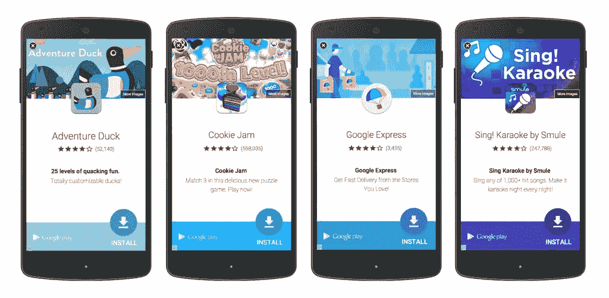
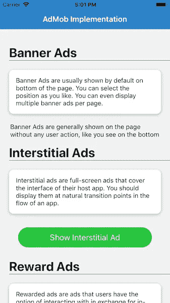
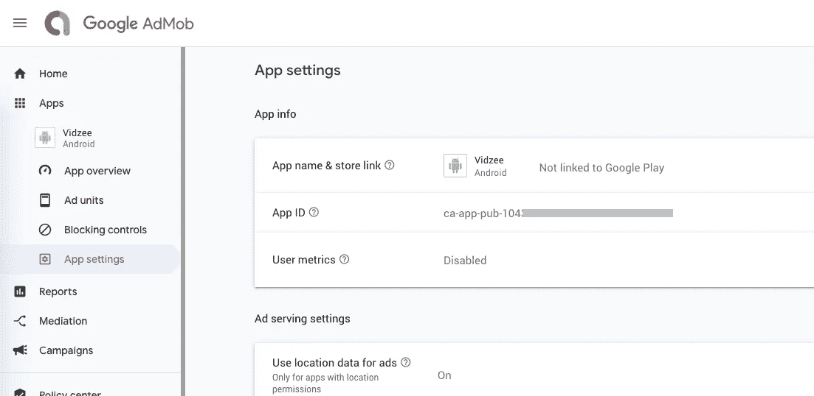
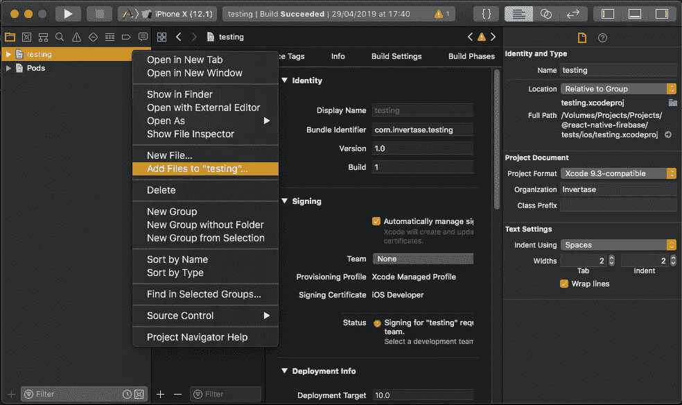
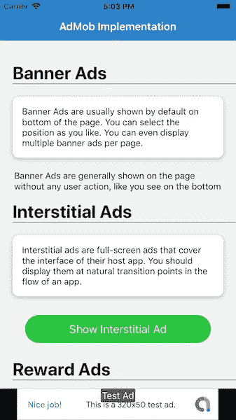
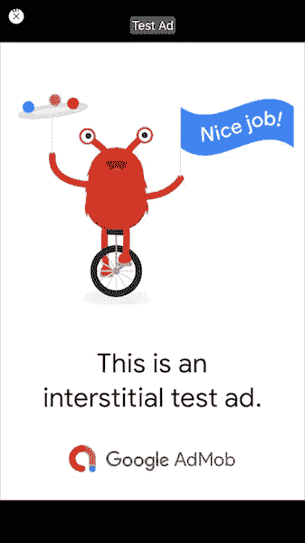
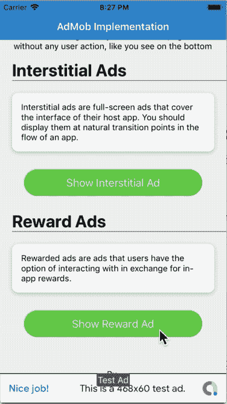

# 在 React Native 中实现 AdMob 与 Firebase

> 原文：<https://javascript.plainenglish.io/implement-admob-in-react-native-with-firebase-4e5000419109?source=collection_archive---------1----------------------->


在这篇文章中，你将学习如何在 React 本地应用中实现 **AdMob 功能，**即谷歌广告。我们将在一个简单的 React 本地应用程序中实现这一点，并在 iOS 模拟器上进行测试。

众所周知，广告是谷歌、脸书、推特等科技巨头的主要收入来源。谷歌广告是最受欢迎的广告之一，谷歌广告的移动版本被称为 AdMob。



An example of Google AdMob ad. The ad is prompting user to install certain app

## AdMob 广告类型

**横幅**:出现在设备屏幕顶部&底部的基本广告格式。

**插页**:整版广告出现在自然间断&过渡处，比如关卡完成。支持视频内容。

**奖励**:整页广告奖励用户观看短视频并与可播放的广告和调查互动。有利于免费游戏用户的货币化。支持视频内容。

**原生**:可定制的广告格式，与你的应用的外观&相匹配。广告与应用程序内容一起出现。支持视频内容。目前，原生广告只能在原生应用中出现，而不能在基于 Ionic 或 React Native 的混合应用中出现。

让我们看看这篇文章的基本框架。**如果你熟悉 React Native 和 Firebase，跳过这些部分，直接看这篇文章的代码部分。**

# 什么是反应原生的

在我们进入博客之前，让我们先澄清一下我们使用的是什么框架。我们正在使用 React Native，这是众多可用的混合应用框架之一。React Native 最接近的对手是 Flutter 和 Ionic。

**TLDR；** — React Native (RN)应用比 Cordova / Ionic 开发的 web 视图应用更“本土”。React Native crates 应用程序的实际 Java 和 Swift 代码，不像 web-view 应用程序本质上运行在一个… web-view 中。

React Native 是一个 JavaScript 框架，用于编写本地呈现的移动应用程序。它基于 React，脸书用于构建用户界面的 JavaScript 库，但它的目标不是浏览器，而是移动平台。因为您编写的大部分代码可以在平台之间共享，React Native 使同时为 Android 和 iOS 开发变得很容易。

使用真正的移动用户界面组件，而不是网络视图，对本地应用程序进行渲染，看起来和感觉都像任何其他本地移动应用程序。reactor Native 还公开了平台 API 的 JavaScript 接口，因此您的 reactor Native 应用程序可以访问手机摄像头或用户位置等平台功能。[脸书](http://bit.ly/1YipO7A)、 [Palantir](http://bit.ly/1PPEiZH) 、 [TaskRabbit](http://bit.ly/1PPEjNg) 等公司已经在面向用户的应用中使用它。

# 什么是火焰基地

如果您对 Firebase 了解不多，那么您需要了解最新的技术新闻。Firebase 是当今市场上最受欢迎的产品。人们可以使用 Firebase 创建快速的移动应用后端，带有大量内置的和随时可以集成的功能。

Firebase 提供的一些快速集成包括

*   电子邮件身份验证
*   社交登录
*   实时数据库
*   分析学
*   防撞装置
*   推送通知
*   应用内消息
*   远程配置

还有更多。Firebase 正在迅速成长，成为最受欢迎的移动应用后端平台。

# 那么，为什么要将 AdMob 与 Firebase 一起使用呢？

嗯，嗯，对 AdMob 来说，使用 Firebase 并不是很有必要。您可以独立于 Firebase 将 AdMob 集成到您的应用程序中。我使用 Firebase 连接的 AdMob 有两个原因

*   我已经使用转化酶反应原生火焰酶插件相当长一段时间了。他们有很好的文档，所以我对他们的产品有信心。它们的 AdMob 依赖性反过来又依赖于 reaction-Native fire ase。因此。
*   Firebase 和 AdMob 连接后，您可以查看关于您的 AdMob 活动的精彩见解。具体说明请参见此处视频。

或者，您可以使用其他 React-Native AdMob 依赖项在您的 React Native 应用程序中显示广告。我以后可能会在我的博客中报道其中一个。

故事讲够了，让我们深入探讨——如何在 React Native 应用程序中实现 AdMob

# 员额结构

我们将逐步探索 AdMob 的功能实现。这是我对博客的分解

**步骤**

1.  创建一个 Firebase 项目并获取所需信息
2.  创建一个简单的反应本地应用程序
3.  设置您的 AdMob 帐户
4.  设置 AdMob 相关性
5.  在您的 RN 应用程序中实施不同类型的广告
6.  在 iOS 设备上构建应用程序并测试

所以让我们开始吧！


I made you laugh … didn’t I ? 😆

# 第 1 步-创建 Firebase 项目

对于 Admob 实现，我们从 Firebase 项目中需要的只是——`GoogleService-Info.plist`文件(对于 iOS)或`google-services.json`文件(对于 Android)

遵循以下步骤

*   登录[火焰基地控制台](http://console.firebase.google.com)
*   创建 Firebase 项目
*   添加一个 iOS 应用程序(或 Android 应用程序)，注册捆绑包 id，并为您的应用程序命名
*   下载`GoogleService-Info.plist`。我们将在项目的后期需要这个文件

如果你需要的话，按照[这个](https://youtu.be/6juww5Lmvgo)视频进行以上步骤。

# 步骤 2 —创建基本的 React 本机应用程序

首先，根据[官方文档](https://facebook.github.io/react-native/docs/getting-started.html)，确保你具备创建一个 react-native 应用的所有先决条件。

> ***在发这个帖子的时候，我已经 React-Native 版本 0.62 &节点 12 . 14 . 0***

创建一个空白的 react-native 应用程序

```
$ react-native init AdMob
```

这将创建一个基本的 React-native 应用程序，您可以在设备或模拟器中运行它。(安卓或 iOS)

我们将创建一个简单的页面，几个按钮将触发广告。虽然横幅广告一般不需要触发器，但插播广告和奖励广告需要触发器。这些触发器通常是游戏应用程序中某个关卡的完成等。我的广告页面的基本用户界面如下所示



Basic UI for AdMob implementation in React Native — iOS

# 步骤 3 —设置您的 Admob 帐户

*   注册然后在[https://apps.admob.com](https://apps.admob.com/?utm_source=internal&utm_medium=et&utm_campaign=helpcentrecontextualopt&utm_term=http://goo.gl/6Xkfcf&subid=ww-ww-et-amhelpv4)登录你的 AdMob 账户。
*   点击侧边栏中的**应用**。
*   点击**添加应用**添加新应用，或点击**查看所有应用**搜索您添加到 AdMob 的所有应用列表。
*   在**应用设置**选项中，您可以看到您的**应用 ID** 。这是您将应用程序连接到 React 原生应用程序中的 Google AdMob 所需的 ID。



Note down your App ID from App Setting in Google AdMob

*   在**广告单元**部分，您可以添加多种类型的广告单元。有关添加广告单元的更多详细信息，请查看以下详细的分步说明

— [横幅广告](https://support.google.com/admob/answer/7311346?hl=en)

[—插播广告](https://support.google.com/admob/answer/7311435?hl=en&ref_topic=7382891)

— [悬赏广告](https://support.google.com/admob/answer/7311747?hl=en&ref_topic=7382891)

AdMob 有很多其他的设置，比如你的广告应该如何、何时以及在哪里出现，但这些都是以后的事了。在本帖中，我们将讨论限制在**“如何在 React 原生应用中显示基本广告单元”**

# 步骤 4 —安装 AdMob 依赖项并实施

在这篇文章中，正如我之前解释的，我们使用 AdMob 和 Firebase。我们为此使用的依赖项是 [React-Native Firebase](https://invertase.io/oss/react-native-firebase/) 。这个主依赖项包含几个服务模块，AdMob 是其中之一。

## 4.1 为 iOS 安装 React-Native Firebase

在您现有的 React 本机应用程序中，使用

```
**$ yarn add @react-native-firebase/app** # For iOS 
**cd ios && pod install**
```

## 4.2 在 Xcode 中导入 Firebase 配置文件

接下来，在 Xcode 编辑器中打开项目(`/ios/{projectName}.xcworkspace`)。通过右键单击项目名称并将“Add files”添加到项目中，将您的`GoogleService-Info.plist`文件添加到项目中，如下所示。确保“如果需要，复制项目”复选框已启用。



## 4.3 在 Xcode 中初始化 Firebase

在您的项目`/ios/{projectName}/AppDelegate.m`中打开 AppDelegate 文件。在文件的顶部导入 Firebase 模块:

```
#import <Firebase.h>
```

在`didFinishLaunchingWithOptions`方法中，添加`configure`方法:

```
- (BOOL)application:(UIApplication *)application didFinishLaunchingWithOptions:(NSDictionary *)launchOptions {
**if ([FIRApp defaultApp] == nil) {
  [FIRApp configure];
}**
....
```

通过运行命令重新生成项目

```
$ cd ios/
$ pod install --repo-update
```

## 4.4 安装 AdMob 依赖项

使用安装模块

```
$ yarn add @react-native-firebase/admob
# For iOS
cd ios/ && pod install
```

完成后，使用以下命令在 iOS 设备中重新运行您的项目

```
$ react-native run-ios
```

或者使用 Xcode 运行。

以上步骤经常会导致一些小错误。如果应用程序启动不好，检查这些

*   清理您的项目并重新构建
*   确保您拥有最新的 CocoaPods 版本
*   确保您的 PodFile 将依赖关系描述为

```
pod ‘RNFBAdMob’, :path => ‘../node_modules/@react-native-firebase/admob’
```

## 4.5 添加您的 AdMob 应用 ID

AdMob 模块需要使用我们在**步骤 3** 中记下的应用 ID 连接到您自己的 Google AdMob 帐户

将 ID 添加到您的根级`firebase.json`文件(在`react-native`对象下创建一个)中，如下所示

```
{
"react-native": {
  "admob_android_app_id": "ca-app-pub-xxxxxxxx~xxxxxxxx",
  "admob_ios_app_id": "ca-app-pub-xxxxxxxx~xxxxxxxx" 
 }
}
```

重新构建应用程序以使更改生效。

# 第 5 步——在应用程序中实现不同类型的广告

一旦一切都设置好了，让我们在应用程序中实现不同类型的广告。

## 横幅广告

横幅广告本身就是一个`<BannerAd>`标签。你可以把它放在你的 React 本地应用中，就像其他标签一样。确保您导入了依赖项

```
import { TestIds, BannerAd, BannerAdSize} from '@react-native-firebase/admob';
```

我在页面底部的`View`位置导入了横幅广告，如下图所示

```
<**BannerAd**
 unitId={TestIds.BANNER}
 size={BannerAdSize.SMART_BANNER}
 requestOptions={{
 requestNonPersonalizedAdsOnly: true,}}
 onAdLoaded={() => {
 console.log('Advert loaded');}}
 onAdFailedToLoad={(error) => {
 console.error('Advert failed to load: ', error);}}
/>
```

在这里，我使用了一个测试 ID `TestIds.BANNER`。这使用 AdMob 提供的默认测试 ID。当您发布应用程序时，您将使用您的制作广告单位 ID 替换它

> **不要在您的生产应用程序中使用测试 ID，也不要在开发应用程序时使用您的生产广告单元 ID**

最终的广告看起来像这样



AdMob Banner Ad in React Native app

## 间隙广告

插播广告是一个触发器。因为这些是全页广告，所以它们并不总是作为横幅广告出现。

要实现间隙广告，请导入所需的依赖项并遵循下面的代码

Interstitial Admob Ads in react native app

同样，`TestIds.INTERSTITIAL`是一个测试 ID。发布应用程序时，将其替换为生产广告 ID。

`.load()`方法加载广告。这个广告需要一些时间来加载。这就是为什么`.show()`在`LOADED`事件中被调用。如果你在`.load()`之后立即调用`.show()`方法，这个 app 就会崩溃。

最后`.show()`全屏显示广告，如下图



Admob interstitial ad in React Native app

## 奖励广告

还是那句话，悬赏广告在触发机制上类似于插播广告。要实现，请导入所需的依赖项并遵循下面的代码

同样，`TestIds.REWARDED`是一个测试 ID。发布应用程序时，将其替换为生产广告 ID。

`.load()`加载广告的方法。这个广告需要一些时间来加载。这就是为什么在`LOADED`事件中调用`.show()`的原因。如果在`.load()`之后立即调用`.show()`方法，app 会崩溃。

奖励广告也有一个`.EARNED_REWARD`事件，当奖励广告抛出回调时(通常是当用户已经看到广告的所需长度时)调用该事件。这次回拨后，你可以向用户提供奖励。

最后`.show()`全屏显示广告。悬赏广告会是这样的



Admob reward ads in React native app

# 步骤 6:在设备上测试应用程序

要运行 iOS 应用程序，您应该指定模拟器

```
$ react-native run-ios --simulator=”iPhone X”
```

要运行 Android 应用程序，您应该首先通过 Android Studio 或`adb`启动模拟器(或连接设备)，然后调用

```
$ react-native run-android
```

Tada！你已经学会了如何在你的 React 原生应用中实现 AdMob 广告。🎉

# 结论

在这篇博客中，我们学习了如何在 React Native app 中实现 Google AdMob 功能。对于用户希望从广告点击中获得一些收入的应用程序来说，AdMob 功能是必不可少的。当你的应用程序有大量用户，并且你不为应用程序中的任何东西向用户收费时，这就很方便了。所以广告成为你的直接收入来源。你也可以将插播广告和奖励广告与应用内奖励相结合，如游戏升级、额外生命等。

> ***本教程的完整源代码可见于***[***react-native-admob***](https://github.com/rathoreabhijeet/react-native-admob)

本文最初发表于 [Enappd](https://enappd.com) 。