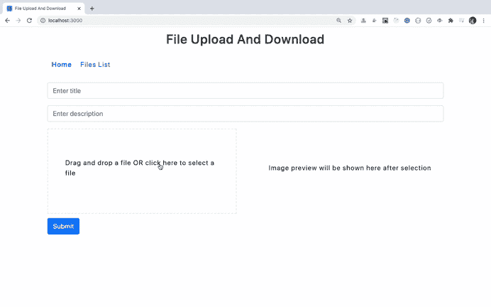
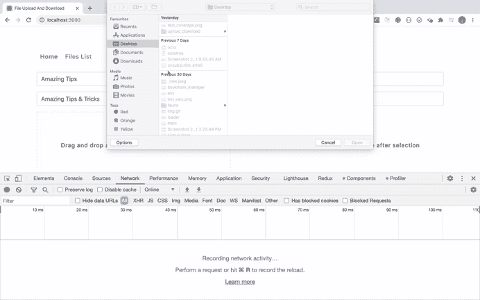

# 建立带有图像预览的文件上传/下载功能

> 原文：<https://javascript.plainenglish.io/implement-file-upload-and-download-functionality-using-mern-stack-with-image-preview-685bb989f4e8?source=collection_archive---------1----------------------->

## 并学习如何添加拖放功能来上传任何类型文件


File Upload

# 介绍

在本文中，我们将创建一个文件上传和下载功能，并使用 MERN 堆栈预览图像。

通过创建此应用程序，您将了解到

*   如何使用拖放上传文件
*   如何上传和下载任何类型的文件
*   如何在上传时限制文件的类型
*   如何在上传时限制文件的大小
*   如何在选择图像后显示预览
*   如何使用 MongoDB 存储和获取文件的细节

还有更多。

> *我们不是将文件以 base64 编码的形式存储在 MongoDB 数据库中，而是将文件存储在服务器上，并且只存储文件在数据库中的路径，以保持数据库较小，并根据需要轻松访问和移动文件。*

我们使用一个非常流行的 [react-dropzone](https://www.npmjs.com/package/react-dropzone) npm 库来实现拖放功能。

对于实际的文件上传，我们使用的是非常流行的 npm 库。

我们将使用 React Hooks 来构建这个应用程序，所以如果您不熟悉它，请查看我以前的文章[这里](https://levelup.gitconnected.com/an-introduction-to-react-hooks-50281fd961fe?source=friends_link&sk=89baff89ec8bc637e7c13b7554904e54)是关于 Hooks 的介绍。

我们将使用`MongoDB`数据库，所以请确保您按照我之前的文章[在这里](https://levelup.gitconnected.com/how-to-install-mongodb-database-on-local-environment-19a8a76f1b92?source=friends_link&sk=416b443bad1f86b292e4b72602cf5c9b)安装它

# 初始设置

使用`create-react-app`创建一个新项目

```
create-react-app react-upload-download-files
```

项目创建完成后，删除`src`文件夹中的所有文件，在`src`文件夹中创建`index.js`和`styles.scss`文件。同样，在`src`文件夹中创建`components`、`router`和`utils`文件夹。

安装必要的依赖项:

```
yarn add axios@0.20.0 bootstrap@4.5.2 downloadjs@1.4.7 node-sass@4.14.1 react-bootstrap@1.3.0 react-dropzone@11.2.0 react-router-dom@5.2.0
```

打开`styles.scss`，将[这里](https://github.com/myogeshchavan97/react-upload-download-files/blob/master/src/styles.scss)的内容加入其中。

# 创建初始页面

在`components`文件夹中创建一个名为`Header.js`的新文件，内容如下:

```
import React from 'react';
import { NavLink } from 'react-router-dom';const Header = () => {
  return (
    <div className="header">
      <h1>File Upload And Download</h1>
      <nav>
        <NavLink activeClassName="active" to="/" exact={true}>
          Home
        </NavLink>
        <NavLink activeClassName="active" to="/list">
          Files List
        </NavLink>
      </nav>
    </div>
  );
};export default Header;
```

在`components`文件夹中创建一个名为`App.js`的新文件，内容如下:

```
import React, { useState, useRef } from 'react';
import { Form, Row, Col, Button } from 'react-bootstrap';const App = (props) => {
  const [file, setFile] = useState(null); // state for storing actual image
  const [previewSrc, setPreviewSrc] = useState(''); // state for storing previewImage
  const [state, setState] = useState({
    title: '',
    description: ''
  });
  const [errorMsg, setErrorMsg] = useState('');
  const [isPreviewAvailable, setIsPreviewAvailable] = useState(false); // state to show preview only for images
  const dropRef = useRef(); // React ref for managing the hover state of droppable area const handleInputChange = (event) => {
    setState({
      ...state,
      [event.target.name]: event.target.value
    });
  }; const handleOnSubmit = async (event) => {
    event.preventDefault();
  }; return (
    <React.Fragment>
      <Form className="search-form" onSubmit={handleOnSubmit}>
        {errorMsg && <p className="errorMsg">{errorMsg}</p>}
        <Row>
          <Col>
            <Form.Group controlId="title">
              <Form.Control
                type="text"
                name="title"
                value={state.title || ''}
                placeholder="Enter title"
                onChange={handleInputChange}
              />
            </Form.Group>
          </Col>
        </Row>
        <Row>
          <Col>
            <Form.Group controlId="description">
              <Form.Control
                type="text"
                name="description"
                value={state.description || ''}
                placeholder="Enter description"
                onChange={handleInputChange}
              />
            </Form.Group>
          </Col>
        </Row>
        <Button variant="primary" type="submit">
          Submit
        </Button>
      </Form>
    </React.Fragment>
  );
};export default App;
```

在这个文件中，我们现在呈现一个表单来添加`title`和`description`。我们将在本文后面添加添加文件的选项。

对于每个输入字段，我们添加了一个`handleInputChange`处理程序来更新每个输入字段的状态。我们为每个输入字段添加了一个`name`属性，它与状态变量的名称完全匹配，因此我们能够使用 ES6 速记语法来更新状态。

```
const handleInputChange = (event) => {
  setState({
    ...state,
    [event.target.name]: event.target.value
  });
};
```

在钩子的情况下，状态不会自动合并，所以我们首先扩展状态的所有属性，然后更新相应的输入字段。

在`router`文件夹中创建一个名为`AppRouter.js`的新文件，内容如下:

```
import React from 'react';
import { BrowserRouter, Switch, Route } from 'react-router-dom';
import App from '../components/App';
import Header from '../components/Header';const AppRouter = () => (
  <BrowserRouter>
    <div className="container">
      <Header />
      <div className="main-content">
        <Switch>
          <Route component={App} path="/" exact={true} />
        </Switch>
      </div>
    </div>
  </BrowserRouter>
);export default AppRouter;
```

现在，打开`src/index.js`文件，在里面添加以下内容:

```
import React from 'react';
import ReactDOM from 'react-dom';
import AppRouter from './router/AppRouter';
import 'bootstrap/dist/css/bootstrap.min.css';
import './styles.scss';ReactDOM.render(<AppRouter />, document.getElementById('root'));
```

现在，从终端执行`yarn start`命令启动应用程序。

您将看到以下屏幕:


# 添加文件上传功能

现在，让我们添加从 UI 上传文件的选项。

打开`src/App.js`文件，在提交按钮之前和结束`Row`标签之后，添加以下代码

```
<div className="upload-section">
  <Dropzone onDrop={onDrop}>
    {({ getRootProps, getInputProps }) => (
      <div {...getRootProps({ className: 'drop-zone' })} ref={dropRef}>
        <input {...getInputProps()} />
        <p>Drag and drop a file OR click here to select a file</p>
        {file && (
          <div>
            <strong>Selected file:</strong> {file.name}
          </div>
        )}
      </div>
    )}
  </Dropzone>
  {previewSrc ? (
    isPreviewAvailable ? (
      <div className="image-preview">
        
      </div>
    ) : (
      <div className="preview-message">
        <p>No preview available for this file</p>
      </div>
    )
  ) : (
    <div className="preview-message">
      <p>Image preview will be shown here after selection</p>
    </div>
  )}
</div>
```

这里，我们使用带有 React render props 模式的`DropZone`组件，我们需要在拖放区显示的文本被添加到`DropZone`组件内的输入字段之后。

在`App.js`文件的顶部添加`DropZone`和`axios`的导入。

```
import Dropzone from 'react-dropzone';
import axios from 'axios';
```

在`handleInputChange`处理程序后增加`OnDrop`功能。

```
const onDrop = (files) => {
  const [uploadedFile] = files;
  setFile(uploadedFile); const fileReader = new FileReader();
  fileReader.onload = () => {
    setPreviewSrc(fileReader.result);
  };
  fileReader.readAsDataURL(uploadedFile);
  setIsPreviewAvailable(uploadedFile.name.match(/\.(jpeg|jpg|png)$/));
};
```

在这里，`onDrop`函数接收一个包含被删除或选中文件的文件数组。

我们一次只上传一个文件，所以上传的文件将是可用的文件[0]，所以我们使用数组析构语法来获取该文件值。

```
const [uploadedFile] = files;
```

为了显示图像的预览，我们使用 JavaScript `FileReader` API。

为了将文件转换成`dataURL`，我们调用了`fileReader.readAsDataURL`方法。

一旦文件被成功读取为`dataURL`，就会调用`fileReader`的 onload 函数。

```
fileReader.onload = () => {
  setPreviewSrc(fileReader.result);
};
```

读取操作的结果将在`fileReader`的`result`属性中可用，我们将该属性赋给`previewSrc`状态变量。

我们只显示图像的预览，所以我们检查上传文件的格式是否正确(只有 jpg、jpeg 和 png 图像),并更新`previewAvailable`变量的状态。

```
setIsPreviewAvailable(uploadedFile.name.match(/\.(jpeg|jpg|png)$/));
```

现在，通过运行`yarn start`命令重启应用程序并验证功能。


这里，我们通过浏览添加了一个文件。您甚至可以通过拖放来添加文件，如下所示:


如果您选择了一个文件，而不是一个图像，我们将不会显示消息`No preview available for this file`所指示的预览。



# 添加下降指示

如果您看到了拖放功能，我们没有显示任何文件被放入拖放区的迹象，所以让我们添加它。

我们已经在`App.js`文件中用类`drop-zone`向 div 添加了一个`ref`。

```
<div {...getRootProps({ className: 'drop-zone' })} ref={dropRef}>
```

并且使用`useRef`钩子在顶部创建了`dropRef`变量。

将`onDragEnter`和`onDragLeave`支柱添加到`Dropzone`组件上。

```
<Dropzone
  onDrop={onDrop}
  onDragEnter={() => updateBorder('over')}
  onDragLeave={() => updateBorder('leave')}
>
```

当文件在拖放区上方时会触发`onDragEnter`功能，当文件从拖放区移开时会触发`onDragLeave`功能。

在`handleOnSubmit`处理程序之前的`App`组件内创建一个新的`updateBorder`函数。

```
const updateBorder = (dragState) => {
  if (dragState === 'over') {
    dropRef.current.style.border = '2px solid #000';
  } else if (dragState === 'leave') {
    dropRef.current.style.border = '2px dashed #e9ebeb';
  }
};
```

因为我们已经用类`drop-zone`添加了对 div 的`dropRef`引用，它将指向那个 div，我们可以使用它的`current`属性通过`dropRef.current.style.border`更新拖放区域的边界。

另外，在`onDrop`函数中，在函数的末尾添加下面一行。

```
dropRef.current.style.border = '2px dashed #e9ebeb';
```

因此，当我们将文件放到拖放区域时，边框将恢复到正常状态。

现在，如果您检查应用程序，您将会看到改变边框的拖放效果。


# 调用 API 进行文件上传

在`src/utils`文件夹中创建一个名为`constants.js`的新文件，内容如下

```
export const API_URL = 'http://localhost:3030';
```

我们将很快在`3030`港启动我们的快递服务器，所以我们在这里提到了。

现在，让我们在`App.js`的`handleOnSubmit`处理程序中编写代码来调用后端 API。

用以下代码替换`handleOnSubmit`处理程序

```
const handleOnSubmit = async (event) => {
  event.preventDefault(); try {
    const { title, description } = state;
    if (title.trim() !== '' && description.trim() !== '') {
      if (file) {
        const formData = new FormData();
        formData.append('file', file);
        formData.append('title', title);
        formData.append('description', description); setErrorMsg('');
        await axios.post(`${API_URL}/upload`, formData, {
          headers: {
            'Content-Type': 'multipart/form-data'
          }
        });
      } else {
        setErrorMsg('Please select a file to add.');
      }
    } else {
      setErrorMsg('Please enter all the field values.');
    }
  } catch (error) {
    error.response && setErrorMsg(error.response.data);
  }
};
```

另外，导入文件顶部的`API_URL`。

```
import { API_URL } from '../utils/constants';
```

在`handleOnSubmit`处理程序中，我们首先检查用户是否输入了所有的字段值并选择了文件，我们对`/upload` API 进行 API 调用，这将在下一节中编写。

```
await axios.post(`${API_URL}/upload`, formData, {
  headers: {
    'Content-Type': 'multipart/form-data'
  }
});
```

我们用`formData`对象发出一个`POST`请求，并将`title`、`description`和实际文件发送给 API。

注意，提及多部分/形式数据的内容类型是非常重要的，否则文件将不会被发送到服务器。

# 为文件上传添加服务器端代码

现在，让我们添加上传文件的服务器端功能。

在`react-upload-download-files`文件夹中创建一个名为`server`的文件夹，并从`server`文件夹中执行以下命令

```
yarn init -y
```

这将在`server`文件夹中创建一个`package.json`文件。

从终端的`server`文件夹中执行以下命令，安装所需的依赖项

```
yarn add cors@2.8.5 express@4.17.1 mongoose@5.10.7 multer@1.4.2 nodemon@2.0.4
```

在`server`文件夹中创建一个名为`.gitignore`的新文件，并在其中添加下面一行，这样`node_modules`文件夹就不会被添加到您的 Git 存储库中。

```
node_modules
```

现在在`server`文件夹中创建`db`、`files`、`model`、`routes`文件夹。同样，在`server`文件夹中创建`index.js`。

在`server/db`文件夹中，创建一个新文件`db.js`，内容如下

```
const mongoose = require('mongoose');mongoose.connect('mongodb://127.0.0.1:27017/file_upload', {
  useNewUrlParser: true,
  useUnifiedTopology: true,
  useCreateIndex: true
});
```

在此提供您的`MongoDB`数据库连接详情。`file_upload`是我们将使用的数据库的名称。

在`model`文件夹中创建一个名为`file.js`的新文件，内容如下

```
const mongoose = require('mongoose');const fileSchema = mongoose.Schema(
  {
    title: {
      type: String,
      required: true,
      trim: true
    },
    description: {
      type: String,
      required: true,
      trim: true
    },
    file_path: {
      type: String,
      required: true
    },
    file_mimetype: {
      type: String,
      required: true
    }
  },
  {
    timestamps: true
  }
);const File = mongoose.model('File', fileSchema);module.exports = File;
```

这里，我们定义了集合的模式，因为我们使用了一个非常流行的[mongose](https://mongoosejs.com/)库来处理 MongoDB。我们将在集合中存储`title`、`description`、`file_path`和`file_mimetype`，所以我们在这个文件中描述了每个的类型。

注意，尽管我们已经将模型名称定义为`File`，MongoDB 还是创建了集合的复数版本。因此集合名称将为`files`。

现在，在`routes`文件夹中创建一个名为`file.js`的新文件，内容如下

```
const path = require('path');
const express = require('express');
const multer = require('multer');
const File = require('../model/file');
const Router = express.Router();const upload = multer({
  storage: multer.diskStorage({
    destination(req, file, cb) {
      cb(null, './files');
    },
    filename(req, file, cb) {
      cb(null, `${new Date().getTime()}_${file.originalname}`);
    }
  }),
  limits: {
    fileSize: 1000000 // max file size 1MB = 1000000 bytes
  },
  fileFilter(req, file, cb) {
    if (!file.originalname.match(/\.(jpeg|jpg|png|pdf|doc|docx|xlsx|xls)$/)) {
      return cb(
        new Error(
          'only upload files with jpg, jpeg, png, pdf, doc, docx, xslx, xls format.'
        )
      );
    }
    cb(undefined, true); // continue with upload
  }
});Router.post(
  '/upload',
  upload.single('file'),
  async (req, res) => {
    try {
      const { title, description } = req.body;
      const { path, mimetype } = req.file;
      const file = new File({
        title,
        description,
        file_path: path,
        file_mimetype: mimetype
      });
      await file.save();
      res.send('file uploaded successfully.');
    } catch (error) {
      res.status(400).send('Error while uploading file. Try again later.');
    }
  },
  (error, req, res, next) => {
    if (error) {
      res.status(500).send(error.message);
    }
  }
);Router.get('/getAllFiles', async (req, res) => {
  try {
    const files = await File.find({});
    const sortedByCreationDate = files.sort(
      (a, b) => b.createdAt - a.createdAt
    );
    res.send(sortedByCreationDate);
  } catch (error) {
    res.status(400).send('Error while getting list of files. Try again later.');
  }
});Router.get('/download/:id', async (req, res) => {
  try {
    const file = await File.findById(req.params.id);
    res.set({
      'Content-Type': file.file_mimetype
    });
    res.sendFile(path.join(__dirname, '..', file.file_path));
  } catch (error) {
    res.status(400).send('Error while downloading file. Try again later.');
  }
});module.exports = Router;
```

在这个文件中，我们使用`multer`库来处理文件上传。我们正在创建一个`multer`配置，存储在名为`upload`的变量中。

```
const upload = multer({
  storage: multer.diskStorage({
    destination(req, file, cb) {
      cb(null, './files');
    },
    filename(req, file, cb) {
      cb(null, `${new Date().getTime()}_${file.originalname}`);
    }
  }),
  limits: {
    fileSize: 1000000 // max file size 1MB = 1000000 bytes
  },
  fileFilter(req, file, cb) {
    if (!file.originalname.match(/\.(jpeg|jpg|png|pdf|doc|docx|xlsx|xls)$/)) {
      return cb(
        new Error(
          'only upload files with jpg, jpeg, png, pdf, doc, docx, xslx, xls format.'
        )
      );
    }
    cb(undefined, true); // continue with upload
  }
});
```

`multer`函数以一个对象作为参数，该对象有许多属性，其中一些属性是`storage`、`limits`和`fileFilter`函数。

`multer.diskStorage`函数接受一个带有`destination`和`filename`函数的对象。

这里我们使用 ES6 函数简写语法，所以

```
destination(req, file, cb) {
```

与相同

```
destination: function(req, file, cb) {
```

`destination`和`filename`功能接收三个输入参数，即`req(request)`、`file(actual uploaded file object)`和`cb(callback function)`。

对于回调函数(cb)参数，

*   如果有错误，它将作为第一个参数传递
*   如果没有错误，那么第一个参数将为空或未定义，第二个参数将包含要传递给回调函数的数据。

在`destination`函数中，我们传递将要存储上传文件的文件夹的路径。在我们的例子中，它将是`server`文件夹中的一个`files`文件夹。

在`filename`函数中，我们为每个上传的文件提供我们想要的名字。在我们的情况下，它将是`current_timestamp_name_of_the_file`。

对于`limits`属性，我们指定了上传文件允许的最大文件大小。在我们的例子中，我们提供了 1MB 作为最大文件限制。

然后在`fileFilter`函数中，我们可以决定接受或者拒绝上传的文件。

如果文件扩展名与任一`jpeg|jpg|png|pdf|doc|docx|xlsx|xls`匹配，那么我们允许通过调用回调函数`cb(undefined, true)`来上传文件，否则我们将抛出一个错误。

如果我们在`fileFilter`函数内部调用`cb(undefined, false)`，那么文件将总是被拒绝，不会被上传。

现在，让我们来看看`/upload`路线

```
Router.post(
  '/upload',
  upload.single('file'),
  async (req, res) => {
    try {
      const { title, description } = req.body;
      const { path, mimetype } = req.file;
      const file = new File({
        title,
        description,
        file_path: path,
        file_mimetype: mimetype
      });
      await file.save();
      res.send('file uploaded successfully.');
    } catch (error) {
      res.status(400).send('Error while uploading file. Try again later.');
    }
  },
  (error, req, res, next) => {
    if (error) {
      res.status(500).send(error.message);
    }
  }
);
```

这里，我们将`upload.single`函数作为第二个参数传递给`/upload`路由，这样它将作为一个中间件，在执行函数体之前首先被执行。

注意，`upload.single`的`file`参数必须与在前端上传文件时使用的名称相匹配。

还记得我们之前用于从`App.js`文件进行 API 调用的代码吗？

```
const formData = new FormData();
formData.append('file', file);
```

我们将文件添加到名为`file`的属性内的`formData`中。这必须与`upload.single`参数名匹配，否则文件上传将无法进行。

在函数内部，我们将获得`req.body`中的`title`和`description`以及`req.file`对象中的实际文件，因为我们已经使用了`multer`库。

然后我们将这些值传递给我们创建的`File`模型的对象。

```
const file = new File({
  title,
  description,
  file_path: path,
  file_mimetype: mimetype
});
```

在对象上调用`save`方法实际上会将数据保存在 MongoDB 数据库中。

如果文件类型与`jpeg|jpg|png|pdf|doc|docx|xlsx|xls`不匹配或者文件大小大于我们提到的大小(1MB ),那么将执行下面的代码

```
(error, req, res, next) => {
  if (error) {
    res.status(500).send(error.message);
  }
};
```

我们将错误消息发送回客户端(我们的 React 应用程序)。

现在，打开`server/index.js`文件，在里面添加以下内容。

```
const express = require('express');
const cors = require('cors');
const fileRoute = require('./routes/file');
require('./db/db');const app = express();app.use(cors());
app.use(fileRoute);app.listen(3030, () => {
  console.log('server started on port 3030');
});
```

在这个文件中，我们使用`Express`服务器在端口`3030`上启动 Node.js 应用程序。

我们还将`cors` npm 包用作中间件，因此当我们从运行在端口`3000`上的 React 应用程序向运行在端口`3030`上的 Node.js 应用程序发出 API 调用时，我们不会收到`CORS`错误。

现在，让我们运行应用程序，检查上传功能。

打开`server/package.json`文件，在`scripts`属性中添加`start`脚本。

```
"scripts": {
  "start": "nodemon index.js"
}
```

现在，打开另一个保持 React 终端运行的终端，从`server`文件夹中执行下面的命令

```
yarn start
```

这将启动我们的 Node.js express 服务器，这样我们就可以对它进行 API 调用。

还可以通过从终端运行以下命令来启动 MongoDB 数据库服务器(如果您已经遵循了前面提到的[这篇文章](https://levelup.gitconnected.com/how-to-install-mongodb-database-on-local-environment-19a8a76f1b92?source=friends_link&sk=416b443bad1f86b292e4b72602cf5c9b)

```
./mongod --dbpath=<path_to_mongodb-data_folder>
```

所以现在您将打开三个终端:一个用于 React 应用程序，一个用于 Node.js 服务器，另一个用于 MongoDB 服务器。

现在让我们来验证上传功能。



如您所见，当我们上传一个文件时，它被添加到 files 文件夹中，并且条目也在 MongoDB 数据库中。所以文件上传成功。

但是我们没有在 UI 上显示任何文件已经成功上传的迹象。让我们现在做那件事。

在`components`文件夹中创建一个新文件`FilesList.js`，内容如下

```
import React, { useState, useEffect } from 'react';
import download from 'downloadjs';
import axios from 'axios';
import { API_URL } from '../utils/constants';const FilesList = () => {
  const [filesList, setFilesList] = useState([]);
  const [errorMsg, setErrorMsg] = useState(''); useEffect(() => {
    const getFilesList = async () => {
      try {
        const { data } = await axios.get(`${API_URL}/getAllFiles`);
        setErrorMsg('');
        setFilesList(data);
      } catch (error) {
        error.response && setErrorMsg(error.response.data);
      }
    }; getFilesList();
  }, []); const downloadFile = async (id, path, mimetype) => {
    try {
      const result = await axios.get(`${API_URL}/download/${id}`, {
        responseType: 'blob'
      });
      const split = path.split('/');
      const filename = split[split.length - 1];
      setErrorMsg('');
      return download(result.data, filename, mimetype);
    } catch (error) {
      if (error.response && error.response.status === 400) {
        setErrorMsg('Error while downloading file. Try again later');
      }
    }
  }; return (
    <div className="files-container">
      {errorMsg && <p className="errorMsg">{errorMsg}</p>}
      <table className="files-table">
        <thead>
          <tr>
            <th>Title</th>
            <th>Description</th>
            <th>Download File</th>
          </tr>
        </thead>
        <tbody>
          {filesList.length > 0 ? (
            filesList.map(
              ({ _id, title, description, file_path, file_mimetype }) => (
                <tr key={_id}>
                  <td className="file-title">{title}</td>
                  <td className="file-description">{description}</td>
                  <td>
                    <a
                      href="#/"
                      onClick={() =>
                        downloadFile(_id, file_path, file_mimetype)
                      }
                    >
                      Download
                    </a>
                  </td>
                </tr>
              )
            )
          ) : (
            <tr>
              <td colSpan={3} style={{ fontWeight: '300' }}>
                No files found. Please add some.
              </td>
            </tr>
          )}
        </tbody>
      </table>
    </div>
  );
};export default FilesList;
```

在这个文件中，最初在`useEffect`钩子内部，我们对`/getAllFiles` API 进行 API 调用。

来自`routes/file.js`的`/getAllFiles` API 如下所示:

```
Router.get('/getAllFiles', async (req, res) => {
  try {
    const files = await File.find({});
    const sortedByCreationDate = files.sort(
      (a, b) => b.createdAt - a.createdAt
    );
    res.send(sortedByCreationDate);
  } catch (error) {
    res.status(400).send('Error while getting list of files. Try again later.');
  }
});
```

在这里，我们调用`File`模型上的`mongoose`库的`.find`方法来获取添加到数据库中的所有文件的列表，然后我们按照`createdAt`日期以降序对它们进行排序，因此我们将在列表中首先获取最近添加的文件。

然后我们将 API 的结果分配给状态中的`filesList`数组

```
const { data } = await axios.get(`${API_URL}/getAllFiles`);
setErrorMsg('');
setFilesList(data);
```

然后，我们使用数组映射方法遍历数组，并在 UI 上以表格格式显示它们。

我们还在表格中添加了一个下载链接。当我们点击`download`链接时，我们正在调用`downloadFile`函数

```
const downloadFile = async (id, path, mimetype) => {
  try {
    const result = await axios.get(`${API_URL}/download/${id}`, {
      responseType: 'blob'
    });
    const split = path.split('/');
    const filename = split[split.length - 1];
    setErrorMsg('');
    return download(result.data, filename, mimetype);
  } catch (error) {
    if (error.response && error.response.status === 400) {
      setErrorMsg('Error while downloading file. Try again later');
    }
  }
};
```

在`downloadFile`函数中，我们调用了`/download/:id` API。注意，我们将`responseType`设置为`blob`。这一点非常重要，否则您将无法获得正确格式的文件。

来自`routes/file.js`文件的`/download` API 如下所示:

```
Router.get('/download/:id', async (req, res) => {
  try {
    const file = await File.findById(req.params.id);
    res.set({
      'Content-Type': file.file_mimetype
    });
    res.sendFile(path.join(__dirname, '..', file.file_path));
  } catch (error) {
    res.status(400).send('Error while downloading file. Try again later.');
  }
});
```

这里，首先，我们用提供的`id`检查是否存在任何这样的文件。如果它存在，那么我们首先通过设置文件的`content-type`来发送回存储在`files`文件夹中的文件。

设置`content-type`对于获得正确格式的文件非常重要，因为我们不仅上传图像，还上传 doc、xls 和 pdf 文件。因此，为了正确发送回文件内容，需要使用`content-type`。

一旦我们从`downloadFile`函数中的`/download` API 得到响应，我们就调用由 [downloadjs](https://www.npmjs.com/package/downloadjs) npm 库提供的`download`函数。

`downloadjs`是一个非常受欢迎的库，可以下载任何类型的文件。你只需要提供文件内容，它的内容类型和文件名，你希望文件下载时，它将触发浏览器的下载功能。

现在，打开`router/AppRouter.js`文件，为`FilesList`组件添加一条路径。

您的`AppRouter.js`文件现在看起来像这样:

```
import React from 'react';
import { BrowserRouter, Switch, Route } from 'react-router-dom';
import App from '../components/App';
import Header from '../components/Header';
import FilesList from '../components/FilesList';const AppRouter = () => (
  <BrowserRouter>
    <div className="container">
      <Header />
      <div className="main-content">
        <Switch>
          <Route component={App} path="/" exact={true} />
          <Route component={FilesList} path="/list" />
        </Switch>
      </div>
    </div>
  </BrowserRouter>
);export default AppRouter;
```

现在，打开`src/App.js`，在调用`/upload` API 后，在`handleOnSubmit`处理程序中添加一条语句，将用户重定向到`FilesList`组件

```
await axios.post(`${API_URL}/upload`, formData, {
  headers: {
    'Content-Type': 'multipart/form-data'
  }
});
props.history.push('/list'); // add this line
```

所以现在，一旦文件被上传，我们将被重定向到`FilesList`组件，在那里我们将看到上传的文件列表。

如果上传文件时出现错误，您将在 UI 上看到错误消息，并且您不会被重定向到列表页面。

假设您已经在两个单独的终端中执行了`yarn start`命令，用于启动 React 和 Node.js 应用程序，并在另一个终端中运行 MongoDB 服务器。现在，让我们验证应用程序的功能。

# 上传图像文件演示


# 上传 PDF 文件演示


# 上传 Excel 文件演示


# 上传文档文件演示


# 上传不支持的文件演示


如您所见，我们能够成功上传和下载我们支持的格式列表中的任何类型的文件。

# 消除对 CORS 的需求

如前所述，为了在从 React 应用程序向 Node.js 应用程序调用 API 时避免出现 CORS 错误，我们在服务器端使用了`cors`库，如下所示:

```
app.use(cors());
```

尝试从文件中删除这一行，您将看到从 React 到 Node.js 的 API 调用失败。


为了防止这个错误，我们使用了 cors 中间件。但正因为如此，世界上的任何人都可以从他们的应用程序直接访问我们的 API，出于安全原因，这并不好。

因此，为了消除对 cors 的需要，我们将在同一个端口上运行 Node.js 和 React 应用程序，这也将消除运行两个独立命令的需要。

所以首先从`server/index.js`文件中删除`cors`的使用，同时删除`cors`的`require`语句。

然后在`app.use(fileRoute)`语句前添加以下代码。

```
app.use(express.static(path.join(__dirname, '..', 'build')));
```

这里，我们告诉 express 静态地提供构建文件夹的内容。

当我们为 React 应用程序运行`yarn build`命令时，将会创建构建文件夹。

要详细了解这实际上是如何工作的，请点击这里查看我以前的文章

并在文件顶部导入`path` Node.js 包。

```
const path = require('path');
```

您的`server/index.js`文件现在看起来像这样:

```
const express = require('express');
const path = require('path');
const fileRoute = require('./routes/file');
require('./db/db');const app = express();app.use(express.static(path.join(__dirname, '..', 'build')));
app.use(fileRoute);app.listen(3030, () => {
  console.log('server started on port 3030');
});
```

现在，打开主`package.json`文件，在`scripts`部分添加`start-app`脚本。

```
"scripts": {
    "start": "react-scripts start",
    "build": "react-scripts build",
    "test": "react-scripts test",
    "eject": "react-scripts eject",
    "start-app": "yarn build && (cd server && yarn start)"
  },
```

现在，假设您已经启动了 MongoDB 服务器，您只需要从终端运行`yarn run start-app`命令。

该命令将创建一个包含所有 React 应用程序的`build`文件夹，然后在端口`3030`上启动 Node.js 服务器。

所以现在，我们可以在同一个`3030`端口上访问 React 和 Node.js 应用程序。因此不需要运行两个单独的命令，您可以在 [http://localhost:3030/](http://localhost:3030/) 访问应用程序

但是有一个问题，如果你刷新`/list`页面，你会得到一个 404 错误。这是因为我们正在使用 Express 服务器启动应用程序，所以当我们到达`/list`路线时，它会去服务器检查该路线。

但是服务器不包含这样一条路线，但是我们的反应应用程序有这条路线，所以为了解决这个问题，我们需要添加一些代码。

打开`server/index.js`文件，在`app.listen`调用前，添加如下代码。

```
app.get('*', (req, res) => {
  res.sendFile(path.join(__dirname, '..', 'build', 'index.html'));
});
```

当我们遇到服务器端不存在的任何路由时，上面的代码将把`build/index.html`文件发送回我们的反应应用程序。

因此，由于服务器端不存在`/list`路由，当我们将用户重定向到`index.html`文件时，out React 应用程序将处理该路由。

所以确保在所有服务器端路由之后添加上述代码行，因为`app.get`中的`*`将匹配任何路由。

您的最终`server/index.js`文件现在将如下所示:

```
const express = require('express');
const path = require('path');
const fileRoute = require('./routes/file');
require('./db/db');const app = express();app.use(express.static(path.join(__dirname, '..', 'build')));
app.use(fileRoute);app.get('*', (req, res) => {
  res.sendFile(path.join(__dirname, '..', 'build', 'index.html'));
});app.listen(3030, () => {
  console.log('server started on port 3030');
});
```

现在，通过运行`yarn run start-app`命令重启你的应用程序，现在刷新`/list`路线不会给你 404 错误。

# 结论

我们现在已经完成了使用 MERN 堆栈创建完整的文件上传和下载功能。

您可以在[这个信息库](https://github.com/myogeshchavan97/react-upload-download-files)中找到这个应用程序的完整源代码。

**不要忘记订阅我的每周时事通讯，在这里直接在您的收件箱** [**中找到惊人的技巧、窍门和文章。**](https://yogeshchavan.dev/)