# 如何用 Vue、Vuetify 和 Axios 构建 web app

> 原文：<https://javascript.plainenglish.io/implement-movie-app-with-vue-vuetify-axios-open-movie-database-api-d12290318cf9?source=collection_archive---------0----------------------->

## 跟随我们用 Vue、Axios、Vuetify 和开放电影数据库 API 构建一个电影数据库应用程序

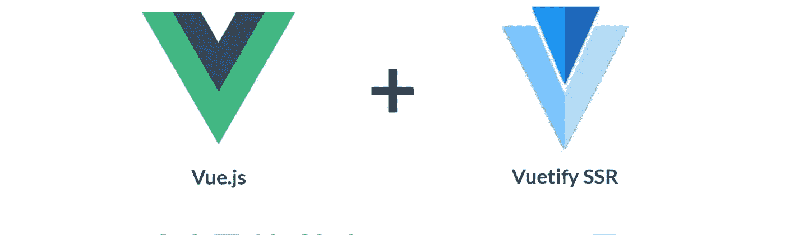

# 介绍

在本文中，我们将构建一个由 Vuetify 和 Axios 支持的 Vue.js 应用程序。本文的目的是实现一个调用 API 的电影应用程序。用户将能够搜索电影。API 将检索包含所有搜索细节的电影。当用户点击一部电影时，它会给出每部电影的更多细节。这是一个相当简单的应用程序，但它将解释从 Vue.js 应用程序调用 API 的用例。

# 内容

1.  为什么选择 Axios？
2.  为什么要 Vuetify？
3.  电影 API 简介
4.  调用和测试 API 和测试。
5.  创建应用程序
6.  应用程序的要求和结构
7.  将 Vuetify 添加到项目中
8.  将 vue 路由器添加到项目中
9.  将 axios 添加到项目中
10.  移除当前脚手架组件
11.  创建最新电影组件
12.  实现电影组件
13.  显示评级
14.  添加搜索电影组件
15.  搜索电影的问题以及我们如何纠正它
16.  如果 API 中没有搜索数据，则添加警告消息
17.  为 axios/重构创建中心文件
18.  包装和源代码

# 1.为什么选择 Axios？

在 Vue.js App 中，我们可以显示来自外部 API 的数据。这可以通过 vue-resource 和 axios 来实现。Axios 是一个第三方库，也是一个流行的库。[这里是 Axios 配合 Vue.js](https://vuejs.org/v2/cookbook/using-axios-to-consume-apis.html) 使用的官方链接。

这里需要注意的重要一点是，在官方文档中没有关于将 axios 安装到 Vue.js 应用程序的细节。我们将在第 9 节讨论这个问题:*将 axios 添加到项目*。

# 2.为什么要 Vuetify？

Vuetify 是一个建立在 Vue.js 之上的材质设计框架。它有很好的 UI 组件，可以很容易地在 Vue.js 上使用。

# 3.电影 API 简介

【http://www.omdbapi.com/ 

omdbapi 是一个开放免费的电影数据库 api，它也将提供电影的细节和图片。主要缺点是大多数图像不是很清楚，但它会做到这一点。还有 API 支持。

为了使用这个 API，首先需要注册，他们会提供一个 API 密匙通过邮件发给你。这可以用于每个查询结果。

需要传递密钥和特殊字符串。s 代表搜索当传递 ***s="Indiana"*** 时，API 将检索所有包含 Indiana 的数据。此外， ***i*** 代表将返回具有 imbd id 的电影，因此只返回一个，因为它是唯一的。我们在这里用****【我】*** 进行演示。*

# *4.调用和测试 API 和测试*

*为了检查我们在调用 omdbapi 时会收到什么，可以使用 postman 工具或任何 api 测试机制进行测试。在这里，我使用邮递员。*

*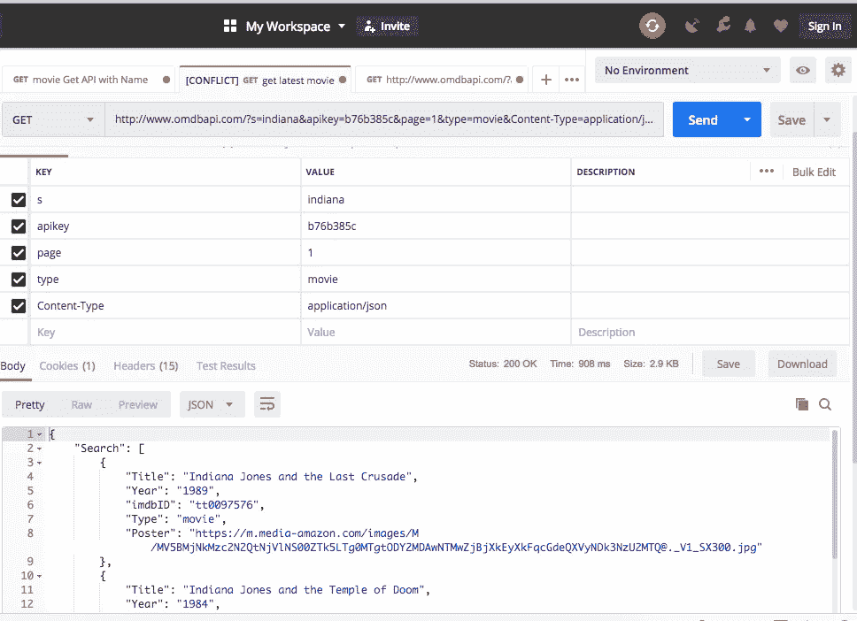*

*正如您在图像中看到的，需要传递 apikey=XXXX 和 s= "电影名称"*

*所以网址变成了*

> *[http://www.omdbapi.com/?s=movie-name&API key = XXXX&page = 1&Type =电影&Content-Type = application/JSON](http://www.omdbapi.com/?s=indiana&apikey=b76b385c&page=1&type=movie&Content-Type=application/json)*

*太棒了，我们很好，现在我们可以继续创建一个应用程序，并在 axios 上工作。*

# *5.创建应用程序*

*创建 Vue js 应用程序是通过一个简单命令完成的*

```
*vue create movie-app*
```

*电影应用是我们的应用名称。*

*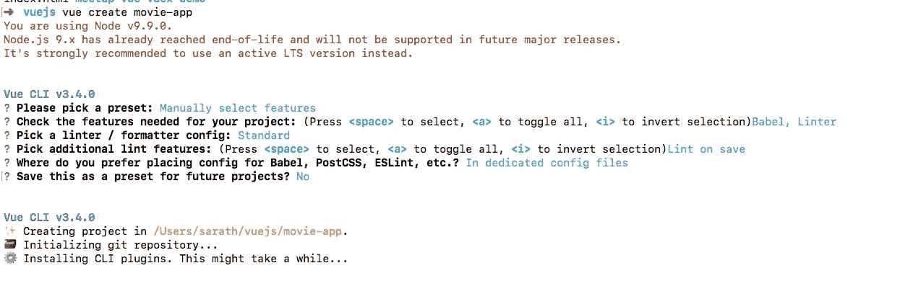*

# *6.应用程序的要求和结构*

*应用程序的结构有 3 个组成部分。*

1.  *最新电影组件。*
2.  *电影成分。*
3.  *SearchMovie 组件。*

*LatestMovie 组件将有当前主页，我将显示与我最喜欢的电影“印第安纳”相关的电影*

*单击每部电影，将显示每部电影的详细信息，这可以通过使用电影组件来完成。*

*提供了搜索和显示这些电影的选项，可以由 SearchMovie 组件处理。*

# *7.将 Vuetify 添加到项目中*

*正如已经讨论过的，我们在应用程序的设计中使用了 Vuetify。需要为此做一些基础工作。在终端上，键入*

```
*vue add vuetify*
```

*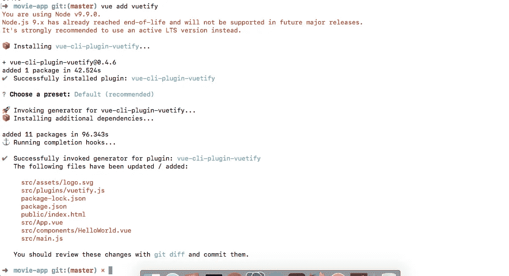*

*安装后，我们的前端将如下所示:*

*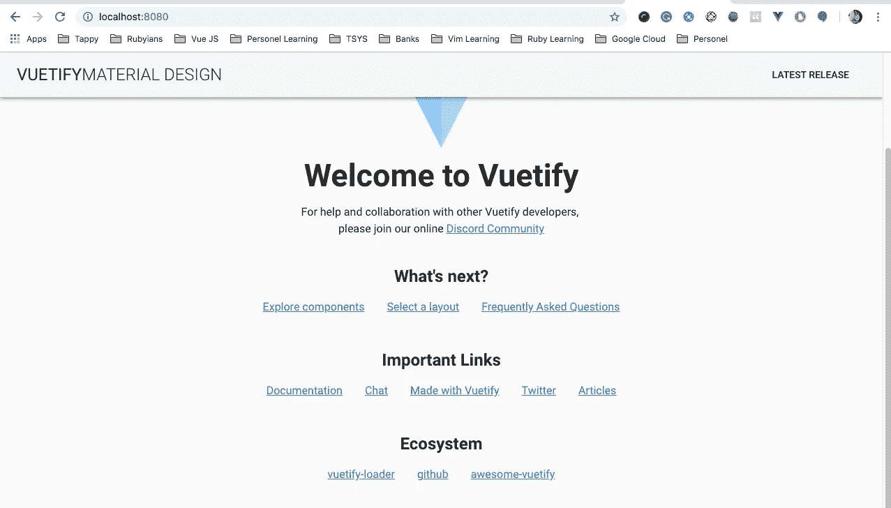*

*太棒了，他们还提供了导航条。然后将继续。*

# *8.将 vue 路由器添加到项目中*

*将解释我们为什么需要 vue 路由器，它将毫不费力地完成路由功能和组件交换。安装 vue 路由器的步骤如下*

```
*npm install vue-router*
```

*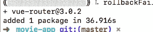*

*现在，需要将路由器链接到应用程序并创建一个路由文件。*

1.  *创建路由器文件*
2.  *向路由器文件添加内容*
3.  *将路由器链接到应用程序*

****1。创建一个路由器文件****

*我遵循一个模式，在 src 路径中创建一个名为 ***router*** 的文件夹，并在其中创建一个 ***index.js*** 文件*

**

***②*。将内容添加到路由器文件****

*到目前为止，我们创建了一个 router/index.js 文件，现在需要导入 Vue 实例和 vue-router 到该文件，还需要导出默认的路由器文件。*

*每个路由器路径会有 3 个组件: ***路径，名称，组件。****

```
*import Vue from 'vue'
import VueRouter from 'vue-router'Vue.use(VueRouter)export default new VueRouter({
  routes: [
    {
    }
  ]
})*
```

****3。将路由器链接到应用程序****

*首先，需要从 path 导入路由器，并在 Vue 实例中使用它。所有这些都在 src/main.js 文件中完成*

```
*import router from ‘./router’*
```

*当前的 main.js 文件将如下所示:*

```
*import Vue from 'vue'
import './plugins/vuetify'
import App from './App.vue'
import router from './router'Vue.config.productionTip = false
new Vue({
  render: h => h(App),
  router
}).$mount('#app')*
```

# *9.将 axios 添加到项目中*

*Axios 是我们调用此应用程序中的 API 服务的联系点。现在我们需要将 axios 安装到我们的项目中。*

```
*npm install axios --save*
```

*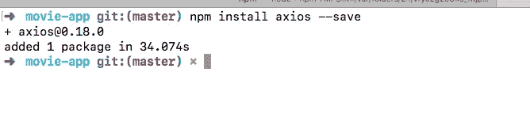*

# *10.移除当前脚手架组件*

*默认情况下，我们有一个组件，将删除该组件并创建我们需要的组件。*

*HelloWorld.vue 是默认组件，将从我们的应用程序中删除它。*

# *11.创建最新电影组件*

*这里需要做一些步骤*

1.  *创建最新的电影。*
2.  *将 axios 添加到最新的电影组件中。*
3.  *将路由器链接到最新电影。*
4.  *为最新电影添加进度条。*
5.  ****创建最新电影****

*在 components 文件夹中创建一个名为 ***LatestMovie.vue*** 的文件。*

****2。将 axios 添加到最新的电影组件中。****

*在这里，我们使用 mounted()生命周期，添加代码以从带有印第安纳电影数据的 omdbapi 获得结果。*

```
*mounted () {
  axios
    .get('[http://www.omdbapi.com/?s=mummy&apikey=XXXXX&page=1&type=movie&Content-Type=application/json'](http://www.omdbapi.com/?s=mummy&apikey=b76b385c&page=1&type=movie&Content-Type=application/json'))
    .then(response => {
      this.wholeResponse = response.data.Search
    })
    .catch(error => {
      console.log(error)
    })
}*
```

****3。将路由器链接到最新电影。****

*现在，我们需要将 ***最新电影*** 链接到路由器文件。*

*在 src/router/index.js 中:*

```
*import LatestMovie from '@/components/LatestMovie'*
```

*将链接添加到 router/index.js:*

```
*export default new VueRouter({
  routes: [
   {
      path: '/',
      name: 'LatestMovie',
      component: LatestMovie
    }
  ]
})*
```

****4。为最新电影*** 添加进度条*

*如果 API 需要时间来检索，我们将需要显示一个进度条。这可以通过使用 vuetify 的*"<v-进度-循环"*来实现。*

*创建了一个数据属性，该属性最初将被设置为 true，之后 API 响应将被设置为 false。*

*另外，另一个名为 wholeResponse 的数据属性将负责处理数据。*

*所以完全我们的***latest movie . vue***就变成了:*

```
*<template><v-container v-if="loading">
    <div class="text-xs-center">
      <v-progress-circular
        indeterminate
        :size="150"
        :width="8"
        color="green">
      </v-progress-circular>
    </div>
  </v-container><v-container v-else grid-list-xl>
    <v-layout wrap>
      <v-flex xs4
        v-for="(item, index) in wholeResponse"
        :key="index"
        mb-2>
        <v-card>
          <v-img
            :src="item.Poster"
            aspect-ratio="1"
          ></v-img><v-card-title primary-title>
            <div>
              <h2>{{item.Title}}</h2>
              <div>Year: {{item.Year}}</div>
              <div>Type: {{item.Type}}</div>
              <div>IMDB-id: {{item.imdbID}}</div>
            </div>
          </v-card-title><v-card-actions class="justify-center">
            <v-btn flat
              color="green"
              [@click](http://twitter.com/click)="singleMovie(item.imdbID)"
              >View</v-btn>
          </v-card-actions></v-card>
      </v-flex>
  </v-layout>
  </v-container>
</template><script>
import axios from 'axios'
export default {
  data () {
    return {
      wholeResponse: [],
      loading: true
    }
  },
  mounted () {
  axios
    .get('[http://www.omdbapi.com/?s=indiana&apikey=XXXX&page=1&type=movie&Content-Type=application/json'](http://www.omdbapi.com/?s=indiana&apikey=XXXX&page=1&type=movie&Content-Type=application/json'))
    .then(response => {
      this.wholeResponse = response.data.Search
      this.loading = false
    })
    .catch(error => {
      console.log(error)
    })
  }
}
</script><style lang="stylus" scoped>
  .v-progress-circular
    margin: 1rem
</style>*
```

*现在，将路由器视图添加到 App.vue 以显示组件:*

```
*<router-view></router-view>*
```

# *12.实现电影组件*

*现在，是单部电影的时候了。这可以通过使用 Movie.vue 文件来实现。*

1.  *添加 Movie.vue 文件*
2.  *添加路由器*
3.  *添加模式*
4.  *在路由器中传递道具。*
5.  *传递最新组件中的道具。*
6.  *处理电影组件中的道具数据。*

****添加 Movie.vue 文件****

*将文件添加到 components/Movie.vue 中*

****添加路由器****

*将 Movie.vue 注册到 router/index.js 文件*

```
*import Movie from '@/components/Movie'*
```

****添加模式****

*URL 中有“#”存在，我们可以使用*

```
*mode: 'history'*
```

*在 router/index.js 文件中。*

****在路由器中传递道具。****

*使用 router/index.js 中的以下代码为 Movie.vue 组件创建一个路径*

```
*{
      path: '/movie/:id',
      name: 'Movie',
      props: true,
      component: Movie
    },*
```

*我们提供 props: true，因为我们将 imdb_id 传递给 Movie.vue 组件，然后该值用于调用该单部电影的 API。*

****传递最新组件*** 中的道具*

*现在，在最新的电影中单击视图，将调用方法，该方法将依次将 imdb_id 作为道具传递给 Movie.vue。*

```
*<v-btn round
              color="green"
              [@click](http://twitter.com/click)="singleMovie(item.imdbID)"
              >View</v-btn>*
```

*单一电影的方法是*

```
*methods: {
    singleMovie (id) {
      this.$router.push('/movie/' + id)
    }
  }*
```

****处理电影组件中的道具数据****

*现在，数据是从最新的电影传过来的。该值在 Movie.vue 组件中作为 prop 接收。该值可由 *this.id* 使用*

*此外，还添加了一个名为 singleMovie 的数据属性来处理响应。*

*Movie.vue 中的代码变成了，*

```
*<template>
  <v-container>
    <v-layout row wrap>
      <v-flex xs12>
        <h2>welcome to single movie component</h2>
          <div>{{singleMovie}}</div>
      </v-flex>
    </v-layout>
  </v-container>
</template><script>
import axios from 'axios'
export default {
  props: ['id'],
  data () {
    return {
      singleMovie: ''
    }
  },
  mounted () {
    axios
      .get('[http://www.omdbapi.com/?apikey=b76b385c&i=XXXXX&Content-Type=application/json'](http://www.omdbapi.com/?apikey=b76b385c&i=tt0209163&Content-Type=application/json'))
      .then(response => {
        this.singleMovie = response.data
      })
      .catch(error => {
        console.log(error)
      })
  }
}
</script><style>
</style>*
```

# *13.显示评级*

*omdbapi 将为我们提供电影的当前评级。我们将在表中显示该值，*

*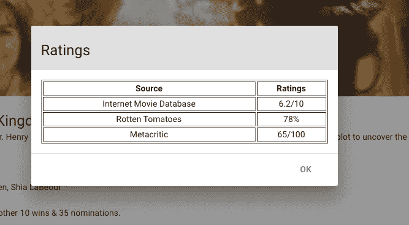*

*为此，将使用模式显示，单击查看评级按钮将调用该模式。*

```
*<template>
<v-layout row wrap>
      <v-flex xs12>
        <div class="text-xs-center">
        <v-dialog
          v-model="dialog"
          width="500">
          <v-btn
            slot="activator"
            color="green"
            dark>
            View Ratings
          </v-btn>
          <v-card>
            <v-card-title
              class="headline grey lighten-2"
              primary-title
            >
              Ratings
            </v-card-title>
            <v-card-text>
              <table style="width:100%" border="1" >
                <tr>
                  <th>Source</th>
                  <th>Ratings</th>
                </tr>
                <tr v-for="(rating,index) in this.ratings" :key="index">
                  <td align="center">{{ratings[index].Source}}</td>
                  <td align="center">{{ratings[index].Value}}</td>
                </tr>
              </table>
            </v-card-text>
            <v-divider></v-divider>
            <v-card-actions>
              <v-spacer></v-spacer>
              <v-btn
                color="primary"
                flat
                [@click](http://twitter.com/click)="dialog = false"
              >
                OK
              </v-btn>
            </v-card-actions>
          </v-card>
        </v-dialog>
      </div>
      </v-flex>
    </v-layout>
  </template>*
```

*我们正在迭代一个叫做 ratings 的数据值。此数据属性来自 API ie r*response . data . ratings .*的响应*

# *14.添加搜索电影组件*

*为此，我们需要创建以下内容:*

1.  *创建 SearchMovie.vue 文件*
2.  *在 App.vue 中创建一个文本字段。*
3.  *单击搜索按钮时，会将文本字段中的数据作为 prop 传递到 SearchMovie.vue 文件。*
4.  *在 SearchMovie.vue 文件中，我们将接收值并调用 API 来获取数据。*

*[为此提交链接](https://github.com/anoobbava/movie-app/commit/1212477d5c4fdb25b0a3ba999f1ca6429e646fec)*

# *15.搜索电影的问题以及我们如何纠正它*

*当前挂载的生命周期钩子只被调用一次，当我们搜索一次时，它显示数据，即当用钢铁侠搜索时，它显示数据。但用“泰坦”搜索后，显示的是同样的数据。这可以通过使用名为 name(来自 App.vue)的数据的 props 上的 watch 属性来修复，并将 mounted 属性更新为一个方法。因此，系统将调用 2 次，即第一次由挂载的生命周期钩子加载，第二次搜索将由 props(name)值的 watcher 操作处理。*

*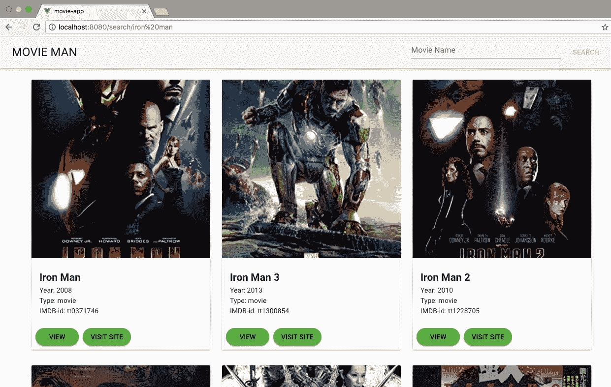**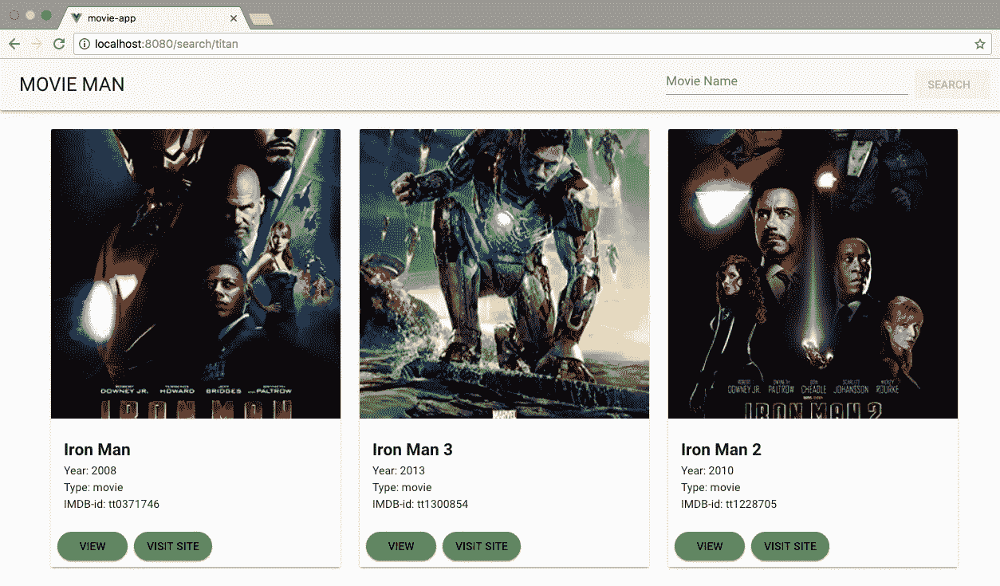*

*t**he issue, we are searching for Titan, but we got iron man***

*[提交修复链接](https://github.com/anoobbava/movie-app/commit/706d81167bf948db62ff63afdb5ff5f2ee197734)*

# *16.如果 API 中没有搜索数据，则添加警告消息*

*假设，当我们用无效的电影或在我们的 omdbapi 中不可用的电影调用 API 时。在这种情况下，需要显示一条消息。*

*我们正在创建一个默认为 false 的数据属性，当搜索到的数据不返回任何内容时，将设置为 true 并显示消息。*

*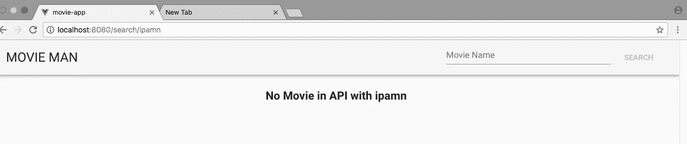*

*[提交代码更改的链接](https://github.com/anoobbava/movie-app/commit/20625f2b3b9d6283fe6b43bca6f652f085673af4)*

# *17.为 axios/重构创建中心文件*

*尽管如此，我们的 axios 和 API 调用代码仍然分散在组件的各个地方。如果我们把这些都放在一个地方，就像 angular 中的服务一样，那就好了。*

*为此*

1.  *在 src/中创建名为 services 的文件夹，并创建文件 MovieApi.js*
2.  *在 main.js 中导入 axios*
3.  *在 main.js 中创建一个默认的 URL*
4.  *导出 MovieApi.js 文件*
5.  *在组件中导入 MovieApi.js。*
6.  *从组件中移除 axios 代码，并放入 MovieApi.js 文件中。*
7.  *从组件中调用适当的方法。*

*[提交代码更改的链接](https://github.com/anoobbava/movie-app/commit/4f1638136ebdf9d7d5b98190d678936bb185ddc0)*

# *18.包装和源代码*

*我们的最终输出将是这样的:*

*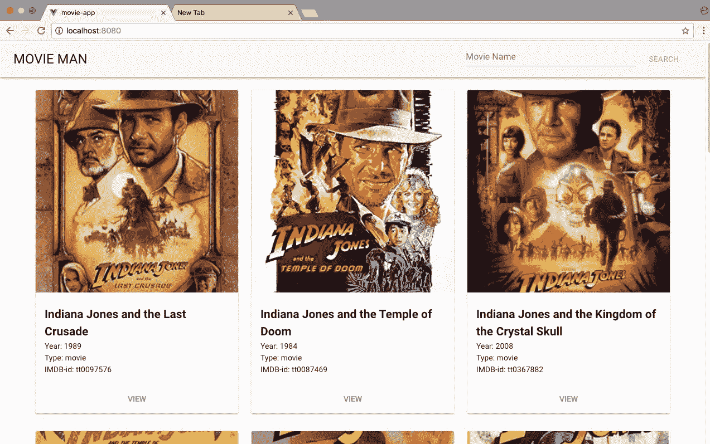*

*LatestMovie component.*

*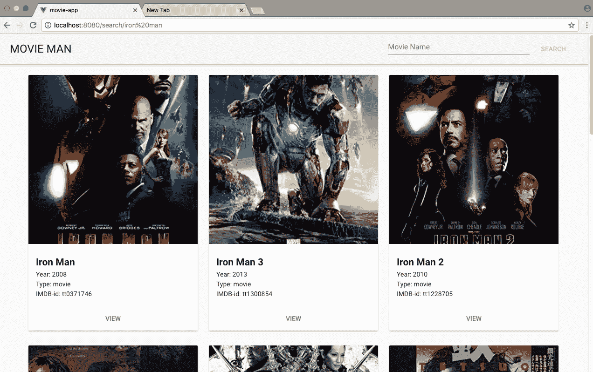*

*searchMovie.vue*

*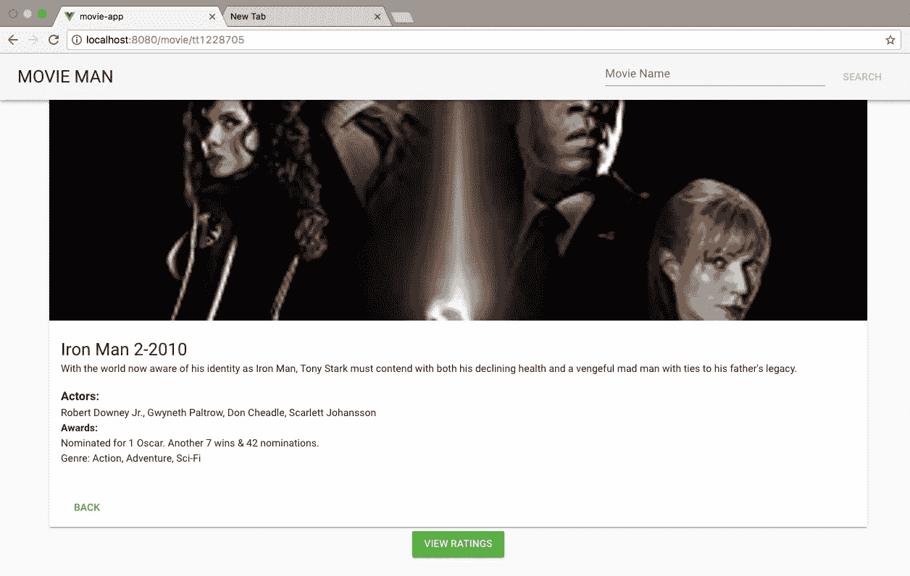*

*Movie.vue*

> *如果这个故事对你有所帮助，请随时[给我买杯咖啡](https://www.buymeacoffee.com/anoobbava)*

*[GitHub 网址](https://github.com/anoobbava/movie-app)*

# *我们做到了！*

*我希望你喜欢跟随。如果你喜欢这个内容并想进一步讨论，请留下你的掌声和评论！*