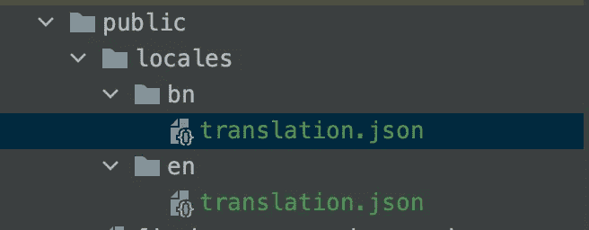
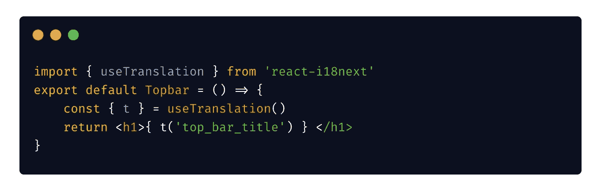
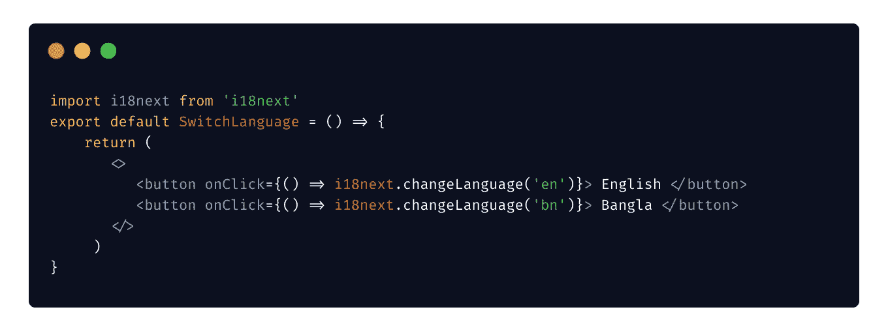

# 在 React 中实现多语言支持

> 原文：<https://javascript.plainenglish.io/implement-multi-language-support-in-react-9854c52ddb55?source=collection_archive---------1----------------------->

## 6 个简单的步骤


多语言支持是优秀前端应用程序的重要特征之一。今天，我们将了解如何在现有的 React 应用程序中添加多语言支持。

今天我们假设我们需要支持两种语言。这里的过程可以扩展到您想要支持的任何数量的语言。

*   英语
*   孟加拉国

我们将基于 i18next 使用一个名为[react-i18 next](https://react.i18next.com/)*的流行库。*

## *第一步。安装依赖项*

*我们必须安装 4 个依赖项。*

*前两个[库](https://react.i18next.com/guides/quick-start)将为我们完成繁重的工作。*

```
*yarn add react-i18next i18next*
```

*#下面的[包](https://github.com/i18next/i18next-browser-languageDetector)会自动为我们检测语言。所以不必担心确定当前选择的语言*

```
*yarn add i18next-browser-languagedetector*
```

*#下一个[包](https://github.com/i18next/i18next-http-backend)将根据语言检测器返回的语言加载值。*

```
*yarn add i18next-xhr-backend*
```

## *第二步。添加配置文件*

*在 index.js 文件旁边创建一个名为 i18n.js 的新文件，在这里我们可以指定我们想要支持的语言。*

*Configuration File for Language Change*

## *步骤 3:修改 App.js 以加载语言*

*在这一步，我们必须修改我们的`App.js`文件并包含我们的配置文件。注意，我们在这里使用了`<Suspense>`,因为`react-i18next`异步加载本地资源，我们必须等待加载完成*

## *第四步。为每种语言创建单独的文件*

*在 public/locales/language_name/*

> *小心点。名称必须与下图完全相同。否则，无法自动加载值。显然，我们可以改变这种行为，但是为了简单起见，我们现在不会深入讨论。*

**

*New file for each language*

## *第五步。在特定于语言的文件中添加值*

*文件 en/translation.js 下的内容可能类似于…*

```
*{
    "top_bar_title": "Community Admin Panel"
}*
```

*bn/translation.js 文件下的内容可能类似于…*

```
*{
    "top_bar_title": "কমিউনিটি এডমিন প্যানেল"
}*
```

*这样，您必须添加每种语言的值。*

## *第六步。使用组件内部的值*

*您可以通过以下方式使用 JSON 文件中定义的值*

**

*Using translation inside the component*

## *额外收获:切换语言*

*现在你可以在任何地方使用下面的命令来切换到你想要的语言(例如在一个按钮或语言转换器中)*

**

*Change Language*

*现在，您出色的应用程序可以支持任意多种语言。*

*今天到此为止。编码快乐！:D*

***通过** [**LinkedIn**](https://www.linkedin.com/in/56faisal/) **或我的** [**个人网站**](https://www.mohammadfaisal.dev/) **与我取得联系。***