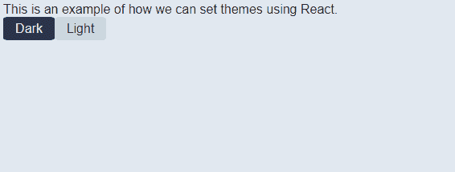
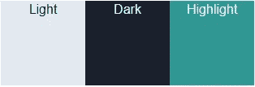
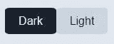
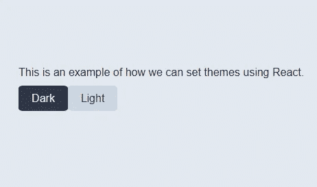

# 使用 React 实现具有持久性的明暗主题

> 原文：<https://javascript.plainenglish.io/implementing-a-light-and-dark-theme-in-react-with-persistence-329aa4bc4da5?source=collection_archive---------11----------------------->



## 介绍

所以，你已经到了创建网站的时候，你想做一些看起来“很酷”的事情，比拥有一个允许用户将网站主题从亮到暗翻转(然后再转回来)的按钮更酷的是什么(或更多关于品牌与 2020)。

毫无疑问，你已经注意到越来越多的网站提供这种功能，但是实现起来有多容易呢？我来告诉你:相对容易。只要你知道一点反应和一些 CSS，这将是一个(社会距离)在公园散步。

本教程的所有代码都在这里[可用。
这个项目的一个例子可以是](https://github.com/mojiwa/react-light-dark-theme)[看这里](http://dark-light-theme-react.netlify.app)。

## 目标

有一个简单的开关或一组按钮，用户可以按下改变网站从一个明亮的主题到一个黑暗的主题(或主题 1 到主题 2)，然后再回来。用户的选择也必须在下次访问网站时被记住。

以下是建议解决方案的一个示例:


## 解决方案

**先决条件:**

您可以自己设置 React 解决方案，使用现有的解决方案，或者克隆下面的 git 库:
[https://github.com/mojiwa/react-light-dark-theme.git](https://github.com/mojiwa/react-light-dark-theme.git)

对于这个例子，我在普通 CSS 中使用标准的 React。节点版本是 14.10.1，你可以[在这里](https://nodejs.org/dist/v14.10.1/)下载。

如果您正在克隆上面的库，您将需要运行`npm install`来安装所有的包。

**颜色选择:**

在我们开始之前，仔细考虑你使用的明暗颜色是很重要的。我不打算讲一整节色彩选择的科学课，但我倾向于选择两种反转时效果很好的颜色(例如，当主题切换时，浅色作为背景，深色作为文本)；以及链接、下划线、按钮等的高亮颜色。这与背景/字体颜色都很好。找到这些颜色可能会花你一点时间，但值得花时间去做。

在这篇文章中，我将使用我为我的个人网站[选择的相同颜色，因为它们配合得非常好:](https://mojiwa.com)

光亮:[https://www.colorhexa.com/e2e8f0](https://www.colorhexa.com/e2e8f0)T2[https://www.colorhexa.com/1a202c](https://www.colorhexa.com/1a202c)
高亮:[https://www.colorhexa.com/319795](https://www.colorhexa.com/319795)



Example theme colours

**开始:**

我将在 App.js 中工作，我将从把所有的颜色定义为常量开始，这样我就可以在代码中很容易地引用它们:

```
*const* THEME_LIGHT_HEX = '#E2E8F0'
*const* THEME_DARK_HEX = '#1A202C';
*const* THEME_HIGHLIGHT_HEX = '#319795';
```

我还将创建一个 Enum 来存储这两个主题，以便以后在设置主题时可以对它们执行一个简单的 if/else 语句。考虑到这一点，App.js 的框架现在看起来像这样:

```
import React from 'react';*const* THEME_LIGHT_HEX = '#E2E8F0'
*const* THEME_DARK_HEX = '#1A202C';
*const* THEME_HIGHLIGHT_HEX = '#319795';
*const* THEMES = {
 Light: THEME_LIGHT_HEX,
 Dark: THEME_DARK_HEX
};*function* App() {
 return (
  <div>
   This is an example of how we can set themes using React.
  </div>
 );
}export default App;
```

这就足够让我们开始了。确保您告诉您的 index.js 文件将<app>渲染到您的 html 入口点(无论是“根”还是其他什么)。</app>

**创建开关:**

有很多方法可以在网站上切换主题。您可以使用按钮、复选框或切换开关。你使用什么并不重要，因为它们中的任何一个都可以工作，JavaScript 代码也是一样的。在这一点上，一切都取决于个人喜好。

我将创建两个按钮，一个切换到亮，一个切换到暗。我们现在将进入一些 CSS 来设置按钮的样式(实际上是 div 样式，而不是 HTML 按钮)。

我有一个导入到 App.js 中的 index.css 文件，我将在那里创建我的按钮。同样，有很多方法可以做到这一点，但是我选择了不涉及额外工具/框架的最简单的方法。使用任何您认为适合创建样式元素的方法:

```
.button-holder {
 display: flex;
}*.theme-button-light* {
 height: 25px;
 width: 60px;
 border-radius: 10%;
 padding: 2px;
 display: flex;
 align-items: center;
 justify-content: center;
 cursor: pointer;
 background-color: #cbd5e0;
 color: #1a202c;
}*.theme-button-dark* {
 height: 25px;
 width: 60px;
 border-radius: 10%;
 padding: 2px;
 display: flex;
 align-items: center;
 justify-content: center;
 cursor: pointer;
 background-color: #2d3748;
 color: #e2e8f0;
}*.theme-button-light:hover* {
 background-color: #e2e8f0;
}*.theme-button-dark:hover* {
 background-color: #1a202c;
}
```

然后，您可以将它们放入您的页面(不要忘记将 css 导入 App.js -如果您不确定如何操作，请参见本文底部的完整代码输出):

```
*function* App() {
 return (
  <div>
   This is an example of how we can set themes using React.
   <div className='button-holder>
    <div *className*='theme-button-dark'>Dark</div>
    <div *className*='theme-button-light'>Light</div>
   </div>
  </div>
 );
}
```

您最终会得到如下结果(请注意，对于一些简单的用户反馈，按钮上有一个悬停效果):



**按钮接线:**

我们需要做的下一件事是连接按钮，当你点击它们时执行一个功能。编辑两个按钮 div，使其看起来像这样:

```
<div *className*='theme-button-dark' *onClick*={() => applyTheme(THEMES.Dark)}>Dark</div>
<div *className*='theme-button-light' *onClick*={() => applyTheme(THEMES.Light)}>Light</div>
```

您会注意到，我们调用了函数“applyTheme”，但是还没有这样的函数，所以我们假设:

```
function applyTheme(theme) {
}
```

**设置主题:**

为了能够看到发生的任何事情，我们需要为我们选择的东西设置背景和文本颜色。为了简单起见，我将通过 JavaScript 代码来设置页面的主体样式:

```
function applyTheme(theme) {
 document.body.style.backgroundColor = theme; document.body.style.color = theme === THEMES.Dark ? THEMES.Light : THEMES.Dark;
}
```

我们在上面所做的就是为传入的主题设置背景颜色。然后，我们使用 if 语句将文本颜色设置为相反的颜色，以检查我们传入的是深色主题还是浅色主题(如果传入深色主题，则将文本颜色设置为浅色主题，反之亦然)。

现在，当您运行它时，您将得到类似上面建议的解决方案的内容:


Working implementation of theme switching

**持久性和默认值:**

剩下要做的最后一件事是保存主题，这样当站点再次被加载时，它会记住之前选择的内容。我们还需要确保在站点第一次加载时就设置了主题(所以它不只是默认的白色背景)。我们使用 web 存储和“ComponentDidMount”或“UseEffect”(如果使用 React Hooks，则使用后者)来实现这些功能。这个示例项目使用了钩子，所以如果你不熟悉，你可以[在这里](https://reactjs.org/docs/hooks-intro.html)阅读。

网络存储是为网络应用程序存储信息的一种很酷的方式。你可以[在这里](https://developer.mozilla.org/en-US/docs/Web/API/Web_Storage_API)了解更多信息。我们可以使用 web 存储在本地保存我们的主题，这样即使我们关闭并重新打开浏览器，我们的选择也会被保存。我们也不需要担心使用 cookies 时的安全问题，因为没有数据被传输到服务器——所有数据都保存在本地。与 cookies 相比的另一个优势是，web 存储使用起来更加直观*和*它可以存储更多的内容(最多 5MB 用于会话存储，更多用于本地存储)。

我为 web 存储创建了两个函数。一个提交数据，另一个检索数据。它们看起来像这样:

```
*const* THEME_KEY = 'THEME';*// Save the chosen theme to web storage
function* SaveSettings(*value*) {
 window.localStorage.setItem(THEME_KEY, value);
}*// Get the saved theme from web storage
function* GetSettings() {
*// Return the saved theme if a theme has been saved.
// If no theme has been saved, default to the light theme.* return window.localStorage.getItem(THEME_KEY) ?? THEMES.Light;
}
```

你可以把这段代码放在你的应用程序函数上面。
要在我们更改主题时保存主题，我们只需在主题更改时调用“SaveSettings()”。像这样更新“applyTheme()”方法:

```
function applyTheme(theme) {
 document.body.style.backgroundColor = theme; document.body.style.color = theme === THEMES.Dark ? THEMES.Light : THEMES.Dark; SaveSettings(theme);
}
```

要在打开页面时应用保存的设置(或者在第一次加载时默认为 light 主题),您可以执行以下操作(如果您使用 React Hooks ),或者只调用 ComponentDidMount()中的相同函数:

```
*// When we load the site, we attempt to get the saved theme from web storage.* useEffect(() => {
 applyTheme(GetSettings());
});
```

仅此而已。现在你有了一个主题开关，可以在亮暗主题之间切换，并保存到本地 web 存储器中。

最终的代码应该如下所示:

App.js

```
import React from 'react';
import './index.css';*const* THEME_LIGHT_HEX = '#E2E8F0'
*const* THEME_DARK_HEX = '#1A202C';
*const* THEME_HIGHLIGHT_HEX = '#319795';
*const* THEMES = {
 Light: THEME_LIGHT_HEX,
 Dark: THEME_DARK_HEX
};
*const* THEME_KEY = 'THEME';*// Save the chosen theme to web storage
function* SaveSettings(*value*) {
 window.localStorage.setItem(THEME_KEY, value);
}*// Get the saved theme from web storage
function* GetSettings() {
*// Return the saved theme if a theme has been saved.
// If no theme has been saved, default to the light theme.* return window.localStorage.getItem(THEME_KEY) ?? THEMES.Light;
}*function* App() { *// When we load the site, we attempt to get the saved theme from  web storage.* useEffect(() => {
  applyTheme(GetSettings());
 });function applyTheme(theme) {
 document.body.style.backgroundColor = theme;
 document.body.style.color = theme === THEMES.Dark ? THEMES.Light :  THEMES.Dark;
 SaveSettings(theme);
}return (
  <div>
   This is an example of how we can set themes using React.
   <div className='button-holder>
    <div *className*='theme-button-dark' *onClick*={() => applyTheme(THEMES.Dark)}>Dark</div>
    <div *className*='theme-button-light' *onClick*={() => applyTheme(THEMES.Light)}>Light</div>
   </div>
  </div>
 );
}export default App;
```

index.css

```
.button-holder {
 display: flex;
}*.theme-button-light* {
 height: 25px;
 width: 60px;
 border-radius: 10%;
 padding: 2px;
 display: flex;
 align-items: center;
 justify-content: center;
 cursor: pointer;
 background-color: #cbd5e0;
 color: #1a202c;
}*.theme-button-dark* {
 height: 25px;
 width: 60px;
 border-radius: 10%;
 padding: 2px;
 display: flex;
 align-items: center;
 justify-content: center;
 cursor: pointer;
 background-color: #2d3748;
 color: #e2e8f0;
}*.theme-button-light:hover* {
 background-color: #e2e8f0;
}*.theme-button-dark:hover* {
 background-color: #1a202c;
}
```

## 简单英语的 JavaScript

喜欢这篇文章吗？如果是这样，通过 [**订阅获取更多类似内容解码，我们的 YouTube 频道**](https://www.youtube.com/channel/UCtipWUghju290NWcn8jhyAw) **！**