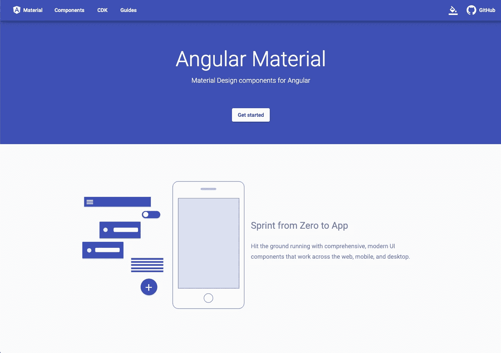
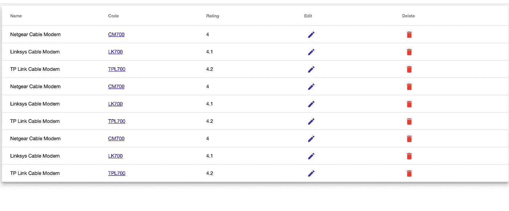
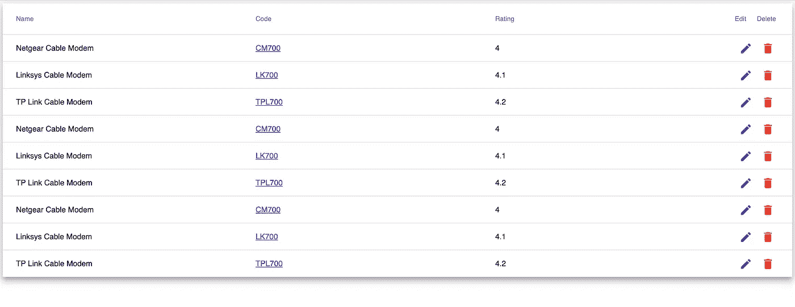
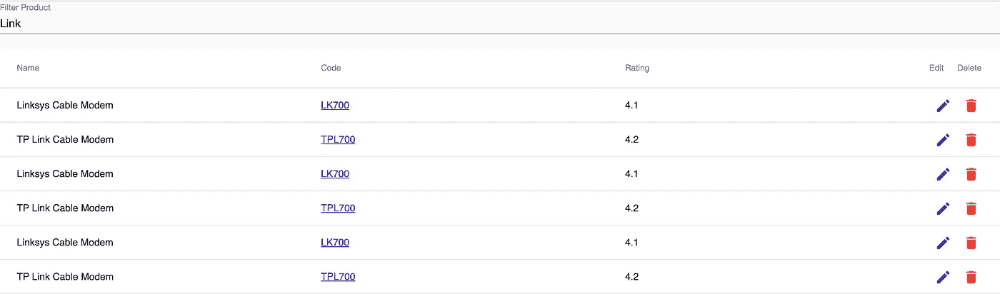

# 实现带分页、服务器端过滤和排序的角度素材表

> 原文：<https://javascript.plainenglish.io/implementing-angular-material-table-with-pagination-server-side-filtering-and-sorting-58e6a2ba4a48?source=collection_archive---------0----------------------->

[Angular Material](https://material.angular.io/) 是 Google 提供的用户界面库。谷歌开发人员在谷歌产品中使用它。棱角分明的材质 ***专注极简的设计*** 。 ***它比丰富的用户界面*更注重性能。**角状素材提供了一堆控件，我们在本文中讨论的范围是角状素材表。我们将贯彻我们的产品设计理念。我们将创建一个产品列表，并在 Angular material 表中显示它们。然后我们将讨论角材表的排序和分页。



# **导入角材数据表模块:**

在添加角度材料数据表模块之前，您必须添加 BrowserAnimationsModule。BrowserAnimationsModule 是运行其他物料模块的依赖模块。数据表有三个关键模块。

*   mat 数据表的 mattable 模块
*   MatSortModule 通过单击标题对元素进行排序
*   用于分页的 MatPaginatorModule 显示页面大小、下一页和页面大小下拉列表
*   另一个模块 MatButtonModule，MatIconModule，MatTooltipModule 用于构造按钮、图标和工具提示的模板。

有一点需要注意的是，9 plus 版本中所有的材质模块都是从@angular/material/ <module>导入的。在以前的版本(即版本 5)中，您只能从@angular/material 导入所有模块。</module>

# **创建产品界面和产品数据:**

下一步是为表创建一个数据模型。在这里，我们正在创建产品界面。产品界面由 id、作为必填字段的名称和产品描述以及作为可选参数的产品等级组成。接下来，我们将创建产品数据，这是产品数组的类型。

# 欢迎来到角度材料数据表:

## **1。创建模板:**

角度材料以标准表格格式显示数据。我们可以根据我们的项目定制表的外观和感觉。下面的模板是材料数据表的一个例子。如果你看到这里我们使用的是`<ng-container>` **`**<ng-container>**`**是一个分组元素，它不会干扰样式或布局，因为 *Angular 没有把它放在 DOM*** 中。`matColumnDef`用`<ng-container>`包装，这将给它元素的顺序和描述。dataSource 用于数据的值。`matColumnDef` 是列定义的必填字段。`matColumnDef` 应该总是与我们正在渲染的元素相同。即，在第二列中，如果`matColumnDef` 是产品名称，那么`matCellDef` 元素应该是{element.productName}}。 ***如果上述名称不同，那么在对列进行排序时会产生问题。*****

## **2.**创建组件:****

**第二步是创建角度材料数据表组件。这里我有导入的产品，来自 Product.ts 文件的产品。这将定义数据表的类型和值。接下来，定义 displayedColumns。displayedColumns 是一种字符串数组。您可以在这里定义要显示的列。**

```
displayedColumns: string[] = [‘productName’, ‘productCode’, ‘prodRating’, ‘edit’, ‘delete’];
```

**然后我们导出产品类型和产品数据。将 MatPaginator 和 MatSort 定义为 ViewChild 引用。**

```
products:Product[]= products;dataSource = new MatTableDataSource(products);@ViewChild(MatPaginator,{static:false}) paginator: MatPaginator;@ViewChild(MatSort, {static:false}) sort: MatSort;
```

*****由于我们将 MatPaginator 和 MatSort 定义为 ViewChild，我们必须在 ngAfterViewInit 生命周期钩子*** 中初始化它。在视图初始化之后设置排序，因为组件将能够查询它的视图来初始化排序。**

```
ngAfterViewInit() {this.dataSource.paginator = this.paginator;this.dataSource.sort = this.sort;}
```

**完整的组件将如下所示:**

**呈现后的页面如下所示:**

****

## **3. **CSS 和样式:****

**现在我们可以看到我们的数据表看起来有点原始。我们可以看到编辑和删除按钮列太大。现在先导入棱角分明的材质主题。主题可以在组件 css 文件中导出。**但是导入文件最好的地方是 angular.json 风格。****

```
“styles”: [**“../node_modules/@angular/material/prebuilt-themes/deeppurple-amber.css”**"../node_modules/primeng/resources/primeng.min.css",]
```

**在组件中导入这样的 css 文件:**

```
@import ‘~@angular/material/prebuilt-themes/deeppurple-amber.css’;@import ‘~material-design-icons/iconfont/material-icons.css’;
```

**完整的 css 是这样的。**

**正如我们在前面的截图中看到的，编辑和删除列看起来很大。但由于这些只是一个图标，所以应该很小。也就是说，我想让它变成 40 px，然后使用*mat-header-cell:n-child*序列我们可以做到这一点。**

```
.mat-cell:nth-child(4),.mat-header-cell:nth-child(4) {flex: 0 0 40px;}.mat-cell:nth-child(5),.mat-header-cell:nth-child(5) {flex: 0 0 40px;}
```

**应用 css 后的页面看起来像下面的截图。现在你可以看到编辑，删除列很小。**

****

## **4.**过滤材料表:****

**过滤是任何表格中非常重要的一部分。我们可以创建一个简单的搜索功能，从产品列表中搜索产品。为此，创建一个输入控件，它是 mat 输入文本。现在，我更喜欢焦点上的过滤器，所以当用户结束编写过滤器和焦点，然后我们将从数据存储搜索。**

```
<mat-form-field><mat-label>Filter Product</mat-label><input matInput type="text" [(ngModel)]="filterValue"(blur)="filterProduct(filterValue)" placeholder="Search product name"></mat-form-field>
```

**现在，当您编写上述代码时，您可能会得到未知模式的错误。所以你必须导入 mat 输入模块。**

```
import {MatInputModule} from ‘@angular/material/input’;
```

**在组件中，您可以根据输入的任何产品名称进行过滤。**

```
public filterProduct = (value: string) => {this.dataSource.filter = value;}
```

****

## ****5。服务器端过滤器:****

**类似于第 4 点，我们可以实现服务器端过滤，搜索所有数据。当我们处理大量数据时，它非常有效。导入 MatProgressSpinnerModule 并添加根组件。添加一个异步加载，如下所示:**

```
//Add MatProgressSpinnerModule in root component import
import {MatProgressSpinnerModule} from ‘@angular/material/progress-spinner’;//Write async method in <div class=”spinner-container” *ngIf=”dataSource.loading$ | async”><mat-spinner></mat-spinner></div>
```

**现在一旦 API 搜索了产品页面大小和产品？。长度将被设置为产品计数。**

```
<mat-paginator [length]=”products?.length” [pageSize]=”{{pageSize}}" [pageSizeOptions]=”[5, 10, 15]”></mat-paginator>
```

**调用 API 获取搜索到的数据。另外，设置 pageSize 属性。**

```
filterProduct(value: string):void{this.serviceAPI.getDataByFilter(value).subscribe(response =>{this.dataSource= response[‘products’];
//Set page index
//Enable disable next button here
//this.pageSize});}
```

## **结论:**

**这是最后的手段。我们已经开始从手工制作 html 到创建具有功能的数据表。我们讨论了以下几点:**

*   **创建的材料数据表模板，组件**
*   **讨论了 CSS 和样式数据表**
*   **实现材料表排序和分页**
*   **从数据源实现过滤器**
*   **服务器端过滤和分页**

**附上 stackblitz 代码以供参考。**

**检查原始数据表并实现服务器端分页。**

**[](https://medium.com/@codingindepth/server-side-pagination-using-ng-prime-data-table-in-angular-5ffb082da138) [## Angular 中使用 NG Prime 数据表的服务器端分页

### web 技术栈中的大多数项目都使用客户端分页。在大多数有角的、有反应的入口…

medium.com](https://medium.com/@codingindepth/server-side-pagination-using-ng-prime-data-table-in-angular-5ffb082da138) 

谢谢，祝阅读愉快！**