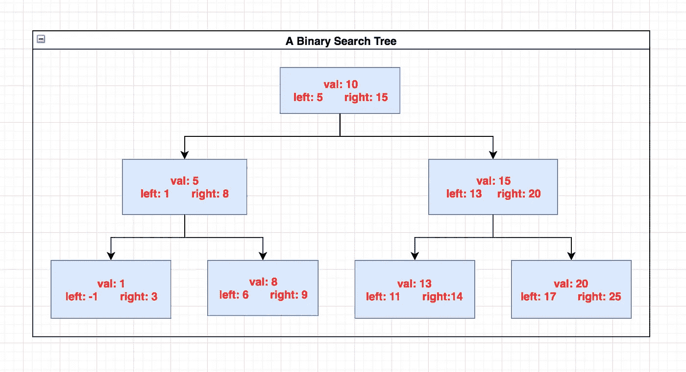
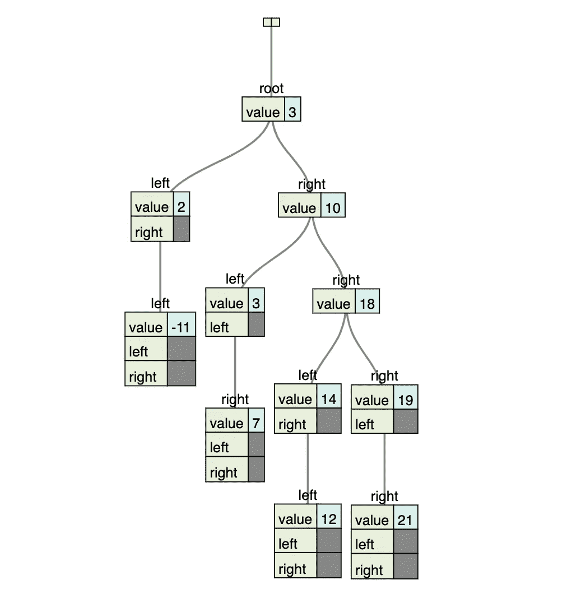
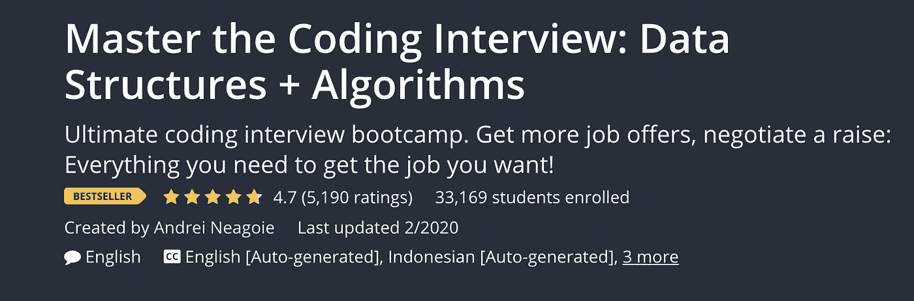

# 用 Javascript 实现二叉查找树

> 原文：<https://javascript.plainenglish.io/implementing-binary-search-tree-163587006d42?source=collection_archive---------8----------------------->

去年，我有机会在 Udemy 上参加了一个名为**掌握编码面试:数据结构+算法**的课程，由 **Andrei Neagoie** 教授(* *你可以在下面找到链接* ******* )。这位教师擅长使用**类比**、**视觉**和**实际**例子将数据结构和算法的简洁概念分解成可理解的块。

**数组**、**哈希表**、**单双链表**、**树**和**图**详细讲解。**数据结构**的利与弊以及它们应该应用到的适当问题也会被详细讨论。

所有主要分类算法的讲座都有实例和时间复杂性分析的支持。诸如**空间和时间复杂度**的概念是响应于对这些数据结构采取的动作而被评估的；诸如**添加/追加、移除、搜索**等操作。

退一步说，**掌握编码面试:数据结构+算法**是我上过的最好的在线编程课程之一。

在这里，我将**总结一下**我对实施**二叉查找树**的了解。我还将创建一个**插入** **方法**，该方法将获取一个节点并将其放置在**二叉查找树**的层次结构中的适当位置。

# 二叉查找树

**二叉查找树**是以**倒排树**的形式存储和组织数据的数据结构。树的**根**位于顶部，而叶子在它下面。树上的每个元素称为一个**节点**。


Inverted tree

# 结节

一个**节点**是二叉查找树的基本构建模块。一个节点有三个属性；**值**、**左**和**右**。

下面的类是创建将插入到树中的节点的蓝图。当创建一个将被插入到树中的新节点时，您将创建这个**节点** **类**的一个**实例**。

```
class Node {
   constructor(value) { 
      this.value = value;
      this.left = null;
      this.right = null;    
  }
}
```

value 属性保存节点的**值**，而 **left** 和 **right** 属性分别保存对节点左侧和右侧节点的引用。

# 根节点

添加到树中的第一个节点称为根节点。因为它是第一个节点，并且在创建时没有节点，所以只有 value 属性有值，而 left 和 right 属性有`null`值。

# 左节点和右节点

**二叉查找树**的一个独特方面是，给定一个节点，其左侧节点的值应该较小，而其右侧节点的值应该较大。

下图显示了一个二叉查找树。



A Binary Search Tree with 7 nodes

# 二叉查找树

现在让我们进入这个数据结构的核心。

让我们创建一个名为 **BinarySearchTree** 的类(蓝图)。我们稍后将创建的带有节点的树将是这个**类**的一个**实例**。

有多种方法可以添加到 BinarySearchTree 类中。有一部分是`insert(val), remove(val) and search(val)`。但是，对于本文，我们将只关注实现`insert(val)`方法，它将帮助我们向树结构中插入新的节点。

首先，让我们创建一个构造函数，在这个函数中我们将用 null 初始化根节点。这是因为，在这个阶段没有节点，没有根，显然也没有树。

```
class BinarySearchTree {
   constructor() {
      this.root = null;
   }
}
```

接下来，我们将创建我们的`insert`方法，该方法将一个整数作为参数，创建一个新的节点实例，并在树上找到节点的正确位置，然后将其插入到那里。

所以我们之前创建的**节点**类在这里开始起作用。我们将简单地从它创建一个新的实例，它将把值传递给树的 insert 方法。

有可能树还没有被创建(根为空)。如果是这样，我们将刚刚创建的 **newNode** 实例分配给`this.root`。这样我们就可以确定树有一个根(没有根就没有树:)，这是数据结构中的第一个节点。

```
class BinarySearchTree {
   constructor() {
      this.root = null;
   }insert(val) {
     const newNode = new Node(val);

     if (!this.root) {
       this.root = newNode;   
     } else {}  
   }
}
```

# **插入节点**

如果根已经存在，我们需要**遍历**树，找到可以插入新节点的适当位置。为此，我们将创建一个新方法，它将接受两个参数，一个是我们遍历树时正在查看的**当前节点**，另一个是我们想要插入到树中的**节点**。

这个我们称之为`insertNode(currentNode, newNode)` 的方法将把`this.root`和`newNode`作为参数。如果树只有一个节点(根节点)，left 和 right 属性将为 null，因此基于 newNode 的值和根节点的值，我们将新节点放在根节点的左边或右边。否则，我们将从根节点开始对每个节点进行递归检查，以查看新节点是否适合树中节点的左侧或右侧。

在`insertNode(currentNode, newNode)` 函数中，我们需要检查 newNode 的值是否小于 *currentNode* 的值？如果是这种情况，我们需要检查 currentNode 的 left 属性的值。如果值为 null，我们将 newNode 赋给 left 属性。否则，如果左边的属性有一个值，我们需要递归调用`insertNode(currentNode, newNode)`方法，并传递给它 currentNode.left 和 newNode。

`this.insertNode(node.left, newNode)`。

现在，如果你回到第一个 if 块，你可以观察到它包含了我们的基本情况。当当前节点的左属性的值为`null`时，递归将停止。

```
class BinarySearchTree {
    constructor() {
      this.root = null;
   }

   insert(val) {
      const newNode = new Node(val);

      if (!this.root) {
        this.root = newNode;   
      } else { 
        this.insertNode(this.root, newNode)     
     }
   }  

   insertNode(currentNode, newNode) {
    if (currentNode.value > newNode.value) {
        if (currentNode.left === null) {
            currentNode.left = newNode;
        } else {
            this.insertNode(currentNode.left, newNode);
        }
     }  else {
        if (currentNode.right === null) {
            currentNode.right = newNode;
        } else {
            this.insertNode(currentNode.right, newNode);
        }
      }     
   }
}
```

现在，我们可以从 BinarySearchTree 类创建一个新的树实例，并根据需要多次调用实例上的 insert 方法，并将值传递给它。

```
const myTree = new BinarySearchTree();myTree.insert(3);myTree.insert(10)
myTree.insert(2)
myTree.insert(3)
myTree.insert(7)
myTree.insert(-11)
myTree.insert(18)
myTree.insert(14)
myTree.insert(12)
myTree.insert(19)
myTree.insert(21)console.log(JSON.stringify(myTree));
```

https://vanya.jp.net/vtree/有一个很棒的工具可以帮助你可视化 JSON BST 数据结构。



# 摘要

课程 [**掌握编码面试:数据结构+算法**](https://www.udemy.com/master-the-coding-interview-data-structures-algorithms/?ranMID=39197&ranEAID=JAsBp5BFozE&ranSiteID=JAsBp5BFozE-28H3FUxSzbSuGGq3hx33RQ&LSNPUBID=JAsBp5BFozE) 是一门教授基本计算机科学概念的伟大课程。

[](https://click.linksynergy.com/link?id=JAsBp5BFozE&offerid=507388.1917546&type=2&murl=https%3A%2F%2Fwww.udemy.com%2Fcourse%2Fmaster-the-coding-interview-data-structures-algorithms%2F)

它将带你深入了解数据结构和算法。**二分搜索法树**是讨论的数据结构之一。BST 用于在不同环境下高效存储和检索数据。

BST 的基本构造块称为节点。一个节点有三个属性(值、左和右)。left 和 right 属性保存有关节点左侧和右侧节点的信息。

树底部的所有节点的左值和右值都为 null。当您向树中插入一个新节点时，首先需要查看该值是小于还是大于根的值。如果它更小，你需要递归地寻找左边的节点，如果它更大，则相反。

结帐 [**应聘**](https://hired.com/x/fd35d132f87b1210edf7a5fc32ad79a9) 软件工程岗位:[https://hired.com/x/fd35d132f87b1210edf7a5fc32ad79a9](https://hired.com/x/fd35d132f87b1210edf7a5fc32ad79a9)