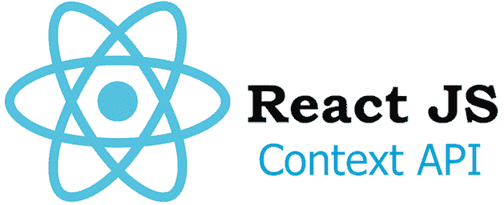

# 在 React 应用程序中实现上下文 API

> 原文：<https://javascript.plainenglish.io/implementing-context-api-in-a-react-application-8b9b156a4154?source=collection_archive---------2----------------------->

## 全局状态管理解决方案



Image from [freecodecamp](https://www.freecodecamp.org/news/clever-react-context-tricks-using-typescript-not-redux-7e2b9c7e5bf6/)

如果您有使用 React 的经验，那么您应该熟悉在`state`中存储数据的想法。每个组件都可以有自己的状态，但理想情况下，顶级组件将包含主要数据。随着应用程序的复杂性和组件的增加，将数据作为道具传递会变得棘手和乏味，因为数据必须找到返回到顶层组件并返回到子组件的路径。

已经有几种解决方案可以帮助管理和维护 React 中的`state`。其中之一是流行的 Redux 库，它也可以与其他框架一起使用。另一个是 Context API，React 内置的状态管理。

本指南将介绍如何在 React 应用程序中实现上下文 API。请参考 [React 文档](https://reactjs.org/docs/context.html)以获得关于上下文 API 的更深入的信息。如果你也想知道如何使用钩子实现 Redux，这里是我的博客[关于它的设置。](https://levelup.gitconnected.com/react-redux-hooks-useselector-and-usedispatch-f7d8c7f75cdd)

# 设置

如前所述，上下文 API 包含在 React 中。一旦我们用`create-react-app`创建了一个 React 应用程序，我们就可以导入并使用它。但在此之前，我们先创建一个`reducer`。

## 还原剂

`reducer`将指定应用程序如何变化，并负责管理`state`。它们也被称为`pure functions`，其中输出仅由输入决定。在`src`目录下，创建一个`reducer.js`文件。在这个文件中，我们将输入以下内容:

reducer.js

在这个例子中，我们用默认值定义了应用程序的`initialState`。我们还定义了我们的`reducer`函数，它将接受两个参数，即`state`和`action`。一个`action`是至少包含一个键、`type`和其他可选键的对象。

```
Ex. {
   type: "SET_VIEW", view: "Profile"
}
```

`reducer`函数将总是返回`state`，无论是原始版本还是更改后的版本。一个`switch`语句被用来确定`state`将如何基于`action`类型而改变。我们将在另一个文件中使用`initialState`和`reducer`，所以请务必使用`export`。一个是`default`输出，另一个可以是`named`输出。我们有了`reducer.js`文件设置，我们可以继续进行`Context API`的设置。

## 上下文 API

仍然在`src`目录下，让我们创建另一个文件`GlobalState.js`。这是我们创建`context`的地方。让我们输入以下内容:

GlobalState.js

让我们分析一下这个文件中发生了什么。首先，我们从 React、`createContext`、`useContext`和`useReducer`导入一些`named`导出。接下来，我们用`createContext`创建上下文。快速注意，`createContext`是一个不需要接受参数的函数，它返回一个上下文对象。

然后我们有组件，`Provider`，它将接受三个参数，`reducer`、`initialState,`和`children`。`reducer`和`initialState`实际上是我们之前在`reducer.js`文件中创建的。`children`参数实际上代表子组件。我们最终要做的是`import`和`Provider`并插入我们想要作为子组件访问上下文的组件。我们稍后将再次讨论这种方法。

每个上下文对象都有一个`Provider React`组件，允许组件订阅上下文变化。澄清一下，这是我们创建的`StateContext`中的`Provider`，而不是我们此刻正在创建的`Provider`。在`Provider`组件中，我们正在创建内部组件`StateContext.Provider`并插入`children`组件。

`StateContext.Provider`接受传递给其`children`组件的`value`道具。在这种情况下，我们希望`children`能够访问全局`state`，并且我们希望它们能够`dispatch`一个动作。这就是`useReducer`功能发挥作用的地方。当调用`useReducer`时，我们传入`reducer`函数和`initialState`。如果你熟悉`useState`，那么`useReducer`也会返回一个包含两个元素的数组:函数`state`和函数`dispatch`。

现在我们已经创建并设置了`context`，是时候使用它了。这个文件中要做的最后一步是利用`useContext`函数，它接受一个参数`StateContext`。我们将在另一个组件中使用这些函数，将它们导出为名称`exports`。

# 在 React 中实现上下文

既然`context`已经设置好了，是时候在 React 应用程序中使用它了。如果您以前在 React 中实现过 Redux，方法是类似的。让我们打开`src`目录下的`index.js`文件。我们需要做的第一件事是导入一些我们之前创建的东西。

index.js

如前所述，这种方法包括在`Provider`中插入一个组件，这样它就可以访问全局状态和调度。在本例中，我们将`App`组件作为`Provider`的子组件插入，并传入道具、`initialState`和`reducer`。这样，`App`的所有子组件都可以访问上下文。它的结构类似于 React Redux。

现在 React 组件已经可以访问上下文了，让我们使用它。在每个组件中，我们将从之前在`GlobalState.js`中创建的文件中导入`globalStateValue`函数。在组件中，我们将按照类似于`useState`的方式进行设置:

```
const [state, dispatch] = globalStateValue();
```

提醒一下，调用`globalStateValue`会调用`useContext`函数，该函数将返回一个包含`state`和`dispatch`函数的数组。就这样，组件可以访问全局状态，并可以发送调度操作来更改状态。下面是它的实现示例(参考`src`目录下的`Left.js`和`Right.js`组件):

Code Sandbox Context API practice

# 结束语

本指南介绍了使用附带的钩子在 React 应用程序中实现上下文 API 的一种可能方式。上下文 API 不需要第三方库。这并不意味着上下文 API 是更好的全局状态管理资源。然而，知道存在其他资源总是好的。另外，我也想表扬桑尼·桑加。我在观看他的一个教程视频时接触到了这种上下文 API 的方法。感谢您的阅读！