# 在网页上实现拖放

> 原文：<https://javascript.plainenglish.io/implementing-drag-and-drop-on-a-web-page-7d34e211c8b?source=collection_archive---------2----------------------->

## 快速简单地使用 HTML5 和 JavaScript

Photo by Kamil Pietrzak on [Unsplash](https://unsplash.com)

# **目标**

> 我们的目标是使网页元素可拖放。

这在 HTML5 中很容易做到

> 在 HTML5 中，拖放是标准的一部分:任何元素都可以拖动。

和几行 JavaScript 代码。

我们将构建一个简单的网页，并在两个

元素之间拖动图片。

我们的例子非常简单，但在我看来，它开启了一个被广泛忽视的可能性世界。

## **工具**

我们不需要太多工具。

*   选择任何你喜欢的 HMTL 或文本编辑器，然后编码！我将使用 [Textpad](https://www.textpad.com/download/) 。
*   您不需要 web 服务器来运行 html 页面，您可以通过双击它或在编辑器中启动它来从本地文件系统运行它。

## 我们开始吧！

**我们流程的概述**

1.  我们将使一个或多个 html 元素可拖动。
2.  我们将指定 JavaScript 函数来处理当我们开始拖放时发生的事情。
3.  我们将使一个或多个 html 元素能够接受被拖动的对象、放置位置——使它们可被放下。

就是这样！

## **第一步:创建一个 HTML5 页面。**

打开编辑器，创建 html 页面的基础。如所愿，取名*somename.html。*

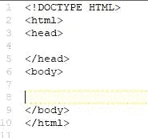

## **步骤 2:使元素可拖动。**

要使元素可拖动，您需要将 **draggable** 属性设置为 true。

**<*element name*draggable = " true ">**

在我们的例子中，我们将制作三个可拖动的图像。

将以下内容添加到您的网页中。

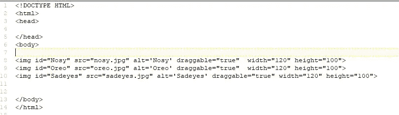

draggable=”true”

你可以随意使用任何你想要的图片。如果你想用我用过的图片，只需右键点击并保存到你的 html 页面所在的文件夹。

**注** : *这些图片可能受版权保护。*

Nosy

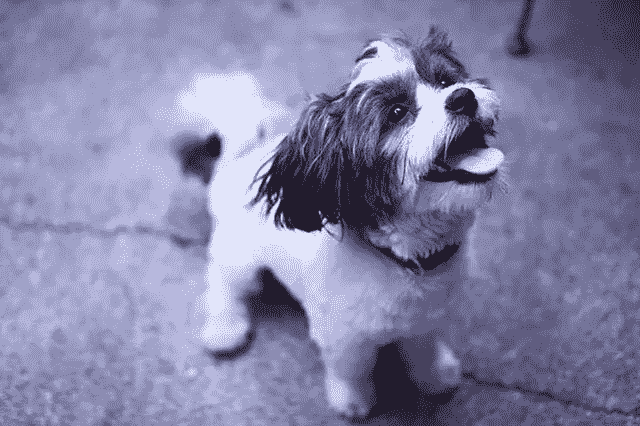

Oreo

Sadeyes

## **步骤 3** :设置当一个元素被拖动时应该发生什么。

这是通过以下一般步骤完成的。

1.  向可拖动元素添加 *ondragstart* 属性。
2.  向 html 页面添加开始和结束标签
3.  指定将在“ondragstart”中调用的 JavaScript 函数(处理程序)
4.  使用 JavaScript 函数中的 **dataTranser.setData()** 方法指定被拖动数据的**数据类型**和**值**。当最初查看时，这经常会令人困惑，因为*第一个参数通常是“文本”或“文本/普通”*。当我们意识到它是被拖动对象的 DOM 字符串时，谜底就解开了。这就是为什么它是文本。

在 html 页面中，修改您的元素。

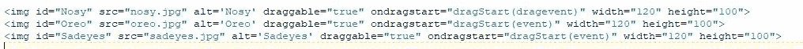

dragStart() will be our JavaScript function

添加开始和结束标记

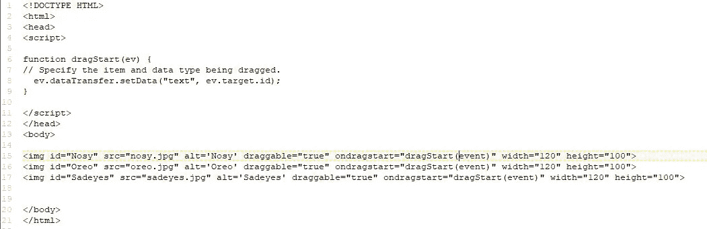

dragStart(). The ondragstart event handler.

对于 dataTransfer.setData()，在我们的例子中，数据类型是“text”(被拖动对象的 DOM 字符串[1])，值是被拖动元素的 id。同样，在我们的例子中，这将是图像的 id，“Nosey”，“Oreo”和“Sadeyes”

## 第 4 步:添加我们可以放入对象的元素，一些属性和 JavaScript。

在我们的例子中，我们希望能够在两个

元素之间拖放。因此，我们将把我们的图像包装在一个(我们将开始拖动)中，并创建第二个来放入它们。但是，我们将添加一些必要的东西，以便能够在两个 div 之间进行拖放。

我们将添加 div 的两个属性， *ondrop* 和 *ondragover* 。

*   对于 *ondrop* ，我们将指定 JavaScript 函数，该函数将处理我们放下时要做的事情。
*   对于 *ondragover* ，当一个元素或文本选择被拖动到一个有效的拖放目标上时被触发，我们将通过使用 **preventDefault()** 方法向浏览器指定“允许拖放”。
*   **preventDefault()** 阻止浏览器对数据的默认处理(**不允许丢弃。**)我们绝对不会想阻止它，**所以这很关键！**

添加以下

元素。一个在图像周围，另一个在第一个 div 的正下方。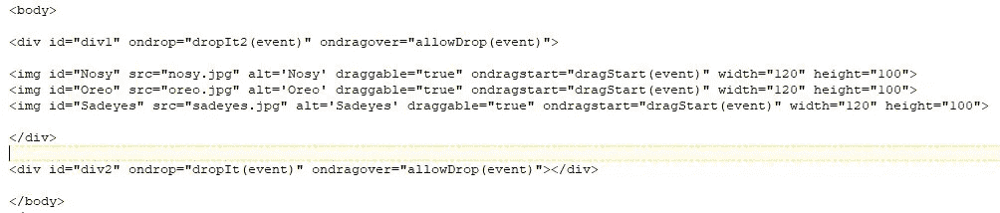

Two divs to drag and drop between

为 *ondrop* 和 *allowDrop* 属性添加以下 JavaScript 函数和事件处理程序。

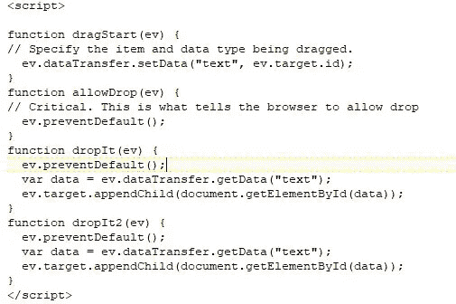

A lot going on here

观察:发生了很多事情。

*   你会注意到 **preventDefault()** 在处理函数 **dropIt()** 和 **dropIt2()** 以及 **allowDrop()** 中。这是必要的，否则处理程序将试图打开图像链接。
*   有两个 **dropIt()** 函数。我们这样做是为了让两个 div 的功能略有不同。我们可以两个 div 只使用一个。
*   **dropIt()** 它使用 **dataTransfer()** 方法来获取被拖动的数据。被拖动的数据是元素的 id。最后，它将它附加到事件对象的目标(div-Drop 对象)。)

# 可选步骤(5 和 6)

## 只是为了好玩

在倒数第二步中，我们将添加一个文本输入元素，并添加更多的代码来显示/删除狗的名字，以及更多的标记。

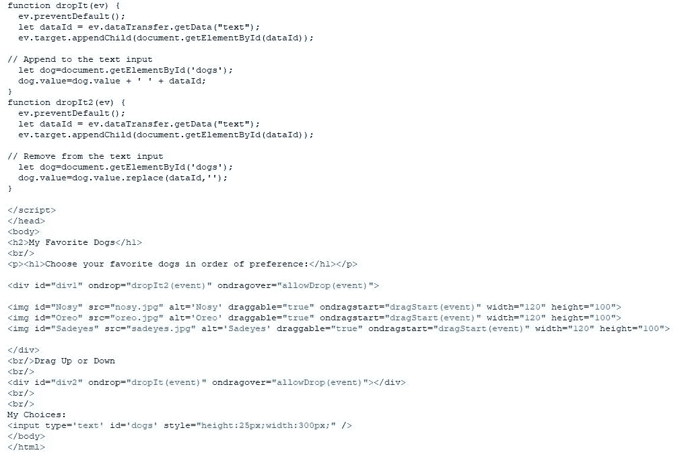

<input type=”text”… and some code in dropIt() and dropIt2()

## 第六步:让它看起来稍微好一点。

在这一步，我们将添加 CSS 样式。

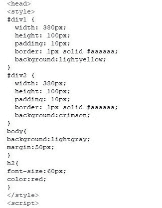

Styling

## 成品！

成品应该如下所示。这是在两个图像中。

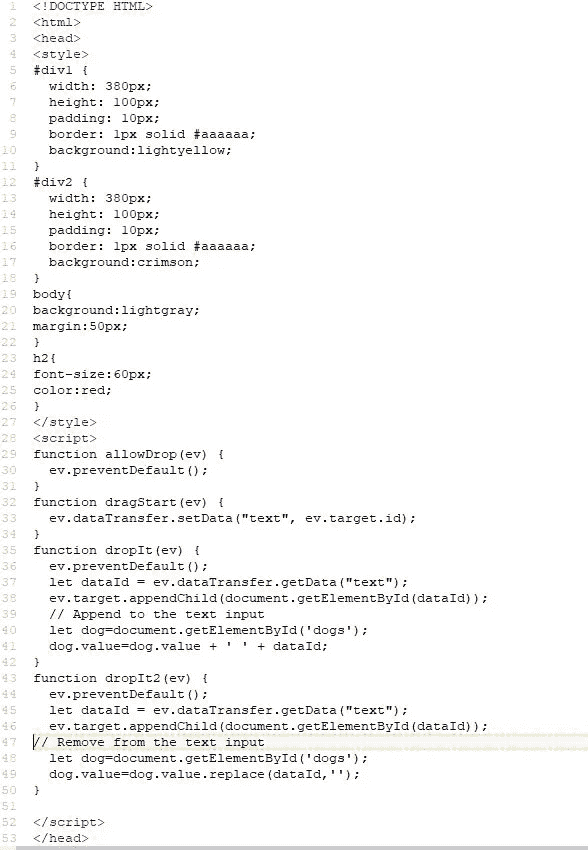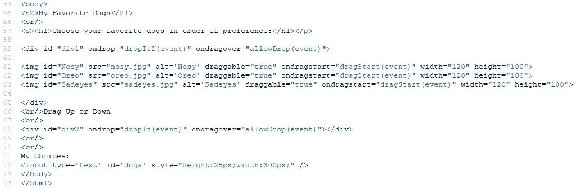

**双击 html 文件，在浏览器中运行。**

# 结论:

这是非常强大的，这个主题还有很多，例如，我们可以指定拖动时使用的鼠标图像，拖动时复制对象而不是移动它，等等。

我想我会建一个滑块拼图。

喜欢尝试，并访问下面的 MDN 链接。

感谢阅读！

**有用链接**

[1]https://developer.mozilla.org/en-US/