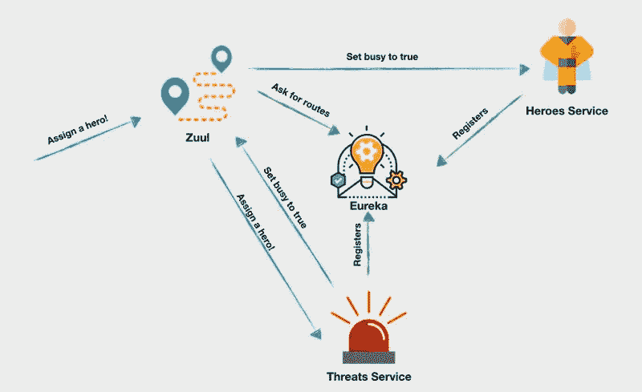
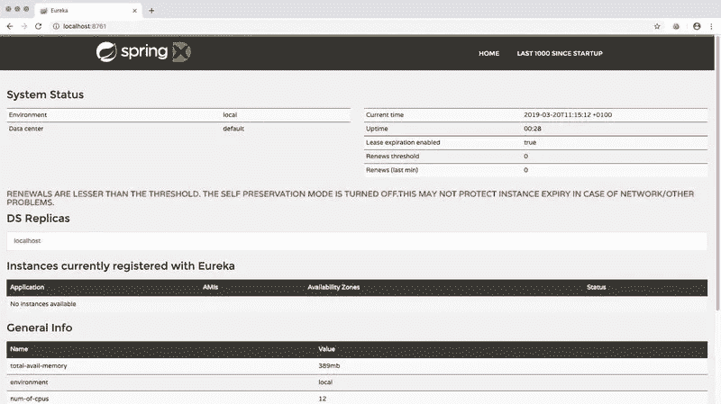
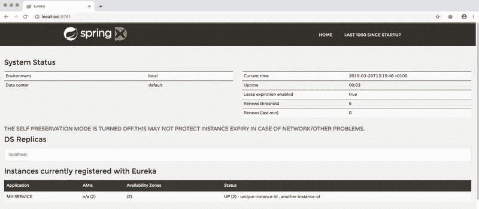
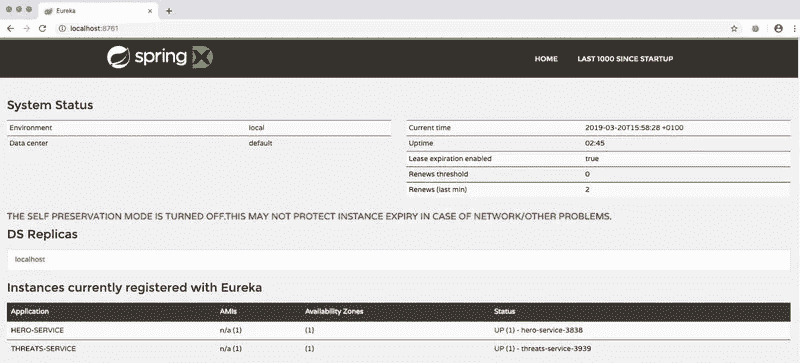
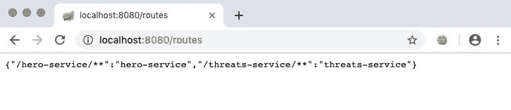

# 在 Node.js 上运行的 JavaScript 微服务中实现服务发现和动态路由的 Eureka 和 Zuul

> 原文：<https://javascript.plainenglish.io/implementing-eureka-and-zuul-for-service-discovery-and-dynamic-routing-in-javascript-microservices-45a7ac18837a?source=collection_archive---------1----------------------->


将您的 JavaScript 应用程序构建为一组微服务会给您带来很多好处。您的应用程序在构建时可以更加模块化、统一和可测试，当您将它们部署到生产环境时，它们可以更加健壮、可伸缩和可用。包含服务发现注册中心和动态路由功能将帮助您在生产中实现可伸缩性和可用性。

本文将向您展示如何将服务发现和智能路由集成到使用微服务架构构建的 Node.js 应用程序中。您将看到如何通过运行在 Java SE 运行时环境中的两个网飞开源项目 Eureka 和 Zuul 来实现这一点。

网飞[尤里卡](https://github.com/Netflix/eureka/wiki)服务器提供服务发现。这使您的应用程序的服务能够找到其他服务，而无需知道它们托管在哪里或访问它们所需的完整 URL，因此您不必为需要访问另一个服务的每个服务提供完整的 URL。

网飞 [Zuul](https://github.com/Netflix/zuul/wiki) 服务提供动态路由。在您的应用程序中使用 Zuul 使您的服务能够使用 Eureka 服务目录中的信息来访问其他服务。

因为 Eureka 和 Zuul 都是 Java 应用程序，它们可以用 Java 的 [Spring 框架](https://spring.io/)的一部分 [Spring Boot](https://spring.io/guides/gs/spring-boot/) 来实现。使用 Spring Boot，您可以将 Java 应用程序打包到 Java 归档文件中。jar)文件，该文件可以在 [Java SE 运行时环境](https://www.oracle.com/technetwork/java/javase/downloads/jre8-downloads-2133155.html)中运行。这使您能够轻松地将 Node.js 服务器与 Eureka 和 Zuul 一起部署在一个容器中。

Spring 已经在 [Spring 云网飞](https://spring.io/projects/spring-cloud-netflix)中为常见的使用场景构建了配置，包括使用 Eureka 的服务发现和使用 Zuul 的智能路由。的。jar 文件是用 Apache [Maven](https://maven.apache.org/) 使用项目对象模型(pom.xml)文件为[尤里卡](https://github.com/spring-guides/gs-service-registration-and-discovery/blob/master/complete/eureka-service/pom.xml)和 [Zuul](https://github.com/spring-guides/gs-routing-and-filtering/blob/master/complete/gateway/pom.xml) 构建的，作为 GitHub 上 [Spring Guides](https://github.com/spring-guides) 资源库的一部分。

# 先决条件

为了完成这篇文章中的编程任务，你需要:

*   [Node.js 和 npm](https://nodejs.org/)(node . js 安装也会安装 NPM。)
*   [Java SE 运行时环境](https://www.java.com/en/download/)

要从这篇文章中最有效地学习，你应该具备以下条件:

*   JavaScript 和 Node.js 的工作知识
*   对 HTTP 协议的一些暴露

GitHub 上有这篇文章的配套资源库[。](https://github.com/maciejtreder/introduction-to-microservices)

# 构建基本的 JavaScript 分布式系统

如果您已经完成了本系列的第一篇文章“用 Node.js 构建 JavaScript 微服务”中的项目，那么您可以继续使用您为那篇文章编写的代码:这篇文章的 Node.js 项目是在那个代码基础上构建的。如果你熟悉构建 JavaScript 微服务，或者想从头开始，可以从 GitHub 获取代码。

通过在要创建项目根目录的目录中执行以下命令行指令来克隆项目:

```
git clone [https://github.com/maciejtreder/introduction-to-microservices.git](https://github.com/maciejtreder/introduction-to-microservices.git)
cd introduction-to-microservices/heroes
git checkout step2
npm install
cd ../threats
npm install
```

# 向 Eureka 注册服务

现有的应用程序是一个简单的系统，有两个服务和硬编码的 URL。如果你想增加更多英雄服务的实例呢？威胁服务如何决定使用哪一个？你应该硬编码两个 URL 吗？

有更好的方法。使用 Eureka，您可以注册您的服务，这样其他服务就不必依赖硬编码的 URL 来找到它们，即使有多个服务实例运行在不同位置的不同服务器上。

Zuul 将提供到达注册表中列出的服务所需的智能路由，因此您不需要创建和维护复杂而脆弱的路由系统。

下图说明了您将要实现的体系结构:



在完成的应用程序中将有两种通信流。首先，会有一个由绿线代表的连续运行序列。每当服务运行时，它向 Eureka 注册并发送心跳，通知 Eureka 它已启动并运行。Zuul 将轮询 Eureka 的所有可用服务，并将它们映射到特定的路线。

第二种流程由蓝线表示，发生在系统收到请求时:

1.  有人请求给一个威胁分配一个英雄！
2.  Zuul 基于从 Eureka 获得的信息，向期望的服务、威胁服务，
3.  威胁服务向 Zuul 发送请求“告诉英雄服务将指定英雄的状态设置为‘忙碌’”。
4.  Zuul 将该请求转发给英雄服务。

下载以下 Java 归档文件，并将它们放在项目的根目录中:

尤里卡服务公司(eureka-service)

zuul-0 . 0 . 1-snapshot . jar(39.6 MB)

通过在应用程序的根目录中执行下面的命令行指令来查看一下 Eureka 用户界面。Windows 用户应该在 Windows 命令提示符(cmd.exe)窗口中执行指令，而不是在 PowerShell 窗口中。

```
java -jar eureka-service-0.0.1-SNAPSHOT.jar
```

使用您最喜欢的浏览器导航到位于 [http://localhost:8761](http://localhost:8761) 的 Eureka 应用程序。



默认情况下，Eureka 服务运行在端口 8761 上。这可以通过使用`--server.port`参数来改变；但是不要这样做，除非你有一个好的理由，比如端口冲突。

# 使用 RESTful API 在 Eureka 中注册一个服务实例

虽然可以使用 Spring 框架在 Eureka 中配置服务，但 Eureka 也有一个可以用于非 Java 应用程序的 RESTful API。要注册一个新服务，您可以针对[http://localhost:8761/eureka/apps/my-service](http://localhost:8761/eureka/apps/my-service)端点执行 POST 请求。这可以通过 curl 命令来完成，如下所示。

在应用程序的根目录中，创建一个*eureka-curl-payload . json*文件，并插入以下 JSON 数据:

显示为“my-service”的`app`的值是用于服务名的句柄。所有包含的数据元素都是向 Eureka 注册服务所必需的。

在应用程序的根目录中执行以下 curl 命令行指令:

```
curl -i --request POST --header "Content-Type: application/json" --data @eureka-curl-payload.json [http://localhost:8761/eureka/apps/my-service](http://localhost:8761/eureka/apps/my-service)
```

执行此请求后，您应该会在终端输出中看到以下内容:

```
HTTP/1.1 204 
Content-Type: application/xml
Date: Mon, 22 Apr 2019 13:37:43 GMT
```

此外，my-service 应该列在当前向 Eureka 表注册的*实例中，该表位于 [http://localhost:8761，](http://localhost:8761,)，如下所示:*



请注意，如果在更改 JSON 文件的内容后没有快速刷新浏览器选项卡，您可能看不到列出的服务。默认情况下，如果客户端在 60 秒内没有发送心跳请求，Eureka 应用程序会自动注销客户端。如果您遇到这种情况，请重新发送 curl 请求。

让控制台窗口打开，让 Eureka 运行。你会再次需要这两样东西。

以下是对 Eureka 正确注册服务实例所需信息的解释:

`hostname`–服务的主机名

`app`–服务的名称(必须与 URI 的名称相同)

`vipAdress`–虚拟主机名

`instanceId`–服务实例的唯一 id

`ipAddr`–运行实例的机器的 IP 地址(使用 0.0.0.0 来使用`hostname`而不是 IP 地址。)

`status`–服务的状态(启动、关闭、启动、停止服务、未知)

`port`–一个 JSON 对象，包含有关运行服务实例的端口的信息

`dataCenterInfo`–在 Amazon Web Services 环境中运行 Eureka 时需要的属性。在 AWS 上运行时，应该设置为“云”。

# 在 Eureka 中注册 Node.js 应用程序

现在，您可以在案例研究项目中实现注册机制了。因为您将在 heroes-service 和 threats-service 服务中使用相同的机制，所以您可以创建一个单独的 npm 项目，这两个服务将使用该项目向 Eureka 注册它们自己。

在*/英雄*和*/威胁*目录的同一层级创建一个*/尤里卡助手*目录。

转到 */eureka-helper* 目录并创建一个 *eureka-helper.js 文件。*

在 */eureka-helper* 目录中，通过执行以下命令行指令初始化 npm 项目并安装必要的依赖项:

```
npm init -y
npm install request 
npm install ip
```

在*/尤里卡助手/尤里卡助手. js* 文件中插入以下 JavaScript 代码:

*eureka-* h *elper* 项目公开了`registerWithEureka`方法，该方法执行您在测试 eureka 时尝试的 HTTP POST 请求。当该方法得到肯定的响应时，它开始向 Eureka 发送一个心跳，以防止它注销服务，如上所述。这是通过`setInterval`方法完成的:

现在你可以从每个服务中调用`registerWithEureka`方法。

修改 */threats/threats.js* 文件，使最后三行代码如下所示:

修改 */heroes/heroes.js* 文件，使最后三行如下所示。注意，`registerWithEureka`的一个参数是不同的:

在 */heroes* 目录中打开一个控制台窗口，执行下面的命令行指令来启动服务。Windows 用户应该使用命令(cmd.exe)窗口，而不是 PowerShell:

```
node heroes.js 3838
```

输出应该如下所示:

```
Registering heroes-service with Eureka
Heroes service listening on port 3838
Registered with Eureka.
```

让此控制台窗口保持打开状态。你最终会打开五个控制台窗口，所以你可能想现在就开始整理你的桌面，这样如果你有足够的空间，你就可以看到它们和你的浏览器标签。

在 */threats* 目录中打开另一个控制台窗口，并使用以下命令行指令启动服务:

```
node threats.js 3939
```

输出应该如下所示:

```
Threats service listening on port 3939
Registering threats-service with Eureka
Registered with Eureka.
```

在您的浏览器中，查看 Eureka (http://localhost:8761)的选项卡，并验证这两个服务是否都列在当前向 Eureka 注册的*实例下，如下所示:*



如果您没有遵循编码，并且希望使用 GitHub 存储库中的代码赶上这一步，请在您想要创建项目目录的目录中执行以下命令:

```
git clone [https://github.com/maciejtreder/introduction-to-microservices.git](https://github.com/maciejtreder/introduction-to-microservices.git)
cd introduction-to-microservices/heroes
git checkout step3
npm install
cd ../threats
npm install
cd ../eureka-helper
npm install
cd ..
```

# 使用 Zuul 查找服务

现在这些服务已经在 Eureka 注册了，它们可以通过 Zuul 的动态路由功能进行定位。

在应用程序的根目录中打开一个新的控制台窗口(这将是您打开的第四个命令窗口)。

通过在新的控制台窗口中执行以下命令行指令来启动 Zuul 服务。这将是您打开的第五个控制台窗口:

```
java -jar zuul-0.0.1-SNAPSHOT.jar
```

这个命令将在 HTTP 端口 8080 上启动 Zuul。默认情况下，Zuul 将在 http://localhost:8761 查找 Eureka 服务。如果您已经更改了 Eureka 的端口，您可以使用内联参数覆盖 Zuul 的默认设置，如下所示，其中第一个端口号是 Zuul 的，第二个是 Eureka 的:

```
java -jar zuul-0.0.1-SNAPSHOT.jar --server.port=9090 --eureka.client.serviceUrl.defaultZone=http://localhost:8761/eureka/
```

打开一个新的浏览器选项卡，导航到[http://localhost:8080/routes](http://localhost:8080/routes)(或者您分配给 Zuul 的端口，如果您已经更改了它)。您应该会看到在 Zuul 中注册的路线列表，如下所示:

```
{"/hero-service/**":"heroes-service","/threats-service/**":"threats-service"}
```



保持 Zuul 服务运行。

# 使用 Zuul 寻找英雄-服务

Zuul 正在运行，但威胁-服务需要更改为使用 Zuul 找到英雄-服务；威胁-服务目前使用的是硬编码的 URL，不太具有可伸缩性。更改服务以使用 Zuul 很容易。

在运行威胁服务的控制台窗口中，停止该服务并保持窗口打开。

在*威胁/威胁. js* 文件中找到以下行:

更改它，使它指向 Zuul 运行的端口，后跟 heroes-service 的名称，因为它是在*eureka-helper/eureka-helper . js*中注册的:

保存文件并**重启**威胁服务。

# 验证尤里卡和祖尔在工作

现在，您的应用程序中已经有了服务目录和动态路由。您可以通过执行 post 命令来查看它的运行情况，该命令将一个特定的“英雄”分配给一个特定的“威胁”，这标志着该英雄正忙于从特定的危险中拯救世界。

你可以使用 [Postman](https://www.getpostman.com/) ，curl，PowerShell[Invoke-WebRequest](https://docs.microsoft.com/en-us/powershell/module/microsoft.powershell.utility/invoke-webrequest)，或者你的浏览器。如果您想使用 curl，请打开一个控制台窗口并执行以下命令行指令:

```
curl -i --request POST --header "Content-Type: application/json" --data "{\"heroId\": 1, \"threatId\": 1}" localhost:8080/threats-service/assignment
```

请注意，如果您更改了运行 Zuul 的端口号，您将需要更改端口号。

如果服务运行正常，您应该会看到类似于 curl 的以下控制台输出的结果:

```
HTTP/1.1 202 
X-Application-Context: application:8080
X-Powered-By: Express
ETag: W/"79-ER1WRPW1305+Eomgfjq/A/Cgkp8"
Date: Fri, 05 Apr 2019 18:05:54 GMT
Content-Type: application/json;charset=utf-8
Transfer-Encoding: chunked{"id":1,"displayName":"Pisa tower is about to collapse.","necessaryPowers":["flying"],"img":"tower.jpg","assignedHero":1}
```

在英雄服务的控制台窗口中，您应该会看到类似于以下内容的输出:

```
Heroes service listening on port 3838
Registered with Eureka.
Successfully sent heartbeat to Eureka.
Successfully sent heartbeat to Eureka.
Set busy to true in hero: 1
```

恭喜你！您现在拥有了一个更具可扩展性和健壮性的微服务应用程序！

如果您想使用 GitHub 存储库中的代码赶上这一步，请在您想要创建项目目录的目录中执行以下命令:

```
git clone [https://github.com/maciejtreder/introduction-to-microservices.git](https://github.com/maciejtreder/introduction-to-microservices.git)
cd introduction-to-microservices/heroes
git checkout step4
npm install
cd ../threats
npm install
cd ../eureka-helper
npm install
cd ..
```

# 摘要

在这篇文章中，您了解了如何在 Eureka 中使用服务发现。您了解了如何将不同任务的责任委派给不同的应用程序，以及如何在服务之间进行通信。这两个应用程序通过公开的 REST APIs 相互通信。每个服务只处理自己负责的数据，并且可以在不涉及其他服务的情况下进行维护、扩展和部署。这两个应用程序都可以在同一个域 localhost:8080 下访问。要访问它们，你只需要将它们的指定句柄添加到 URL 中。

下一步[扩展共享 MongoDB Atlas 云持久层上的 Node.js JavaScript 微服务](https://medium.com/@maciejtreder/scaling-node-js-javascript-microservices-on-shared-mongodb-atlas-cloud-persistence-layers-620bf975ebfd)。

# 额外资源

[建筑风格与基于网络的软件架构设计](https://www.ics.uci.edu/~fielding/pubs/dissertation/top.htm)，罗伊·托马斯·菲尔丁，2000——菲尔丁的博士论文描述了表征状态转移(第 5 章)和其他建筑风格。

[微服务](https://en.wikipedia.org/wiki/Microservices)——虽然有缺陷，但维基百科的文章是寻找更多关于微服务架构和实现的信息的良好起点。

[Node.js](https://nodejs.org/en/docs/) 参考文件

[Spring Cloud NetFlix Spring Cloud 网飞项目](https://github.com/spring-cloud/spring-cloud-netflix)“……通过自动配置和绑定到 Spring 环境和其他 Spring 编程模型习惯用法，为 Spring Boot 应用程序提供网飞操作系统集成。”

*我是 Maciej Treder，通过* [*联系我 contact@maciejtreder.com*](mailto:contact@maciejtreder.com)*[*https://www.maciejtreder.com*](https://www.maciejtreder.com/)*或@ maciejtreder on*[git hub](http://github.com/maciejtreder)*、*[T31*和*](https://twitter.com/maciejtreder)[T37 LinkedIn](https://www.linkedin.com/in/maciej-treder/)*

**本帖最初发布在* [*Twilio 博客*](https://www.twilio.com/blog/eureka-zuul-service-discovery-dynamic-routing-javascript-microservices-node-js) *上。**