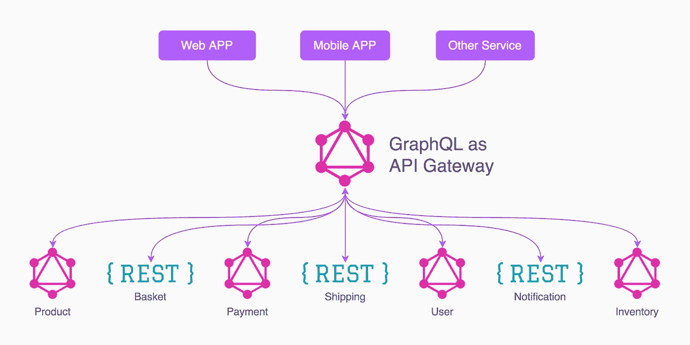
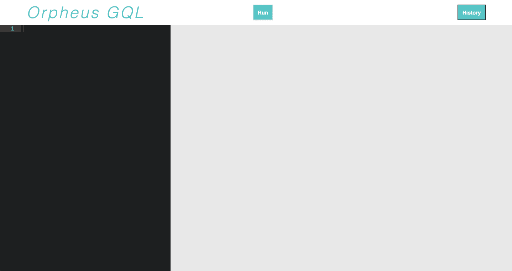

# 实现 GraphQL:地下世界之旅

> 原文：<https://javascript.plainenglish.io/implementing-graphql-a-journey-to-the-underworld-c6cbc2447710?source=collection_archive---------0----------------------->

Photo by [Julian Hochgesang](https://unsplash.com/@julianhochgesang?utm_source=medium&utm_medium=referral) on [Unsplash](https://unsplash.com?utm_source=medium&utm_medium=referral)

如果您经常与数据库和 API 端点交互，您可能听说过 GraphQL。但如果没有，这里有一个快速入门:

GraphQL 既是一种描述如何请求数据的语法，也是一种实现从客户端到服务器的查询的运行时。由于 GraphQL 只是一个规范，它与特定的语言、库或平台无关，因此您可以在客户端使用它，也可以自己调用 GraphQL 服务器。所有实施的共同点如下:

*   它只使用请求的数据来响应客户端的查询。
*   它可以将来自多个来源的数据压缩到一个端点。
*   它通过使用类型系统来验证数据。

那些受到传统 REST APIs 限制的人将接受 GraphQL 的灵活性，将应用与服务分离。GraphQL 的单个“智能”端点可以接受复杂的查询，然后将数据输出转化为客户端需要的任何内容，而不是拥有多个“哑”端点。

本质上，您可以将 GraphQL 视为一个在一个请求中调用许多嵌套端点的系统，模拟一个多路复用的 REST 端点。这意味着团队可以更高效地跨多个平台运输，对数据使用方式的可见性和控制达到前所未有的水平。

此外，GraphQL 允许在没有状态管理库的情况下执行。当客户机可以指定它需要的来自服务器的状态的确切形状，并在单个请求中接收它时，就不太需要与那些库相关的所有额外代码了。

然而，尽管 GraphQL 具有开创性，但其简单的语法和易用性可能并不像看起来那样简单:查询最终可能会执行各种不同的操作。GraphQL 抽象出了数据库调用的各种底层功能，因此您所做的查询可能会出乎意料地变得计算密集型或资源密集型。

因此，许多公司对从他们的 REST 平台转换到 GraphQL 持谨慎态度，并且实现 GraphQL 的程序员不确定哪些特定查询可能会成为他们应用程序的性能瓶颈。此外，GraphQL 查询作为嵌套的 JSON 对象返回；很难理解不同嵌套数据项之间的关系。抽象的糖是有代价的！

现有的工具确实提供了一些度量标准，让我们能够深入了解 GraphQL 查询。例如， [Apollo Engine](https://github.com/apollographql/apollo-engine-js) 通过其跟踪仓库(一个数据管道和存储层)提供对单个 GraphQL 的全面了解，该跟踪仓库捕获关于 Apollo 服务器处理的每个 GraphQL 操作的结构化信息，包括访问的特定字段集、使用每个字段的计时数据进行的解析器调用树，以及重要的元数据，如客户端身份和查询的模式版本。但是，它要求您使用 Apollo 构建自己的 GraphQL 服务器，并部署到他们的云上。这并不是对每个人都可行的解决方案。

[DataLoader](https://github.com/facebook/dataloader) 是一个由脸书开发的批处理和缓存库，它可以最大限度地减少对数据库的请求数量(即使在单个查询中，由于它们的嵌套性质，请求数量也可能很大)，从而防止应用程序的性能受到影响。但是，虽然 DataLoader 确实有助于减少不必要的读取冗余，但它并没有向您显示指标。

还有各种不是专门为 GraphQL 构建的 JSON 可视化工具，但是它们可以帮助用户处理从查询返回的复杂数据。它们包括:[代码美化](https://codebeautify.org/jsonviewer)、 [CodePlex JsonViewer](https://archive.codeplex.com) 或 [Visual Studio JSON Viewer](https://marketplace.visualstudio.com/items?itemName=MykolaTarasyuk.JSONViewer) 。

但到目前为止，还没有创建出易于设置的工具来处理 GraphQL 查询，向用户提供深入的查询分析。

进入 [Orpheus GQL](https://github.com/orpheus-gql/orpheus-dist) ，这是我们开发的一个工具，它可以分解和说明查询的不同部分，以了解它们对应用程序的运行时和性能影响。Orpheus 可以作为节点模块安装，它提供了查询成本分析(嵌套深度、解析器命中数、数据点、运行时间)，以及所提供查询中每个组件的成本的阳光可视化。更多关于俄耳甫斯的信息可以在[这里](https://orpheusgql.com/)找到。

它包含一个不可知的后端，足够灵活以适应关系和非关系数据库。所有需要做的就是安装 Orpheus 并提供您的 GraphQL 端点。Orpheus 将作为带有 GUI 端点的 GraphQL 扩展提供，类似于 graph QL 的工作方式。

总之，如果您可以避免使用 REST 而使用 GraphQL，那么您应该这样做。切换将避开客户端状态管理中的大量复杂性，并将客户端代码的范围最小化为只需要在 UI 中呈现的数据。

现在有一些工具可以让您深入了解 GraphQL 查询，减少数据库调用，并快速搭建 GraphQL 服务器，考虑进行这一转变的开发人员不仅可以从总体上更深入地了解 GraphQL，还可以了解他们的特定查询、模式和解析器是如何操作的。那些已经使用 GraphQL 的人将从如何重新配置模式或数据库以优化应用性能的见解中受益。

有关 GraphQL 的更多信息，[点击此处](https://graphql.org/)。

特约作者:
[唐](https://github.com/tttaaannnggg)[智刘](https://github.com/wisdom161)[妮莎](https://github.com/nkchatterjee)