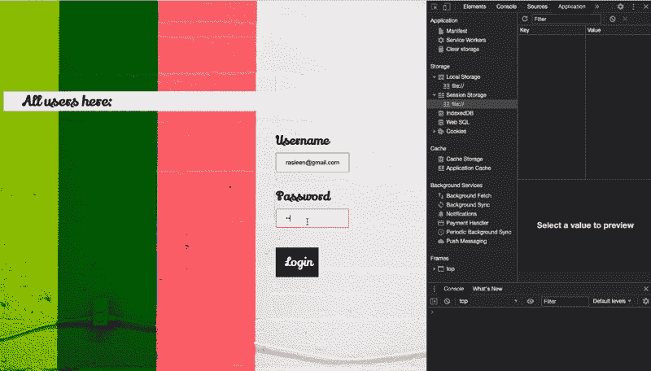

# 如何使用 LocalStorage 和 SessionStorage 存储登录会话

> 原文：<https://javascript.plainenglish.io/implementing-login-case-using-localstorage-and-sessionstorage-bfddce5d2198?source=collection_archive---------0----------------------->

## 保存 SessionStorage 中当前登录的用户和 LocalStorage 中所有用户的信息，全部使用普通 JavaScript！

JavaScript 是一种轻量级脚本语言，但它提供了如此多的功能，从制作动态网页到创建服务器、移动应用程序等等。现代 JavaScript 可以使用的两个重要功能是 LocalStorage 和 SessionStorage。



The Demo

# 本地存储与会话存储

两者都可以从 Inspect Element > Application > local storage 或 SessionStorage 中访问。它们的名称说明了它们之间的区别，两者都存储信息，但是 SessionStorage 为当前会话存储信息，而 LocalStorage 将信息存储在系统的本地。

*当你改变你当前的标签页或浏览器窗口时，会话就会过期，因此，信息会自动丢失，而 LS 不会这样工作！*

因此，为了存储用户 ID 和密码等用户信息，我们将使用 LocalStorage，并且当前登录的用户信息将在 SessionStorage 本身中可见！很酷的东西👩🏻‍💻！

## 实施时间

HTML 表单看起来像这样，我们将从这个表单中提取用户名和密码，并在我们的 JS 代码中使用它。

```
...
<body>
  <div>
    <ul id="listuser">
      <h3> All users here: </h3>
    </ul> 
  </div>

<form onsubmit="return false"><div class="container"><label for="uname"><b>Username</b></label>
<input type="text" placeholder="Enter Username" id= "uname"                  name="uname" required><label for="psw"><b>Password</b></label>
<input type="password" placeholder="Enter Password" id="psw" name="psw" required><button type="submit" onclick="Login()">Login</button>

</div>
</form>
</body>
...
```

用户 ID 和密码作为对象数组存储在 LS 中。为此，我们将创建一个数组，并将每个用户的对象推送到数组中。密码必须以加密形式存储在本地存储器中，否则很容易被提取出来。

*函数 btoa('string ')对传递的字符串进行编码，而 atob('encoded_string ')对编码后的字符串进行解码。*

```
function Login()
{
 var a = new Array();
 up1 = new Object();
 up2 = new Object();

up1={
 name:’[abcd@gmail.com](mailto:abcd@gmail.com)’,
 password:btoa(’abc@12')
};up2={
 name:’[bcd@gmail.com](mailto:bcd@gmail.com)’,
 password:btoa(’bcd@12')
};a.push(up1);
a.push(up2);
```

## 提取当前登录的用户信息

简单地说，提交的表单中的用户名和密码将是当前用户的详细信息，我们将使用 setItem 方法将它们存储在 SessionStorage 中，该方法接受一个 ***(key，value)对*** 。类似地，如果您想要取出值，请使用 getItem('key ')。请记住，这里的密钥类似于— array['array_name'][userID]

```
var username = document.getElementById(‘uname’).value;
var password = document.getElementById(‘psw’).value;sessionStorage.setItem(“currentloggedin”,username);
```

***存储用户对象的数组。LocalStorage 只存储字符串值，Json.stringify()为我们做了这件事！***

```
localStorage.setItem('all_users',JSON.stringify(a));
```

## 登录后在网页上显示用户

是时候解析我们存储在上面的对象数组，并动态显示作为

*   元素附加到

```
a=JSON.parse((localStorage.getItem("all_users")));a.push({name: username, password: password});localStorage.setItem('name',JSON.stringify(a));for(var i=0; i<a.length; i++)
  {
   var li = document.createElement("li");
   li.innerHTML=a[i]['name'];
   document.getElementById("listuser").appendChild(li);
  }
```

# 附加情况:用户认证

我将使用***JavaScript map***来检查来自 LocalStorage 的用户信息的有效性，并声明成功登录，如果用户名和密码记录存在于 LocalStorage 中。为此，我们需要将用户信息以对象数组的形式转换为 Hash-map。

## **JavaScript 中的 Map()——优化**

JS 使用。map()函数，其中的对象可以作为[键，值]对存储，并且可以作为***hashmap[键] = value 访问；***

在这里，我将电子邮件 ID 存储为密钥，将密码存储为值。请记住使用 atob(“密码”)对其进行解码，以便与存储在 LocalStorage 中的密码进行比较。

```
function Login()
{
   const hash = Object.fromEntries(
   a.map(e => [e.name, e.password])
)var username = document.getElementById('uname').value;
var password = document.getElementById('psw').value;for (let key of hash) 
{

    if(key[0] === username && key[1]===atob(password))
     {
         alert('Login successful');
     }

else
     {
         alert('Login fail');
     }
}
```

Object.fromEntries()帮助我们检索所有对象，每个对象数组都使用 map()函数转换或映射到一个 hashmap 条目。这是在本地存储中存储东西的更优化和更有效的方式。

# **迭代包含用户信息的哈希表**

迭代地图有许多复杂的方法，从使用 reduce()函数到使用 Object.assign()。

## **使用还原剂()**

```
var hashmap = a.reduce(function(map, obj) {
    map[obj.key] = obj.val;
    return map;
}, {});
```

## **2 .使用对象. assign( )**

```
const hashmap = Object.assign({}, ...(<{}>a.map(s => ({[s.key]:s.value}))));
```

*迭代哈希表最简单的方法是对循环* *运行* ***，返回(键、值)对，可分别作为键[0]和键[1]访问。***

JavaScript 真的很有趣，它总是包含一些未被发现的特性！继续探索并从中创造创新！