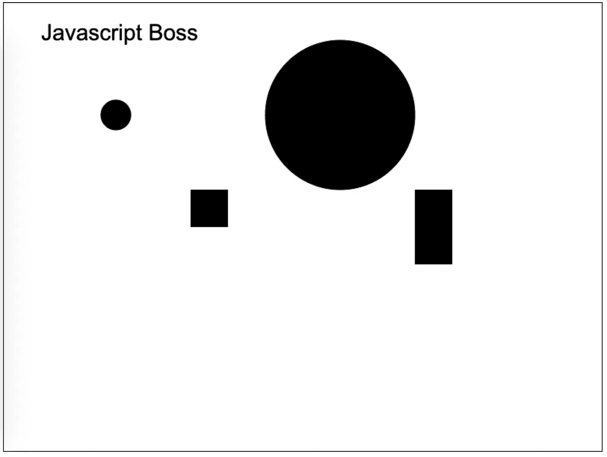

# 如何在 JavaScript 中实现松耦合、高内聚

> 原文：<https://javascript.plainenglish.io/implementing-loose-coupling-high-cohesion-with-classes-in-javascript-422c52bfbec?source=collection_archive---------0----------------------->


开发人员应该努力编写干净、可维护的代码。编程中要学习的一个关键原则是如何实现松耦合和高内聚。

在本文中，我们将使用 JavaScript 类来实现这些设计模式，并讨论为什么它们使代码更易于维护。

您可以在此处查看资源库中的代码示例:

[https://gitlab.com/sundry/javascript/gamelib](https://gitlab.com/sundry/javascript/gamelib)

什么是松耦合？

> 松散耦合指的是一个代码组件对另一个代码组件的内部工作有多少了解。如果它依赖于对某个组件了解太多，那么它被认为是高度耦合的。当一个组件不太了解其他组件的内部工作时，它被认为是松散耦合的。

什么是高凝聚力？

> 高内聚指的是定义非常好的组件。这意味着它只服务于一个目的，而且它很好地实现了这个目的。如果你有一个从数据库读取数据、发送电子邮件、打印文档的组件，那么它就没有高内聚。每一个都应该被分离成它自己的组件。通过让一个组件只做一件事，您可以获得很多好处，比如只测试您需要的东西，分离关注点，以及易于维护。

我们可以用类在 JavaScript 中实现这些特性。您也可以使用函数，但是在本文中，我们将演示如何使用类和依赖注入。

对于这个例子，我已经开始了一个小游戏库，它将使用 HTML 画布来绘制某些形状。为了演示这些原理，我将在画布上绘制形状，例如圆形和正方形。

首先，让我们从展示一个以不可维护的方式实现一切的类开始。

```
export default class Shape {
  constructor(props) {
    this._type = props.type;
    this._text = props.text || '';
    this._transform = props.transform || { x: 0, y: 0 };
    this._radius = props.radius || 20;
    this._width = props.width || 0;
    this._height = props.height || 0;
  } update({ context }) {
    context.beginPath();
    switch (this._type) {
      case 'circle':
       context.arc(
         this._transform.x,
         this._transform.y,
         this._radius,
         0,
         2 * Math.PI
       );
       context.fill();
       context.stroke();
       break;
     case 'square':
       context.fillRect(
         this._transform.x,
         this._transform.y,
         this._width,
         this._height
       );
       break;
     default:
       break;
   }
}
```

仔细阅读这段代码，我们可以看到它是一个类，接受一种形状，绘制形状的 x 和 y 坐标，如果是圆形，接受半径，如果是正方形，接受宽度和高度。

该类还有一个更新方法，该方法使用开关来确定要绘制的形状类型。

这个类使用了一种类型，将它耦合到某种类型的形状上，从而引入了依赖关系。对于每种类型的形状，我们都必须在我们的形状类中实现它自己的规则。通过在一个类中实现每种类型的形状，我们不需要松散耦合和高内聚。

如果我们要实现每个形状，文件将成为维护的负担。例如，如果我们想对 circle 实现进行更改，我们需要读取我们甚至不关心的代码。此外，我们可能会对 square 实现产生副作用。

圆必须知道宽度和高度，这是更大的开销，因为它只需要知道半径。广场的反面。它需要知道宽度和高度，但不知道半径。通过这样做，我们引入了甚至没有被有效使用的代码。

因此，让我们重构它，以显示类和继承，以及这如何也能导致高度耦合的组件。

```
export default class Shape {
  constructor(props) {
    this._transform = props.transform || { x: 0, y: 0 };
  } update({ context }) {}
}
```

这个父类不需要知道它是什么类型的形状，它只需要知道一个变换。但是由于我们正在演示继承，任何子组件现在都与父类高度耦合。如果父母有任何变化，都会影响到孩子。

```
import Shape from './Shape';export default class Circle extends Shape {
  constructor(props) {
    super(props);
    this._radius = props.radius || 20;
  } update({ context }) {
    context.beginPath();
    context.arc(
      this._transform.x,
      this._transform.y,
      this._radius,
      0,
      2 * Math.PI
    );
    context.fill();
    context.stroke();
  }
}
```

Circle 类不需要知道它是什么类型。它已经知道了。它有很高的凝聚力，因为它只关心画一个圆。如果我们在圆形类中改变任何东西，都不会在方形类中产生任何副作用。然而，由于它必须从 Shape 类继承，它现在必须了解父类的内部工作方式。

所以让我们一起去掉 Shape 类，创建一个可以注入到每个形状中的 Transform 类。

```
export default class Transform {
  _x = 0;
  _y = 0;
  constructor(props) {
    this._x = props.x || 0;
    this._y = props.y || 0;
  }
  get x() {
    return this._x;
  }
  set x(x) {
    this._x = x;
  }
  get y() {
    return this._y;
  }
  set y(y) {
    this._y = y;
  }
}
```

现在我们可以重写我们的 Square 类来使用将要注入的 Transform 类。

```
export default class Square {
  constructor(props) {
    this._width = props.width || 0;
    this._height = props.height || 0;
    this._transform = props.transform;
  } update({ context }) {
    context.beginPath();
    context.fillRect(
      this._transform.x,
      this._transform.y,
      this._width,
      this._height
    );
  }
}
```

现在我们可以注入所需的任何类型的转换。我们与父 Shape 类的耦合度不高，并且我们具有高度的内聚性，因为我们有不同的关注点，并且将逻辑与 Square 和 Circle 类分开。

结果:



非常现代的艺术，如果我这么说的话。

总之，使用松耦合和高内聚的原则编写代码的原因是，我们可以将我们的逻辑分成不同的关注点，维护代码而不会产生副作用和可测试性，并且不用编写完成所有事情的庞大组件。