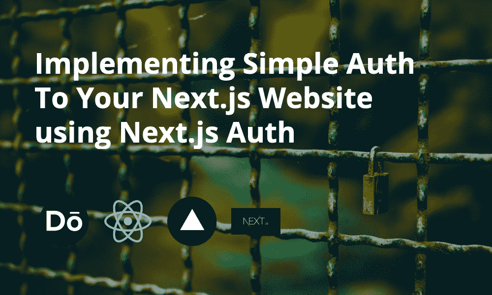
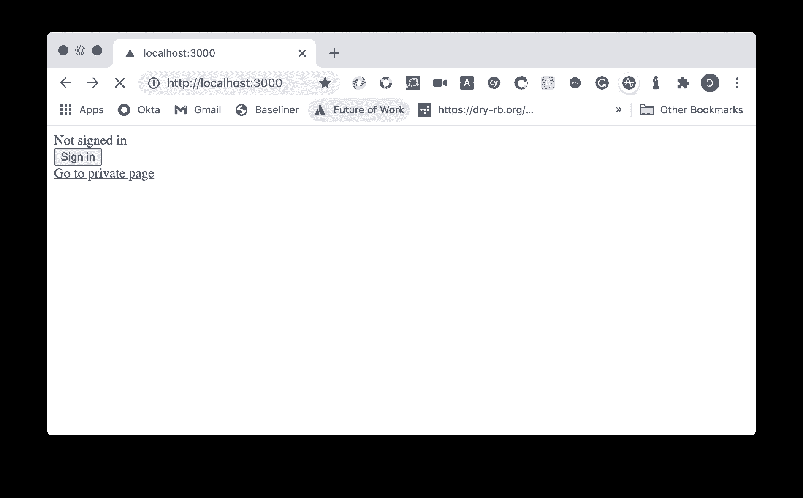
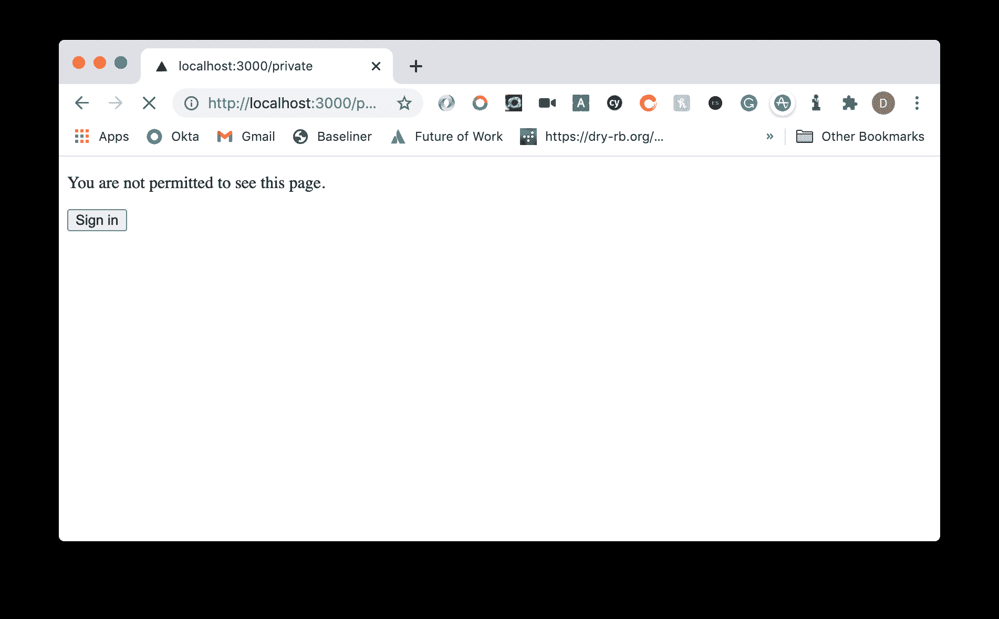
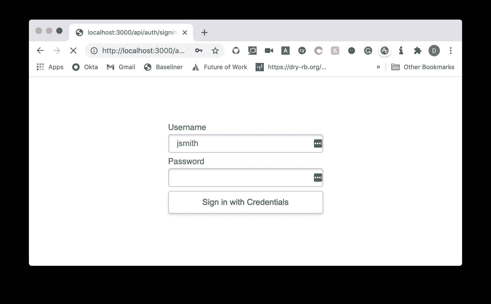
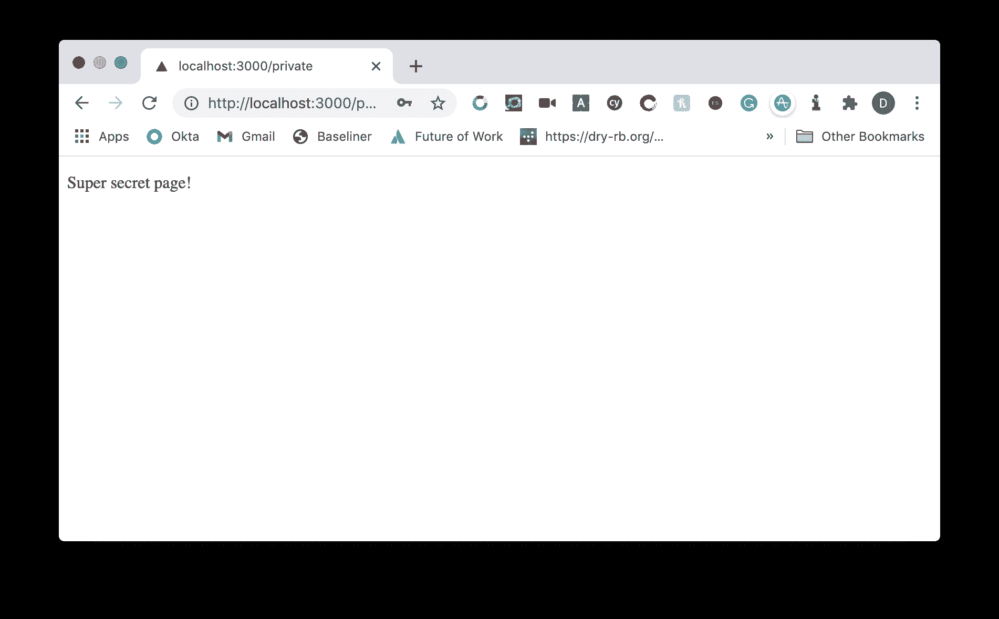

# 使用 Next.js Auth 实现对您的 Next.js 网站的简单授权

> 原文：<https://javascript.plainenglish.io/implementing-simple-auth-to-your-next-js-website-using-next-js-auth-e136d77bb333?source=collection_archive---------3----------------------->

## 使用 Next.js Auth 向网站添加您自己的简单身份验证

托管网站时，部署的密码保护可能是一笔昂贵的费用，尤其是当您想要保护分支部署时。

在今天的教程中，我将向您展示如何使用 Next.js 10 和 Next.js Auth 在这些分支上设置自己的简单身份验证保护。

## 入门指南

## 设置应用编程接口

在`pages/api/auth/[...nextauth].js`中，增加以下内容:

我们将使用`NEXTAUTH_USERNAME`和`NEXTAUTH_PASSWORD`来设置我们的基本环境变量。

以上将进行比较，如果比较正确，我们将返回`user`对象，该对象只是`admin`的名字和`1`的 ID。

## 设置私人页面

在`pages/private.js`中增加:

在这里，我们将使用`useSession`钩子来确定我们是否登录，同时使用`next-auth/client`库中的`signIn`给用户一个登录的选项。

## 更新 page/index . js 和 page/_ app . js

最后，让我们更新我们的基础页面:

这将类似于我们基于会话的私人页面。

至于`pages/_app.js`我们将确保我们的授权提供商在那里:

这就是我们代码设置所需的全部！

## 设置环境变量

对于本地开发，我们可以将 env vars 添加到`.env.local`文件中。现在添加以下内容:

在这里，我们设置了身份验证和应用程序 URL 所需的用户名和密码(这里只是 localhost)。

太好了，现在我们可以看到行动了！

## 探索网站

如果我们运行`npm run dev`，它将通过`package.json`脚本运行`next dev`，并在`localhost:3000`上启动网站。

当前所在的页面没有访问权限，因此它会显示我们的登录消息。

无论访问权限如何，都将有一个链接可以点击进入我们的`/private`页面，在那里所有的内容都是私有的。

如果我们选择了这个选项，我们会发现我们没有权限。

如果我们现在决定点击登录，我们会看到**提供的`sign in`页面。**

在环境变量中写入我们设置的**用户名**和**密码**将导致我们被重定向到具有访问权限的上一页。

成功！我们已经设法向 Next.js 应用程序添加了简单、基本的身份验证。

您可以[尝试 Vercel 上托管的项目](https://nextjs-simple-auth.vercel.app/)。

## 资源和进一步阅读

1.  [直播项目](https://nextjs-simple-auth.vercel.app/)
2.  [代码回购](https://github.com/okeeffed/nextjs-simple-auth)
3.  [Next.js Auth](https://next-auth.js.org/)
4.  [Next.js Auth —凭证](https://next-auth.js.org/providers/credentials)

*图片来源:* [*杨致远*](https://unsplash.com/@chrisyangchrisfilm)

*原贴于我的* [*博客*](https://blog.dennisokeeffe.com/blog/2020-11-16-nextjs-simple-auth/) *。*