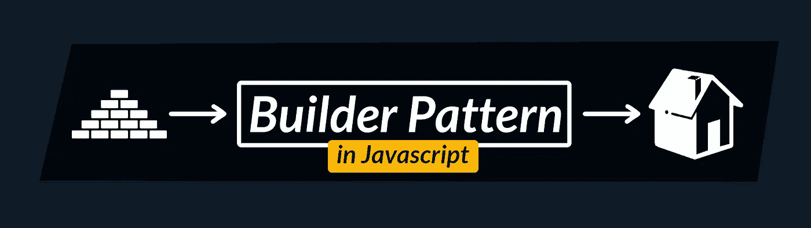

# 在没有类的情况下用 JavaScript 实现构建器模式

> 原文：<https://javascript.plainenglish.io/implementing-the-builder-pattern-in-javascript-without-classes-eaf41f93b9c0?source=collection_archive---------2----------------------->

设计模式是软件开发的重要部分。它们描述了常见问题及其解决方案。一种这样的模式是*建造者*模式。正如[维基百科所说的](https://en.wikipedia.org/wiki/Builder_pattern)，它是“一种设计模式，旨在为面向对象编程中的各种对象创建问题提供灵活的解决方案”。然而，我在这里向你展示它不仅适用于面向对象的语言，而且可以在没有类的 JavaScript 中实现。

# 构建器模式是如何工作的？

构建器模式的目的是简化对象创建过程。它不同于工厂模式:当创建过程复杂并且需要任意数量的输入时，构建器模式非常有用。一个著名的例子是 Java 中的`StringBuilder`类，它用于构建字符串(咄):

鉴于 builder 模式的面向对象特性，您可能会认为要实现它就必须使用类。但是我在这里证明你错了:由于原型委托和`this`绑定，这种模式对于 JavaScript 等函数式语言完全有效。

# 用 JavaScript 实现构建器模式

为了实现构建器模式，我们将使用构造函数、`new`关键字和`this`绑定。请注意，这些特性与类无关，它们的行为与类无关，它们是在类出现之前引入的。作为 builder 模式的一个用例，假设您必须使用相同的头对相同的服务器执行大量常见的 HTTP 请求，并且希望简化 API。遵守以下代码:

首先，请注意“ClientBuilder”函数。它返回一个包含所有构建逻辑的对象。它公开了函数`forBaseUrl`、`withHeaders`、`usingFetch`、`usingAxios`和`build`。您使用这些函数来指定想要的行为，然后使用`build`来获得完整的客户端。`Client`函数是一个构造函数，它接受`baseUrl`、`headers`和`executor`，通过这个函数绑定它，并公开函数`post`和`get`。然后，您将像这样使用这些函数:

这就结束了我们对 JavaScript 中构建器模式的讨论，希望你会觉得有用。让我知道你还想让我涵盖哪些设计模式！

