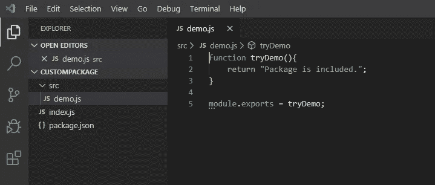
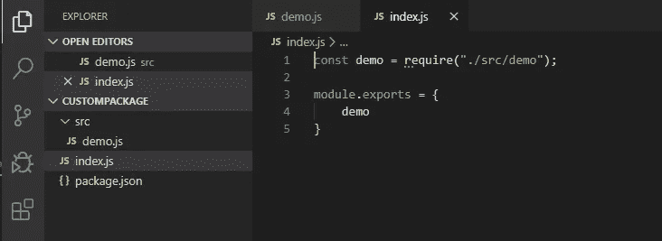
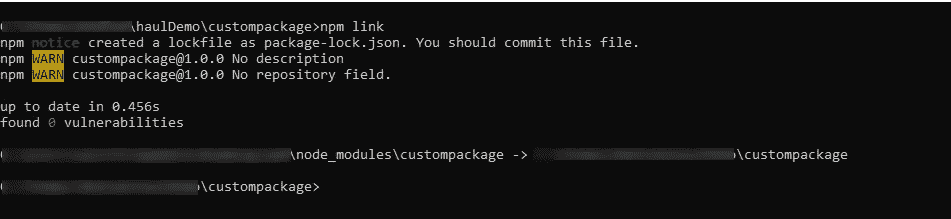
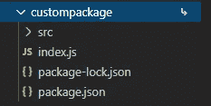
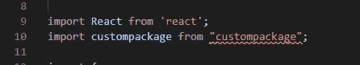
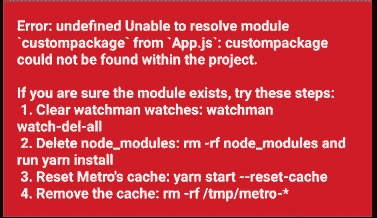
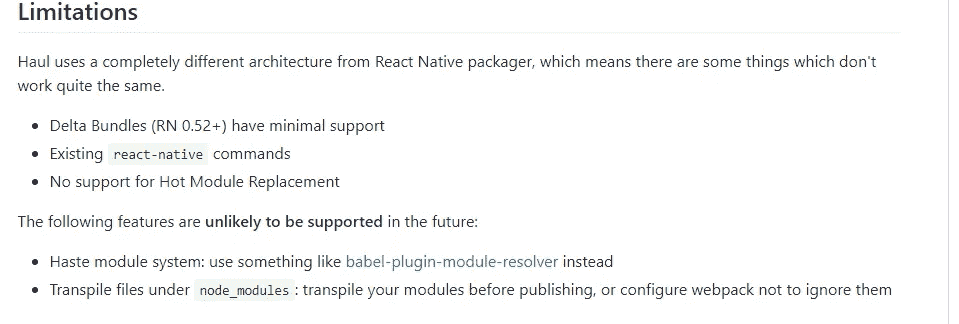

# 使用 NPM 链接和运输在 React Native 中导入本地包

> 原文：<https://javascript.plainenglish.io/import-local-packages-in-react-native-using-npm-link-and-haul-d6b2fae313a3?source=collection_archive---------4----------------------->

在 React Native with NPM 链接中使用本地包并不像它应该的那样简单。拖运会起作用的。


我正在建立一个新的 React 原生项目，并想使用一些 NPM 仓库中没有的本地包。我以为 NPM·林克会在几分钟内使这成为可能，但我错了。显然，React 本机打包程序不支持符号链接，这意味着您的本地包在运行时将是未知的。
Haul 取代 React 原生打包程序来捆绑你的应用并修复我的问题。

[](https://github.com/callstack/haul) [## 调用堆栈/运输

### 用于开发 React Native apps Haul 的命令行工具是基于 open……

github.com](https://github.com/callstack/haul) 

# 设置

我创建了一个“custompackage ”,它包含一个返回“包含包”的函数。这个设置的唯一目标是在 React 本机应用程序中显示这个字符串。通过完成这一步，包链接将会成功。



我还初始化了一个 React 原生应用。

# 把我们的包裹连在一起，不要拖拉

在我们的“custompackage”项目中执行“npm link”。这将为我们的项目创建一个符号链接:



现在在 React 本地项目中执行“npm link custompackage”。完成后，我们将在 node_modules 中看到我们的包，如下所示:



当用 Visual Studio 代码编写我们的代码时，编辑器会识别我们的包。所以一切看起来都很好，不是吗？



那么，让我们运行这个应用程序。在这一点上，我们将期待一个简单的视图，其中包含“包”印在上面。

```
react-native run-android
```



Exactly my face 24 hours ago

所以让我们试着解决这个问题！

# 链接我们的包裹并使用拖运

*查看文档:*

[](https://github.com/callstack/haul) [## 调用堆栈/运输

### 用于开发 React Native apps Haul 的命令行工具是基于 open……

github.com](https://github.com/callstack/haul) 

让我们将 Haul 作为一个依赖项添加到 React 本地项目中，并对其进行配置:

```
npm install --save-dev @haul-bundler/clinpx haul init
```

链接我们的定制套餐:

```
npm link custompackage
```

运行运输:

```
npx haul start
```

打开另一个终端并运行 React 本地应用程序:

```
react-native run-android
```

结果应该是这样的:


# 就是这样！

# 限制..热重装:-(

遗憾的是，Haul 似乎不支持热重装。真遗憾..但只要按两次“R ”,你就可以轻松地在 Android 模拟器中重新加载你的应用..编码快乐！

