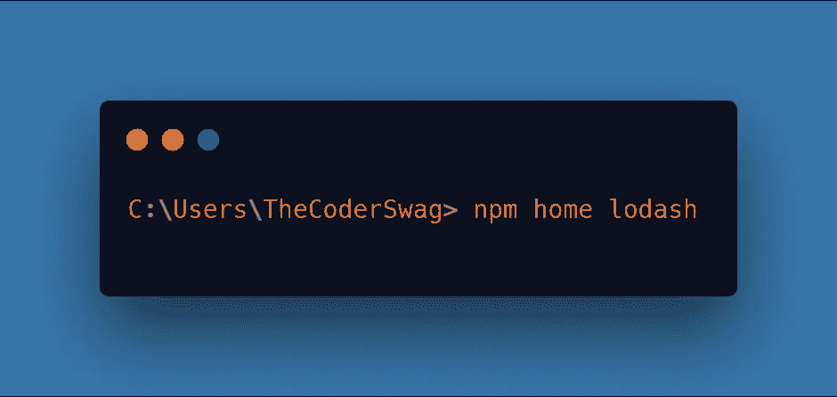

# 用这些 NPM 技巧打动你的同事

> 原文：<https://javascript.plainenglish.io/impress-your-colleagues-with-these-npm-tricks-29b47a937caa?source=collection_archive---------3----------------------->

Photo by [Paul Esch-Laurent](https://unsplash.com/@pinjasaur?utm_source=medium&utm_medium=referral) on [Unsplash](https://unsplash.com?utm_source=medium&utm_medium=referral)

就像其他人一样，开发人员喜欢知道一些小技巧来展示给他们的同事或朋友。今天，我决定写一些你在使用节点包管理器( **NPM** )时可以使用的键盘魔术。这些不仅会打动你和你周围的人，还会让你的工作流程绝对更快更简洁。所以既然做了这个小前提，那就开始分析这些招数吧！

# #1 包初始化

您想快速初始化一个新的包吗？这样做的时候出现的那些无穷无尽的系统问题你是不是已经厌倦了？然后**运行 npm init-** y 或 **npm init-f.** 这些命令将允许你跳过这些问题，直接进入你的下一个惊人的项目！

# #2 打开包的主页

你正在使用一个刚刚发现的很酷的 npm 包吗？你想查看它的主页来阅读文档吗？然后运行**NPM home“your-package”。**这个命令将把你直接带到你正在寻找的页面**！**

# #3 打开一个包的 GitHub 库

与上面描述的命令类似，运行**NPM repo“your-package”**会直接将您带到一个网页。但是这一次，你会被自动重定向到官方的 GitHub 库。

# #4 列出所有已安装的软件包

为什么要浪费时间打开 **package.json** 文件去检查我们安装了哪些包？简单地运行**NPM ls--depth 0**你就会得到你正在寻找的信息。

# #5 列出可用的脚本

新项目新脚本对吗？但是，再次强调，必须仔细检查 **package.json** 文件可能是乏味且耗时的。让我们通过运行 **npm run** 命令来获得这个列表！

# #6 检查 package.json 中没有声明的包

另一个有用的命令，使用 **npm prune** 来执行这个操作。该命令将遍历您的 **package.json** 文件，并将其内容与 **/node_modules** 内容进行比较。您将收到一个输出列表，其中列出了所有不在 **package.json** 文件中的包。完成此操作后， **npm prune** 将删除那些没有手动添加到 **package.json** 中的包，或者那些没有**保存**标志的 **npm 安装**的包。

# #7 凹凸包版本

需要撞一个包？简单地运行 **npm** 和**次要/主要/补丁**命令。

# #8 运行测试

您可能已经在一天中多次运行 **npm 运行测试**命令了，对吗？但是为什么不用一模一样的更短的版本 **npm t** ！

# 奖励命令

还在渴望更多 npm 有用的命令快捷键吗？那就看看我给你准备的这份奖金清单吧。

# 软件包安装

# 全局软件包安装

# 包安装+另存为开发依赖项

# 包安装+另存为依赖项

# 结论

能够给你的同事留下深刻印象是很好的，但是让这篇文章知道你在使用技术时可以学到的所有技巧更好。希望这篇文章能帮助你在阅读之前发现一些你不知道的技巧，并激励你在学习新东西时更深入！