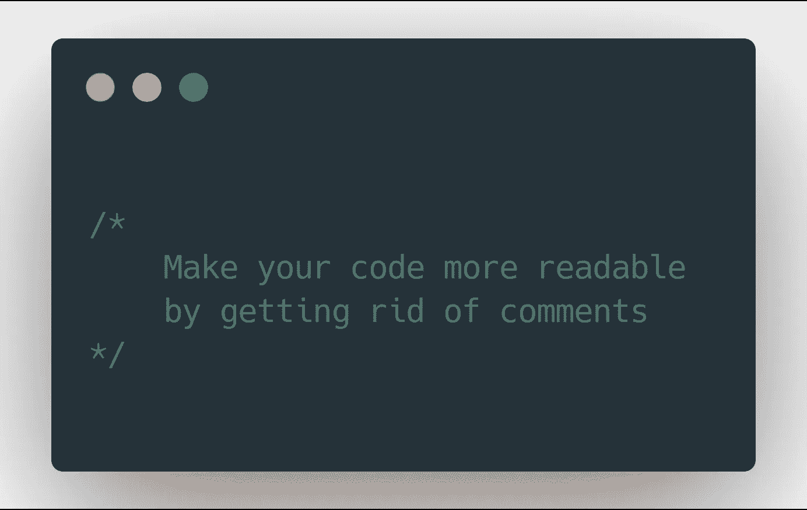

# 通过去除注释来提高代码的可读性

> 原文：<https://javascript.plainenglish.io/improve-code-readability-by-getting-rid-of-comments-e1513c6ae84c?source=collection_archive---------2----------------------->



代码注释虽然有争议，但仍然被认为是一种好的实践。注释通常用于提高代码可读性，使维护和解释某些决策变得更容易。但是评论总是有帮助，还是弊大于利？

只是澄清一下:我并不是告诉你*永远不要*写评论，并打倒所有写评论的人。和任何规则一样，也有例外。但是我要说的是，大多数时候，评论并不是一个明智的决定。此外，这是我的主观意见，我希望在回复中听到一些客观的批评！

# 当注释不起作用时:可读性

注释的一个最明显的原因是解释某个代码块做什么。矛盾的是，这是不使用注释的最不明显的原因。

首先，如果你的代码需要注释才能有意义，你应该后退一步重新评估它。你能做些什么让它更具可读性吗？有什么可以重构的吗？代码本身是一种语言(也是一种确定性的语言)，那么为什么你需要引入另一种语言(一种模糊的语言)来让它变得可以理解呢？考虑这些例子:第一个是有注释的糟糕代码，第二个是重构的没有注释的代码。哪个更容易阅读？

这段代码是一个(假想的)推荐系统的一部分，这个系统根据标签给你提供相关的页面。检查这两个文件之间的区别:第一个文件有糟糕的，但是有大量文档记录的代码，第二个文件有干净和可理解的代码，但是没有注释。它不仅没有注释，而且我敢说你可以试着写一个:代码本身已经没有什么可说的了。这些例子对我的下一个论点也有提示。你能发现它吗？

# 当评论不起作用时:真相之源

一个优秀的程序员所珍视的主要原则之一是:不要重复自己。它强调了你的代码应该只有一个真实的来源。使用这个简单的指导方针，你可以避免许多错误和失误。但是评论直接违背了这个原则。

> 代码从不说谎，但有时注释会说谎(罗恩·杰弗里斯)

您找到我在前面的示例中提到的问题了吗？该函数的注释说相关页面应该有 75%的匹配标签，但代码本身使用了 85%。最有可能的是，规范改变了，程序员更新了代码，但是忘记了更新注释。现在有一个模糊之处，会让每个将要使用这段代码的人感到困惑。

第二个例子没有这个问题。阈值存储在一个常量中，其名称与注释的目的相同:阐明其目的。当你发现自己在写一个注释时，问问自己:你在注释中陈述了代码中已经陈述过的、可能会过时的东西吗？

# 当注释起作用时:API 文档

评论批评到此为止，现在我将谈谈在评论是完全恰当的，甚至是可取的情况下的案例。如果你正在设计一个服务于最终用户(甚至是你团队中的其他程序员)的 API 或库，你会想要有文档。文件也违反了单一来源的真理原则，但这正是我们必须处理的事情。但是我们能做的是将文档尽可能地靠近代码。有很多解决方案(Java 的 JavaDoc，JS/React 的 react-docgen 等等。)这将基于注释自动生成文档。检查来自 material-ui 库的这个片段:这些注释用于生成 markdown 文档，该文档稍后用于生成文档网站:

您可以进一步推动它，并根据其他评论生成评论！下面是 material-ui 的另一个例子，其中来自 TypeScript 定义的注释/类型用于生成 JavaScript 注释:

# 当评论起作用时:决策

有些情况下，代码可读性强且简洁，但不清楚为什么要以这种方式编写(可能非常规和/或低效)。这可能有很好的理由，并且，作为一个解释和可能的警告，你可以发表评论来澄清它。我的意思的一个很好的例子是这个评论:

```
// 
// Dear maintainer: 
// 
// Once you are done trying to 'optimize' this routine, 
// and have realized what a terrible mistake that was, 
// please increment the following counter as a warning 
// to the next guy: 
// 
// total_hours_wasted_here = 42 
//
```

感谢 *@jensroland* 和他的 [StackOverflow](https://stackoverflow.com/questions/184618/what-is-the-best-comment-in-source-code-you-have-ever-encountered/482129#482129) 的回答。

# 注释起作用时:教程

虽然这可能超出了本文的范围，但是教程是注释的绝佳场所，也是唯一适合的代码类型:

```
const apples = 5; // set apples to 5
```

当你从教程切换到产品时，记得删除它们！

感谢您阅读到最后，我希望您喜欢这篇文章，并在您的代码中留下评论时会更加体贴。我要说的是，这篇文章受到了像《T4》这样的书的启发，我强烈建议你去读这些书。