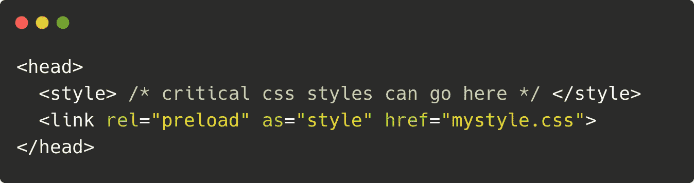

# 用 3 种简单的方法提高 CSS 性能

> 原文：<https://javascript.plainenglish.io/improve-css-performance-in-3-easy-ways-1ce3632e2cdc?source=collection_archive---------4----------------------->

不管你在建什么网站，在今天的世界里，你至少会有一些 CSS 样式。尽管如此，web 开发中一个经常被忽视的部分是 CSS 性能。不要担心！有几个简单的技巧可以用来轻松提高样式表的速度。

## **1。确保文件在 HTML 中没有阻塞**

通常，我们在 HTML 中导入一个 CSS 文件，如下所示:

这样做的问题是，它以同步方式加载 CSS 文件，并在样式表完全加载之前阻止页面的其余部分呈现。这可能是不希望的。相反，我们可以在样式表中预加载一个简单的关键字:`preload`，这有助于防止呈现阻塞。

这告诉浏览器在页面的其余部分呈现之前，在页面生命周期的早期获取这些样式表——因此，有助于防止由于样式表加载较晚而可能发生的任何呈现阻塞。

## 2.将关键 CSS 样式移动到内嵌样式表中

浏览器不会呈现一个 DOM 元素，直到它所有的样式都被加载进去。如果您的元素样式都存储在一个大的样式表中，而这个样式表需要几秒钟的时间来加载，那么这可能会是一个问题。相反，我们可以通过将所有关键的 CSS 样式内联到 HTML 文件中来为用户提供更好的体验:

这意味着我们可以在其余的样式表加载之前呈现所有关键的 DOM 元素。有几个工具可以帮助你找出哪些风格是重要的，哪些不是。其中一个是可以和`Grunt`配合使用的`grunt-critical`。

## 3.使用 preconnect 可以更快地加载字体

当浏览器请求某些字体时，它会进行 DNS 查找，建立 TCP 连接，然后向服务器请求字体。这些步骤会导致显著的减速。相反，我们可以在浏览器知道它需要在`rel`属性上使用`preconnect`选项来请求字体之前建立这些连接。

这告诉浏览器在页面加载时立即建立 DNS 查找和 TCP 连接，而不是在浏览器到达 CSS 文件中需要查找字体的位置时才建立。

# 结论

CSS 的性能经常被忽视，甚至被后端、数据库甚至 JavaScript 的性能所掩盖。然而，HMTL 为我们提供了一些真正简单易用的 API，它们可以提高我们页面的速度，有时还能大幅提高速度。