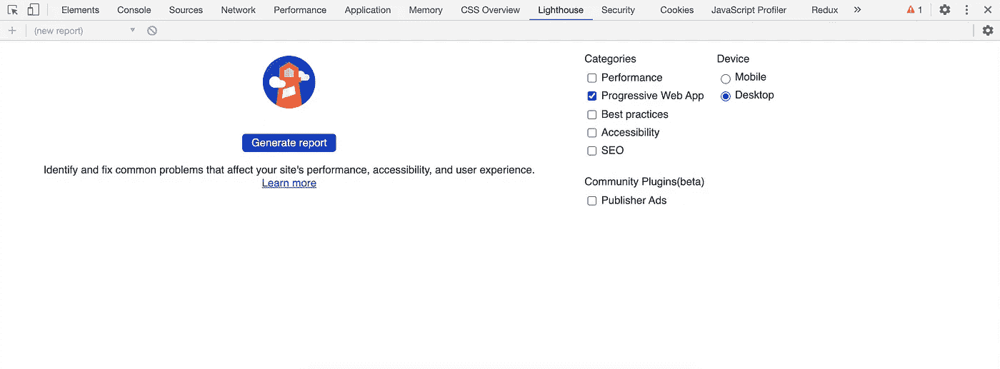
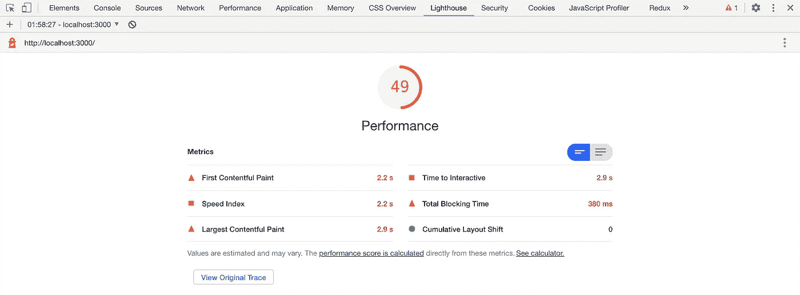
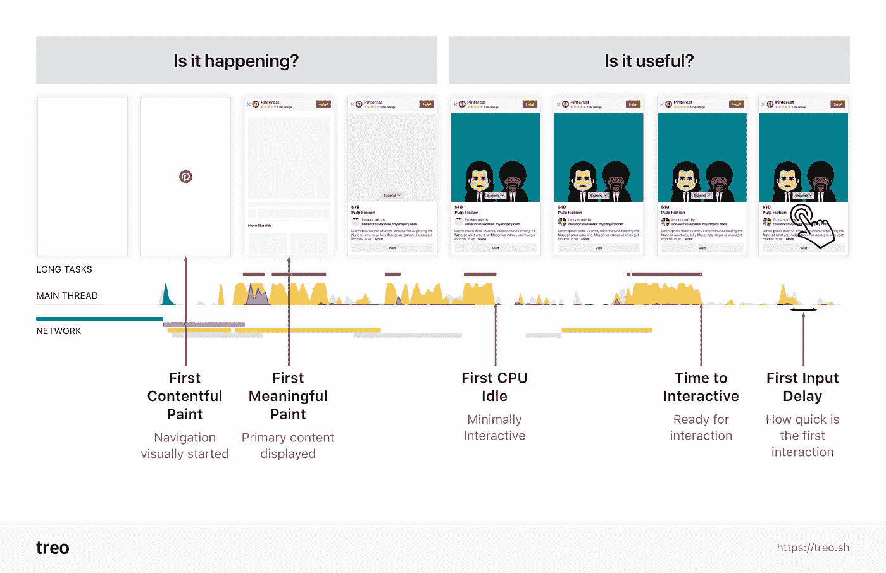
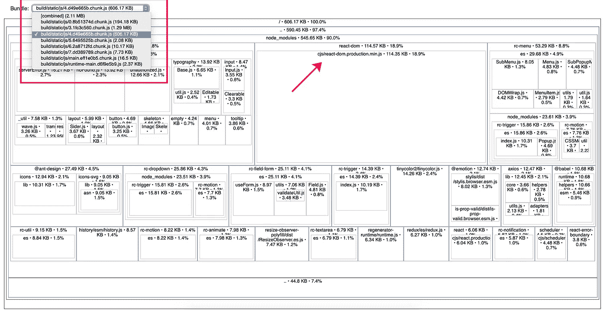
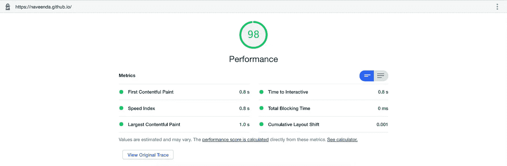
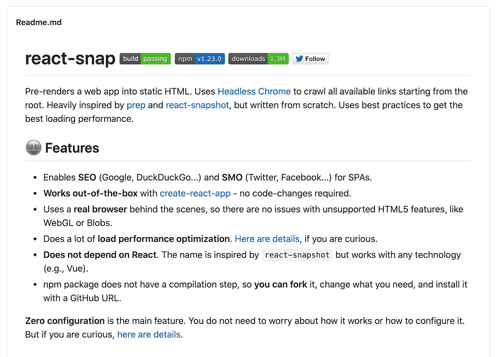
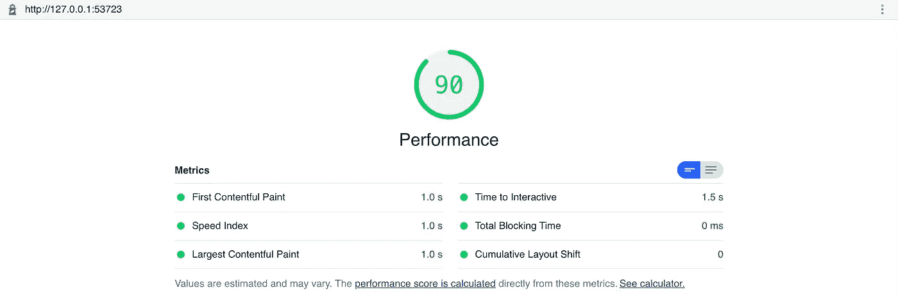

# 通过使用“反应-捕捉”,使用预渲染路线改进首次绘制时间

> 原文：<https://javascript.plainenglish.io/improve-first-paint-timing-with-pre-rendered-by-using-react-snap-28f0643fce90?source=collection_archive---------8----------------------->


React Performance Tips

# 快速小结

当您在 Lighthouse 性能报告中看到 react 应用程序首次绘制时间过高时，您可以通过使用 [react-snap](https://github.com/stereobooster/react-snap) 轻松改善。

# 介绍

我当时正在开发 react [PWA](https://en.wikipedia.org/wiki/Progressive_web_application) 应用程序，在 [lighthouse](https://developers.google.com/web/tools/lighthouse) 审计期间，出于好奇，我在 lighthouse 工作室检查了其他选项。



当我运行性能报告时，它只得到 49%。因此，我决定敲打每一个问题，以提高性能。



## 从 49%到 73%

这是我的错误，我在开发模式下运行审计，而不是生产模式。在生成产品构建之后，我运行了审计，得到了高达 73%的结果。


现在，需要集中精力进行**的第一次心满意足的绘画。**先说第一件事，第一幅内容丰富的画是什么(或者干脆是 FCP)？

## **第一次心满意足的画画**

第一次绘画是当你的 web 应用程序开始从空白页面加载到有意义的内容时。它可以是文本、图像(包括背景图像)、非白色画布或 SVG 中的任何内容。



https://treo.sh

从你注意到的图片来看，Pinterest 实际上正在加载一个小型加载器来改进他们的 **First Contentful Paint。**所以我决定在页面加载之前添加一个加载器，但是我的审计报告还是一样的。

## 捆绑分析器报告

因此，我决定在我的 react 应用程序上分析生产捆绑报告。

在 [source-map-explorer](https://www.npmjs.com/package/source-map-explorer) 的帮助下，我们可以使用 create-react-app 来分析 React app create 的包大小。它通过计算每个树节点的源映射的大小来创建包大小报告。

**第一步:安装包**

```
npm i source-map-explorer --dev
```

**第二步:在 package.json 上添加 npm 脚本**

```
"scripts": {
  **"analyze": "source-map-explorer 'build/static/js/*.js'",**
}
```

**步骤 3:创建一个生产版本**

```
npm run build
```

**步骤 4:运行分析命令，分析捆绑包大小**

```
npm run analyze
```

得到报告后，我发现我的文件比实际的 react 产品代码要大。



出于好奇，我决定审计 Next.js 应用程序，以了解 React 和 next.js 之间的性能差异。

## **接下来。JS 审计报告**

我用 next.js 建立了一个 [portfolio](https://naveenda.github.io/) 网站，我只是在上面运行了性能审计，它获得了惊人的 98%。



[https://naveenda.github.io/](https://naveenda.github.io/)

我知道，这是一个静态呈现的站点，这意味着为每条路线创建一个实际的 HTML 文件。

**反应迅速**

我正在寻找的东西，获取所有的路线，并为每个路线创建 HTML 页面。幸运的是我找到了 [react-snap](https://github.com/stereobooster/react-snap) ，react snap 做的正是我想要的。



让我们在我的项目中配置反应快照

## 配置

react-snap 配置非常简单，只需 3 个步骤

**第一步:安装 react-snap**

```
npm i react-snap --dev
```

**第二步:在你的 package.json 上添加 npm 脚本**

```
"scripts": {
 **"postbuild": "react-snap"** }
```

**第三步:修改你的** `**index.jsx**` **文件**

每当我们创建生产构建时，react-snap 就会为我们创建预渲染路线。

## **获得 90%🎉**

在创建生产版本之后，我再次运行审计，得到了 90%



还有 10%的剩余😞。如果你能改进这些，请在评论中告诉我

**感谢您的阅读！**如果你喜欢这篇文章，可以考虑[在 Twitter 上关注我](https://twitter.com/NaveenDA_)，并与你的开发者朋友分享这篇文章🐋😀