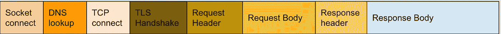

# 提高 NodeJS HTTP 请求-响应的可观察性

> 原文：<https://javascript.plainenglish.io/improve-observability-of-nodejs-http-request-response-a12f8629ccd0?source=collection_archive---------2----------------------->


Photo by [Thomas Kelley](https://unsplash.com/@thkelley?utm_source=unsplash&utm_medium=referral&utm_content=creditCopyText) on [Unsplash](https://unsplash.com/search/photos/watch-tower?utm_source=unsplash&utm_medium=referral&utm_content=creditCopyText)

NodeJS 是 IO 密集型的，http 请求构成了应用程序生命周期的主要部分。为了监视和观察 NodeJS 应用程序，理解它对其他系统的请求行为是微服务体系结构不可或缺的一部分。受下面这条推文的启发，我们决定分享如何在 NodeJS 应用程序的 HTTP 请求-响应生命周期的上下文中提高可观察性。

## NodeJS HTTP 请求-响应阶段



在 NodeJS 中，HTTP 请求和响应都是 [NodeJS 流](https://nodejs.org/api/stream.html)，它们实现 [EventEmitter](https://nodejs.org/api/events.html#events_class_eventemitter) 接口，为特定的生命周期事件发出事件。我们可以向这些事件添加事件监听器，以便测量请求和响应的重要指标。NodeJS 为上述 HTTP 生命周期阶段发出的事件有

*   [插座](https://nodejs.org/api/http.html#http_event_socket)
*   [DNS 查找](https://nodejs.org/api/net.html#net_event_lookup)
*   [TCP 连接](https://nodejs.org/api/net.html#net_event_connect)
*   HTTPS 连接的 TLS 连接(`secureConnect`套接字上的事件)
*   [响应体启动](https://nodejs.org/api/stream.html#stream_event_data)
*   [响应体结束](https://nodejs.org/api/stream.html#stream_event_end)

`request`始于[网的创建。套接字](https://nodejs.org/api/net.html#net_class_net_socket)对象，一旦套接字被创建，它就发出`socket`事件。现在，这个套接字可以用来监听 DNS 查找、TCP 和 TLS 事件。我们将使用标记高分辨率时间戳的`[process.hrtime()](https://nodejs.org/api/process.html#process_process_hrtime_time)`来标记事件，并找到从请求开始到每个时间戳的持续时间。

```
const request = https.request(options, callback)
const startTime = process.hrtime();
let dnsLookup, tcpConnection, tlsHandshake, responseBodyStart, responseBodyEnd;request.on("socket", socket => {
    // Socket created for dnslookup
    socket.on("lookup", () => {
        dnsLookup = process.hrtime();
    }); // TCP Connection established
    socket.on("connect", () => {
        tcpConnection = process.hrtime();
    }); // TLS Handshake complete
    socket.on("secureConnect", () => {
        tlsHandshake = process.hrtime();
    });
});
```

一旦请求完成，服务器将开始发送响应。这些响应字节可以在 [http 上监听。回应](https://nodejs.org/api/http.html#http_class_http_serverresponse)对象

```
https.request(requestOptions, res => {
    // The first time response bytes are transferred
    res.once("data", () => {
        responseBodyStart = process.hrtime();
    });
    res.on("data", chunk => (response += chunk));
    res.on("end", () => {
        responseBodyEnd = process.hrtime();
        callback(null, {
            body: response,
            duration: getEventDuration()
        });
    });
});
```

现在，您可以找到标记有时间戳的每个事件的持续时间，从而找到生命周期中重要部分的持续时间。

```
DNS lookup = dnsLookup - startTime
TCP connection = tcpConnection - (dnsLookup || startTime)
TLS connection = tlsHandshake - tcpConnection
First byte = responseBodyStart - tlsHandshake
Content transfer = responseBodyEnd - responseBodyStart
Total = responseBodyEnd - startTime
```

这些信息现在可以添加到*监控*和*分布式跟踪*中，以帮助提高系统的*可观察性*。

整个实现以 npm 包`[**http-duration-client**](https://www.npmjs.com/package/http-duration-client)` 的形式发布，全部代码可从[github/http-duration-client](https://github.com/congruencelabs/http-duration-client)获得