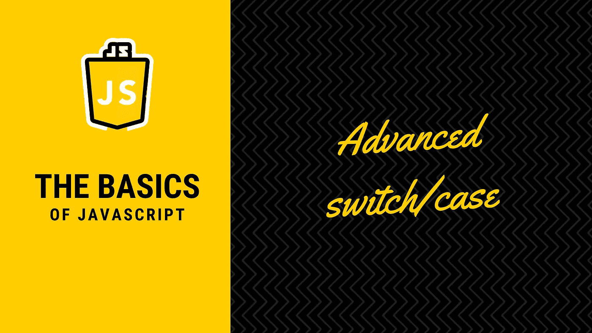

# 使用增强的 switch/case 语句改进您的条件块

> 原文：<https://javascript.plainenglish.io/improve-you-conditional-blocks-with-enhanced-switch-case-statements-8f4cadd20b27?source=collection_archive---------7----------------------->

## Javascript 的基础知识

## 一些你可能不知道的关于 switch/case 语句的基本技巧，可以帮助你在某些情况下写出更好的代码。



*有大的条件块？需要用非常简单的代码构建一个定制的验证器吗？想要一个很酷的 IDE 折叠功能？*

**我们来探讨一下** `**switch/case**` **指令之外的基础知识。**

`switch`语句确实是一个很好的工具。它是一种语言，允许你为一个值选择不同的选项，并根据设置的值运行不同的代码。

**如果你重复大量的** `**if**` **语句，使用 switch 语句可以极大地简化你的代码。**

# 👨🏻‍🎓switch/case 语句的基础

但首先，让我们简单回顾一下这句话的目的。

考虑下面的代码示例，它根据上下文显示一些文本:

```
const color= "green";if(color === "red")
  console.log("color is red");
else if (color === "blue"){
  console.log("color is blue");
} else {
  console.log("color might be green…");
}
```

没什么特别的，我们可以注意到，这是一个有点难以阅读的指示，如果不是相同的缩进。此外，一些代码编辑器的折叠功能可能不会像我们预期的那样直观地工作。

现在让我们看看使用`switch/case`语句的相同指令:

```
const color = "green";switch(color){
  case "red":
    console.log("color is red");
    break;
  case "blue":
    console.log("color is blue");
    break;
  default:
    console.log("color might be green…");
}
```

这有点冗长，但标准化的缩进更具可读性。事实上对于这样的小条件，if/else 是完美的，你可以避免使用 switch 语句。

当我们有一个大的`if`语句序列时，或者在稍微复杂一点的条件块中，比如下面的级联用例中，`switch/case`语句大放异彩。

# switch 语句的🤿穿越/级联

`switch/case`的一个很好的特性是落差(或层叠)。

这意味着无论何时出现大小写匹配，解释器都会逐行执行指令，直到遇到**停止指令**。该指令将使解释器退出交换机。

**有 3 个停止指令:**`**break**`**`**return**`**`**throw**`**。******

******💡注意:***你可以依赖其中任何一个，但不要忘记使用其中一个。否则，您可能会触发不自觉的级联、意外状态，并以难以调试的情况结束。*****

****以下示例演示了使用级联的`switch/case`语句的访问控制功能。****

*   ****如果用户角色是`EDITOR`或`ADMIN`，那么用户可以编辑文章。****
*   ****否则，用户将被拒绝编辑。****

```
**const requestUserRole = "ADMIN";function isAllowedToEdit(role){
  switch(role){
    case "ADMIN":
    case "EDITOR":
      return true; // User is allowed
    default:
      return false; // User is denied
  }
}console.log(isAllowedToEdit(requestUserRole));
// Returns true**
```

****在第一种情况下不使用停止指令会使解释器逐行执行，直到第一条返回指令。所以这里它返回`true`。****

# ****🦾高级开关/外壳使用****

****我们甚至可以更进一步，你可能没有意识到:`switch` 指令不仅允许打开一个变量的值，而且任何表达式也是**可用的，只要我们给出一个匹配**的例子。****

****例如，这里有一个使用`switch`语句编写的简单数据验证器，它符合以下规则:****

*   ****该字符串至少有 5 个字符长。****
*   ****该字符串不应包含任何数字。****

****为此，我们将使用一个`switch(true)`语句。****

```
**const valueToValidate = "hello world";async function customValidation(value){
  switch(true) {
    case (value.length < 5):
      throw new Error("Given string is too short!");
    case (value.match(/\d+/) !== null):
      throw new Error("No numeric allowed!");
    default:
      return Promise.resolve("String is valid");
  }
}customValidation(valueToValidate)
  .then(success => console.log(success))
  .catch(err => console.log(err));
// Displays « String is valid »**
```

*   ****如果字符串少于 5 个字符，第一种情况将返回 true，触发我们的错误。****
*   ****如果在字符串中检测到任何数字，第二种情况将为 true 并抛出。****

****我们在这里使用了简单的比较，但是您可以完美地使用任何返回布尔值的函数。当你有大量的条件逻辑并且不想依赖太多的 if/else 语句时，这可能很酷。****